# 使用 Pandas melt()重塑数据帧

> 原文：<https://towardsdatascience.com/reshaping-a-dataframe-using-pandas-melt-83a151ce1907?source=collection_archive---------6----------------------->

## 使用 Pandas melt()将数据帧从宽格式更改为长格式的实践教程


Jonny Caspari 在 [Unsplash](https://unsplash.com/s/photos/frame?utm_source=unsplash&utm_medium=referral&utm_content=creditCopyText) 上的照片

> 当您处理包含具有某种序列的变量的数据集(例如，时序数据)时，通常需要进行整形。
> 
> 来源于弗吉尼亚大学研究数据服务部[1]

我不久前发表了一篇文章，展示了处理新冠肺炎时间序列数据的一步一步的教程。在本教程中，主要任务之一是将数据从宽格式转换为长格式，以便于进一步的数据分析。Pandas `melt()`方法节省了我很多时间，而且只需要几行代码就可以完成任务。

重塑数据帧是数据科学中一项重要的基本技能。在本文中，我们将探索 Pandas `melt()`以及如何使用它进行数据处理。这篇文章的结构如下:

1.  最简单的熔化
2.  显示自定义名称
3.  显示多个 id
4.  指定要熔化的列
5.  熊猫融化了
6.  额外收获:重塑新冠肺炎时间序列数据

> 请查看[笔记本](https://github.com/BindiChen/machine-learning/blob/master/data-analysis/048-pandas-melt/pandas-melt.ipynb)获取源代码。更多教程可从 [Github Repo](https://github.com/BindiChen/machine-learning) 获得。

# 1.最简单的熔化

最简单的`melt()`不需要任何参数，它会将所有列转换为行(显示为列**变量**，并在新列**值**中列出所有相关值。

```
# without any argument
df_wide**.melt()**
```

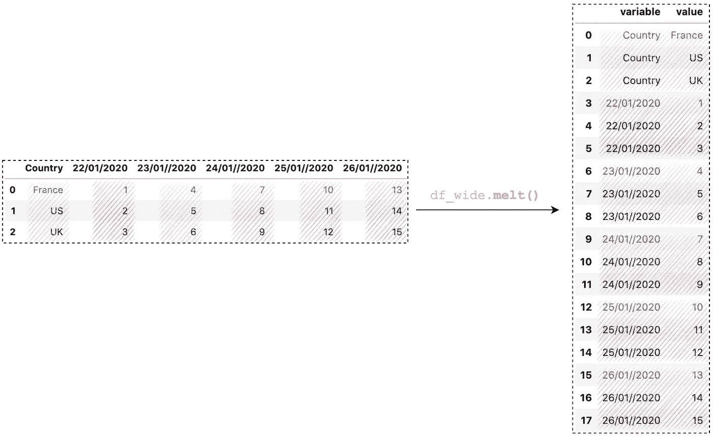

最简单的熊猫融化(图片由作者提供)

但是，这个输出往往没有太大意义，所以一般用例至少指定了`id_vars`参数。例如，`id_vars='Country'`会告诉熊猫保持**国家**为一列，其他所有列都变成行。

```
df_wide.melt(
    **id_vars='Country',**
)
```

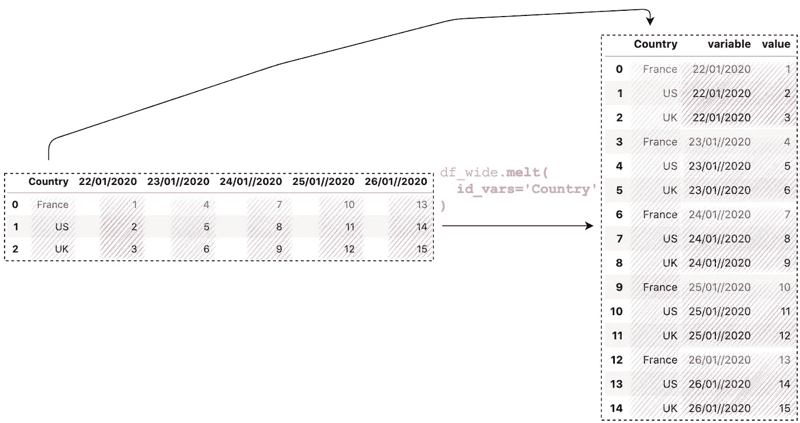

最简单的熊猫融化(图片由作者提供)

注意现在的行数是 15，因为**国家**列中的每个值有 5 个值(`3 X 5 = 15`)。

# 2.显示自定义名称

默认情况下，**【变量】**和**【值】**为列名。我们可以通过`var_name`和`value_name`参数指定自定义名称:

```
df_wide.melt(
    id_vars='Country',
    **var_name='Date',**
    **value_name='Cases'**
)
```

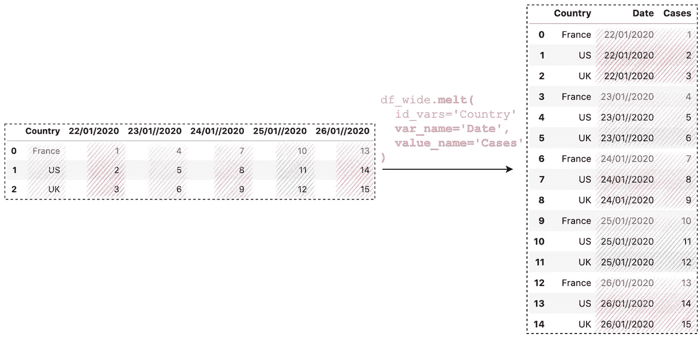

熊猫与自定义名称融为一体(作者图片)

# 3.指定多个 id

`melt()`最有用的特性之一是我们可以指定多个 id 来将它们保存为列。例如，如果我们希望将**国家**、**纬度**和**经度**保留为列，以便更好地参考:

```
df_wide.melt(
    **id_vars=['Country', 'Lat', 'Long'],**
    var_name='Date',
    value_name='Cases'
)
```

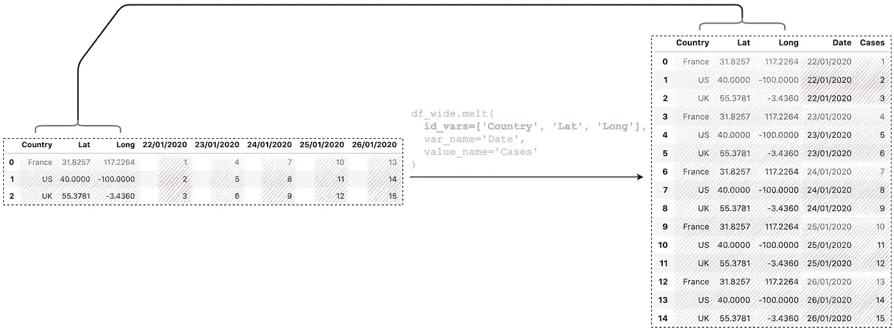

熊猫融化与 id_vars(图片由作者提供)

# 4.指定要熔化的列

默认情况下，Pandas `melt()`函数会将所有其他列(除了在`id_vars`中指定的列)转换为行。在实际项目中，您可能只关心某些列，例如，如果我们只想看到 **"24/01/2020"** 和 **"25/01/2020":** 上的值

```
df_wide.melt(
    id_vars=['Country', 'Lat', 'Long'],
    **value_vars=["24/01//2020", "25/01//2020"],**
    var_name='Date',
    value_name='Cases'
)
```

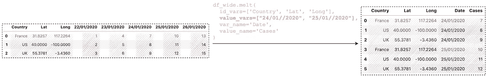

熊猫融化与价值 _ vars(图片由作者提供)

# 5.熊猫融化了

我们也可以直接从 Pandas 模块调用`melt()`而不是 DataFrame。然而，这些是相同的。

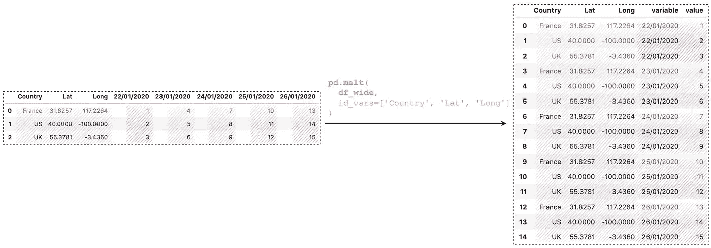

从熊猫模块调用融化(图片由作者提供)

# 6.额外收获:重塑新冠肺炎时间序列数据

利用我们目前所学的知识，让我们来看看一个现实世界的问题:可从约翰·霍普金斯大学 [CSSE Github](https://github.com/CSSEGISandData/COVID-19/tree/master/csse_covid_19_data/csse_covid_19_time_series) 获得的新冠肺炎时间序列数据。

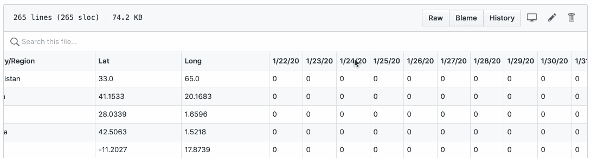

(图片由作者提供)

有两个问题:

*   ***被保存在不同的 CSV 文件中。将它们绘制在一张图中并不简单。***
*   *****日期显示为列名**，并且难以执行日间计算，例如，计算每日新增病例、新增死亡病例和新增康复病例。***

***让我们重塑 3 个数据集，并将它们合并成一个数据帧。***

## ***6.1 加载数据集***

***首先，让我们加载数据集:***

```
***confirmed_df = pd
    .read_csv('time_series_covid19_confirmed_global.csv')deaths_df = pd
    .read_csv('time_series_covid19_deaths_global.csv')recovered_df = pd
    .read_csv('time_series_covid19_recovered_global.csv')***
```

## ***6.2 将它们从宽格式重塑为长格式***

***通过运行`confirmed_df.columns`、`deaths_df.columns`和`recovered_df.columns`，它们都应该输出如下相同的结果:***

***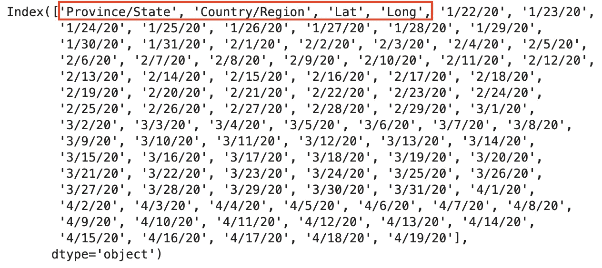***

***(图片由作者提供)***

***请注意，从第 4 列开始，所有列都是日期，以获取日期列表`confirmed_df.columns[4:]`***

***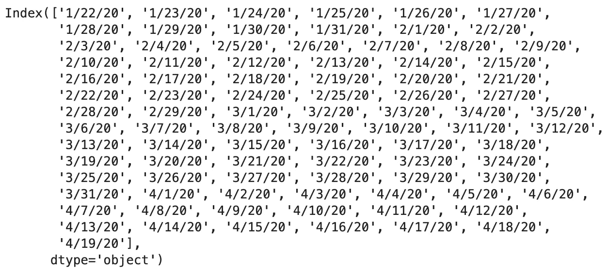***

***(图片由作者提供)***

***在合并之前，我们需要使用`melt()`将数据帧从当前的宽格式转换为长格式。换句话说，我们把所有的日期列都转换成了值。以下是相关的主要设置:***

*   ***使用`‘Province/State’`、`‘Country/Region’`、 `‘Lat’`、`‘Long’`作为标识符变量。我们稍后将使用它们进行合并。***
*   ***用变量列`‘Date’`和值列 `‘Confirmed’`取消透视日期列(如我们之前看到的`columns[4:]`***

```
***confirmed_df_long = confirmed_df.melt(
    **id_vars=['Province/State', 'Country/Region', 'Lat', 'Long'],** 
    **value_vars=dates,** 
    **var_name='Date',** 
    **value_name='Confirmed'**
)deaths_df_long = deaths_df.melt(
    **id_vars=['Province/State', 'Country/Region', 'Lat', 'Long'],** 
    **value_vars=dates, 
    var_name='Date', 
    value_name='Deaths'**
)recovered_df_long = recovered_df.melt(
    **id_vars=['Province/State', 'Country/Region', 'Lat', 'Long'], 
    value_vars=dates, 
    var_name='Date', 
    value_name='Recovered'**
)***
```

***所有结果都是新的长格式。它们都是按 ***日期*** 和 ***国家/地区*** 排序的，因为原始数据已经按 ***国家/地区*** 排序，日期列已经是 ASC 顺序。***

**下面是`confirmed_df_long`的例子**

**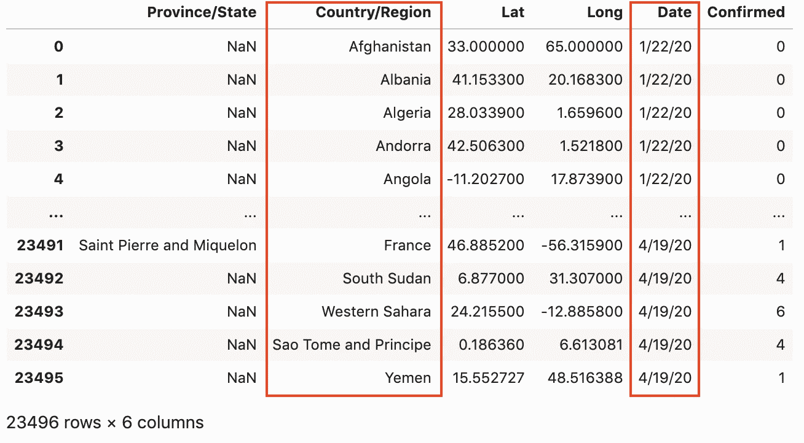**

**confirmed_df_long 示例(图片由作者提供)**

## **6.3 合并确认、死亡和恢复**

**最后，我们使用`merge()`一个接一个地合并 3 个数据帧:**

```
**# Merging **confirmed_df_long** and **deaths_df_long**
full_table = **confirmed_df_long**.merge(
  right=**deaths_df_long**, 
  how='left',
 **on=['Province/State', 'Country/Region', 'Date', 'Lat', 'Long']** )# Merging **full_table** and **recovered_df_long**
full_table = **full_table**.merge(
  right=**recovered_df_long**, 
  how='left',
 **on=['Province/State', 'Country/Region', 'Date', 'Lat', 'Long']** )**
```

**现在，我们应该得到一个包含`Confirmed`、`Deaths`和`Recovered`列的完整表格:**

**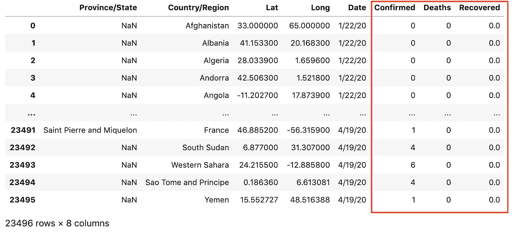**

**full _ 表格，包含已确认、死亡和已康复的患者(图片由作者提供)**

**如果您想了解更多关于创建**活动**、**新确认**、**新死亡**和**新恢复**的信息，请查看这篇文章:**

**</covid-19-data-processing-58aaa3663f6>  

# 结论

在本文中，我们讨论了 5 个用例以及 1 个真实的例子，它们都是关于使用 Pandas `melt()`方法将数据帧从宽格式重塑为长格式的。它非常方便，是数据预处理和探索性数据分析中最受欢迎的方法之一。

重塑数据是数据科学中一项重要的基本技能。我希望你喜欢这篇文章，并学到一些新的有用的东西。

感谢阅读。请查看[笔记本](https://github.com/BindiChen/machine-learning/blob/master/data-analysis/048-pandas-melt/pandas-melt.ipynb)获取源代码，如果您对机器学习的实用方面感兴趣，请继续关注。更多教程可从 [Github Repo](https://github.com/BindiChen/machine-learning) 获得。

## 参考

*   [1]弗吉尼亚大学:[研究数据服务+科学](https://data.library.virginia.edu/stata-basics-reshape-data/)**