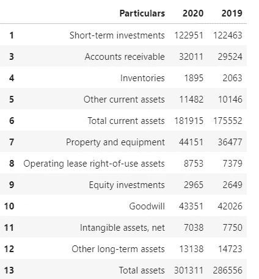
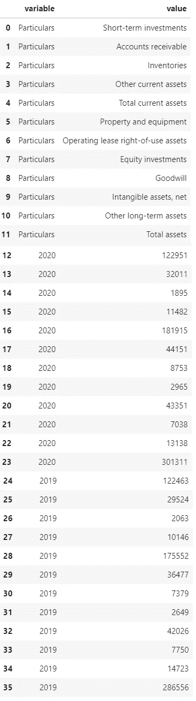
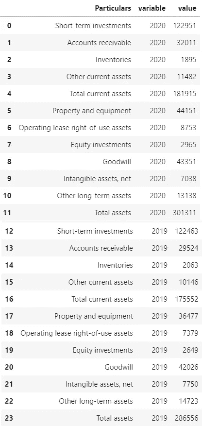
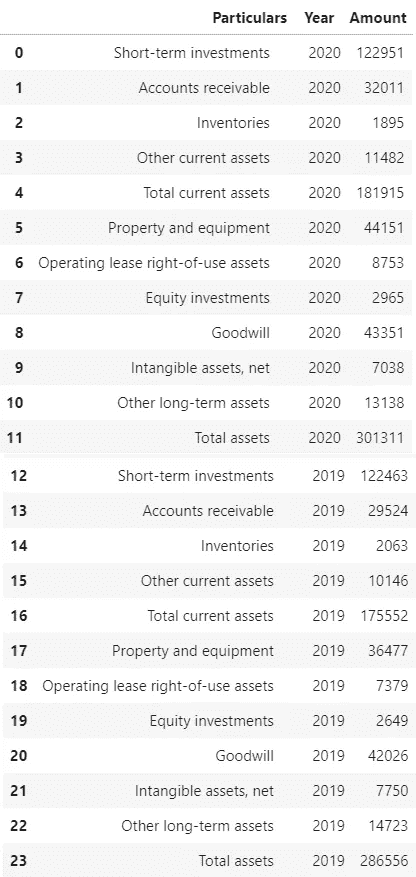
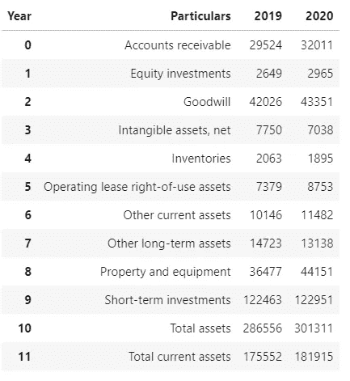

# 用熊猫重塑数据

> 原文：<https://towardsdatascience.com/reshaping-data-with-pandas-ecff92572488?source=collection_archive---------25----------------------->

## 在分析数据时，我们可能需要重塑表格数据。Pandas 有两种方法可以帮助将数据重新整形为所需的格式。

米利安·耶西耶在 [Unsplash](https://unsplash.com/s/photos/data-analysis?utm_source=unsplash&utm_medium=referral&utm_content=creditCopyText) 上拍摄的照片

Pandas 有两种方法来重塑数据，即**()**和**()**。这些方法分别类似于 R 中“tidyr”包的 gather()和 spread()函数。我们将考虑公司报告格式的资产负债表。资产负债表存储在名为“df”的 pandas 数据框架中。

作者图片

# 融化()

此方法将表格数据平面化/融合，以便将指定的列及其各自的值转换为键值对。“键”是转换前数据集的列名，“值”是相应列中的值。默认情况下，转换后，“键”存储在名为“变量”的列中，“值”存储在另一个名为“值”的列中。

这可能看起来有点混乱，开始时我也遇到过。然而，一旦我们看一个例子，事情就变得简单了。让我们把之前看到的资产负债表拉平/融化。最初，我们将调用带有默认参数的 melt()方法。

作者图片

如前所述，数据帧的列被转换成键值对。这种格式可能没有用，所以，让我们看一个例子，其中“细节”列保持不变，相关的年度数据作为键值对出现在相邻的列中。在这种情况下,“细节”列称为“id”列，应该传递给 melt()方法的“id_vars”参数。

作者图片

除了“细节”列(传递给“id_vars”参数)之外，所有其他列都被转换为键值对。我们还可以指定一个列列表，将这些列视为“id”列。我们可以使用' var_name '和' value_name '参数重命名' value '和' variable '列，如下所示。

作者图片

当我们在 Excel 中分析数据时，这种格式会很有用。这种格式使得在 Excel 中构建数据透视表更加容易。

# 透视()

这个方法与 melt()所做的正好相反。它将键值对转换成列。让我们看一个将“df_melt”(如下所示)转换回原始格式的例子。

df_melt(图片由作者提供)

作者图片

melt()和 pivot()是将表格数据转换成所需格式时很方便的两种方法。melt()将列转换为键值对，而 pivot()将键值对转换为列。