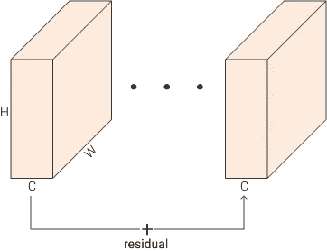
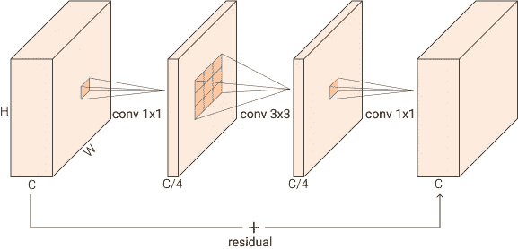
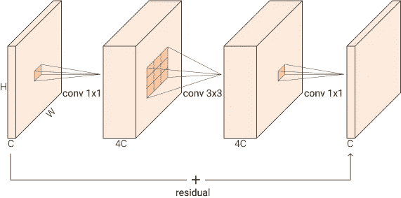
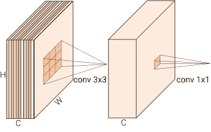
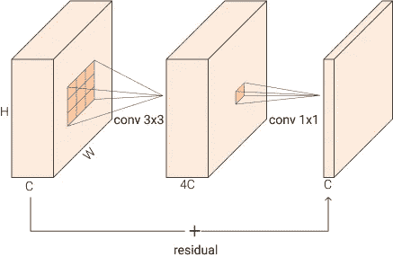

# 残差、瓶颈、反向残差、线性瓶颈、MBConv 解释

> 原文：<https://towardsdatascience.com/residual-bottleneck-inverted-residual-linear-bottleneck-mbconv-explained-89d7b7e7c6bc?source=collection_archive---------6----------------------->

## *py torch 中的那些+实现是什么鬼*

*嘿，我在*[*LinkedIn*](https://www.linkedin.com/in/francesco-saverio-zuppichini-94659a150/)*过来打个招呼👋*

这里有一个互动版本[可用](https://github.com/FrancescoSaverioZuppichini/BottleNeck-InvertedResidual-FusedMBConv-in-PyTorch/blob/main/README.ipynb)

**所有这些模块都已经在我的** [**眼镜**](https://github.com/FrancescoSaverioZuppichini/glasses) 库中实现了

在现代深度学习中记录名字很难。今天我们将看到现代 CNN 架构中使用的不同模块，如 ResNet、MobileNet、EfficientNet，以及它们在 PyTorch 中的实现！

在我们做任何事情之前，让我们创建一个通用的 conv-规范-行为层

```
torch.Size([1, 64, 56, 56])
```

# 剩余连接

在 [*中提出的 ResNet 中使用了残差连接，用于图像识别*](https://arxiv.org/abs/1512.03385) 的深度残差学习，让我们也引用 Schmidhuber 实验室在 [*高速公路网*](https://arxiv.org/abs/1505.00387) 上的工作。这个想法是将你的输入添加到你的输出中。下面的图片可以帮助你把它形象化。但是，我的意思是它只是一个`+`操作符。残差运算提高了梯度跨乘数层传播的能力，从而允许有效地训练超过 100 层的网络。



作者图片

在 PyTorch 中，我们可以很容易地创建一个`ResidualAdd`层

## 捷径

有时你的残差没有相同的输出维数，所以我们不能把它们相加。我们可以使用快捷方式中的 conv(带+的黑色箭头)来投影输入，以匹配输出的特征

# 瓶颈块

[*中还引入了瓶颈块，用于图像识别的深度残差学习*](https://arxiv.org/abs/1512.03385) 。瓶颈模块接受大小为`BxCxHxW`的输入，它首先使用廉价的`1x1 conv`将其减少到`BxC/rxHxW`，然后应用`3x3 conv`，最后再次使用`1x1 conv`将输出重新映射到与输入相同的特征维度`BxCxHxW`。这比用三个`3x3 convs`要快。由于投入首先减少，这就是我们称之为“瓶颈”的原因。下图显示了模块，我们在最初的实现中使用了`r=4`



作者图片

前两次转换之后是 batchnorm 和非线性激活，而最后一次非线性是在加法之后应用的。在 PyTorch

注意，只有当输入和输出特性不同时，我们才应用`shortcut`。

实际上，当我们希望降低空间维度时，在中间卷积中使用`stride=2`。

# 线性瓶颈

在 [MobileNetV2 中引入了线性瓶颈:反向残差和线性瓶颈](https://arxiv.org/abs/1801.04381)。线性瓶颈块是没有最后激活的瓶颈块。在论文的第 3.2 节中，他们详细讨论了为什么在输出之前存在非线性会损害性能。简而言之，非线性函数 line ReLU 会将所有内容<设置为 0，从而破坏信息。他们根据经验证明，当输入通道少于输出通道时，情况确实如此。所以，去掉瓶颈中的`nn.ReLU`，你就有了。

# 反向残差

在 [MobileNetV2:反向残差和线性瓶颈](https://arxiv.org/abs/1801.04381)中再次引入了反向残差。反向残差块是反向瓶颈层。他们使用第一个 conv 扩展功能，而不是减少功能。下面的图像应该可以清楚地说明这一点



作者图片

所以我们从`BxCxHxW`到->`BxCexHxW`->->`BxCxHxW`，其中`e`是*膨胀比*并设置为`4`。它们不是像正常瓶颈阻塞那样变宽- >变窄- >变宽，而是相反，变窄- >变宽- >变窄。在 PyTorch 中，这是微不足道的

在`MobileNet`中，剩余连接仅在输入和输出特征匹配时应用，不要问我为什么，如果你知道，请评论:)所以你应该这样做

# MBConv

所以在 MobileNetV2 之后，它的构建模块被称为`MBConv`。`MBConv`是具有深度方向可分离卷积的反向线性瓶颈层。

# 深度方向可分离卷积

深度方向可分离卷积采用一种技巧，将一个正常的 3×3 conv 分成两个卷积，以减少参数的数量。第一种方法将单个 3×3 滤波器应用于每个输入通道，另一种方法将 1×1 滤波器应用于所有通道。如果你做你的比赛，这和做一个正常的 3x3 conv 是一样的，但是你保存参数。

这也有点愚蠢，因为在我们现有的硬件上，它比普通的 3x3 要慢得多。

下图展示了这个想法



作者图片

通道中的不同颜色表示每个通道应用一个单独的滤镜

在 PyTorch:

第一个卷积通常称为`depth`，而第二个卷积称为`point`。让我们数一数参数

```
sum(p.numel() for p in DepthWiseSeparableConv(32, 64).parameters() if p.requires_grad) 
```

出局:`2432`

让我们来看一个普通的 Conv2d

```
sum(p.numel() for p in nn.Conv2d(32, 64, kernel_size=3).parameters() if p.requires_grad)
```

出局:`18496`

这是一个很大的区别

# 获取 MBConv

让我们创建一个完整的 MBConv。有几个 MBConv 的重要细节，归一化适用于深度和点卷积，非线性仅适用于深度卷积(记住线性瓶颈)。应用的 ReLU6 非线性。把所有东西放在一起

在 [EfficientNet](https://arxiv.org/abs/1905.11946) 中使用了该模块的稍加修改的版本，带有[挤压和激励](https://arxiv.org/abs/1709.01507)。

# 融合反转残差(融合 MBConv)

融合反向残差在 [EfficientNetV2:更小的模型和更快的训练](https://arxiv.org/abs/2104.00298)中引入，以使 MBConv 更快。所以基本上，由于深度方向的回旋很慢，他们将第一个和第二个 conv 融合成一个 3×3 的 conv(3.2 节)。



作者图片

# 结论

现在你应该知道所有这些块之间的区别和它们背后的推理了！我强烈推荐阅读与他们相关的论文，你不会错的。

关于 ResNet 更详细的指南，请查看[剩余网络:在 Pytorch 中实现 ResNet](/residual-network-implementing-resnet-a7da63c7b278)