# 从零开始的残差网络在计算机视觉中的应用

> 原文：<https://towardsdatascience.com/residual-networks-in-computer-vision-ee118d3be68f?source=collection_archive---------24----------------------->

## 使用 Tensorflow 和 Keras 的深度学习应用

# 1.介绍

深度卷积神经网络显著改变了图像分类的研究前景[【1】](https://papers.nips.cc/paper/2012/file/c399862d3b9d6b76c8436e924a68c45b-Paper.pdf)。随着层次的增加，模型的表现力也增加了；它能够学习更复杂的表达。在某些时候，网络的深度和模型的准确性之间似乎存在正相关关系。当网络越来越深入时，消失/爆炸梯度问题变得越来越严重。规范化的初始化和中间规范化层最终解决了这个问题，深层网络开始融合。然而，随着深度的增加，模型的准确性开始饱和，然后实际上迅速下降，而不是在随后的实验之前的直觉推理。这不是由于过度拟合，而是由于当前用于优化模型的求解器的局限性[【2】](https://arxiv.org/pdf/1512.03385.pdf)。

退化问题通过引入剩余网络[【2】](https://arxiv.org/pdf/1512.03385.pdf)得到部分解决。它引入了一种系统的方法来使用*快捷连接*，即跳过一层或多层的连接。这些*短连接*只是执行身份映射，它们的输出被添加到堆叠层的输出中(这不会增加额外的参数或计算复杂度)。其背后的想法是，如果多个非线性层可以渐近地逼近复杂的函数(仍在理论上研究，但这是深度学习的基础)，那么剩余函数也可能发生同样的情况。这样做的好处是，同时简化了求解者的工作。在[【3】](https://arxiv.org/abs/1603.05027)中研究了其他类型的连接，如缩放、门控和 1x1 卷积的跳跃连接；然而，身份映射继续产生最低的训练损失。

我们的任务是对一系列带标签的图像进行分类。我们想比较两种不同方法的准确性；第一个是经典卷积神经网络，第二个是残差网络。我们的目标是展示残余网络的力量，即使是在不太深的环境中。这是在解决退化问题的同时帮助优化过程的好方法。我们对残差网络进行了经验测试，它更容易过度拟合。为了解决这个问题，我们通过使用数据扩充策略来综合扩充我们的数据集。

我们再次使用辛普森一家的角色数据集[【4】](https://www.kaggle.com/alexattia/the-simpsons-characters-dataset)。我们对数据集进行了过滤，仅包含包含 100 张以上图像的类(字符)。在训练、验证和测试数据集之间进行拆分后，数据集的最终大小如下:12411 幅图像用于训练，3091 幅图像用于验证，950 幅图像用于测试。

和往常一样，代码和数据也可以在我的 [GitHub](https://github.com/luisroque/deep-learning-articles) 上获得。

本文属于使用 TensorFlow 进行深度学习的系列文章:

*   [迁移学习和数据增强应用于辛普森图像数据集](/transfer-learning-and-data-augmentation-applied-to-the-simpsons-image-dataset-e292716fbd43)
*   [基于 F. Pessoa 的工作用递归神经网络生成文本](/generating-text-with-recurrent-neural-networks-based-on-the-work-of-f-pessoa-1e804d88692d)
*   [使用 Seq2Seq 架构和注意力的神经机器翻译(ENG to POR)](/neural-machine-translation-using-a-seq2seq-architecture-and-attention-eng-to-por-fe3cc4191175)
*   [残差网络从无到有应用于计算机视觉](/residual-networks-in-computer-vision-ee118d3be68f)

# 2.数据预处理

我们创建生成器来将我们的数据提供给模型。我们还应用一个转换来规范化数据，在训练和验证数据集之间分割它们，并定义一个 32 的批量大小(参见[【5】](/transfer-learning-and-data-augmentation-applied-to-the-simpsons-image-dataset-e292716fbd43)以更好地理解预处理和生成器)。

```
import tensorflow as tf
from tensorflow.keras.models import Model
from tensorflow.keras.layers import Layer, BatchNormalization, Conv2D, Dense, Flatten, Add, Dropout, BatchNormalization
import numpy as np
from tensorflow.keras.datasets import fashion_mnist
from tensorflow.keras.utils import to_categorical
import matplotlib.pyplot as plt
from sklearn.model_selection import train_test_split
from tensorflow.keras.preprocessing.image import ImageDataGenerator
import os
from tensorflow.keras import Input, layers
from tensorflow.keras.layers import Dense, Flatten, Conv2D, MaxPooling2D
import timedirectory_train = "./simpsons_data_split/train/"
directory_test = "./simpsons_data_split/test/"def get_ImageDataGenerator(validation_split=None):
    image_generator = ImageDataGenerator(rescale=(1/255.),
                                         validation_split=validation_split)
    return image_generator

image_gen_train = get_ImageDataGenerator(validation_split=0.2)

def get_generator(image_data_generator, directory, train_valid=None, seed=None):
    train_generator = image_data_generator.flow_from_directory(directory, 
                                                               batch_size=32, 
                                                               class_mode='categorical', 
                                                               target_size=(128,128), 
                                                               subset=train_valid, 
                                                               seed=seed)    
    return train_generator

train_generator = get_generator(image_gen_train, directory_train, train_valid='training', seed=1)
validation_generator = get_generator(image_gen_train, directory_train, train_valid='validation')Found 12411 images belonging to 19 classes.
Found 3091 images belonging to 19 classes.
```

我们还创建了一个膨胀的数据集，通过应用一组几何和光度变换来减少过度拟合的可能性。几何变换改变了图像的几何形状，使得 CNN 不会因位置和方向的改变而改变。光度变换通过调整图像的颜色通道，使 CNN 不受颜色和光照变化的影响。

```
def get_ImageDataGenerator_augmented(validation_split=None):
    image_generator = ImageDataGenerator(rescale=(1/255.),
                                        rotation_range=40,
                                        width_shift_range=0.2,
                                        height_shift_range=0.2,
                                        shear_range=0.2,
                                        zoom_range=0.1,
                                        brightness_range=[0.8,1.2],
                                        horizontal_flip=True,
                                        validation_split=validation_split)
    return image_generator
image_gen_train_aug = get_ImageDataGenerator_augmented(validation_split=0.2)
train_generator_aug = get_generator(image_gen_train_aug, directory_train, train_valid='training', seed=1)
validation_generator_aug = get_generator(image_gen_train_aug, directory_train, train_valid='validation')Found 12411 images belonging to 19 classes.
Found 3091 images belonging to 19 classes.
```

我们可以遍历生成器来获得一组图像，其大小等于上面定义的批处理大小。

```
target_labels = next(os.walk(directory_train))[1]

target_labels.sort()

batch = next(train_generator)
batch_images = np.array(batch[0])
batch_labels = np.array(batch[1])

target_labels = np.asarray(target_labels)

plt.figure(figsize=(15,10))
for n, i in enumerate(np.arange(10)):
    ax = plt.subplot(3,5,n+1)
    plt.imshow(batch_images[i])
    plt.title(target_labels[np.where(batch_labels[i]==1)[0][0]])
    plt.axis('off')
```

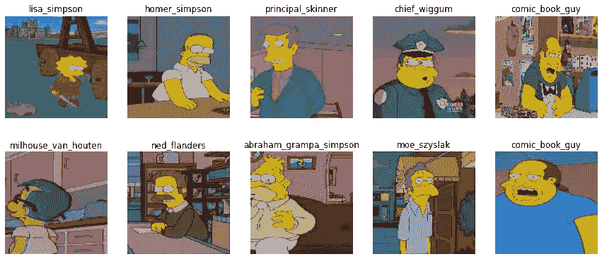

图 1:由训练生成器生成的一组图像。

# 3.基准模型

我们定义一个简单的 CNN 作为基准模型。它使用 2D 卷积层(对图像执行空间卷积)和最大池操作。它们之后是具有 128 个单元和 ReLU 激活功能的密集层，以及速率为 0.5 的下降层。最后，最后一层产生我们的网络的输出，其单元数量等于目标标签的数量，并使用 softmax 激活函数。该模型是用 Adam 优化器编译的，具有默认设置和分类交叉熵损失。

```
def get_benchmark_model(input_shape):
    x = Input(shape=input_shape)
    h = Conv2D(32, padding='same', kernel_size=(3,3), activation='relu')(x)
    h = Conv2D(32, padding='same', kernel_size=(3,3), activation='relu')(x)
    h = MaxPooling2D(pool_size=(2,2))(h)
    h = Conv2D(64, padding='same', kernel_size=(3,3), activation='relu')(h)
    h = Conv2D(64, padding='same', kernel_size=(3,3), activation='relu')(h)
    h = MaxPooling2D(pool_size=(2,2))(h)
    h = Conv2D(128, kernel_size=(3,3), activation='relu')(h)
    h = Conv2D(128, kernel_size=(3,3), activation='relu')(h)
    h = MaxPooling2D(pool_size=(2,2))(h)
    h = Flatten()(h)
    h = Dense(128, activation='relu')(h)
    h = Dropout(.5)(h)
    output = Dense(target_labels.shape[0], activation='softmax')(h)

    model = tf.keras.Model(inputs=x, outputs=output)

    model.compile(optimizer='adam',
             loss='categorical_crossentropy',
             metrics=['accuracy'])
    return modelbenchmark_model = get_benchmark_model((128, 128, 3))
benchmark_model.summary()Model: "model"
_________________________________________________________________
Layer (type)                 Output Shape              Param #   
=================================================================
input_1 (InputLayer)         [(None, 128, 128, 3)]     0         
_________________________________________________________________
conv2d_1 (Conv2D)            (None, 128, 128, 32)      896       
_________________________________________________________________
max_pooling2d (MaxPooling2D) (None, 64, 64, 32)        0         
_________________________________________________________________
conv2d_2 (Conv2D)            (None, 64, 64, 64)        18496     
_________________________________________________________________
conv2d_3 (Conv2D)            (None, 64, 64, 64)        36928     
_________________________________________________________________
max_pooling2d_1 (MaxPooling2 (None, 32, 32, 64)        0         
_________________________________________________________________
conv2d_4 (Conv2D)            (None, 30, 30, 128)       73856     
_________________________________________________________________
conv2d_5 (Conv2D)            (None, 28, 28, 128)       147584    
_________________________________________________________________
max_pooling2d_2 (MaxPooling2 (None, 14, 14, 128)       0         
_________________________________________________________________
flatten (Flatten)            (None, 25088)             0         
_________________________________________________________________
dense (Dense)                (None, 128)               3211392   
_________________________________________________________________
dropout (Dropout)            (None, 128)               0         
_________________________________________________________________
dense_1 (Dense)              (None, 19)                2451      
=================================================================
Total params: 3,491,603
Trainable params: 3,491,603
Non-trainable params: 0
_________________________________________________________________def train_model(model, train_gen, valid_gen, epochs):
    train_steps_per_epoch = train_gen.n // train_gen.batch_size
    val_steps = valid_gen.n // valid_gen.batch_size

    earlystopping = tf.keras.callbacks.EarlyStopping(patience=3)
    history = model.fit(train_gen, 
                        steps_per_epoch = train_steps_per_epoch,
                        epochs=epochs,
                        validation_data=valid_gen, 
                        callbacks=[earlystopping])

    return historytrain_generator = get_generator(image_gen_train, directory_train, train_valid='training')
validation_generator = get_generator(image_gen_train, directory_train, train_valid='validation')
history_benchmark = train_model(benchmark_model, train_generator, validation_generator, 50)Found 12411 images belonging to 19 classes.
Found 3091 images belonging to 19 classes.
Epoch 1/50
387/387 [==============================] - 139s 357ms/step - loss: 2.7674 - accuracy: 0.1370 - val_loss: 2.1717 - val_accuracy: 0.3488
Epoch 2/50
387/387 [==============================] - 136s 352ms/step - loss: 2.0837 - accuracy: 0.3757 - val_loss: 1.7546 - val_accuracy: 0.4940
Epoch 3/50
387/387 [==============================] - 130s 335ms/step - loss: 1.5967 - accuracy: 0.5139 - val_loss: 1.3483 - val_accuracy: 0.6102
Epoch 4/50
387/387 [==============================] - 130s 335ms/step - loss: 1.1952 - accuracy: 0.6348 - val_loss: 1.1623 - val_accuracy: 0.6619
Epoch 5/50
387/387 [==============================] - 130s 337ms/step - loss: 0.9164 - accuracy: 0.7212 - val_loss: 1.0813 - val_accuracy: 0.6907
Epoch 6/50
387/387 [==============================] - 130s 336ms/step - loss: 0.7270 - accuracy: 0.7802 - val_loss: 1.0241 - val_accuracy: 0.7240
Epoch 7/50
387/387 [==============================] - 130s 336ms/step - loss: 0.5641 - accuracy: 0.8217 - val_loss: 0.9674 - val_accuracy: 0.7438
Epoch 8/50
387/387 [==============================] - 130s 336ms/step - loss: 0.4496 - accuracy: 0.8592 - val_loss: 1.0701 - val_accuracy: 0.7441
Epoch 9/50
387/387 [==============================] - 130s 336ms/step - loss: 0.3677 - accuracy: 0.8758 - val_loss: 0.9796 - val_accuracy: 0.7645
Epoch 10/50
387/387 [==============================] - 130s 336ms/step - loss: 0.3041 - accuracy: 0.8983 - val_loss: 1.0681 - val_accuracy: 0.7561
```

# 4.剩余网络

深层残差网络由许多叠加的*残差单元*组成，可以定义为:

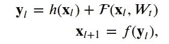

其中 x_ *l* 和 *x_* {l+1}为第 l 个单元的输入输出， *F* 为剩余函数， *h(x_l)* 为恒等式映射， *f* 为激活函数。 *W_t* 是与第 l 个残差单元相关联的一组权重(和偏差)。[【2】](https://papers.nips.cc/paper/2012/file/c399862d3b9d6b76c8436e924a68c45b-Paper.pdf)提出的层数为 2 或 3。我们将 *F* 定义为两个 3×3 卷积层的堆栈。在[【2】](https://papers.nips.cc/paper/2012/file/c399862d3b9d6b76c8436e924a68c45b-Paper.pdf)*f*中，一个 ReLU 函数在逐元素加法后被应用。我们遵循了后来提出的[【3】](https://arxiv.org/abs/1603.05027)架构，其中 *f* 只是一个身份映射。在这种情况下，

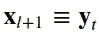

我们可以写作，

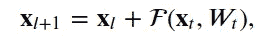

或者更一般地说，

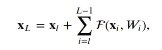

对于任何较深的单元 *L* 和较浅的单元 *l* 。该功能

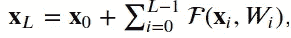

对于任何深度单元， *L* 是所有在前剩余函数的输出加上 x_0 的总和。

就优化过程而言，反向传播属性给出了关于为什么这种类型的连接有助于优化过程的一些直觉。我们可以把它写成:

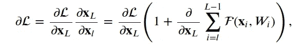

其中 *L* 是损失函数。注意这个梯度

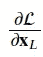

直接传播信息，而术语

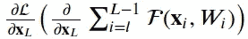

通过权重层传播。可以看出，利用这种形式，即使当权重任意小时，层的梯度也不会消失。

## 4.1 剩余单位

我们使用层子类化来构建*剩余单元*。自定义图层类有三种方法:`__init__`、`build`和`call`。`__init__`方法用定义的关键字参数调用基本的`Layer`类初始化器。`build`方法创建层。在我们的例子中，我们定义了两组`BatchNormalization`,后面是一个`Conv2D`层，最后一个使用与层输入相同数量的过滤器。`call`方法通过各层处理输入。在我们的例子中，我们有以下顺序:第一个`BatchNormalization`，ReLu 激活函数，第一个`Conv2D`，第二个`BatchNormalization`，另一个 ReLu 激活函数，第二个`Conv2D`。最后，我们将输入添加到第二个`Conv2D`层的输出，这可以看作是执行身份映射的*短连接*的实现。

```
class ResidualUnit(Layer):
    def __init__(self, **kwargs):
        super(ResidualUnit, self).__init__(**kwargs)

    def build(self, input_shape):
        self.bn_1 = tf.keras.layers.BatchNormalization(input_shape=input_shape)
        self.conv2d_1 = tf.keras.layers.Conv2D(input_shape[3], (3, 3), padding='same')
        self.bn_2 = tf.keras.layers.BatchNormalization()
        self.conv2d_2 = tf.keras.layers.Conv2D(input_shape[3], (3, 3), padding='same')

    def call(self, inputs, training=False):
        x = self.bn_1(inputs, training)
        x = tf.nn.relu(x)
        x = self.conv2d_1(x)
        x = self.bn_2(x, training)
        x = tf.nn.relu(x)
        x = self.conv2d_2(x)
        x = tf.keras.layers.add([inputs, x])
        return xtest_model = tf.keras.Sequential([ResidualUnit(input_shape=(128, 128, 3), name="residual_unit")])
test_model.summary()Model: "sequential"
_________________________________________________________________
Layer (type)                 Output Shape              Param #   
=================================================================
residual_unit (ResidualUnit) (None, 128, 128, 3)       192       
=================================================================
Total params: 192
Trainable params: 180
Non-trainable params: 12
_________________________________________________________________
```

## 4.2 尺寸增加剩余单元

在[【2】](https://arxiv.org/pdf/1512.03385.pdf)提出的架构中，有增加维度的*剩余单元*。这通过使用直线投影 *W_s* 通过快捷连接来实现，以匹配所需尺寸:

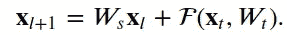

在这种情况下，它是由 1x1 卷积层完成的。

```
class FiltersChangeResidualUnit(Layer):

    def __init__(self, out_filters, **kwargs):
        super(FiltersChangeResidualUnit, self).__init__(**kwargs)
        self.out_filters = out_filters

    def build(self, input_shape):
        number_filters = input_shape[0]
        self.bn_1 = tf.keras.layers.BatchNormalization(input_shape=input_shape)
        self.conv2d_1 = tf.keras.layers.Conv2D(input_shape[3], (3, 3), padding='same')
        self.bn_2 = tf.keras.layers.BatchNormalization()
        self.conv2d_2 = tf.keras.layers.Conv2D(self.out_filters, (3, 3), padding='same')
        self.conv2d_3 = tf.keras.layers.Conv2D(self.out_filters, (1, 1))

    def call(self, inputs, training=False):
        x = self.bn_1(inputs, training)
        x = tf.nn.relu(x)
        x = self.conv2d_1(x)
        x = self.bn_2(x, training)
        x = tf.nn.relu(x)
        x = self.conv2d_2(x)
        x_1 = self.conv2d_3(inputs)
        x = tf.keras.layers.add([x, x_1])
        return xtest_model = tf.keras.Sequential([FiltersChangeResidualUnit(16, input_shape=(32, 32, 3), name="fc_resnet_unit")])
test_model.summary()Model: "sequential_1"
_________________________________________________________________
Layer (type)                 Output Shape              Param #   
=================================================================
fc_resnet_unit (FiltersChang (None, 32, 32, 16)        620       
=================================================================
Total params: 620
Trainable params: 608
Non-trainable params: 12
_________________________________________________________________
```

## 4.3 模型

最后，我们可以建立完整的模型。我们首先定义一个有 32 个过滤器的`Conv2D`层，一个 7x7 内核，步距为 2。在第一层之后，我们添加我们的*剩余单元*。然后，我们添加一个新的`Conv2D`层，有 32 个滤镜，一个 3x3 内核，步幅为 2。之后，我们添加了我们的*剩余单元*，它允许以 64 的输出改变尺寸。为了最终确定我们的模型，我们将数据展平，并通过 softmax 激活函数和与类数量相同的单元数量将其馈送到一个`Dense`层。

```
class ResNetModel(Model):

    def __init__(self, **kwargs):
        super(ResNetModel, self).__init__()
        self.conv2d_1 = tf.keras.layers.Conv2D(32, (7, 7), strides=(2,2))
        self.resb = ResidualUnit()
        self.conv2d_2 = tf.keras.layers.Conv2D(32, (3, 3), strides=(2,2))
        self.filtersresb = FiltersChangeResidualUnit(64)
        self.flatten_1 = tf.keras.layers.Flatten()
        self.dense_o = tf.keras.layers.Dense(target_labels.shape[0], activation='softmax')   

    def call(self, inputs, training=False):
        x = self.conv2d_1(inputs)
        x = self.resb(x, training)
        x = self.conv2d_2(x)
        x = self.filtersresb(x, training)
        x = self.flatten_1(x)
        x = self.dense_o(x)

        return xresnet_model = ResNetModel()
resnet_model(inputs= tf.random.normal((32, 128,128,3)))
resnet_model.summary()Model: "res_net_model"
_________________________________________________________________
Layer (type)                 Output Shape              Param #   
=================================================================
conv2d_6 (Conv2D)            multiple                  4736      
_________________________________________________________________
residual_unit (ResidualUnit) multiple                  18752     
_________________________________________________________________
conv2d_7 (Conv2D)            multiple                  9248      
_________________________________________________________________
filters_change_residual_unit multiple                  30112     
_________________________________________________________________
flatten_1 (Flatten)          multiple                  0         
_________________________________________________________________
dense_2 (Dense)              multiple                  1094419   
=================================================================
Total params: 1,157,267
Trainable params: 1,157,011
Non-trainable params: 256
_________________________________________________________________optimizer_obj = tf.keras.optimizers.Adam(learning_rate=0.001)
loss_obj = tf.keras.losses.CategoricalCrossentropy()@tf.function
def grad(model, inputs, targets, loss):
    with tf.GradientTape() as tape:
        preds = model(inputs)
        loss_value = loss(targets, preds)
    return loss_value, tape.gradient(loss_value, model.trainable_variables)def train_resnet(model, num_epochs, dataset, valid_dataset, optimizer, loss, grad_fn):

    train_steps_per_epoch = dataset.n // dataset.batch_size
    train_steps_per_epoch_valid = valid_dataset.n // valid_dataset.batch_size

    train_loss_results = []
    train_accuracy_results = []
    train_loss_results_valid = []
    train_accuracy_results_valid = []
    for epoch in range(num_epochs):
        start = time.time()
        epoch_loss_avg = tf.keras.metrics.Mean()
        epoch_accuracy = tf.keras.metrics.CategoricalAccuracy()
        epoch_loss_avg_valid = tf.keras.metrics.Mean()
        epoch_accuracy_valid = tf.keras.metrics.CategoricalAccuracy()
        i=0
        for x, y in dataset:
            loss_value, grads = grad_fn(model, x, y, loss)
            optimizer.apply_gradients(zip(grads, model.trainable_variables))

            epoch_loss_avg(loss_value)
            epoch_accuracy(y, model(x))
            if i>=train_steps_per_epoch:
                break
            i+=1
        j = 0
        for x, y in valid_dataset:
            model_output = model(x)
            epoch_loss_avg_valid(loss_obj(y, model_output))  
            epoch_accuracy_valid(y, model_output)
            if j>=train_steps_per_epoch_valid:
                break
            j+=1

        # End epoch
        train_loss_results.append(epoch_loss_avg.result())
        train_accuracy_results.append(epoch_accuracy.result())
        train_loss_results_valid.append(epoch_loss_avg_valid.result())
        train_accuracy_results_valid.append(epoch_accuracy_valid.result())

        print("Training -> Epoch {:03d}: Loss: {:.3f}, Accuracy: {:.3%}".format(epoch,
                                                                   epoch_loss_avg.result(),
                                                                   epoch_accuracy.result()))
        print("Validation -> Epoch {:03d}: Loss: {:.3f}, Accuracy: {:.3%}".format(epoch,
                                                           epoch_loss_avg_valid.result(),
                                                           epoch_accuracy_valid.result()))
        print(f'Time taken for 1 epoch {time.time()-start:.2f} sec\n')

    return train_loss_results, train_accuracy_resultstrain_loss_results, train_accuracy_results = train_resnet(resnet_model, 
                                                          40, 
                                                          train_generator_aug,
                                                          validation_generator_aug,
                                                          optimizer_obj, 
                                                          loss_obj, 
                                                          grad)Training -> Epoch 000: Loss: 2.654, Accuracy: 27.153%
Validation -> Epoch 000: Loss: 2.532, Accuracy: 23.488%
Time taken for 1 epoch 137.62 sec

[...]

Training -> Epoch 039: Loss: 0.749, Accuracy: 85.174%
Validation -> Epoch 039: Loss: 0.993, Accuracy: 75.218%
Time taken for 1 epoch 137.56 sec
```

# 5.结果

残差网络在测试集上显示出更好的准确性，与基准模型的 75.6%相比，接近 81%的准确性。我们可以很容易地使剩余模型更深入，这是我们可以从这个架构中提取最大价值的场景。

```
fig, axes = plt.subplots(1, 2, sharex=True, figsize=(12, 5))

axes[0].set_xlabel("Epochs", fontsize=14)
axes[0].set_ylabel("Loss", fontsize=14)
axes[0].set_title('Loss vs epochs')
axes[0].plot(train_loss_results)

axes[1].set_title('Accuracy vs epochs')
axes[1].set_ylabel("Accuracy", fontsize=14)
axes[1].set_xlabel("Epochs", fontsize=14)
axes[1].plot(train_accuracy_results)
plt.show()
```

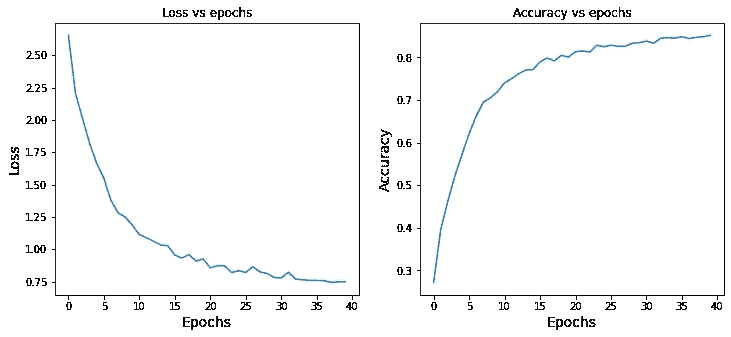

图 2:残差网络几个时期的训练精度和损失演变。

```
def test_model(model, test_generator):

    epoch_loss_avg = tf.keras.metrics.Mean()
    epoch_accuracy = tf.keras.metrics.CategoricalAccuracy()

    train_steps_per_epoch = test_generator.n // test_generator.batch_size
    i = 0
    for x, y in test_generator:
        model_output = model(x)
        epoch_loss_avg(loss_obj(y, model_output))  
        epoch_accuracy(y, model_output)
        if i>=train_steps_per_epoch:
            break
        i+=1

    print("Test loss: {:.3f}".format(epoch_loss_avg.result().numpy()))
    print("Test accuracy: {:.3%}".format(epoch_accuracy.result().numpy()))print('ResNet Model')
test_model(resnet_model, validation_generator)
print('Benchmark Model')
test_model(benchmark_model, validation_generator)ResNet Model
Test loss: 0.787
Test accuracy: 80.945%
Benchmark Model
Test loss: 1.067
Test accuracy: 75.607%num_test_images = validation_generator.n

random_test_images, random_test_labels = next(validation_generator)

predictions = resnet_model(random_test_images)

fig, axes = plt.subplots(4, 2, figsize=(25, 12))
fig.subplots_adjust(hspace=0.5, wspace=-0.35)

j=0
for i, (prediction, image, label) in enumerate(zip(predictions, random_test_images, target_labels[(tf.argmax(random_test_labels, axis=1).numpy())])):
    if j >3:
        break
    axes[i, 0].imshow(np.squeeze(image))
    axes[i, 0].get_xaxis().set_visible(False)
    axes[i, 0].get_yaxis().set_visible(False)
    axes[i, 0].text(5., -7., f'Class {label}')
    axes[i, 1].bar(np.arange(len(prediction)), prediction)
    axes[i, 1].set_xticks(np.arange(len(prediction)))
    axes[i, 1].set_xticklabels([l.split('_')[0] for l in target_labels], rotation=0)
    pred_inx = np.argmax(prediction)
    axes[i, 1].set_title(f"Categorical distribution. Model prediction: {target_labels[pred_inx]}")
    j+=1
plt.show()
```

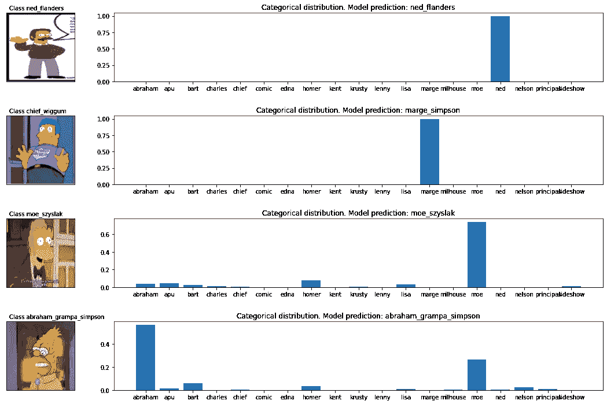

图 3:随机图像(左侧)和残差网络产生的预测的相应分类分布(右侧*)。*

# *6.结论*

*残余网络引入了一种系统的方法，通过简单地执行身份映射来使用*快捷连接*。这被证明稳定了深度网络的优化过程。此外，剩余网络通过超越传统 CNN 显示了快捷连接的力量。*

*该方法可以通过增加模型的深度来扩展。这是特别合适的，因为剩余网络不会遭受退化问题。*

*保持联系: [LinkedIn](https://www.linkedin.com/in/luisbrasroque/)*

# *7.参考*

*[【1】](https://papers.nips.cc/paper/2012/file/c399862d3b9d6b76c8436e924a68c45b-Paper.pdf)【Krizhevsky 等人，2012】Krizhevsky，a .，Sutskever，I .，Hinton，G. E. (2012)。基于深度卷积神经网络的图像网分类。神经信息处理系统进展，25:1097–1105。*

*[【2】](https://arxiv.org/pdf/1512.03385.pdf)【何等，2015】何，k，张，x，任，s，孙，J. (2015)。用于图像识别的深度残差学习。*

*[【3】](https://arxiv.org/abs/1603.05027)【何等，2016】何，k，张，x，任，s，孙，J. (2016)。深剩余网络中的身份映射。*

*[【4】](https://www.kaggle.com/alexattia/the-simpsons-characters-dataset)[https://www . ka ggle . com/Alex attia/the-Simpsons-characters-dataset](https://www.kaggle.com/alexattia/the-simpsons-characters-dataset)*

*[【5】](/transfer-learning-and-data-augmentation-applied-to-the-simpsons-image-dataset-e292716fbd43)[https://towards data science . com/transfer-learning-and-data-augmentation-applied-to-the-Simpsons-image-dataset-e 292716 FBD 43](/transfer-learning-and-data-augmentation-applied-to-the-simpsons-image-dataset-e292716fbd43)*