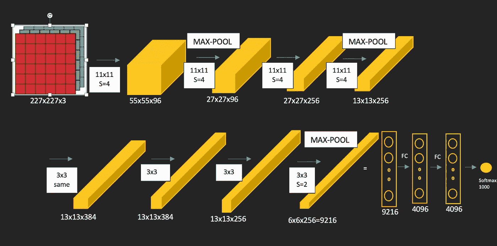

# ResNets:为什么它们的性能比经典的 ConvNets 好？(概念分析)

> 原文：<https://towardsdatascience.com/resnets-why-do-they-perform-better-than-classic-convnets-conceptual-analysis-6a9c82e06e53?source=collection_archive---------16----------------------->

## 更深入地了解是什么让剩余网络如此高效

图片来源: [Unsplash](https://unsplash.com/s/photos/tech)

> 今天，我们都熟悉神经网络在赋予机器人工智能方面发挥的作用，几乎在每个领域，从医疗行业到太空探索。来自世界各地的机器学习爱好者和研究人员正在寻找使这些网络尽可能健壮和高效的方法。一个这样的网络是剩余网络(ResNets ),这是一个无处不在使用的架构，能够有效地实现更深更大的网络。在本文中，首先，我们将简要概述 LeNet-5、AlexNet 和 VGGNet-16/19 等经典网络，然后我们将讨论剩余网络(RenNets)的功能，以及它如何减轻之前讨论的经典网络的一些限制，并通过深度网络实现高效训练。这将有助于你梳理这些概念，并为从概念上更好地理解 ResNets 扫清道路。如果您不想浏览经典架构，请跳过下一节，直接进入 ResNets (2。我们能走多深？).

## 1.经典网络架构

基本卷积神经网络(CNN)的设计从图像输入层(尺寸:高度、宽度、通道)开始，随后与一些卷积滤波器、最大或平均池层的组合进行卷积，随后是全连接层，最后是用于类别标签预测的 Softmax 或 Sigmoid 输出函数。后续层的信道根据卷积层中使用的滤波器数量而增加。这种设计 CNN 的通用方法对于每种架构都是通用的，但是这些层的数量和排列方式使得它们在性能和效率方面互不相同。

[***LeNet-5***](http://yann.lecun.com/exdb/publis/pdf/lecun-98.pdf) 架构，开发于 1998 年，用于识别一组手写数字的灰度图像，它由大小为:(32×32×1)的图像输入层，6 个滤波器的卷积层，滤波器大小为(5×5)和(2×2)，平均池，步幅:1 用于卷积，2 用于平均池。网络以一个完全连接的层和具有 10 个可能预测的输出函数结束(在这种情况下是数字(0 到 9))。该网络由总共 60，000 个训练参数组成。

图一。LeNet-5 架构(图片来源:作者)

2012 年，研究人员提出了一个比 LeNet 大得多的网络，名为 [***AlexNet***](https://papers.nips.cc/paper/2012/file/c399862d3b9d6b76c8436e924a68c45b-Paper.pdf) 对 ImageNet LSVRC-2010 数据集中的 120 万张高分辨率图像进行分类。输入大小为(227x227x3)，它由卷积层和最大池层的组合组成，使用相同的填充和 1000 个类，在最后一层使用 Softmax 函数进行预测。该网络有 6000 万个训练参数，比 LeNet 大得多。网络的架构如图 2 所示。

图二。AlexNet 架构(图片来源:作者)

2015 年开发的[***VGGNet-16/19***](https://arxiv.org/pdf/1409.1556.pdf)，在 ImageNet 数据集上训练，是这三种网络架构中最深入的。它有 1.38 亿个训练参数，包括:VGG-16 中的 16 个卷积层(使用填充)，VGG-19 中的 19 个卷积层(两者的功能相同)，最大池，全连接和 Softmax 分类器中的 4096 个特征，最终预测 1000 类对象。通过该网络中每一层的输入的宽度和高度尺寸的系统减少，伴随着每一层中通道数量的有组织的增加，是引起许多开发者和研究者注意的一个因素。看看这些深度网络的功效，它们在行业中普遍用于训练各种机器学习模型以及向初学者教授基础知识。

图 3。VGGNet-16 网络架构(图片来源:作者提供)

## 2.我们能走多深？

当我们进一步增加这些网络的深度以使模型更健壮并增强其性能时，会发生什么？根据理论，训练和测试时的错误率应该随着我们在网络中的深入而不断降低，然而，在实验中，发生了相反的事情。在达到最小值后，错误率不再稳定下降，而是再次开始上升。这是由于**爆炸和消失梯度下降**问题造成的，该问题也会导致模型过度拟合，从而增加误差。这个问题可以从数学上理解[这里](https://www.youtube.com/watch?v=qhXZsFVxGKo)。在这种情况下，像 L2 正则化或剔除这样的技术无助于优化或减少过拟合。因此，随着我们深入，有效的参数和激活(甚至来自身份函数)会在中间丢失，因为后续层由于通过不断更新权重和偏差进行的严格激活而无法维持它们。

图 4。该图显示，20 层网络的错误率小于 56 层网络的错误率，理论上应该相反。([图片来源:(原文引用)用于图像识别的深度残差学习](https://arxiv.org/pdf/1512.03385.pdf)

幸运的是，**剩余网络**已经被证明在解决这个问题上非常有效，因为它们在每两层之间使用跳过连接或“捷径”,同时在所有层之间使用直接连接。这允许我们从一层获取激活，并将其提供给另一层，甚至神经网络中更深的层，因此在更深的层中维持网络的学习参数。

图 5。在 ResNet 中跳过连接([图片来源:(原始引用)用于图像识别的深度残差学习](https://arxiv.org/pdf/1512.03385.pdf)

这种连接的一个块被称为**“剩余块”**，它们在 ResNet 中相互堆叠，以保持从单位函数中有效学习参数，甚至在更深的层中。

## **3。残余块内部发生了什么？**

让我们将普通网络层的结构和功能与残差块进行比较，以正确理解残差块的工作原理。平面网络由线性(z)和非线性(ReLU)激活组成，其输出用作后续层的输入。在这种情况下，对于每一层，只使用一个激活函数。

图 6。“普通网络”的一层(图片来源:作者)

在哪里，

*z[l+1]= w[l+1]****a[l]****+b[l+1]*

*ReLU:g(z(l+1))=****a【l+1】***

*z[l+2]= w[l+2]a[l+1]+b[l+2]*

*ReLU:g(z[l+2])=****a【l+2】***

*(以此类推(l+n)层，其中 n 是层数)*

*w[l]* 是第*l*层的权重矩阵。

*B[l]* 是第*l*层的偏差

然而，在其第*【l+2】*层中的剩余块连同来自*a【l】*即*g(z【l】)*的激活，也使用来自先前激活函数的参数，即*a【l】*本身。这是通过下图所示的跳过连接实现的。

图 7。ResNet(图像来源:作者)的一层(残余块)

剩余块非线性 ReLU 函数；

*a[l+2]= g(z(a[l+1])+a[l])****(重要方程)***

***如果在*** *的情况下，z(a[l+1]) = 0，(这发生在 w[l+1] = 0，b[l+1] = 0 的情况下)*

***a[l+2]= a[l]****([l+2]层还有一个参数要学习)*

上图所示的连接将*a【l】*添加到第*【l+1】层的 ReLU 非线性函数中。因此*a【l】*中的信息通过捷径快速转发到网络的更深处。这暗示着第*【l+1】层的 ReLU 函数现在变成了*g(z【l+1】+****a【l】****)*。这样，即使在网络中的某个第 n *层*层，权矩阵为零矩阵，偏差也为 0，使 *z(a[l+1])* 无效，第*【l+2】层*层也总会有一个来自第*l*层的高效学习参数，即*a[l】*。**

**注:**有时候，当*a【l】*和*a【l+2】*层的尺寸不同时，矩阵加法是不可能的，所以，*z(a【l+l】)+a【l】*没有意义。在这种情况下，通过将矩阵 *Ws* 乘以前一层的权重矩阵*W【l】*来对这些层的权重矩阵进行一些调整，以使维度相同并能够进行相加。幸运的是，这些计算中的大部分是在设计 ResNet 网络时处理的，因为在它们的卷积层中使用了“相同的”卷积。

## 4.网络中的层

图 8。ResNet 中的层由堆叠的剩余块组成(图片来源:作者)

深度网络是通过将剩余的块一个接一个地堆叠起来而构建的，每个网络长达一百层，有效地从网络更深处的早期激活中学习所有参数。ResNet 的卷积层如图 9 所示。它是一个由 34 层组成的 ResNet，具有使用相同填充的(3×3)卷积滤波器、最大池层和全连接层，以预测 1000 个类的 Softmax 函数结束。

图 9。34 层 ResNet 卷积神经网络([图片来源:(原文引用)用于图像识别的深度残差学习](https://arxiv.org/pdf/1512.03385.pdf))

总之，ResNets 是最有效的神经网络架构之一，因为它们有助于在网络的更深处保持低错误率。因此，在需要深度神经网络的情况下，如特征提取、语义分割、各种生成性对抗网络体系结构，被证明表现得非常好。这些也可以用于开发严格的配备人工智能的计算机视觉系统，其中需要提取复杂的特征或提高图像和视频的分辨率。我希望这篇文章能帮助您更清楚地了解 ResNets 背后的基本概念。感谢阅读！

**参考文献:**

【https://arxiv.org/pdf/1603.05027.pdf】<https://arxiv.org/pdf/1603.05027.pdf>**:ResNets 研究论文**

**【2】*[*http://yann.lecun.com/exdb/publis/pdf/lecun-98.pdf*](http://yann.lecun.com/exdb/publis/pdf/lecun-98.pdf)*:LeNet 研究论文**

**【3】*[*https://papers . nips . cc/Paper/2012/file/c 399862d 3 b 9d 6 b 76 c 8436 e 924 a 68 c 45 b-Paper . pdf*](https://papers.nips.cc/paper/2012/file/c399862d3b9d6b76c8436e924a68c45b-Paper.pdf)*:Alex net 研究论文**

**【4】*[*https://arxiv.org/pdf/1409.1556.pdf*](https://arxiv.org/pdf/1409.1556.pdf)*:VGGNet 研究论文**

**【5】*[*https://www . coursera . org/learn/convolutional-neural-networks/lecture/hahz 9/resnets*](https://www.coursera.org/learn/convolutional-neural-networks/lecture/HAhz9/resnets)*:CNN 课程 by deeplearning.ai**

**[*https://towardsdatascience . com/introduction-to-resnets-c0a 830 a 288 a4*](/introduction-to-resnets-c0a830a288a4)**