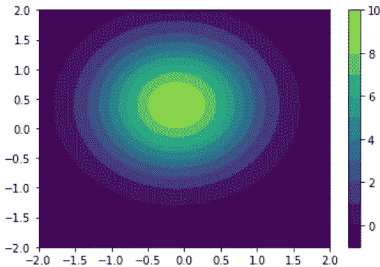
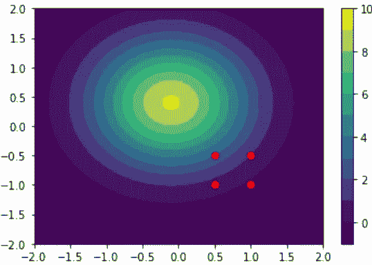
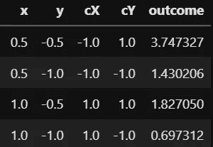
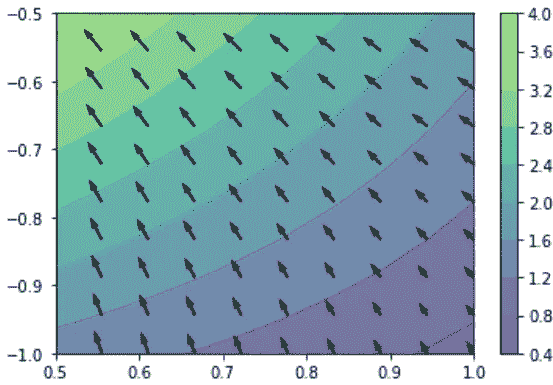
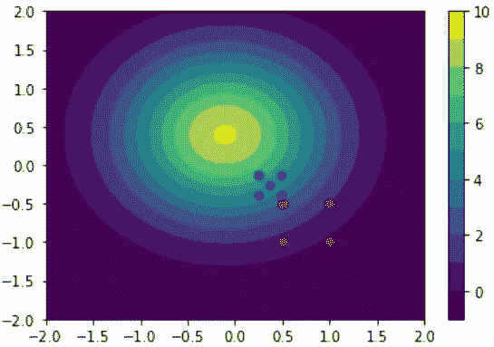
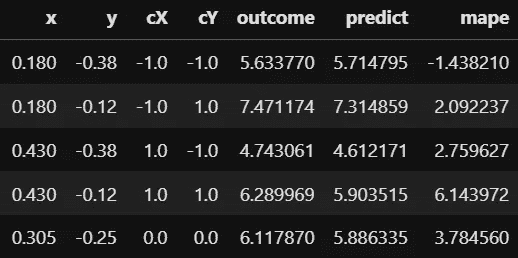
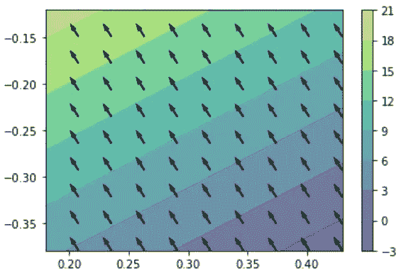
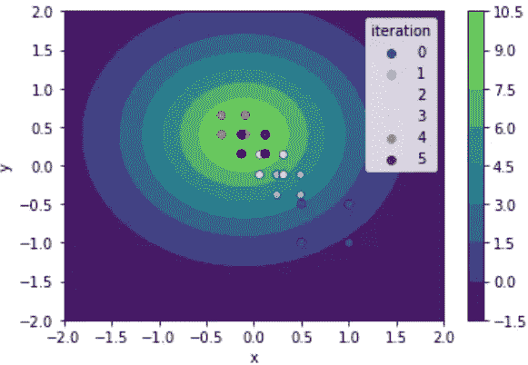

# 基于实验设计和 python 的响应优化

> 原文：<https://towardsdatascience.com/response-optimization-with-design-of-experiments-and-python-63f9afb3f26f?source=collection_archive---------16----------------------->

## [思想和理论](https://towardsdatascience.com/tagged/thoughts-and-theory)

## 用响应面法(RSM)和 python 寻找实验最优值。

# 介绍

在[之前的文章](https://medium.com/mlearning-ai/design-of-experiments-doe-with-python-be88f5c013f5)中，提出了一种分析具有两个水平的简单 DOE 的方法，并讨论了解决平均效应和相互作用的相关分析。然而，运行 DOE 的重要一点是寻找系统最大响应的能力。

在本文中，我们将使用 python 中可用的一些非常基本的工具来解决这样一个问题:给定两个水平的全因子 DOE 的结果，如何计划和执行接下来的运行以实现最大化。如果你熟悉一些机器学习技术，你会发现我们正在实现一个非常简单的梯度下降方法。不同之处在于，我们不想最小化成本函数，而是最大化结果。

只要记住，如果你需要最小化某事，你可以最大化它的负面！

# 未知响应的生成

为了简单起见，我们将生成一个依赖于两个变量的响应:x 和 y，这并不太复杂，但它有一个最大值。

我们创建了一个函数，我们将在实验的下一步使用它。

上面的函数接受两个输入:x 和 y，以及一个我们稍后将使用的关键字解析器。第一次运行时，我们让代码为 x0、y0 和 fwhm 生成随机变量。这些是我们函数中的一些超参数，用来探索不同的情况。
然后我们用 np.linspace (101 个点)初始化我们的曲面，并计算我们矩阵(用 meshgrid 构建)中每个 x 和 y 的函数。结果如下所示。



图一。生成的表面。

## 总体思路和框架

现在让我们想象我们想要探索这个系统，所以，作为优秀的实验者，我们计划一个实验。我们不太了解，只知道我们的参考变量是从 x = [0.5，1]和 y=[0.5，-1]左右开始的。这是任意的，其他任何值都可以。

我们将探索那个地区作为我们的第一个实验。



第一次全因子设计。

此时，我们将得到四个点的结果(全因子设计)。从那里，我们将拟合一个具有 scikit-learn 函数的二阶相互作用的线性模型，并建立我们系统的最陡路径。

一旦我们了解我们的系统朝哪个方向发展，我们将选择下一个点。在这篇文章中，我们将首先手动这样做，然后实现一个简单的循环来自动完成同样的任务。

## 效用函数

为了生成实验，进行测量并将结果与我们以前的模型进行比较，创建一个函数来帮助我们这样做是很方便的。

在上面的代码中，我们用我们的 *xs* 和 *ys* 的所有组合来初始化一个数据帧。最终我们可以决定在设计中添加一个中心点，但这不是强制性的。

为了与上一篇文章中的内容保持一致，我们称函数为“normal_to_coded_var ”,它将变量重新编码为 **1** 。然后，我们使用一个 lambda 函数来计算响应，传递我们之前在生成曲面时定义的参数。如果我们在现实生活中实际运行这个实验，这一步就不会出现:在这种情况下，我们只需要用将结果导入到我们的数据框架中的东西来修改这条线。

如果将模型传递给函数，代码还将计算预测值的%误差。请注意，为了得到一个模型，您至少需要第一次运行，因此我们将在接下来的步骤中使用该函数。

## 线性模型

为了找到最佳方向，我们需要拟合一个模型。最简单的方法是用多项式特征和线性回归定义管道。我们使用多项式特征来计算 x 和 y (x*y)之间的相互作用参数，并最终(interaction=False)计算类似(x**2 和 y**2)的项。

## 生成下一步

为了生成下一步，我们需要一个简单的策略:我们计算一个方向上的期望增量，并基于该模型推导出另一个方向上的增量。

基本上，我们计算 increment_x 和 increment_y，同时跟踪系数的符号(否则我们将总是增加 x)。然后，我们将变量映射回原始空间，因为我们在寻找最大值，所以我们将该值添加到之前显示最大值的点。围绕新的 x 和 y 的最大步长将是 0.125。

我们可以找到不同的方法来选择新的值，这取决于我们对系统的了解或考虑特定的约束。

# 迭代结果

第一次运行的起点是:



首先对原始变量、编码变量(cX 和 cY)和响应(结果)进行 DoE。

我们看到我们的 2 因子全因子，以及编码变量，和结果。运行上面的代码将生成这个表面。请注意，曲面是使用拟合的模型生成的。



从第一个 DOE 获得的表面。

从那里我们看到表面线不是直的，所以相互作用项有一些影响。我们还注意到，从最小值到最大值，我们几乎有 4 个点的差异。这是因为所选区域很宽。如果系统是强非线性的，这并不总是一个好的起点。箭头显示的是梯度:这也是从拟合的模型计算出来的，而不是原来的表面。

代码如下:

将被迭代的代码。

这将输出下一步:

```
coef x -0.66 and coef y 0.86
increment x -1.54 and increment y 2.00 with ratio -0.77
new x 0.37 and new y -0.25
[0.24 0.49] [-0.38 -0.12]
```

比率为负，表示系数之一为负，而另一个不是。接下来建议的点集中在 x = 0.37 和 y = -0.25 处。因此，下一步是移动到左上角，但也减少了原始空间的宽度。

新实验的要点在下图中用蓝色显示。请注意，为了节省时间/资源，您可以决定使用第一个设计的左上角来运行第二批实验。在这种情况下，我们还在设计中实现了中心点。



如果我们想看看我们的模型如何很好地拟合新空间的结果，我们应该使用“x”和“y”作为变量再次拟合它:用编码变量拟合模型是方便的，因为它们是标准化的，但是预测在新的数据框架中是没有用的。

从下表中我们可以看到，红色方块附近的误差较低，随着我们远离它，它会如预期的那样增加。



第一个模型的结果和预测值之间的比较。

## 迭代表面结果

这是用原始变量生成的表面。请注意，左图中预测值的范围从 0 到> 25(第一次 DoE)，右图中预测值的范围> 18(第二次运行)。



第一次 DOE(左)和第二次运行(右)的表面响应。

## 自动化回路

最后，我们可以尝试实现一个简单的标准来找到我们的最优值:在这种情况下，我们只需重复上面的步骤，当结果中的最大值低于所有组合实验中的最大值时，停止代码。

```
steps_df = pd.DataFrame()
x_t = np.array([0.5,1])
y_t = np.array([-0.5,-1])for i in range(10):
    test_df = output_model(x_t, y_t, pars=(x0, y0, fwhm), cnt_point=False)
    test_df['iteration'] = i
    pipe1 = linear_pipe_fit(degree=1, interaction=True, dataframe=test_df, input_vars=['x','y'])
    x_t, y_t = next_step(pipe1, increment_y = 2, dataframe=test_df)
    #plot_contour_fromdf(test_df, fill_value=0, model = pipe1, plot_normal_vars=True)
    steps_df = steps_df.append(test_df)
    max_outcome = test_df['outcome'].max()

    if max_outcome < steps_df['outcome'].max():
        print(f'maximum found at iteration {i}')
        break
    print(x_t, y_t)
```

这是原始曲面上的迭代:



迭代特性是在迭代 i=4 时，代码向后移动，然后停止，有效地找到最大值。

# 结论

总之，我们看到了如何设计一个 2 级 DoE，并使用简单的策略迭代搜索最大值。代码看起来在方向改变上是健壮的。然而，这种实现可能会受到局部最大值的影响。

如果我们怀疑我们的系统可能有复杂的表面，运行稀疏设计(如拉丁方)来更好地映射表面可能是一个好的选择，而不是盲目地寻找最大值。

# 参考书目:

本文的灵感来自于:
[使用数据的流程改进—使用数据的流程改进(learnche.org)](https://learnche.org/pid/contents)

我的 [github 简介](https://github.com/AndC314/DoE)和一个笔记本，上面有这里使用的全部代码。