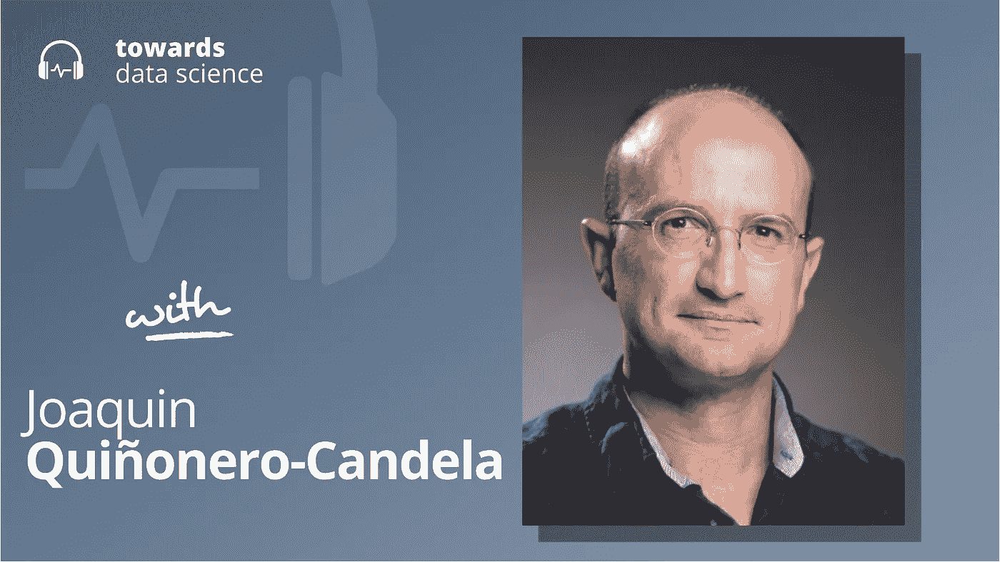

# 负责任的 AI 在脸书

> 原文：<https://towardsdatascience.com/responsible-ai-at-facebook-936d3dcb0161?source=collection_archive---------36----------------------->

## [苹果](https://podcasts.apple.com/ca/podcast/towards-data-science/id1470952338?mt=2) | [谷歌](https://www.google.com/podcasts?feed=aHR0cHM6Ly9hbmNob3IuZm0vcy8zNmI0ODQ0L3BvZGNhc3QvcnNz) | [SPOTIFY](https://open.spotify.com/show/63diy2DtpHzQfeNVxAPZgU) | [其他](https://anchor.fm/towardsdatascience)

## Joaquin quionero-Candela 在 [TDS 播客](https://towardsdatascience.com/tagged/tds-podcast)

要选择章节，请访问 Youtube 视频[这里](https://youtu.be/UKd8hpOl1tQ)。

*编者按:这一集是我们关于数据科学和机器学习新兴问题的播客系列的一部分*，*由 Jeremie Harris 主持。除了主持播客，Jeremie 还帮助运营一家名为*[*sharpes minds*](http://sharpestminds.com)*的数据科学导师初创公司。你可以听下面的播客:*

收听[苹果](https://podcasts.apple.com/ca/podcast/towards-data-science/id1470952338?mt=2)、[谷歌](https://www.google.com/podcasts?feed=aHR0cHM6Ly9hbmNob3IuZm0vcy8zNmI0ODQ0L3BvZGNhc3QvcnNz)、 [Spotify](https://open.spotify.com/show/63diy2DtpHzQfeNVxAPZgU)

脸书经常部署推荐系统和预测模型，这些系统和模型每天都会影响数十亿人的生活。这种影响力伴随着巨大的责任——除了其他事情之外，开发符合道德、公平和良好表征的人工智能工具的责任。

这不是一项容易的任务。人类花了几千年来争论“公平”和“伦理”的含义，但还没有达成共识。这正是为什么负责任的人工智能社区在确定探索和推荐什么政策时必须尽可能多地涉及不同的观点——这是脸书负责任的人工智能团队一直在应用的做法。

在这一集的播客中，我邀请到了华金·基诺内罗·坎德拉，他是脸书负责任人工智能的杰出技术负责人。Joaquin 多年来一直处于人工智能道德和公平运动的前沿，并监督了脸书负责任的人工智能团队的形成。因此，他是相对少数几个有实践经验的人之一，能够大规模地做出关键的人工智能伦理决策，并看到它们的效果。

我们的谈话涵盖了很多领域，从关于公平定义的哲学问题，到实现某些道德人工智能框架时出现的实际挑战。以下是我最喜欢的一些外卖食品:

*   Joaquin 强调了在人工智能背景下思考公平的三种不同方式，所有这些方式都在一定程度上涉及到在不同人群(性别、种族等)中比较给定算法的性能。第一，如果一个系统对每个群体都达到了最低的绩效水平，那么它就是公平的。这将包括制定听起来像这样的标准，“任何种族都不应该被错误分类超过 5%。”第二种方法走得更远，要求平等:算法性能不应该在不同组之间变化太大。应用这一标准会导致这样的要求，“平均而言，任何种族被错误分类的频率都不应超过其他任何种族的 3%。”
    最后一个策略是最小化各组结果的差异。这里的想法是应用先验知识，即“所有的组都同样可能执行行为 X，所以一个不能预测所有的组将以同样的概率执行 X 的算法一定是不公平的。”
*   一个关键问题是:谁来决定哪种公平标准适用于特定情况？Joaquin 认为这是公平问题的核心:我们不会很快解决我们所有深刻的道德争论，所以与其现在假装道德清晰，我们应该专注于创建允许在具体案例的基础上确定具体决定的公平性的过程。因此，他的团队的口号是“公平是一个过程”(他真的有一件 t 恤来证明这一点！)
*   无论公平过程涉及什么，很明显，我们不应该指望数据科学家自己处理所有的事情。数据科学家没有时间成为道德和哲学的大师，因此有必要在这些道德问题到达技术团队之前建立抽象的结构。为此，脸书的负责任的人工智能计划(Responsible AI initiative)根据一种“中枢辐射”模式工作，在这种模式下，一个核心团队负责以公开透明的方式制定道德标准，然后这些标准由专门的团队转化为数据科学家可以实施的数学定义。
*   Joaquin 讨论了大公司之间协作和协调日益增长的重要性，以确保建立更普遍的负责任的人工智能开发标准，这些标准不仅仅反映单个组织的激励或观点。本着这种精神，他现在与人工智能伙伴关系(Partnership on AI)合作，这是一个伞式组织，汇集了脸书、谷歌、微软和 OpenAI 等主要参与者，以协调与人工智能道德最佳实践和安全人工智能开发相关的问题。

你可以[在推特上关注华金](https://twitter.com/jquinonero)，或者[在推特上关注我](https://twitter.com/jeremiecharris)

## 播客中引用的链接:

*   华金的[个人网站在这里](http://quinonero.net/)。
*   华金在 AI 网站上关于合作关系的页面在这里。

## 章节:

*   0:00 介绍
*   1:32 华金的背景
*   8:41 实施流程
*   15:12 没有单一优化功能
*   公平的定义
*   28:03 脸书和 Twitter 如何管理公平性
*   32:04 算法歧视
*   37:11 人工智能伙伴关系
*   44:17 总结

## 请查看以下文字记录:

杰里米(00:00):

嘿，大家好。我是杰里米。欢迎回到播客。我对今天的节目感到非常兴奋，因为我们将谈论脸书是如何做负责任的人工智能的。现在，脸书经常部署推荐系统和预测模型，每天影响着数十亿人的生活。伴随着这种延伸而来的是巨大的责任，除了其他事情之外，还有开发符合道德、公平以及良好表征的人工智能工具的责任。

耶雷米(00:22):

这真的不是一件容易的事情。人类已经花了几千年来争论公平和道德到底意味着什么，而我们在这些问题上还没有达成任何共识。这正是为什么负责任的人工智能社区在决定探索和推荐什么政策时，必须尽可能多地涉及不同的观点。这是脸书负责任的人工智能团队已经应用的实践。

耶雷米(00:44):

现在，在这一集的播客中，我和华金·奎诺内罗·坎德拉在一起，他是脸书负责任人工智能的杰出技术负责人。华金多年来一直处于人工智能伦理和人工智能公平运动的前沿。他监督了脸书整个负责任的人工智能团队的形成，基本上是从零开始。因此，他是相对少数有实践经验的人之一，能够大规模地做出关键的人工智能伦理决策，并看到它们的效果。

杰里米(01:09):

现在，我们的对话将涵盖很多领域，从关于公平定义本身的哲学问题，到实施某些人工智能伦理框架时出现的实际挑战。这是一个伟大的。我很兴奋能和你们分享这一集，希望你们也喜欢。Joaquin，非常感谢你参加我的播客。

华金(01:26):

谢谢你，杰米。谢谢你邀请我。非常荣幸，我非常喜欢你的播客。

耶雷米(01:32):

非常感谢。你能来真是令人激动。我真的很期待这次谈话。我们可以讨论的东西太多了，但我认为有一个情景片段会有助于做好准备。这是一个关于你的背景的简短对话，你是如何进入这个领域的，有人是如何从 ML 和学术旅程之外进来，然后最终来到你现在的位置，这是脸书负责任人工智能倡议的领导者。你怎么去的？

华金(01:56):

我们必须有一个协议，你可以随时打断我，因为一旦我开始谈论我的旅程，我可以去很长时间。我认为在非常非常高的水平上，我在 2004 年完成了机器学习的博士学位。当时，在我所在的社区，很少有人使用 AI 这个词。NeurIPS 社区主要是一个 ML 社区。我做过一段时间的学者。我是德国马克斯·普朗克研究所的博士后。我的第一次转变是在 2007 年 1 月作为一名研究科学家加入了位于英国剑桥的微软研究院。

华金(02:43):

所以在我的职业生涯中发生了一件非常基本的事情，那就是我遇到了使用机器学习的产品团队。特别是，在微软的搜索引擎必应(Bing)发布之前，我们开始与该团队进行对话。我们开始应用 ML 来增加广告对人们的相关性。具体来说，我们正在建立模型，预测如果有人看到广告，他是否会点击。这项工作真的让我迷上了这样一个想法，即 ML 不仅仅是你在科学论文中做的事情，而是你可以实际投入生产的事情。

华金(03:24):

所以，在 2009 年，Bing 组织问我，“嘿，你为什么不离开微软研究院，那种舒适的研究环境，为什么不成为一名工程经理，在 Bing 内部领导一个团队？”所以，我就这么做了。这可能是我一生中压力最大、最戏剧性的转变之一，因为我对成为一名工程领导者一无所知。我不习惯做路线图、人员规划、预算、随叫随到、负责关键生产组件。所以，压力很大。但同时，这也很棒，因为它让我看到了另一个世界。

华金(04:04):

在我的整个职业生涯中，有一个主题一直重复出现，现在依然如此，那就是技术转移的想法。从白板和一些数学、一些想法、一些研究、一些实验，一直到需要维护和运行的生产系统。

华金(04:22):

这种转变让我以第一人称视角看到了研究的另一面，另一个世界，有时作为一名研究人员，你会进去说，“嘿，你们都应该考虑使用我刚刚建立的这个很酷的模型，”然后人们会说，“我没有时间做这个。我很忙。”所以，现在突然之间，我站在了另一边。这是一次很棒的经历，最终也帮助建立了拍卖优化团队。这让我学到了一点关于机制设计、经济学和拍卖的知识。

华金(04:57):

然后我在 2012 年 5 月来到了脸书。我加入了广告组织。我开始为广告建立机器学习团队。然后，我认为我职业生涯中的第二个重要时刻发生了，那就是，我想我会告诉每个人的一句话是，我真的很难相信奇才队没有规模。

华金(05:16):

因此，我们面临的挑战是，我们在脸书有一些优秀的机器学习研究人员，但我们需要解决的问题数量不断增加。我们几乎被自己快速移动的能力所束缚。人们会在他们自己的盒子里建造模型，有他们自己的运输过程，我觉得整个过程很慢。困扰变成了，我们如何加速研究到生产？我们怎样才能建立工厂？

华金(05:51):

那是一个有趣的时期，因为突然之间，有一个困难的决定要说，嗯，不要急于建立最复杂的神经网络来进行排名和推荐，让我们坚持我们现有的技术，这是合理的。我们使用增强决策树，使用在线线性模型等相对简单的工具。在大范围内，这可能没那么简单。但我们的想法是，我们可以每周发货吗？我们能不能从花几周时间从-

耶雷米(06:26):

哇哦。

华金(06:26):

是啊，那是幻觉。vision 每周都会发货。这几乎成了一句口头禅。每个人都喜欢，“每周出货。”这让我们建立了整个生态系统来管理从研究到生产的路径。它做了很多事情。这是我们在整个公司建立的一套工具。这很有趣，因为它只关注广告。这个想法是，在 ads 中，任何人都可以很容易地建立任何类型的模型，预测任何类型的表面上的任何类型的事件，实际上分享代码，分享想法，分享实验结果。

华金(7:00):

几乎也知道该和谁说话。其实一件大事就是建立一个社群。我们的愿景是，这与您实际表达模型的框架无关。当 TensorFlow 和 Keras 变得流行时，我们当然支持它。我们支持 PyTorch。但是如果你真的想用 C++从头开始写东西，请便。这是相当不可知论的。一切都是为了管理工作流。

华金(07:28):

最终发生的是，团队开始要求采用我们正在构建的东西。从时间上看，整个公司都采用了我们的产品。我们开始在计算机视觉、自然语言处理、语音、推荐、机器翻译等基础上增加专门的服务。这导致了一个名为 Applied ML 的团队的成立，我帮助建立并领导了几年，它本质上只是为整个公司提供服务，并使 ML 民主化，并将其交到所有产品团队的手中。

华金(08:06):

这个想法是，因为奇才不会扩展，你不需要那么多奇才，奇才将是基本创新的创造者，但这样你就可以拥有一个由数百名甚至数千名工程师组成的生态系统，他们可以非常容易地利用和建立这些东西。所以，我一直这样做，直到三年前。在我们过渡到第三个重要时刻，也就是过渡到负责任的人工智能之前，如果你想问我关于这一部分的任何问题，我会先喘口气。

耶雷米(08:41):

在这方面，特别是在你职业生涯的第二阶段，我最大的收获之一是你在谈论实施过程，比如变得非常非常擅长实施过程。在我看来，每当人们谈论人工智能伦理、人工智能公平之类的东西时，这就是让我不寒而栗或让我对整个空间有点紧张的东西，这显然缺乏一致性。

杰里米(09:04):

很难知道什么是 AI 公平，什么是 AI 伦理。似乎每个人都有不同的定义。我也不清楚，即使我们有了这些定义，我们如何将它们编成可复制和可扩展的过程。所以，专业知识一定很重要，对吧？我的意思是，过程开发流程，将映射到人工智能工作的公平性？

华金(09:27):

确实如此。现在，你击中了要害。这很有趣，因为我们在公司内部民主化人工智能时所做的许多事情现在非常有帮助，因为我们正在研究负责任的人工智能，尽管这可能不是我们脑海中的第一个想法。但是，现在我们有工具可以让我们看到在脸书生产中部署的所有模型是什么，谁建造了它们，它们包含了什么，这种想法最终会给你这种程度的阻碍和一致性，这真的很重要。但是当然，负责任的人工智能还有更多。如你所说，在概念的定义上存在广泛的分歧。所以，也许让我告诉你我自己的世界之旅。

华金(10:23):

我一直在关注公平、问责和透明研讨会。我相信它发生的第一年可能是 2014 年左右，在 NeurIPS，然后它不断重复出现。然后我相信 2018 年可能是它爆发的一年。事实上，我参加了那个研讨会。它成为了一个独立的会议，2018 年在纽约举行。

华金(10:53):

但就在 2017 年底之前，在纽约的会议上，凯特·克劳福德(Kate Crawford)或索隆·巴罗卡斯(Solon Barocas)等人做了几个基本的主题演讲。这对我来说变得很明显，好像我的整个大脑在某种程度上爆炸了，我想，是时候了。很明显是时候了。我们需要把食物放在煤气上。我们需要全力以赴。我们需要从最初的努力开始，真正地，真正地建立一个专注于负责任的人工智能的巨大努力。

华金(11:27):

作为一个热爱数学、热爱工程、热爱流程和平台并为人们提供工具的人，我认为我们可以在几个月内解决算法偏差问题[相声 00:11:42]。

耶雷米(11:43):

不会那么难的。

华金(11:44):

是啊，没那么难。能有多难？我想，我们来看看这里。所以，我看了一些作品，一些定义。当然，很快就清楚了。这是 Arvind Narayanan 的作品，他给出了这个美丽的演讲，公平的 21 个定义和他们的政治。他在 2018 年做了一个关于这个的演讲。当时它被称为肥胖之星会议。现在它被称为事实。[inaudible 00:12:11]社区很擅长想出像[NIPS 00:12:14]和 FAT 这样可怕的名字。幸运的是，我们给它们重新命名了。

耶雷米(12:18):

快速移动，打破东西。

华金(12:19):

快速移动，打破东西。所以，我想，好吧，没关系。在这 21 个定义中，一些关于公平的定义试图让不同群体之间的结果平等，一些关于公平的定义试图关注对每个人一视同仁，我想，好吧，我们到底需要多少个？就像，也许我们可以实现一对。我想象像一个下拉框，好吧，我选择哪一个作为[相声 00:12:44]从业者？我想我们可以有漂亮的可视化数据，包括分组数据、模型的准确性、校准曲线等等。我想，好吧，我们有这个我们，我们可以在几个月内完成。

华金(12:59):

然后，我突然意识到，人工智能的公平性主要不是人工智能的问题，数学没有答案。你应该使用什么样的公平定义，这完全取决于具体情况。你需要建立多学科的团队，包括来自道德和政治哲学的人。这实际上非常重要。或许最重要的一点是，公平不是模型的属性。这不是一个状态框。其实是一个过程。公平是一个过程。事实上，我会把镜头倾斜一点，给你们看…我故意穿上我们为团队制作的 t 恤，上面写着，公平是一个过程。

耶雷米(13:45):

啊，非常好。

华金(13:46):

这是我们为团队制作的一套 t 恤，因为我一直在重复这件事。因此，有一天，我们团队的行政助理拿出一堆 t 恤给每个人，并说，“好吧，你们一直在说公平是一个过程[听不清 00:14:03]。”不管怎样，我们自豪地穿着它们。你永远不会结束。对于工程师来说，可能有点难以想象的是，这不像是，哦，我要在这里做这个麦克风，而且已经完成了。我测试过了，可以用。不是这样的。

华金(14:20):

如果你回到过去，我想人类从亚里士多德开始就一直在讨论公平。我们还在讨论，我们不同意。它变得政治化，因为我们有不同的意识形态。所以，你需要建立一个多学科的过程，包括风险评估，决策，记录你如何做出决策等等。这只是为了公平起见。显然，在负责任的人工智能中，你也有许多其他维度要处理。

耶雷米(14:54):

我喜欢把公平作为一个过程的想法，部分是因为，嗯，有一个著名的原则叫做古德哈特定律。一旦你定义了一个指标，你说，我们要优化这个数字，然后突然人们找到了绕过它的方法，他们发现了黑客，他们发现了作弊。可以说，我在今天的股市中看到了这一点。

耶雷米(15:12):

时间回到 1950 年，一般来说，如果股市上涨，人们的生活质量就会提高。但现在我们看到了脱钩，因为人们开始玩游戏和政治，并围绕它进行优化。所以，这看起来像…我的意思是，这是战略的一部分，是认识到没有单一的损失函数，没有单一的优化函数来改善，而是看起来像让我们专注于过程？

华金(15:35):

绝对的。关于这件事，我有几件事想说。首先，每个指标都是不完美的。即使你不是专门为公平而工作，当你设定一个指标目标时，特别是，我认为许多技术公司非常成功的原因之一是，我认为我们可以快速迭代，我们可以非常量化，我们可以由指标驱动，我们可以移动这些指标。

华金(16:11):

但这同时也是我们潜在的致命弱点，它会让你陷入困境。因此，培养非常强的批判性思维是至关重要的。开发我们称之为计数器的指标是很重要的，就像其他指标一样，当你使这个指标变得更好时，你不应该使它变得更差。但即便如此-

耶雷米(16:36):

[相声 00:16:36]其中一个例子？那听起来像是一个迷人的想法。

华金(16:39):

一个简单的想法是，想象你正在努力提高一个语音识别系统的准确性，你正在通过单词错误率或类似的东西来衡量它，无论你想要什么。因此，如果你关心公平，你可以建立一个反指标，你可以实际分解，你可以取消你的指标，比如说，在美国。你可以通过一些地理分组来做到这一点，因为全国各地的口音都不同。然后，您的衡量指标可能是您不能降低任何组的性能，因为平均值总是会影响您，对吗？

耶雷米(17:21):

是啊。

华金(17:21):

你可以让大多数人的情况变得好两倍，你可以让另一个人的情况变得更糟，而你可能甚至没有意识到。因此，这将是一个非常公平的中心指标。但是你可以想象许多其他的场景，在这些场景中你试图优化体验的许多方面，并且有一些事情你不希望变得更糟。

耶雷米(17:51):

我想你对此的第一个评论是公平，或者说公平的定义对数据科学家来说不是一个挑战。

华金(17:58):

没错。

耶雷米(17:58):

这不是他们应该担心的事情，这完全有道理。数据科学家没有时间去拿哲学学位和公共政策学位。所以，这最终会是某个人的工作。无论是政策制定者还是有更多文科背景的人，我想到的一个问题是，围绕这些指标的对话的特点变得非常非常技术性。我想仅仅是能够传达正在做出的决定的本质，这本身就是一个挑战。你认为这种情况会经常出现吗？你有什么策略来应对这种挑战吗？

华金(18:32):

这是一个挑战。我们已经取得成功的一件事是定义一个在整个公司谈论公平的一致的词汇，以及一组越来越复杂的一致的问题，以使这一点非常具体，并用例子来说明。公平的一个最基本的定义是问这样一个问题，我的产品对所有群体都有效吗？当然，定义组的问题也是非常依赖于上下文的。

华金(19:18):

在我的左边是我们的脸书入口摄像头，它有一个智能人工智能，能够跟踪人。如果我和我在西班牙的父母或者在[听不清 00:19:36]德国的父母进行视频会议，基本上现在你可以想象我们的周末是如何和我们的孩子一起度过的，或者我们和他们进行视频会议，我们实际上也给了他们一些这样的设备，因为如果你用你的手机来 Skype 或 FaceTime 或使用你使用的任何软件，试图保持画面居中等真的很烦人。

华金(19:56):

因此，传送门是神奇的，但人工智能跟踪人们，并看到如果你有两个人来缩小它，裁剪，居中和一切，你不能想当然地认为它会在肤色或性别或年龄方面都一样好。在这种情况下，你可以说，我如何定义最低服务质量？最低的服务质量是，某人突然出现或某事的失败率必须小于某个小百分比的时间或帧或会话数或其他。

华金(20:34):

这是一个合理的概念，最低服务质量的概念。我希望我的产品对每个人都足够好。当然，在我的产品环境中，一个关键的问题是，嘿，考虑到你要建立的东西，谁是你应该考虑的最敏感的群体？稍后，如果你愿意，我会在话题罐里放点东西，那就是我们可以谈论选举干预。我们可以谈论人工智能如何在这种情况下提供帮助。我们可以谈谈印度选举。然后我们可以推理出在这种情况下哪些群体是相关的。

华金(21:12):

但是回到门户的例子，关于公平的最基本的问题是，嘿，你能取消你的度量吗？团队通常会启动标准。所以数据科学，ML 团队会说，“嘿，这个模型够好了吗？”好吧，问题是，在这种情况下，它可以是肤色，有许多尺度可以用于此，年龄和性别，然后对于这些桶中的每一个，查看表现最差的桶，并想象这是唯一的人口，你还会推出吗？

华金(21:50):

如果答案是否定的，那么也许你需要坐下来想一想，好吧，我怎样才能确保我不会丢下任何人。接下来是印度大选，这里有一系列问题和一个更具比较性质的公平定义。在某种程度上，最低服务质量与标准相比，但它不一定担心，哦，它可能对一组比另一组工作得更好。只要它对每个人都足够好，就没问题。我将把另一个话题放入话题罐，那就是古德哈特定律，以及你是如何玩弄或搞砸你的最低服务质量的。

华金(22:30):

但是下一个层次将是平等或平等待遇。你可以说，好吧，我实际上关心的是性能上的差异。印度选举的例子是这样的。如果我没记错的话，大约在去年四、五月间，我们举行了人类历史上最大规模的选举。我想大概有接近 10 亿的注册选民。比这少一点点，但是很大。在这个时候，有许多错误信息和操纵企图的担忧。

华金(23:08):

在没有人工智能的情况下，我们解决这个问题的方法是让人类获得标准、社区指南、内容政策，并检查内容是否违反这些标准。如果有，你就把他们拿下。但问题是，就这次选举的规模和我们现有的数量而言，你没有多少人可以雇佣来做这件事。所以接下来你需要做的是你需要区分工作的优先顺序，因为很明显，我的关于我弹吉他或展示我的猫或我的狗的帖子，我们不应该浪费时间去回顾这些。

华金(23:47):

但是，如果有政治家正在讨论的问题，或者即使不是政治家，组织也在讨论公民内容，讨论社会或政治问题的内容，那么我们应该优先考虑这些内容。所以，我们建立了一个人工智能来做这件事。我们称之为市民分类器。因此，它所做的是筛选内容，识别可能是公民性质的内容，然后优先考虑这些内容，供人们审查。

华金(24:20):

公平问题是什么？嗯，公平问题是，在印度，你有，我想有 20 多种官方语言，而且有许多地区有非常不同的文化特征。所以，真的，如果你把你的人口划分成地区和语言，你可以看到这些实际上是如何与宗教或种姓相关联的。不同地区的人们关注的社会问题是不同的。但现在你有了一个人工智能，它可以优先考虑我们将那些人力资源放在哪里来审查内容。如果人工智能只对几种语言有效，而对其他语言无效，会发生什么？

华金(25:01):

所以，如果你拿语言做类比，如果它高估了语言的风险会发生什么？这意味着我们会优先考虑…我们会投入更多的人力资源来审查该语言的帖子。如果你低估或低估了另一种语言中某些东西在本质上是公民的可能性，那么我们就没有在那里分配足够的人力资源。

华金(25:22):

然后，我们决定不以最低服务质量为标准，我们认为，这是一个我们真正想要平等待遇的案例。由于我们这里有一个二进制分类器，它输出一个介于 0 和 1 之间的数字，表示这段内容是公民的概率是多少，那么我们所说的是，我们希望这些预测能够针对每一种语言和每一个地区进行很好的校准。

华金(25:47):

所以，再一次，公平的概念，我们设置了一个更高的标准，因为这是关于资源分配的公平。为了使画面完整，我们在内部也使用的第三个常见定义和相关问题集是关于公平的，是关于询问，不仅仅是我们应该平等对待所有人和所有事，还是系统的性能应该高于每个人的某个标准？那么问题就变成了，例如，有没有一群人的产品结果值得特别关注？这可能是因为我们应该考虑一些历史背景。

华金(26:42):

我们在 2020 年看到的一个例子是，随着美国种族正义意识的觉醒，人们开始关注黑人企业的商业成果，例如在脸书。因此，我们已经建立了产品的努力，帮助黑人拥有的企业的可见性，因为我们觉得脸书平台有机会帮助改善已经存在的情况。

华金(27:17):

很多时候，当你考虑公平时，这个问题也是一个责任问题。这就像，好吧，人们可能会说，好吧，但社会是有偏见的，而我在这里，我已经建立了一个中立的技术，我在这个游戏中没有皮肤。我认为我们要说的是它不是那样工作的。你的技术可以反映这些偏见，它可以延续它们，它可以将它们封装在一个黑盒中，使它们合法化，或者使它们很难调试或理解。另一方面，技术也可以让每个人的结果变得更好。但有时我们不得不问自己，有没有我们要优先考虑的群体？说了很多话。

耶雷米(28:03):

不。我认为很难回答这个问题，脸书是如何在推特上管理公平的[听不清 00:28:10]。

华金(28:09):

没错。

耶雷米(28:10):

但是我认为你描述的不同种类的镜头和不同的公平方法真的很有趣。从过程的角度来看，我非常好奇的一件事是，在组织内部，关于应用哪个公平标准的决定来自哪里？您认为做出决策的流程目前是否已经正式化，结构是否足够合理？显然，会有迭代，但是你觉得你对这个过程应该如何构造有一个好的感觉吗？

华金(28:42):

是啊。所以，我们正在建立流程。但对我们来说非常清楚的是，这是一个轴辐式模型。因此，我们有一个集中的负责任的人工智能团队，它是多学科的。正如我前面提到的，它不仅有人工智能科学家和工程师，也有道德和政治哲学家和社会科学家。该团队所做的是整个层面的工作，从为提出这些问题提供一个道德框架，如果你愿意，这将是定性部分，然后更深入到定量部分，就像，嘿，我们如何…

华金(29:26):

现在你谈到了平等与最低服务质量。为了平等，你谈到了二元分类器。这在数学中到底意味着什么？我在看什么？我看的是组间的假阳性率还是类似的？回答:不，我们不一定，因为这有问题。但是你会怎么做呢？

华金(29:48):

在这下面还有另一层，更多的是平台和工具集成。再一次，利用我们在应用 ML 中所做的所有工作，我们如何使它变得非常简单和友好，能够按组分解算法的预测，等等？所以，你有整个蛋糕，包括像办公时间这样的事情，这实际上非常重要。它是集中的。

华金(30:15):

然后你会看到，每个产品团队都在构建自己的嵌入式专家组，他们将与一个集中的团队密切合作。你必须这样做的原因是，你需要集中的团队有一致的实践，一致的术语和定义，但是决策，就像你之前说的，需要在上下文中做出。

华金(30:45):

因此，让集中的团队做出数百个非常依赖上下文的决策是不切实际和低效的。最重要的是，因为我们说，这是一个过程，你不要做一次决定就完事了。你坚持下去。对吗？

耶雷米(31:04):

是啊。

华金(31:06):

顺便说一句，我看了电影《编码偏见》,作者是 Shalini Kantayya。它的特点是 Joy Buolamwini 和 Timnit Gebru 和 Cathy O'Neil 以及其他许多负责任的人工智能方面的杰出研究人员。我认为试图引用现场的人，然后把人弄错，这一定是非常危险的。

华金(31:32):

其中一个，我将把它保持在那个抽象层次，因为我不记得是谁说的了，其中一个说了这样的话，“许多这些负责任的人工智能实践，比如公平，它们就像卫生。就好像你每天都要刷牙一样。”这就是我对它的看法。你必须结合你的产品来做。因此，我们看到越来越多的产品团队建立他们自己的嵌入式工作，我们与他们的合作非常非常密切。

耶雷米(32:04):

你如何决定……所以，这其中有一个几乎是经济的方面让我着迷。我想我看到了 Amanda Askell，OpenAI 的人工智能政策专家之一，她在推特上谈到了这个想法，现在在人工智能伦理社区有一个主题，如果我能找到一个算法不好的原因，那么这个算法就不应该被部署。在某种程度上，在时代精神中有这样的氛围，人们会说，“哦，好吧，这个算法以这种边缘方式进行歧视。”

耶雷米(32:33):

当然，我们知道所有的算法都会不可避免地以某种方式进行区分。所以，一定有某种界限，我们会说，好吧，这太多了，这还不够。从这个角度来看，我想你是如何看待经济取舍的？我的意思是，你可以试着去调试算法，直到母牛回家，但是在某个时候，某些东西必须被启动。所以，是的，我想，你怎么看待这个权衡？

华金(32:59):

我认为很难对这个问题给出一个纯粹定量的答案。我的意思是，再一次，作为一个数学和工程人员，我喜欢能够计算函数的成本，如果我使用人工智能减少仇恨言论，误报的成本是 40 美元 3 美分。所以这很难。我认为这涉及到了一些事情。我认为它涉及透明度，也涉及治理。

华金(33:40):

我认为，我认为事情的发展方向是，当你将人工智能构建到一个产品中时，你对风险收益分析非常透明，有一个短语我这些天在使用，我可能是从某人那里偷来的，我不知道，这种人工智能最小化的想法，这种想法……就像人们谈论数据最小化一样。所以，AI 最小化。而不是我的本能是让我们使用人工智能，因为它很酷，它应该是这样的，我可以不用人工智能吗？如果答案是也许，但如果我加上 AI，它为每个人增加了一吨多的价值，就像，好吧，这是合理的，我有价值。

华金(34:33):

然后是另一面，这是所有的风险清单。而风险之一可能是歧视，也可能是其他对不公平的定义。我认为这些权衡是透明的，并且有一个理想的闭环机制来获得反馈并进行调整，看看什么是可接受的，我认为这是我们将不可避免的未来。

华金(35 分 06 秒):

我经常用的一个例子并不是 AI 的例子，但还是那句话，我再说一遍，这些问题很多都不是大家熟悉的 AI 问题。我们考虑内容的适度性，以及在给予每个人发言权和允许言论自由之间的艰难权衡，但另一方面，保护社区免受有害内容的影响。而且有明显有害的误传。我们得出了坚定的结论，即我们既不能也不应该自己或独自这样做。当我说我们时，我当然是以脸书员工的身份说的。但我认为这在整个技术领域都是如此。

华金(35:55):

我们正在试验这个外部监督委员会。也许你听说过。是一群专家。团队做了大量工作，将他们组织在一起，制定了章程以及他们将如何运作。但是让我们先关注一下它的精神。它的精神是将会有棘手的决定。没有任何内容政策是完美的。因此，让人类参与到开发中来，拥有一个包括外部审查和专业知识的治理是至关重要的。我认为，归根结底，这将是透明度、问责制和参与性治理机制的相互作用。对吗？

耶雷米(36:45):

是啊。

华金(36:46):

如果你缩小范围，你会想到人工智能在 10 年内会非常普遍，非常重要，一个大问题将是参与式治理，对吗？

耶雷米(36:58):

是啊。

华金(36:59):

你或我怎么能说人工智能在哪里开车送我们的亲戚或宠物去看兽医，我的意思是，这将是非常惊人的，就像某种自动驾驶-

耶雷米(37:11):

这本身，几乎就像是在脸书的整个过程中强制征收这种能源税……我认为脸书这样做很好。我认为脸书有一个负责任的人工智能部门很棒。从某种程度上来说，这种情况只能在今天大规模发生是完全有道理的，因为只有在这样的规模下，像脸书、谷歌和 OpenAI 这样的公司才能真正负担得起建立巨型语言模型和巨型计算机视觉模型。这导致…我希望我们有更多的时间来讨论这个问题，但是我必须问一个关于人工智能合作的问题。

华金(37:43):

当然，是的。

耶雷米(37:43):

因为它是这个等式中如此重要的一部分。实际上，我个人的一个担忧是，我们在这里已经谈了一点，但仅仅是安全、隐私、公平、道德，所有这些东西，它们确实采取了对有竞争力的组织有效征税的形式。我的意思是，谷歌必须与脸书竞争。脸书必须和其他人竞争。这是一个市场。

耶雷米(38:06):

这是一件好事，但只要有公平税，只要有安全税，这意味着就有动力进行某种竞争，每个人都试图在某种程度上在这些方向上进行最低限度的投资。至少在我看来，像人工智能伙伴关系这样的团体在调解互动、设定最低标准方面发挥着有趣的作用。我想，首先，你同意这种解释吗？第二，随着技术的发展，你如何看待人工智能领域的合作伙伴关系发挥更大的作用？因为我知道这是一件大事，但我想确保我得到你对[相声 00:38:40]的广泛想法。

华金(38:39):

不，我很高兴你在人工智能上提出合作。我是董事会成员，过去几年一直积极参与，我认为这是一个世界需要的组织。但我希望你能帮助我理解“逐底竞赛”假说背后的逻辑。也许我们可以通过选择你想要的任何责任维度来使它变得非常具体。我只是有点纠结。我想确定我真的明白你的意思。

耶雷米(39:14):

是啊，是啊，当然。所以，我在想象…实际上，我会举一个从 alignment 到 AI 安全社区的例子。所以，一个常见的是一个假设，我不一定买这个，但具体来说，让我们假设这是真的，语言模型可以任意缩放，并导致类似超级强大的模型，有效的神谕或类似的东西。所以，他们本质上是在释放你可以用超大语言模型做的东西的数量。

耶雷米(39:43):

在某种程度上，安全是一个问题，你可能不想要一个任意强大的语言模型，可以策划和计划。就像你可以说，“嘿，我怎么从华金那里骗到 8 万美元？”语言模型说，“哦，这是你怎么做的。”然而，像 OpenAI 这样的公司正在与 DeepMind 或任何其他公司竞争，以尽可能快的速度扩大这些规模。谁先达到一定的能力水平，我的意思是，在六个月左右的时间里就有决定性的优势。

耶雷米(40:16):

有类似的情况，你有公平和偏见等等，但在任何时候你参与公司与公司的竞争，你可以在安全上投入边际成本，或者你可以在能力上投入边际成本，总会损失一些价值。这种权衡是…我想知道人工智能上的伙伴关系是否可以在组织之间发挥某种作用，设定每个人至少都想遵守的标准，诸如此类的事情。

华金(40:44):

是啊。谢谢你。我理解这个问题。这个问题让我在某种程度上思考了一下环境可持续性，你可以在许多方面进行同样的竞争，不仅是在公司之间，甚至是在国家之间。就好像我们只有一个星球。谁将承诺削减二氧化碳成本？就像，哦，好吧，等一下，我马上回来。

耶雷米(41:10):

就在这棵树后面。

华金(41:13):

没错。我认为人工智能方面的合作在许多方面都发挥着关键作用。首先，作为一个论坛，一个非常独特的论坛，它汇集了你能想到的每一种类型的组织，学术界，民权组织，民间社会，其他类型的非营利组织，小公司和大公司。人工智能合作伙伴中的一些组织将积极游说，塑造和宣传即将到来的监管。因此，我认为已经有了一点压力，要求大公司参与并带头，因为不这样做可能意味着你必须应对对所有人都不利的监管。所以，我觉得这是一个角度。

华金(42:16):

另一个角度是效率。你描述的一些工作，我可以投资的一些美元，以确保我的大语言模型符合人类价值，并且它们不是邪恶的，如果你有一个由大量盈利性公司支持的组织，并且他们做这项工作，像 ABOUT ML 这样的项目是我喜欢的项目，它建立在数据集和模型的文档实践上，所以它是各种想法的组合，像数据集的数据表和模型卡等，这些都是非常强大的。

华金(43:04):

我们脸书公司对此投入了极大的关注和实验。我很高兴我们可以使用一些东西，A，相对现成的，但非常[相声 00:43:16]，我们不必建立自己，并为加分。它得到了像人工智能伙伴组织这样的组织的认可和信任，它不仅仅代表我们的利益。我认为这将是一个普遍的模式。

华金(43:33):

这是一个 360 度的视角，你可以通过一个拥有所有人的多利益主体组织来获得。第二，效率和便利性，最佳实践和建议来自那些真正知道他们在做什么的人，你知道当这个被创建时每个人都在看。然后第三个是真正的合法性和有效性，你通过使用一些东西，嘿，这些不像脸书的伦理原则。对吗？

耶雷米(44:06):

是啊。

华金(44:06):

我的意思是，如果人们皱起眉头，人们会说，“哦，我的意思是，那里代表了什么利益？”只有脸书的，而它来自人工智能的合作伙伴。

耶雷米(44:17):

是啊。我的意思是，这是我希望在未来能看到更多的组织之一。这似乎是那种组织的新生核心有望继续发展的事情，因为正如你所说，我们需要在许多不同的层面上对这一领域进行某种多党派的监督。很高兴看到这项倡议正在成形。华金，非常感谢你的时间。实际上，你有没有一个你喜欢分享东西的地方，特别是像 Twitter，或者一个个人网站，如果人们想了解更多关于你的工作，你想把他们引向那里？

华金(44:49):

哦，我要坦白一件事。所以，我是一个晚采用 Twitter 的人。

耶雷米(44:58):

哦，那可能对你的心理健康有好处。

华金(45 分 03 秒):

但我现在感到一种强烈的责任感，那就是为公众辩论做出贡献并参与其中[听不清 00:45:14]。我现在甚至不得不去看看我的推特，这让我自己很尴尬。在推特上，我是@jquinonero。所以，是字母 J，然后是我的第一个姓。很复杂。我有两个姓，因为我来自西班牙。

耶雷米(45:33):

我们可以分享它。

华金(45:34):

我们有一个…没错。是啊是啊。我已经做出了更多参与的个人承诺，我将不得不学习如何以一种不会像你所说的那样破坏我的心理健康的方式来做这件事。

耶雷米(45:48):

是啊。出于某种原因，我认为这是最大的挑战之一，尤其是我发现在 Twitter 上保持这种正念状态，不要迷失在提要中。好家伙。不管怎么说，我们已经活了十年了。但真的很感谢你花时间在这上面。非常感谢，真的很喜欢这次谈话。

华金(46 分 05 秒):

非常感谢你，杰米。很高兴来到这里。谢谢你做这个播客，谢谢你让每个人都参与到这种对话中来。

耶雷米(46:17):

我很乐意。