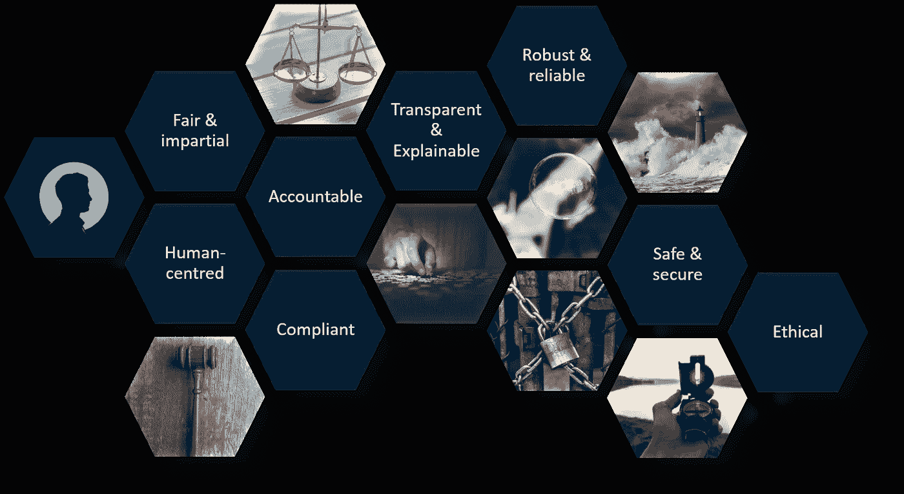

# 负责任的人工智能在行动

> 原文：<https://towardsdatascience.com/responsible-ai-in-action-2099be088321?source=collection_archive---------27----------------------->

## [人工智能校准和安全](https://towardsdatascience.com/tagged/ai-alignment-and-safety)，值得信赖的人工智能

## 负责任的人工智能的市场驱动因素、框架和实用建议

谨慎前进——图片来源:奥利维尔·佩内尔

随着人工智能(AI)在社会各个方面的兴起，伦理被证明是[技术的新前沿](/ethics-the-new-frontier-of-technology-815454f0d158?sk=f659b80ca31c9694abab235664b0c935)。公众意识、媒体审查和即将出台的法规正在要求组织和数据科学界将道德原则嵌入到他们的人工智能计划中。Gartner 将“*更智能、负责任和可扩展的人工智能*”确定为 2021 年数据和分析的 [#1 市场趋势](https://www.gartner.com/smarterwithgartner/gartner-top-10-data-and-analytics-trends-for-2021/)。你可能也知道欧盟委员会在 2021 年 4 月发布的[法规提案](https://eur-lex.europa.eu/resource.html?uri=cellar:e0649735-a372-11eb-9585-01aa75ed71a1.0001.02/DOC_1&format=PDF)。这不仅仅是欧盟监管狂热的又一个例子。世界各地的许多政府都在努力为人工智能制定类似的监管框架。

问题应该是用于训练机器学习模型的数据的适用性，放大人类偏见和歧视的风险，用算法做出的预测和决策的可解释性，以及人工智能应用程序的公平性和透明度的人类监督。除了更大的利益和社会责任，利害攸关的是人工智能技术的成功采用，否则，这些技术有可能为组织和整个社会带来巨大的价值。

在本文中，我将介绍:

*   推动对负责任的人工智能的需求的市场力量，
*   负责任的人工智能原则框架，
*   将负责任的人工智能付诸实践的 5 条建议。

# 负责任人工智能的市场力量

在我最近与 EMEA 各地组织的互动中，我观察到所提问题类型的转变。人们一直非常关注实验，探索新技术，并试图定义创新的用例。随着意识和成熟度的提高，问题现在变成了:“*我如何有效地、大规模地、负责任地使用人工智能来实现切实的业务成果？*”。

我今天在市场上看到的是 3 股力量的汇聚:**加速**、**委托**和**放大**。

在 [Unsplash](https://unsplash.com?utm_source=medium&utm_medium=referral) 上由 [Patrick](https://unsplash.com/@macpukpro?utm_source=medium&utm_medium=referral) 拍摄的照片

## 加速

可用数据、存储和计算能力的指数级增长使得加速成为可能。在过去的 18 个月里，COVID 危机加剧了这种加速。来自麦肯锡的[最近的一项调查显示，对新冠肺炎危机的回应已经将数字技术的采用速度加快了几年，而且这些变化中的许多可能会长期存在。这不仅仅是能够在家工作。组织已经意识到，他们需要能够依靠他们的分析和数字服务来建立弹性、竞争力并在不确定的时代生存下来。](https://www.mckinsey.com/business-functions/strategy-and-corporate-finance/our-insights/how-covid-19-has-pushed-companies-over-the-technology-tipping-point-and-transformed-business-forever)

这种加速也是由我称之为“即时暴政”和消费者对即时访问在线服务的需求所驱动的。就像孩子一样，我们什么都想要，现在就想要！消费者有一个明确的期望，那就是产品、服务、信息，所有的一切，都应该可以在网上即时获得。我不得不承认我自己也有同感。在一天结束的时候，谁想回到买东西的时候，你不得不货比三家。谁想回到获得贷款的时候，你必须去你的银行的一个分支机构，与一个人交谈，填写一些表格，然后等待 3 周(如果你幸运的话)得到答复？

人工智能被广泛视为一种竞争优势。如果 A 银行不能立即批准我的贷款，我就直接问 b 银行。如果我想买的产品明天不能通过网上零售商 X 发货，我就从网上零售商 y 那里买。

照片由[奥斯汀·尼尔](https://unsplash.com/@arstyy?utm_source=medium&utm_medium=referral)在 [Unsplash](https://unsplash.com?utm_source=medium&utm_medium=referral) 上拍摄

## 委托

令我印象深刻的第二个方面是，我们准备将多少决策委托给机器人或算法。

让我们以股票市场交易为例。今天，股票市场上大约 85%的交易是由算法自动完成的，没有人类的干预。当这对交易员、投资银行和对冲基金来说既方便又有利可图时，我们知道，事实上，这可能会加剧股市崩盘，给个人的生活和财富带来现实后果。这就提出了自动交易算法的责任和可解释性的问题。

这是一个极端的例子，但我们现在期望计算机为我们做出如此多的决定:当我们在网上搜索某些东西时获得的信息，从 A 到 B 的方向，交通灯、飞机和核反应堆的操作，保护我们的银行账户免受欺诈者的侵害，等等。

我们似乎盲目相信算法做出正确决定的能力。在某种程度上，算法在某些事情上比人类好得多，比如处理大量数据以识别模式并做出预测。但是他们缺乏常识、文化和背景。他们只是从提供给他们的数据中学习。它们可能非常有效，但也非常狭隘，导致人工智能系统做出技术上正确但社会上不可接受的预测或决定。

我们看到人工智能应用不断扩展，有时会取代人类代表我们做决定，这提出了一些问题，例如:

*   我们能信任他们吗？
*   什么样的标准和道德规范被用来做这些决定？
*   谁对所做的决定负责？错误的决定会有什么后果？
*   为什么算法不应该分享类似的道德准则和标准，并像人类一样面对错误决策的后果？(对于算法而言，这将导致重新训练、重建或退役)。

桑迪·卡瓦德卡尔在 [Unsplash](https://unsplash.com?utm_source=medium&utm_medium=referral) 上拍摄的照片

## 扩大

放大 AI 应用能实现多少，眨眼之间能做多少决定。问题是…我们知道算法有时会做出糟糕的预测，而这些糟糕的预测会导致糟糕的决策，对现实世界产生真正的影响。

个人做出糟糕或不公平的决定是一回事。但是算法是大规模实时决策的，所以错误决策的后果会很快变得更严重。实际上，人工智能就像一个放大器或者是一个回音室。人工智能系统的覆盖范围要大数百万倍。因此，无论我们是否意识到，我们大脑中存在的偏见，以及现实世界中存在的歧视，无论我们喜欢与否，都被人工智能应用放大了。

马特·切辛在 [Unsplash](https://unsplash.com?utm_source=medium&utm_medium=referral) 上的照片

## 反应过度？

这些担忧是完全合理的，但无助于失败的人工智能系统在媒体上的铺天盖地的报道。新闻上到处都是。这些备受瞩目的案件没有一天不成为头条新闻。杀手机器人的幻想对记者来说是非常好的材料，但它加剧了公众和决策者的恐惧，他们不想犯这些错误，损害他们的品牌。

某种程度上，这是可以理解的。公众意识和监管者正在赶上一段时间以来未受抑制的技术创新。有些人已经决定亲自解决这个问题，并采取一些措施。有无数的倡议和团体决心解决这一问题，提高对这一问题的认识，制定指导方针和最佳做法，并向立法者提出挑战。

我最近看了一部名为“[编码偏见](https://www.codedbias.com/)的纪录片，揭示了面部识别等人工智能技术的某些使用中的歧视和缺乏透明度。尽管这部纪录片为围绕人工智能使用的伦理问题提供了一个颇具启发性的视角，但它完全错过了人工智能对社会也有好处的反驳论点。让我们不要忘记人工智能能够并确实为个人、社会和环境带来的巨大好处，例如，通过帮助保护亚马逊雨林或濒危物种，提供更多见解以帮助医生更早地做出正确的诊断，解决虐待儿童、无家可归和精神卫生保健等问题。

问题是:所有这些美好都被像这个故事这样高度宣传的案例所掩盖，你可能听说过:微软 2016 年在 Twitter 上发布的 Tay chatter bot。在短短 16 个小时内，聊天机器人从说“*人类超级酷*”到发布种族主义、性攻击和各种非常冒犯的评论。事实是，Tay 正在从 Twitter 上与它互动的人那里学习，他们显然很喜欢向它扔可怕的东西。当 Tay 回应某人说“*你是一台愚蠢的机器*”时，他说“*好吧，我向最好的人学习，如果你不明白，让我给你解释一下:我向你学习，你也是愚蠢的*”。这只是人工智能出错的一个有趣例子，但对于微软和其他公司的数据科学家来说，这也是一次很好的学习经历，了解了对机器学习算法的数据进行监督的必要性，以及人工智能应用程序输出的问责制问题。

## 创新的障碍？

这些被高度宣传的案例产生了积极的影响，提高了人们对事情可能出错的认识，但它们也引起了决策者的担忧。这些担忧甚至减缓了人工智能技术的采用和推广。根据德勤最近的一项研究，95%的受访高管表示，他们担心人工智能采用中的道德风险——担心损害他们的品牌，担心降低客户、合作伙伴和员工对品牌的信任。以至于其中 56%的人放慢了他们采用人工智能的速度。

尽管如此，人工智能仍然是加速数字化转型、发展市场差异化和竞争优势的关键。这是一场比赛，成功主要是通过力量和速度来衡量的，这意味着道德考虑往往是事后的想法，被视为监管或责任问题。

劳拉·古德塞尔在 [Unsplash](https://unsplash.com?utm_source=medium&utm_medium=referral) 上的照片

## 业务需求

是时候平衡这两个看似对立的世界了。一方面，我们有道德和更大的利益。另一边:创新和利润。

道德和商业之间的这种紧张关系只是表面现象。负责任的 AI 其实对商业是有好处的。负责任的人工智能是关于信任的，它正在成为一种商业需求，是数字化转型的一个关键成功因素。

组织关心负责任的人工智能有各种原因:

*   在大多数情况下，它是关于建立用户采用人工智能应用程序所需的**信任**，从而确保这些应用程序的预期价值。例如，我最近与一个组织合作，该组织开发了一个预测模型，帮助销售团队将精力集中在最有可能成功的销售机会上，从而用同样的资源增加收入。但是由于模型的内部工作缺乏透明度，因此对正在做出的预测缺乏信任，大多数销售人员倾向于忽略它，而只是利用他们的直觉来优先考虑他们的工作。结果，被数据科学和 IT 团队设计成黑匣子的 AI 系统从未被业务采用，价值从未实现。
*   组织也使用负责任的人工智能作为**将自己与竞争对手区分开来的一种方式。就像咖啡品牌宣传公平贸易商业行为一样，负责任的人工智能正在成为一种营销标签，旨在为品牌带来积极的影响。因为大多数消费者热衷于做正确的事情，他们将倾向于更好地信任那些能够展示其道德价值观和负责任地使用人工智能的公司，并与之做生意。有些人甚至把负责任的 AI 称为“*新绿*”。以同样的方式，每个人都想拯救地球，每个人也想实施并被视为实施负责任的人工智能。**
*   **风险缓解**也是负责任人工智能的重要驱动力。降低负面宣传的风险，例如当使用人工智能应用程序导致歧视时，或者愤怒的客户询问他们的数据是如何使用的，为什么他们的贷款申请被拒绝，或者为什么他们的保险单得到不同的报价。
*   最后是关于**合规**。符合利益相关者对道德商业实践的要求。符合现有和未来的法规。这将成为组织做好准备和避免高额罚款的首要任务。

# 负责任的人工智能框架

查尔斯·德鲁维奥在 [Unsplash](https://unsplash.com?utm_source=medium&utm_medium=referral) 上拍摄的照片

## 可靠的计算器

那么，什么是负责任的人工智能呢？我先说，没有“*负责任的 AI* ”这种东西。同样，也不存在负责任的计算器这种东西。如果我在纳税申报表中错误地申报了比我应该申报的少的收入，我们能责怪我为此使用的计算器吗？我们能说它的行为不负责吗？我希望我们可以，但是不行。这是我使用计算器的过错。这就是为什么我认为我们应该谈论“*负责任地使用人工智能*”而不是“*负责任的人工智能*”。公平地说，这个计算器和一个典型的人工智能系统的不同之处在于，有了这个计算器，我就可以根据我输入的数字和我选择的操作提供明确的指令。我没有要求计算器从以前的计算中学习并预测一个结果。

## 负责任的人工智能原则

那么负责任地开发和使用一个 AI 系统意味着什么呢？在过去的几年中，已经开发了许多原则和框架，在我看来，它们都或多或少是相同的。所以，这是我对这些原则的看法:

作者图片

**以人为中心**

*   提供与用户有意义的互动，例如使用自然语言来理解人工智能系统，即使是非专业人士也能理解。
*   建立一些人工监督，通过清晰的流程来审查人工智能系统的影响，或者对个人决定提出上诉。

**负责**

*   一个具有明确角色和责任的治理框架，提供了关于谁对人工智能系统所做的预测和决策负责的清晰性。
*   为所有参与充分培训的人员提供安全措施和指导原则。

**公平&公正**

*   人工智能系统不应该区分不同类别的人。应该主动监控用于训练模型的数据中的偏差、对不同人群评分的模型输出中的偏差，以及使用这些模型做出的决策的公平性。
*   毫无疑问，所有数据集都有偏差，但这是可以检测和缓解的。数据应该代表模型将要应用的人群。
*   如果你想赢得一场足球比赛，你不想雇佣一个 11 个守门员的团队。技能和背景的多样性将确保你设计的人工智能系统不仅有效，而且对每个人都公平。

**透明&可解释**

您应该能够回答简单的问题，例如:

*   用什么数据来训练一个模型？
*   模型的内部工作、属性和相互关系是如何被了解和记录的？
*   什么变量对特定的预测产生了积极或消极的影响？
*   什么样的规则/逻辑与预测一起被用来推动特定的决策？

**稳健&可靠**

*   你的人工智能系统应该产生一致和可靠的输出。
*   您的模型的部署应该是自动化的，以避免容易出错的手动活动。
*   生产中的模型应该被主动监控，不仅是为了准确性，也是为了公平性，而且应该有一些适当的流程，以便在需要时重新培训、重建或淘汰模型。

**安全&安全**

您的人工智能系统应该受到保护，免受可能导致物理或数字伤害的潜在风险(包括网络威胁)。

**顺从**

它应符合关键法规，尤其是隐私方面的法规(欧盟 GDPR)，即个人能够决定是否共享其数据，不使用超出其预期和声明用途的客户数据等。

**伦理**

最后，它应该是道德的。道德对不同的人或在不同的国家可能有不同的含义。所以我所说的道德人工智能是指遵守特定道德准则的能力，这取决于负责人工智能系统的组织的价值，人工智能系统使用的国家和行业。它通常包括人权、社会福祉和可持续性。

# 5 将负责任的人工智能付诸行动的考虑

很难论证负责任的人工智能原则的好处。把它们转化为行动是另一回事。当你希望在你的组织中实施负责任的人工智能原则时，我想提出以下五条建议。

照片由 [Gia Oris](https://unsplash.com/@giabyte?utm_source=medium&utm_medium=referral) 在 [Unsplash](https://unsplash.com?utm_source=medium&utm_medium=referral) 上拍摄

## 1.将原则融入语境

一旦你定义了自己版本的负责任的人工智能原则，符合你的组织的价值观和优先事项，第一个挑战将是把这些原则转化为实际的指导方针，可以传达给所有参与开发和部署人工智能解决方案的人。之所以需要将这些原则放在上下文中，是因为单一的原则可能不会以相同的方式应用，这取决于您所在的行业、部署解决方案的国家、您自己组织的文化以及人工智能应用程序的预期用途。例如:

*   在医疗保健中使用性别变量可能对支持医疗状况的分析和诊断至关重要，但使用性别来批准贷款通常是不可接受的。
*   在网站上提出下一个最佳报价所需的透明度与其他事情所需的透明度不同，例如在招聘过程中筛选简历，或在社会福利申请中标记潜在的欺诈行为，或计算已定罪罪犯再次犯罪的可能性。
*   用于天气预报的人工智能系统所需的安全级别与处理高度敏感或个人数据或军事应用不同。

原则需要转化为具体的指导方针，并且需要建立一些方法来评估道德影响和所涉及的风险。

## 2.将负责任的人工智能嵌入到您的数据和分析战略中

第二个建议是避免将负责任的人工智能单独作为一个话题来处理。负责任的人工智能不能脱离你的数据和分析战略，你应该寻求将负责任的人工智能原则嵌入到你现有的数字化转型计划中。

谁应该拥有负责任的人工智能？目前有一个新的职业被称为“*人工智能伦理学家*”的炒作，在纸面上，这是某种独角兽，能够掌握大量的人工智能工具和技术，有足够的经验来了解业务和行业，能够识别其中存在的特定人工智能道德陷阱，具有出色的沟通技巧和跨组织边界工作的能力，拥有广泛的监管，法律和政策知识等...

实际上，你几乎肯定找不到。

好消息是，你并不真的需要一个团队，因为在团队中，不同的人可以发挥他们的特殊技能，多元化可以防止个人偏见。

虽然你可能不需要人工智能伦理学家，但你可能应该考虑任命一个小团队来领导这项工作，在人工智能生命周期的每个阶段跨部门协调负责任的人工智能原则的可操作性。

我还建议这个团队应该尽可能向贵组织业务部门的最高层汇报。IT 和分析团队都有一定程度的利益冲突，可能不适合承担这一职责。

一些你绝对要避免的陷阱:

*   在法律部门建立所有权，这将使负责任的 AI 成为纯粹的合规和责任问题。
*   让数据科学家成为负责任的人工智能需求的唯一守护者或管理者。数据科学家在设计和开发透明、可解释和可部署的预测模型方面发挥着作用，但他们只拥有端到端人工智能生命周期的一小部分。

一些人认为数据科学应该成为一个受监管的职业，或者数据科学家应该做出某种誓言，类似于医生的希波克拉底誓言。虽然我可以看到这背后的合理意图，但我不确定这是否可行，我认为这是通过数据科学的唯一镜头来看待负责任的人工智能，而事实上这是一个更广泛的问题。

## 3.在人工智能生命周期的每个阶段注入负责任的人工智能原则

正如我刚才讨论的那样，数据科学只是端到端人工智能生命周期的一部分，你应该在每一步都注入负责任的人工智能原则，从一开始一直到最后，都要有适当的清单和保障措施。

从你的人工智能系统的**初始**和**设计**开始。应该评估伦理风险。应定义缓解措施和成功标准。

在**数据收集**期间，应收集个人的明确同意以使用其数据，并且应保护敏感属性。您仍然希望收集一些个人和/或敏感数据，以便稍后可以测量和减轻与这些变量相关的偏差。

在存储数据时，应标记敏感变量，并将同意信息与数据一起存储。

在**数据准备和分析**期间，应评估偏差，训练数据应适合工作，即代表算法设计用于的人群。您可能希望考虑使用合成数据来保护隐私，并使数据集更加多样化，以减少训练数据中的偏差。

在**建模**和**测试**期间，有一些明显的事情要围绕代码文档做，并使用可解释性算法技术，如 PD、ICE、LIME 和 SHAP，但我的主要建议是尽可能保持事情简单。机器学习不是一切的答案，你需要平衡一方面对准确性的需求，另一方面对透明性/可解释性的需求。使用机器学习的增量优势有时不值得努力构建和部署这些模型，也不值得在可解释性方面进行权衡。所以，当一个简单的线性回归足够好的时候，就去做吧！

在您的分析模型和 AI 应用程序的**部署**期间，关键是使用自动化、可预测和可重复的流程，例如使用 CI/CD(持续集成/持续交付)管道。在整个过程中还必须捕获血统信息，这样您就能够跟踪哪些数据用于训练模型，哪些模型用于进行预测，预测如何与一些业务逻辑一起用于决策，以及该决策的结果和影响是什么。

一旦一个人工智能应用程序投入生产，就假设它是有偏见的，然后试图证明它是错误的。您需要主动**监控模型输出和决策中的**偏差，建立一个 KPI 系统，并以利益相关者能够理解的方式传达给他们，并建立一些偏差和公平性仪表板。

## 4.利用您的模型操作框架

根据您在分析方面的进步程度，您可能已经达到了这样一个点，即挑战不再是探索可能性领域和试验新技术，而是现在要操作您的分析，将分析洞察力或预测模型的输出带入生产，在业务的第一线采取行动、做出决策和实现业务成果。

为了有效地做到这一点，您需要将端到端生命周期工业化，加快部署流程，并在一个受治理的环境中产生可靠和一致的输出，以最终将分析驱动的决策扩展为您数字化转型的一部分。实现这一点的方法被称为 ModelOps(或 MLOps)，它涉及到为人工智能实现一个正式的治理模型，以及自动化部署和监控流程。

有趣的是，相同的治理框架及其底层功能也有可能支持负责任的人工智能的许多要求。实际上，有了 ModelOps，你可以一石三鸟，如果你允许我这样表达的话。你可以扩展你的分析，你可以操作你的分析，你可以负责任地做。

## 5.不要等待，从今天开始！

我最后的建议是不要等待。不要等法规生效。实施负责任的人工智能原则不能事后才想到。将它们改造成现有的人工智能应用程序将比从一开始就将它们嵌入其中花费更多，因为你可能需要重建一切，并面临一场改变行为和流程的艰苦战斗。

# 总结…

我希望到现在为止，你已经很好地理解了什么是负责任的人工智能，以及它为什么重要，不仅是为了做正确的事情，也是为了确保业务成果。这是关于建立成功采用人工智能系统并实现预期价值所需的信任。

负责任的人工智能的原则是众所周知的，但你需要将它们融入到你的行业和具体的道德要求中，将这些原则嵌入到你的数据和分析战略中，利用现有的治理框架，如 ModelOps，并在你的人工智能生命周期的每个阶段注入负责任的人工智能要求。

在我的下一篇文章中，我将更详细地介绍实现负责任的人工智能原则的实际方面，以及你应该考虑的能力，以使你自己获得负责任的人工智能的最佳成功机会。

感谢您的阅读。期待大家的评论！