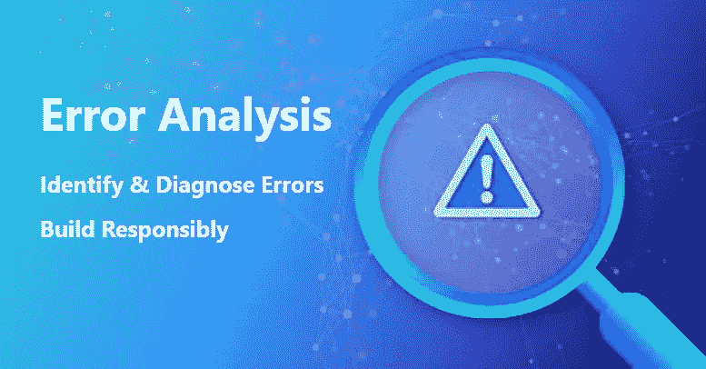
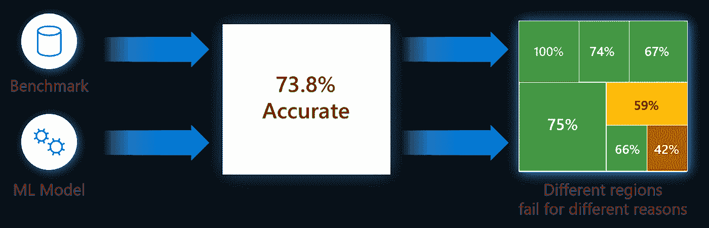
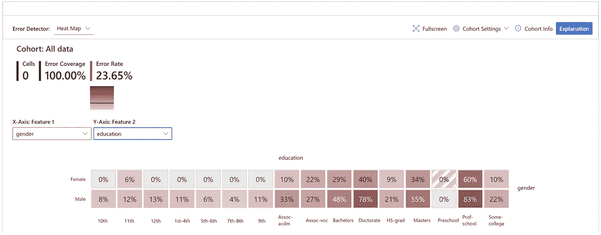
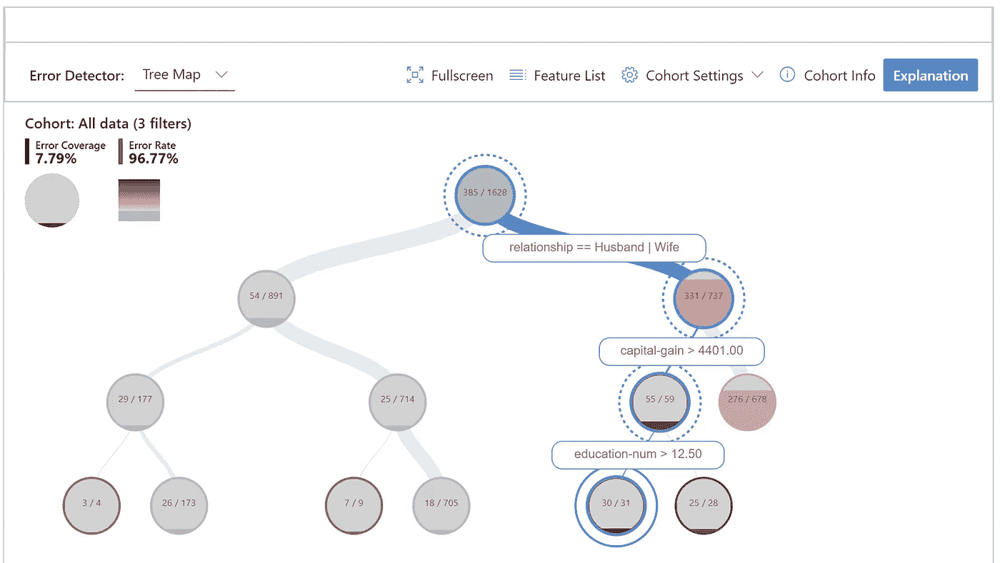
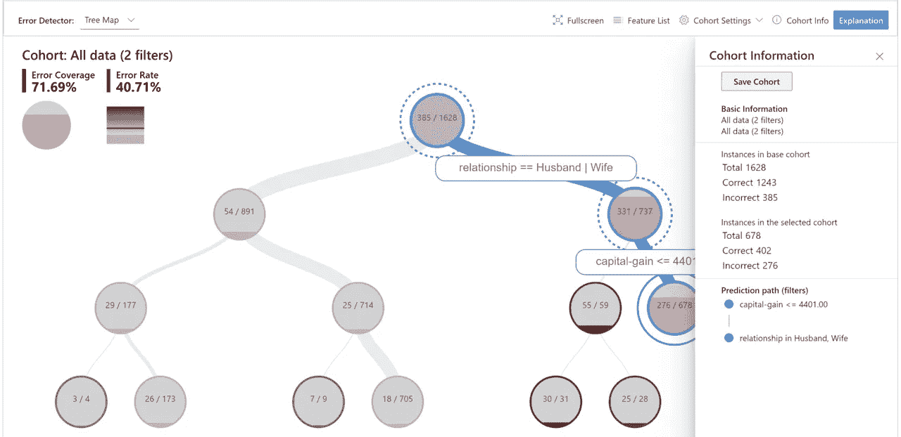
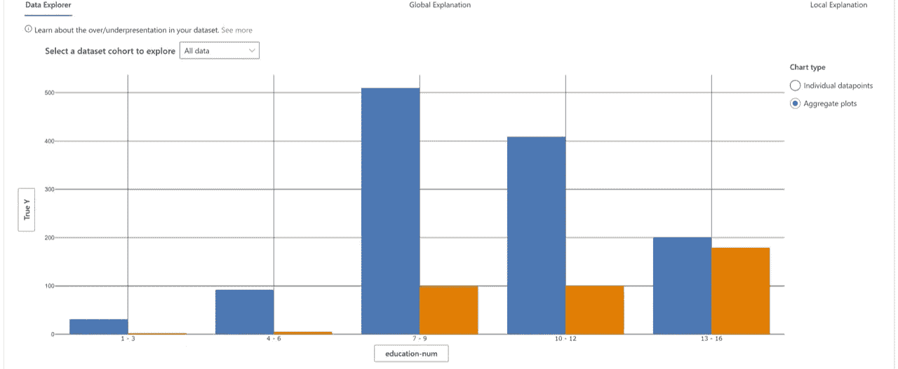
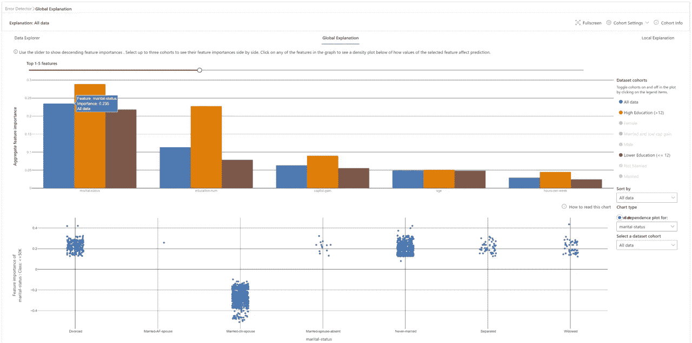
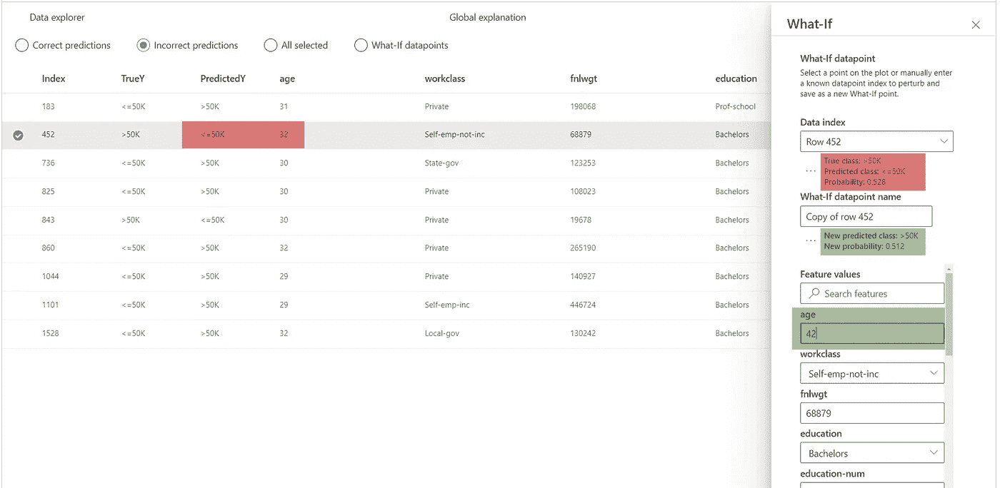

# 具有错误分析的负责任的机器学习

> 原文：<https://towardsdatascience.com/responsible-machine-learning-with-error-analysis-a7553f649915?source=collection_archive---------8----------------------->

## 了解如何识别和诊断机器学习中的错误



(*图片作者*)

# 概观

**网址:** [ErrorAnalysis.ai](/ErrorAnalysis.ai)

**Github 资源库:**[https://github.com/microsoft/responsible-ai-widgets/](https://github.com/microsoft/responsible-ai-widgets/)

在现实世界中部署模型的机器学习(ML)团队经常面临对 ML 模型进行严格的性能评估和测试的挑战。我们有多频繁地读到诸如“模型 X 在给定的基准上有 90%”的断言，并且想知道，这个断言对于模型的实际使用意味着什么？在实践中，团队很清楚模型的准确性在数据的子组之间可能不一致，并且可能存在模型更经常失败的输入条件。通常，这种失败可能会导致与缺乏可靠性和安全性、不公平或更广泛地对机器学习缺乏信任相关的直接后果。例如，当交通标志检测器在某些日光条件下或对于[意外输入](https://interestingengineering.com/tesla-autopilot-mistakes-red-letters-on-flag-for-red-traffic-lights)运行不良时，即使模型的整体精度可能很高，开发团队提前了解模型在这种情况下可能不可靠的事实仍然很重要。



**图 1** — [错误分析](/erroranalysis.ai)脱离了总体准确性指标，以透明的方式向开发人员公开了错误的分布，使他们能够有效地识别&诊断错误。(*图片作者*)

虽然当前的模型评估实践存在几个问题，但是最明显的一个问题是在整个基准上使用聚合度量来对模型进行评分。很难用一个单一的数字来传达一个关于模特行为的详细故事，然而大多数研究和排行榜都是基于单一的分数。同时，可能存在输入特征空间的几个维度，从业者可能有兴趣深入研究并提出诸如“*当外面黑暗并下雪时，自动驾驶汽车中的识别模型的准确性会发生什么变化？*"或"*贷款审批模型在不同种族、性别、年龄和教育背景的人群中表现相似吗？*”。沿着如上所述的多个潜在维度在失败的领域中导航是具有挑战性的。此外，从长远来看，当模型根据新的数据证据或科学进步频繁更新和重新部署时，团队还需要持续跟踪和监控模型行为，以便更新[不会引入新的错误，从而破坏用户信任](https://www.microsoft.com/en-us/research/blog/creating-better-ai-partners-a-case-for-backward-compatibility/)。

为了解决这些问题，从业者通常不得不创建定制的基础设施，这既繁琐又耗时。为了加速严格的 ML 开发，在这篇博客中，你将学习如何使用[错误分析工具](/erroranalysis.ai)来:

1)深入了解模型的故障分布情况。

2)用主动数据探索和可解释性技术调试 ML 错误。

错误分析工具包集成在负责任的 AI 部件 OSS 库中，这是我们向开源社区和 ML 从业者提供一套集成工具的起点。不仅是对 OSS RAI 社区的贡献，从业者还可以在 [Azure 机器学习](https://azure.microsoft.com/en-us/services/machine-learning/)中利用这些评估工具，包括[fair learn](https://fairlearn.github.io/)&[interpret ml](https://interpret.ml/)和 2021 年年中的 now Error Analysis。

如果您有兴趣了解更多关于通过最小化回归和新错误来保持向后兼容先前自我的训练模型更新，您也可以查看我们最新的开源库和工具 [BackwardCompatibilityML](https://github.com/microsoft/BackwardCompatibilityML/) 。

# 先决条件

要安装负责任的 AI Widgets“raiwidgets”包，只需在您的 python 环境中运行以下命令，从 [pypi](https://pypi.org/project/raiwidgets/) 安装 rai Widgets 包。如果您还没有安装 interpret-community，您还需要安装它来支持模型解释的生成。

```
pip install interpret-community
pip install raiwidgets
```

或者，您也可以克隆开源存储库并从头开始构建代码:

```
git clone https://github.com/microsoft/responsible-ai-widgets.git
```

您需要安装 yarn 和 node 来构建可视化代码，然后您可以运行:

```
yarn install
yarn buildall
```

并从 raiwidgets 文件夹本地安装:

```
cd raiwidgets
pip install –e .
```

更多信息请参见[投稿指南](https://github.com/microsoft/responsible-ai-widgets/blob/main/CONTRIBUTING.md)。

如果您打算运行存储库测试，在存储库的 raiwidgets 文件夹中运行:

```
pip install -r requirements.txt
```

# 入门指南

本文通过对收入预测(> 50K，<50K). The model under inspection will be trained using the tabular [UCI 人口普查收入数据集](http://archive.ics.uci.edu/ml/datasets/Census+Income))使用二元分类任务来说明错误分析工具，该数据集包含数字和分类特征，如年龄、教育程度、工作时间、种族等。

我们可以使用下面的 API 调用错误分析仪表板，它接收由来自解释社区存储库、模型或管道、数据集和相应标签(true_y 参数)的解释器之一计算的解释对象:

```
ErrorAnalysisDashboard(global_explanation, model, dataset=x_test, true_y=y_test)
```

对于较大的数据集，我们可以将解释下采样到较少的行，但对整个数据集运行误差分析。我们可以提供缩减采样解释、模型或管道、完整数据集，然后提供采样解释和完整数据集的标签，以及(可选)分类特征的名称:

```
ErrorAnalysisDashboard(global_explanation, model, dataset=X_test_original_full,true_y=y_test, categorical_features=categorical_features, true_y_dataset=y_test_full)
```

下面所有的截图都是使用 LGBMClassifier 和三个估值器生成的。您可以使用我们库中的 [jupyter 笔记本直接运行这个例子。](https://github.com/microsoft/responsible-ai-widgets/tree/main/notebooks)

# 错误分析如何工作

# 1.识别

错误分析从识别与总体基准错误率相比具有较高错误率的数据群组开始。仪表板允许通过使用错误热图或由错误引导的决策树来进行错误探索。

**用于错误识别的错误热图**

该视图基于输入要素的一维或二维格网对数据进行切片。用户可以选择感兴趣的输入要素进行分析。热图以较暗的红色显示误差较大的单元格，以将用户的注意力吸引到误差差异较大的区域。这是有益的，尤其是当不同分区中的错误主题不同时，这在实践中经常发生。在这个错误识别视图中，分析主要由用户和他们的知识或假设来指导，这些知识或假设是理解失败最重要的特征。



***图 2*** — *虽然数据集的总体错误率为 23.65%，但热图显示，对于受过高等教育的个人，错误率明显更高，高达 83%。男性的错误率也高于女性。* ( *图片作者*)

**错误识别决策树**

通常，错误模式可能很复杂，涉及不止一个或两个特征。因此，开发人员可能很难探索所有可能的功能组合，以发现具有严重故障的隐藏数据袋。为了减轻负担，二叉树可视化自动将基准数据划分为可解释的子组，这些子组具有出乎意料的高或低的错误率。换句话说，该树利用输入特征最大限度地将模型错误与成功分开。对于定义数据子组的每个节点，用户可以调查以下信息:

*   **错误率** —模型不正确的节点中的一部分实例。这通过红色的强度显示出来。
*   **错误覆盖范围** —落入节点的所有错误的一部分。这通过节点的填充率来显示。
*   **数据表示** —节点中实例的数量。这通过节点的传入边的厚度以及节点中实例的实际总数来显示。



***图 3*** *—旨在通过分离数据中的错误实例和成功实例来发现失败模式的决策树。这里的分层误差模式表明，尽管数据集的总体误差率为 23.65%，但对于已婚、资本收益高于 4401 英镑、受教育年限高于 12 年的个人，误差率可能高达 96.77%。* ( *图片作者*)

**群组定义和操作**

为了使分析专门化并允许深入研究，可以为任何数据群组而不仅仅是整个基准生成两个错误识别视图。群组是数据的子群组，如果用户希望回到那些群组用于将来的调查，他们可以选择保存这些子群组以供以后使用。可以从热图或树中交互式地定义和操作它们。它们也可以被带到下一个关于数据探索和模型解释的诊断视图中。



***图 4****——创建一个新的队列进行进一步调查，重点关注已婚且资本利得低于 4401 的个人。* ( *图片作者*)

# 2.诊断

在识别具有较高错误率的群组之后，错误分析使得能够进一步调试和探索这些群组。然后，通过数据探索和模型可解释性，就有可能获得关于模型或数据的更深入的见解。

# 调试数据

**数据浏览器**:用户可以通过沿着数据浏览器的两个轴选择不同的特性和估计器来探索数据集的统计和分布。他们可以进一步将子组数据统计与其他子组或整体基准数据进行比较。例如，该视图可以揭示某些群组是否代表性不足，或者它们的特征分布是否与总体数据显著不同，从而暗示可能存在异常值或异常协变量偏移。



**图 5** — *在图 1 和图 2 中，我们发现，对于受教育年限越长的个体，该模型的失败率越高。当我们查看数据在特征“education_num”中的分布时，我们可以看到 a)受教育超过 12 年的个人的实例较少，b)对于该群组，低收入(* ***蓝色*** *)和高收入(* ***橙色*** *)之间的分布与其他群组非常不同。事实上，对于这个群体来说，收入高于 5 万英镑的人更多，这与总体数据不符。* ( *图片作者*)

**实例视图**:除了数据统计之外，有时仅仅观察原始数据以及表格或平铺形式的标签是有用的。实例视图提供此功能，并将实例分为正确和不正确的选项卡。通过目测数据，开发人员可以识别与缺失特征或标签噪声相关的潜在问题。

# 调试模型

模型可解释性是提取关于模型如何工作的知识的强大手段。为了提取这些知识，错误分析依赖于微软的 [InterpretML](https://github.com/interpretml) 仪表板和库。该库是 Rich Caruana、Paul Koch、Harsha Nori 和 Sam Jenkins 在 ML 可解释性方面的突出贡献。

**全球解说**

**特征重要性**:用户可以探索影响所选数据子组或群组的整体模型预测(也称为全局解释)的前 K 个重要特征。他们还可以并排比较不同群组的特征重要性值。关于特征重要性或排序的信息有助于理解模型是利用预测所必需的特征，还是依赖虚假的相关性。通过将特定于该群组的解释与针对整个基准的解释进行对比，可以了解该模型对于所选群组的表现是否不同或异常。

**依赖图**:用户可以看到所选特性的值与其对应的特性重要性值之间的关系。这向他们展示了所选特征的值如何影响模型预测。



***图 6*** *—收入预测模型的全局特征解释表明，婚姻状况和受教育年限是全局最重要的特征。通过单击每个特性，可以观察到更细粒度的依赖关系。例如，“离婚”、“从未结婚”、“分居”或“丧偶”等婚姻状态有助于模型预测较低的收入(< 50K)。“民事配偶”的婚姻状况反而有助于模型预测更高的收入(> 50K)。* ( *图片作者*)

**本地解释**

全局解释近似于整体模型行为。为了将调试过程集中在给定的数据实例上，用户可以从表格实例视图中选择任何单独的数据点(具有正确或不正确的预测),以探索它们的局部特征重要性值(局部解释)和单独的条件期望(ICE)图。

**局部特征重要性**:用户可以调查单个预测的前 K 个(可配置的 K 个)重要特征。帮助说明基础模型在特定数据点上的局部行为。

**个体条件期望****【ICE】**:用户可以调查特征值从最小值到最大值的变化如何影响对所选数据实例的预测。

**扰动探索(假设分析)**:用户可以对所选数据点的特征值进行更改，并观察预测的结果变化。他们可以保存假设的假设数据点，以便进一步与其他假设数据点或原始数据点进行比较。



***图 7*** *—对于这个个体，模型输出一个错误的预测，预测这个个体的收入不到 50K，反之亦然。有了假设解释，就有可能理解如果其中一个特征值发生变化，模型将如何表现。例如，在这里我们可以看到，如果这个人老了 10 岁(年龄从 32 岁变到 42 岁)，这个模型就会做出正确的预测。虽然在现实世界中，许多这些特性是不可变的，但是这种敏感性分析旨在进一步支持具有模型理解能力的从业者。* ( *图片作者*)

# 其他相关工具

错误分析使从业者能够识别和诊断错误模式。与模型可解释性技术的集成证明了将这些工具作为同一个平台的一部分一起提供的联合力量。我们正在积极地将更多的考虑整合到模型评估体验中，例如公平性和包容性(通过 [FairLearn](https://fairlearn.github.io/) )以及更新期间的向后兼容性(通过[backward compatibility ml](https://github.com/microsoft/BackwardCompatibilityML))。

# 我们的团队

错误分析的最初工作始于对深入理解和解释机器学习失败的方法的研究调查。微软研究院的贝斯米拉·努什、 [Ece Kamar](https://www.ecekamar.com/) 和[埃里克·霍维茨](http://www.erichorvitz.com/)正在领导这些努力，并继续用新技术创新用于调试 ML 模型。在过去的两年里，我们的团队通过与 Azure 机器学习小组中的 RAI 工具团队以及微软混合现实中的分析平台团队的合作得到了扩展。分析平台团队在构建内部基础设施方面投入了数年的工程工作，现在我们正在将这些工作作为 Azure 机器学习生态系统的一部分开源提供给社区。RAI 工装团队由[伊利亚·马蒂亚赫](https://www.linkedin.com/in/imatiach/)、[梅赫努什·萨梅克](http://cs-people.bu.edu/sameki/)、[罗曼·卢茨](https://www.linkedin.com/in/romanlutz/)、[理查德·埃德加](https://www.linkedin.com/in/richard-edgar-48aa0613/)、[惠美·宋](https://www.linkedin.com/in/hyemisong/)、[敏素·思格彭](https://www.linkedin.com/in/minsoothigpen/)和[阿努普·希尔冈卡](https://www.linkedin.com/in/anupshirgaonkar/)组成。他们对负责任的人工智能的民主化充满热情，并在为社区提供此类工具方面有多年的经验，以前有 FairLearn、InterpretML Dashboard 等例子。在这个过程中，我们也得到了微软以太委员会和微软混合现实的合作伙伴的慷慨帮助和专业知识:[帕勒姆·莫哈杰尔](http://linkedin.com/in/parham-mohadjer-09365b96/)、[保罗·科赫](http://linkedin.com/in/paulbkoch/)、[泽维尔·费尔南德斯](https://www.linkedin.com/in/praphat-xavier-fernandes-86574814/)和[胡安·马乐](https://www.linkedin.com/in/juanlema/)。所有的营销活动，包括这个博客的展示，都是由 Thuy Nguyen 协调的。

非常感谢所有让这一切成为可能的人！

# 相关研究

**走向负责任的人工智能:用于表征系统故障的混合人机分析**。贝斯米拉·努希、埃切·卡马尔、埃里克·霍维茨；HCOMP 2018。 [pdf](https://www.microsoft.com/en-us/research/publication/towards-accountable-ai-hybrid-human-machine-analyses-for-characterizing-system-failure/)

**机器学习的软件工程:案例研究**。Saleema Amershi、Andrew Begel、Christian Bird、Rob DeLine、Harald Gall、Ece Kamar、Nachiappan Nagappan、Besmira Nushi、Thomas ZimmermannICSE 2019。 [pdf](https://www.microsoft.com/en-us/research/publication/software-engineering-for-machine-learning-a-case-study/)

**人类-人工智能团队的更新:理解并解决性能/兼容性权衡**。Gagan Bansal、Besmira Nushi、Ece Kamar、Daniel S Weld、Walter S Lasecki、Eric HorvitzAAAI 2019。 [pdf](https://www.microsoft.com/en-us/research/publication/updates-in-human-ai-teams-understanding-and-addressing-the-performance-compatibility-tradeoff/)

**机器学习系统向后兼容性的实证分析**。梅加·斯里瓦斯塔瓦、贝斯米拉·努什、埃切·卡马尔、什塔尔·沙阿、埃里克·霍维茨；KDD 2020。 [pdf](https://www.microsoft.com/en-us/research/publication/an-empirical-analysis-of-backward-compatibility-in-machine-learning-systems/)

**通过稳健的特征提取了解深度网络的故障**。萨希尔辛拉，贝斯米拉努什，什塔尔沙阿，欧洲经委会卡马尔，埃里克霍维茨。CVPR 2021(即将亮相)。 [pdf](https://arxiv.org/abs/2012.01750)