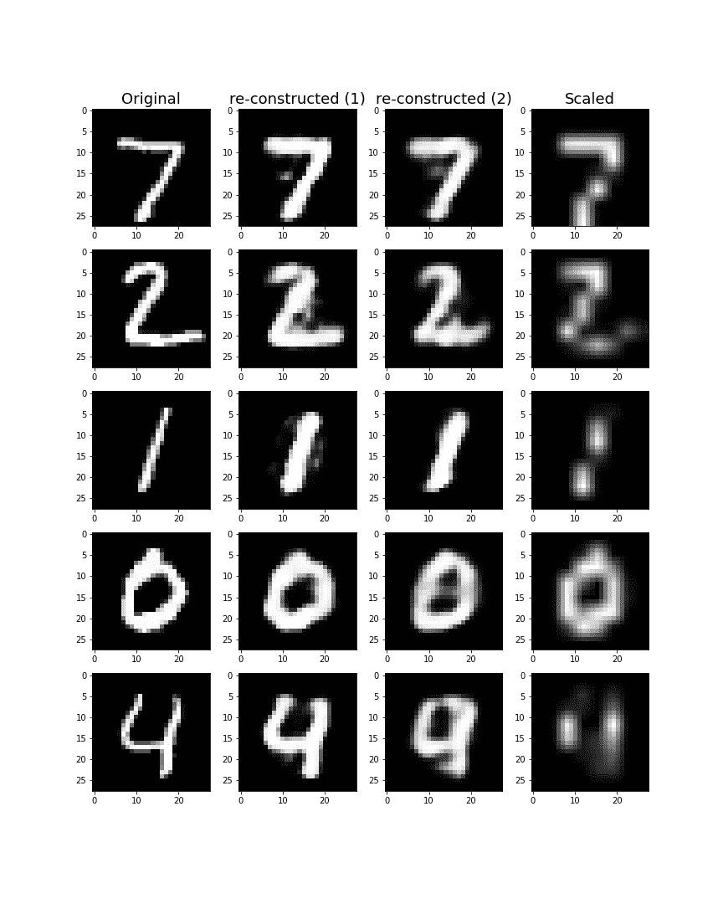
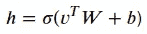
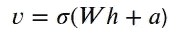
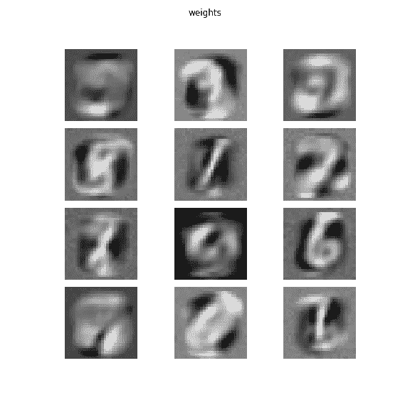

# 用于特征提取的受限玻尔兹曼机器，解释

> 原文：<https://towardsdatascience.com/restricted-boltzmann-machines-for-feature-extraction-explained-90cc433c2556?source=collection_archive---------18----------------------->

## 它们易于编码，并与神经网络相连。受限玻尔兹曼机器会卷土重来吗？

受限玻尔兹曼机(简称 RBM)是一种通用的特征提取方法。它拥有坚实的理论基础，但实现和运行它所需的实际步骤相当简单明了。它可以与其他类型的机器学习模型相结合，最值得注意的是，RBM 可以与深度学习模型无缝集成。当我在学习欣赏这种算法时，我意识到我错过了一个好的解释，没有用公式和技术术语来攻击我。这篇文章是对受限玻尔兹曼机器的日常语言介绍——在需要的地方有一点数学知识。所以，如果你想知道更多关于受限玻尔兹曼机器在特征提取中的应用，这篇文章就是为你准备的。

照片由[维姆·范因德](https://unsplash.com/@wimvanteinde?utm_source=medium&utm_medium=referral)在 [Unsplash](https://unsplash.com?utm_source=medium&utm_medium=referral) 拍摄

# 但是首先:关于特征提取说几句话

受限玻尔兹曼机是一种特征提取过程。执行要素提取时，数据集中的现有要素将被合并并转换为一组更简洁的要素，然后可用于聚类、分类和其他任务。我们为什么要这样做，这有什么帮助？主要有两个原因。两个都提吧。

**特征提取减少过拟合**。当输入要素的数量很大时，这可能意味着用于有效分类的信息“分散”在大量要素中。它还增加了数据中“机会模式”的可能性，这可能导致分类算法过拟合。图像和语音到文本数据是两个例子，其中特征的原始数量往往非常大，并且特征提取有助于随后的分类。

**特征提取允许更好的结果，更快。**因为我们使用的是更小的向量，所以聚类、离群点检测和可视化等操作可以在更少的特征上更快地执行。更重要的是，当特征提取算法适用于数据时，它将影响比原始集合更少相互依赖的特征。这使得分类结果更加可靠，也更容易训练和调整。

现在我们理解了动机，让我们回顾一下几乎任何特征提取算法的最突出的超参数背后的直觉:输出维数。

# 决定输出维度的数量

当执行特征提取时，我们减少了特征的数量，这导致我们的数据集中每个样本的一些信息丢失。自然，我们希望避免不必要的损失，因此特征提取算法通常被设计为在给定输出特征数量的情况下，保留尽可能多的信息。显然，我们选择输出的特征越多，可以保留的信息就越多——但同时，使用特征提取算法的全部意义在于*减少维度的数量*。因此，在开发包含特征提取阶段的模型时，我们应该尝试不同的输出维度选择，直到找到正确的平衡。特征提取算法的工作的一个关键部分是最小化所选输出大小的信息损失，以便我们可以获得该大小的最佳折衷。

但是我们如何知道丢失了多少信息呢？我们通过逆转提取过程来做到这一点——这被称为*重建*——并观察原始样本与其重建样本之间的差异。RBM 为我们提供了特征提取(称为编码)和重建(称为解码)的公式。这些公式将在下一节中介绍。

在此之前，我们来看一个检查不同输出维度的例子。下图是 MNIST 手写数字数据集中的一些 28 x 28 像素的图像样本(实际上是测试集中的前几个图像)。原始图像在左手边。它们由在 MNIST 的训练集上训练的 RBM 编码和解码，输出节点的数量有两种不同的选择。

# 重建示例

受限玻尔兹曼机:重构实例。作者图片

标有重建(1)的列显示从 **128** 隐藏特征重建的图像，而下一列显示缩小到 **64** 尺寸然后重建的图像。现在，仔细观察并比较图像:第一次重建通常更好，只有一些局部伪影。在第二次重建中，数字 4 变得与 9 非常相似，这有点令人担忧。右手边的最后一栏显示了基本的特征提取算法(一种标准的重采样程序，将图像减少到 64 像素)如何对相同的数据执行。重采样过程产生的质量比同等维数的 RBM 差得多，因为与 RBM 相比，它没有利用原始图像中的结构和重复模式。

现在我们已经理解了有效特征提取背后的思想，让我们看看 RBMs 中用于数据编码和解码的公式。

# 是时候来点公式了

在这一节中，我们将深入探讨并解释对 RBM 实现至关重要的两个过程的公式，即编码(提取)和解码(重建)公式。这些几乎是实践中唯一需要的公式。如果你想明智地使用 RBMs，熟悉并理解它们是很重要的。

第一个公式显示了如何将数据编码到一个较低的维度中:

受限玻尔兹曼机编码公式。作者图片

让我们回顾一下每个符号代表的含义:

*   *h* 代表*隐藏*。 *h* 是输出，一个低维向量，它表示特征提取过程后的数据点。
*   适马象征着 s 形函数。如果你需要复习什么是乙状结肠，请查看 Jimmy Shen 的文章或维基百科页面。
*   *v* 代表可见。它是表示我们想要对其执行特征提取的数据点的输入向量。它被渲染为一个行向量，然后乘以矩阵 *W* 。
*   *W* 是一个 *m-* by- *n* 权重矩阵*，*其中 *m* 是输入尺寸 *v* 的长度】， *n* 是输出尺寸 *h* 的长度)。 *W* 的条目是训练时学习到的参数。
*   *b* 是偏置参数的向量，长度为 *n*

因此，要计算低维特征向量，需要将输入向量乘以一个矩阵，添加一个偏差向量，然后对每个元素应用 sigmoid 函数。 *W* 和 *b* 的条目需要针对特定数据集的重建进行优化。这是通过 RBM 的专门训练算法实现的，称为*对比发散*。您可能已经注意到，这个公式与具有 sigmoid 激活的密集神经网络层的公式非常吻合，这意味着一旦您单独训练它并将其插入深度神经网络模型，您就可以使用端到端反向传播来进一步微调参数。

但是，现在应该清楚的是，RBM 不仅仅是标准神经网络层的一个花哨名称。下一个公式是解码(重建)公式，它将低维的 *h* 作为输入，并检索高维的 *v:*

受限玻尔兹曼机解码(重构)公式。作者图片

我非常喜欢这个公式，因为它与编码公式的形式几乎完全相同，甚至使用了相同的变换矩阵 *W* 。第一个公式中的偏置向量 *b* 在这里不能重复使用(它甚至没有正确的长度)，所以它在公式中被替换为不同的偏置向量 *a* 。

现在，您可能已经注意到，我们计算的 *v* 的条目被限制在某个范围内:由于我们在应用公式时执行的最后一个操作是应用 sigmoid，因此结果 *v* 的所有条目都被限制在 0 和 1 之间。这不是巧合，它引导我们讨论 RBM 及其假设的一个重要方面，特别是那些适用于输入向量的假设。

# 受限玻尔兹曼机和伯努利随机变量向量

受限玻尔兹曼机器在其基本形式中，假设其输入是[伯努利变量](https://en.wikipedia.org/wiki/Bernoulli_distribution)的向量(参见参考文献中放宽这一假设的扩展示例)。每个伯努利变量只有两种可能的状态，标记为 0 和 1，因此 RBM 输入向量中只允许 0 和 1。单个伯努利变量的随机行为可以用单个参数 *p* 来概括，该参数表示变量取值为 1 的概率。**两个**伯努利随机变量的行为要求，在两个变量各自的概率 p( *v₁* 和 p( *v₂* )之上，它们的条件概率 p( *v₂* | *v₁* =1)和 p( *v₂* | *v₁* =0)(等价地，我们可以指定它们的*联合*概率 p( *v₁对于三个伯努利变量，潜在相互作用项的数量增加到 5(8–3)，对于四个变量，增加到 12(16–4)，依此类推。换句话说，考虑到涉及两个、三个或更多变量的潜在相互作用，即使这些看似简单的变量的行为也很难建模。*

为了更好地理解“交互”意味着什么，让我们再次考虑 MNIST 数据集。例如，如果我们将图像中心像素为白色的图像子集与整组图像进行比较，我们会发现，在第一种情况下，围绕该像素的八个像素也为白色的概率更高。这意味着中间像素的亮度值在统计上依赖于其相邻像素的值。我们从中抽取样本的概率分布模型需要包括*相互作用项*(在本例中，用于相邻像素)

RBM 旨在模拟数据集中最显著的交互作用。他们通过学习参数 *W* 、 *a* 和 *b* 的适当值来做到这一点。 *W* 的列表示输入变量之间的不同交互模式，这些模式中的每一个都可以存在或不存在，输出向量 *h* 表示特定模式在给定示例中存在的概率。

幸运的是，将输入表示为 0 和 1 的向量实际上不是一个严重的限制，因为我们可以根据数据类型对每个特征应用适当的预处理技术:

*   分类(也称为名义)变量，如汽车的品牌，可以使用一键编码进行编码，这是机器学习中编码名义值的标准方法。
*   整数值——如售出商品的数量——可以使用一键编码和变体进行编码，如[格雷码](https://en.wikipedia.org/wiki/Gray_code)。
*   连续值(如每英里的运营成本)必须进行分类，然后作为整数值处理。

对于 MNIST 数据集，输入影像中的像素值是 0 到 255 之间的整数。但是，中间值很少出现，因此对于这个特定的数据集，最好只分入两个容器，一个用于暗(黑)像素，一个用于亮(白)像素。

使用图像作为输入，可以可视化 *W* 的列。每一列代表像素之间相互作用的一种模式，其中相同色调(黑色或白色)的像素被 RBM 识别为在该模式下串联出现。此示例显示了只有 12 个隐藏单元的 RBM 的权重矩阵 *W* 的列:

训练后变换矩阵 *W 的列值的可视化。有些补丁明确表示特定的数字，如 0、1、2、6、7 和 9。*

在这个例子中，RBM 探测到的一些交互模式类似于特定的数字。因为我们知道数据集实际上包含不同的数字，这有力地证明了该算法能够检测其输入向量中的重复模式，同时分离不同的向量。

# 如何开始使用 RBMs

如果你想在自己的数据和建模问题上尝试 RBM 过程，那么我建议你使用发布到 github 的[这个实现](https://github.com/mr-easy/Restricted-Boltzmann-Machine)。[这是我的回购](https://github.com/kishkash555/train-visualize-rbm-mnist) 与笔记本，我在这里生成了这篇文章中使用的例子。

# 摘要

在这篇文章中，我介绍了受限玻尔兹曼机器和特征提取的原理。受限玻尔兹曼机是一种易于实现的二进制数据向量的特征提取过程。可以研究 RBM 的权重矩阵以进一步了解结果，因为它的列表示特定输入要素的权重。虽然成果管理制植根于一些深刻的理论概念，但实施和调整它们并不需要广泛的理论背景。

如果你对从数据科学家到机器学习专家的旅程感兴趣，或者只是想扩大你对经典机器学习的理解，那么受限玻尔兹曼机器是更彻底研究的好模型。RBM 背后的许多理论概念与其他主要模型是相同的——仅举两个例子，高斯混合模型和隐马尔可夫模型。在下面的链接中，你可以找到一些资源来帮助你扩展对受限玻尔兹曼机器背后的理论和相关机器学习概念的理解。我发现[这个博客条目](https://www.theaidream.com/post/introduction-to-restricted-boltzmann-machines-rbms)比 RBMs 上的[维基百科页面更有帮助。如果您找到了其他好的资源，请告诉我:)](https://en.wikipedia.org/wiki/Restricted_Boltzmann_machine)

# 参考

[1]|[《乙状结肠和坦的区别》](https://jimmy-shen.medium.com/the-difference-between-sigmoid-and-tanh-e8d0c172475f)作者 Jimmy Shen，2020 年 4 月。

[2]罗伯特·w·哈里森 2018。连续受限玻尔兹曼机器。无线网络。[https://doi.org/10.1007/s11276-018-01903-6](https://doi.org/10.1007/s11276-018-01903-6)。

[3] Youtube。com | [深度学习讲座 10.3 受限玻尔兹曼机器](https://youtu.be/wfFf5Fj-rzE)，作者 Frank Noe，2020 年 10 月。

[4]Wikipedia.com |[受限玻尔兹曼机](https://en.wikipedia.org/wiki/Restricted_Boltzmann_machine)

[5]Github.com |[受限-玻尔兹曼-机](https://github.com/mr-easy/Restricted-Boltzmann-Machine)作者易先生，2020 年 8 月。

[6]Github.com |[火车-可视化-rbm-mnist](https://github.com/kishkash555/train-visualize-rbm-mnist) 由基什卡什，2021 年 10 月。

[7]AI 梦想([【www.theaidream.com】](https://www.theaidream.com/))|[受限玻尔兹曼机器简介](https://www.theaidream.com/post/introduction-to-restricted-boltzmann-machines-rbms)，2020 年 11 月