# 零售数据分析

> 原文：<https://towardsdatascience.com/retail-data-analytics-1391284ec7b8?source=collection_archive---------29----------------------->

## 使用 AWS 的数据科学组合项目

卢卡斯·布拉塞克在 [Unsplash](https://unsplash.com?utm_source=medium&utm_medium=referral) 上的照片

# 介绍

在本文中，我想向您展示一个完整的数据科学组合项目。在这个项目中，我想使用亚马逊网络服务和不同的机器学习算法来执行零售数据分析。包括项目建议书和最终项目报告的完整代码可以在我的 [Github](https://github.com/patrickbrus/Retail_Data_Analytics) 资源库中找到。

# 定义

如今，商店使用零售数据分析(RDA)来更好地预测可能售出的商品数量，从而更好地估计应该生产多少商品。这一点非常重要，因为一年中售出商品的数量会有很大变化。例如，人们倾向于在圣诞节前购买比平时多的东西，而不是在节假日。这可以很容易地从亚马逊统计数据的季度收入中看出。亚马逊的季度收入在第四季度总是最大的，这表明人们在第四季度比其他季度消费更多。这是显而易见的，因为圣诞节在第四季度，也是黑色星期五，这也导致了全球范围内的大量消费。如果一家商店在圣诞节前商品太少，潜在的收入就会流失。但是如果一个商店有太多的产品，就需要太多的存储空间，而存储又要花钱，所以公司又会浪费钱。因此，可以使用 RDA 来优化产品的生产，从而总是有一个最佳的可用量。

# 问题陈述

这个项目的目标是预测商店的部门范围内的每周销售额。这将有助于优化生产流程，从而在降低成本的同时增加收入。应该可以从一个部门输入过去的销售数据，并获得预测的每周销售额。

# 韵律学

目标数据是数值数据。因此，可以使用均方根误差(RMSE)来获得最佳性能的机器学习技术。等式 1 显示了计算 RMSE 的公式。为了更好地理解 RMSE 的规模，可以使用归一化的 RMSE。归一化 RMSE 的计算方法是将 RMSE 除以目标变量的标准偏差。此外，可以使用 R 平方分数。R 平方得分代表模型可以代表的方差的百分比。R 平方得分计算每个点的平方误差除以“虚拟”估计误差，该误差仅预测所有目标变量的平均值。等式 2 显示了计算 R 平方的公式。

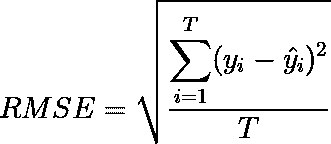

等式 1:均方根误差等式

等式 2: R 平方等式

# 数据探索

这个项目使用了来自 [Kaggle](https://www.kaggle.com/manjeetsingh/retaildataset) 的 RDA 数据集。该数据集包含位于不同地区的 45 家商店的历史销售数据。每个商店又进一步分成几个部门。数据本身存储在 excel 表中。excel 表包含三个选项卡。第一个选项卡包含来自商店的数据。第二个包含特性，第三个包含销售数据。

## 商店

总共有 45 家店的数据。每个商店都有自己的类型和大小，这也包括在 excel 表中。excel 表中包含的信息是匿名的。图 1 显示了商店大小的统计数据。总共有三种不同类型的商店(A、B 和 C)。

图 1:商店规模统计

## 特征

这些特征与商店相关。图 2 包含所有可用的特性和每个特性的简短描述，而图 3 包含一些特性的统计数据。降价 1-降价 5 的数据非常不完整，必须删除，或者必须应用不同的方法来处理丢失的数据。

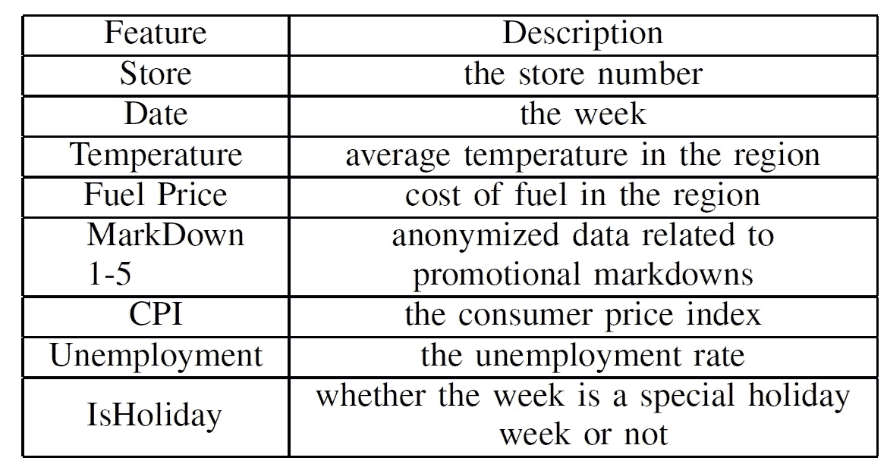

图 2:数据集的特性

图 3:特性的统计

## 销售

每个商店还将历史销售数据存储在数据集中。销售数据收集自 2010 年 2 月 5 日至 2012 年 11 月 1 日。图 4 包含与销售数据相关的所有特性，图 5 包含每周销售的一些统计数据。

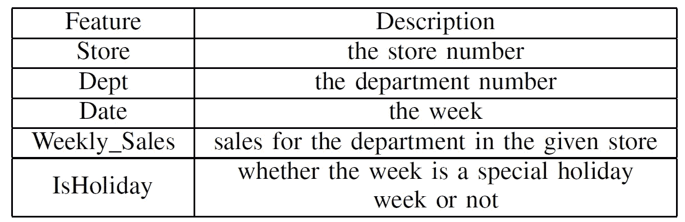

图 4:销售数据的特征

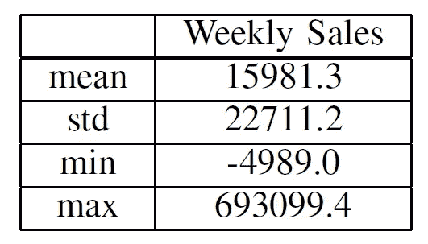

图 5:销售数据统计

# 探索性可视化

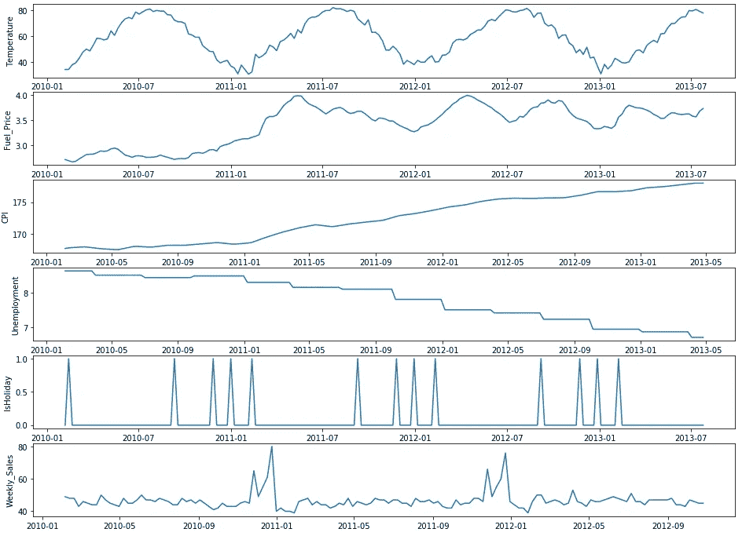

图 6:特性的历史数据

本章更详细地介绍了数据和所有功能。图 6 显示了一些特征的时间序列分析。第一行包含温度图。气温一年一年地变化，最高值出现在七月左右，最低值出现在一月。气温本身似乎对周销量没有任何影响。该图的第二行包含燃料价格。从 2011 年 1 月到 2011 年 7 月，燃油价格大幅上涨。之后，燃油价格上下波动。图中的第三行包含消费者价格指数，自时间序列开始以来，该指数稳步上升。下一行可以看到失业率，自时间序列开始以来，失业率稳步下降。CPI 和失业率的作用完全有道理，因为当人们有更多的工作时，他们有更多的钱去买东西，因此 CPI 上升，因为需求越多，价格越高。该图的第五行包含是否是假日周的布尔数据。最后一行包含每周销售数据。可以看出，如果一周是假日周，则每周销售数据不会自动变大。每周销售的高峰在 11 月和 12 月。11 月的高峰可能是由于黑色星期五，而 12 月的高峰可能是由于圣诞节。一月份的周销售额最低。
图 7 显示了商店分析。左边的图显示了每种类型有多少商店。“A”类商店最常见，而“C”类商店最不常见。中间的图显示了每种商店类型的每周销售额的箱线图。商店类型“A”的周销售额中值最高，而类型“C”的周销售额中值最低。如果看一下右边的图，这是完全有意义的，它显示了每种商店类型的商店大小的方框图。在这里，可以看到商店类型“A”最大，商店类型“B”第二大，商店类型“C”最小。所以商店的规模与每周的销售额直接相关。

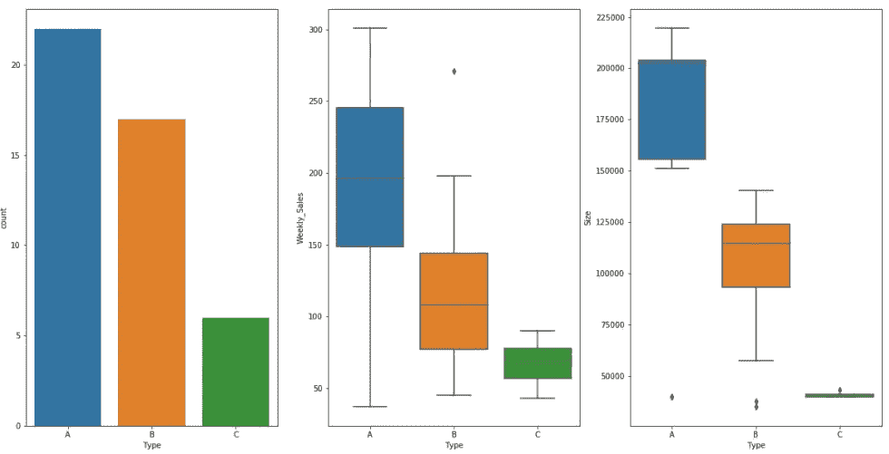

图 7:商店分析

# 算法和技术

为了解决这个问题，应该应用机器学习。应该应用不同状态的机器学习技术，并且最好的性能应该用于最终应用。在最终的应用程序中，用户应该能够输入一周和感兴趣的商店，并获得预测的每周销售额作为输出。作为机器学习算法，应应用和评估以下算法:
1 .线性回归
2。决策树回归器
3。随机森林回归变量
4。XGBoost 回归器
最终的模型应该能够遵循每周销售的模式。它应该能够检测到黑色星期五和圣诞节前后的峰值和一月份的低值。

## 线性回归

线性回归是一种机器学习技术，它试图找到一个结合所有输入特征的线性函数，以获得目标值。因此，假设输入要素和目标值之间的关系是线性的。

## 决策树回归器

决策树可以表示线性和非线性函数，并试图构建规则树。树中的每个节点包含一个条件，每个分支包含一个结果。它可以被认为是一个简单的“如果条件则分支 1 否则分支 2”结构。决策树算法试图以能够优化结果性能的方式构建这些规则。当应该创建预测时，对决策树的节点和分支进行“遍历”,并且最终节点包含该树的预测。决策树非常流行，因为它们易于解释。树的结构可以容易地可视化，并且用户可以直接看到节点条件和分支，因此可以容易地遵循策略，决策树模型如何创建预测。

## 随机森林回归量

随机森林在训练时创建更多的决策树，以防止过度适应。在推理期间，随机森林输出所有决策树预测的平均值，以获得最终预测。

## XGBoost 回归器

XGBoost 回归器算法是随机森林的优化版本。它使用梯度推进技术来提高训练速度和预测性能。

## 基准

线性回归模型被用作基准模型。它是使用 scikit-learn 库训练的。它的 RMSE 为 21469.1 周销售额，这是一个非常大的值，它告诉我们，周销售额与输入要素不是线性相关的。图 8 显示了 100 个预测和它们的真实标签。可以看出，基准模型不能遵循周销售额的结构。图 11 显示了训练基准模型、部署它并获得评估结果的代码。

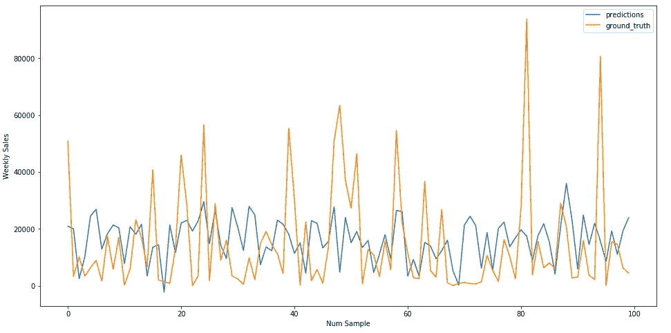

图 8:线性回归模型的结果

# 履行

在这一章中，我想解释预处理数据和训练所有估算者的主要程序。为了更加清晰，我附上了代码片段。

## 数据预处理

笔记本"[2 _ Create _ Train _ and _ Test _ data . ipynb](https://github.com/patrickbrus/Retail_Data_Analytics/blob/master/2_Create_Train_and_Test_Data.ipynb)"包含数据预处理和创建训练、测试和验证数据的代码。作为第一个预处理步骤，列“IsHoliday”从布尔值转换为整数。其次，商店类型被转换为分类列。商店类型“A”转换为 0，“B”转换为 1，“C”转换为 2。下一步，日期列被转换成两个独立的特性。第一个是年份，第二个是一年中的星期。应使用一年中的某一周，因为要预测每周的销售额。之后，应解决降价列中大量缺失值的问题。为了消除缺失值，使用了 sklearn 库中的迭代估算器。迭代插补器将每个缺失值建模为其他特征的函数，并使用该估计值进行插补。降价列的特征和可用值用于训练回归模型。然后使用训练好的回归模型预测缺失值。迭代估算器仅根据训练数据进行训练，以避免数据泄漏到拒绝测试和验证数据中。图 9 显示了训练一个迭代估算器，然后输入缺失值的代码。

最后，训练、测试和验证数据集被创建并存储在单独的 csv 文件中。测试集大小占所有数据的 10%，而验证集大小占其余数据的 30%。

图 9:迭代估算代码

## 培养

笔记本“[3 _ Training _ and _ deployment . ipynb](https://github.com/patrickbrus/Retail_Data_Analytics/blob/master/3_Training_and_Deployment.ipynb)”包含所有训练代码。我开始将训练、验证和测试数据加载到 S3(图 10)。

图 10:向 S3 上传数据的代码

然后我训练了基准模型。使用 sklearn 库创建和训练线性回归基准模型。用于训练的代码位于源文件夹中的“train_linear_regression.py”脚本中，该脚本也用作笔记本中 sagemaker sklearn 估计器对象的入口点。之后，部署并评估了基准模型。在评估中，我计算了归一化 RMSE、R 平方得分，并创建了一个包含前 100 个测试预测的图(图 11)。此外，我使用 matplotlib 库绘制了前 100 个预测值与实际值的关系。

图 11:训练和部署线性回归模型的代码

之后，我训练了决策树回归器和随机森林回归器。对于两者，我都使用了 sklearn 库，并且在源文件夹中有单独的训练脚本作为入口点。决策树和随机森林有很多不同的超参数。为了找到最佳匹配，我使用 skopt 库来创建贝叶斯优化器。贝叶斯优化器将 sklearn 估计器对象作为输入，这是一个字典，其中超参数名称作为键，它们的值范围作为值，一个整数指示应该执行多少次迭代以及用于交叉验证的折叠数。图 12 包含了寻找最优决策树回归器的代码。我使用交叉验证折叠大小为 5，贝叶斯优化器运行了 7 次迭代。

图 12:为决策树回归器训练贝叶斯优化器的代码

图 13 包含寻找最优随机森林回归量的代码。交叉验证折叠大小再次为 5，贝叶斯优化器运行 10 次迭代。随机森林回归器另外使用所有四个 cpu 核心，以便加速训练。

图 13:为随机森林回归器训练贝叶斯优化器的代码

对于这两个训练好的模型，我计算了归一化 RMSE 和 R 平方得分。作为最后一个估计者，我训练了 XGBoost 回归器。XGBoost 回归器使用 Sagemaker 中已经创建的容器进行训练。同样，XGBoost 估计量有很多超参数。为了找到最佳组合，我使用了 Sagemaker 的“HyperparameterTuner”库。图 14 包含查找最佳 XGBoost 回归器并对其进行评估的代码。我训练了 20 种不同的 XGBoost 估计器，并提取和部署了性能最好的估计器。部署后，我再次计算了标准化的 RMSE 和 R 平方得分，加上前 100 个测试预测的可视化。

图 14:为 XGBoost 模型加评估训练贝叶斯优化器

# 结果

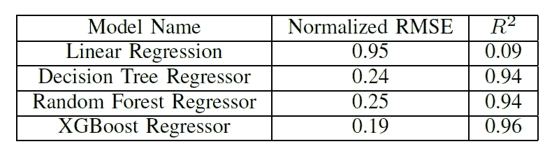

图 15:最终结果

图 16 显示了经过训练的决策树回归器的前 100 个预测与基本事实标签的比较。可以看出，决策树回归器已经能够跟踪每周销售的模式。图 15 包含 RMSE 和 R 平方得分。

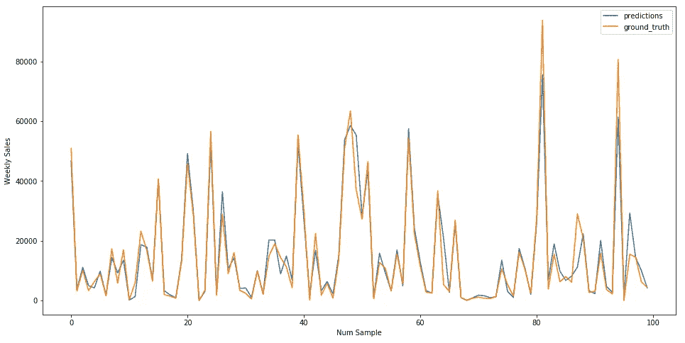

图 16:决策树模型的结果

图 17 显示了经过训练的随机森林模型的前 100 个预测。随机森林同样能够遵循周销售额的结构，但是随机森林回归器具有稍大的归一化 RMSE，同时具有与决策树模型相同的 R 平方。

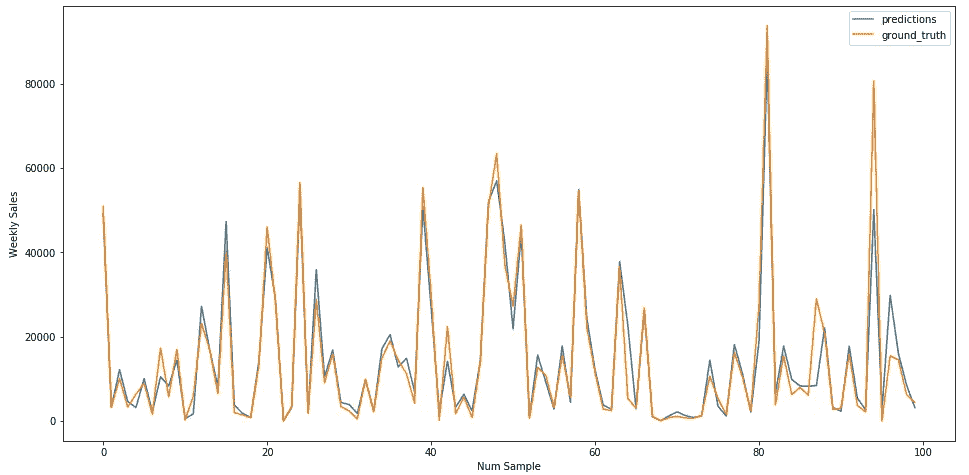

图 17:随机森林模型的结果

图 18 显示了根据贝叶斯优化具有最佳超参数组合的训练 XGBoost 模型的前 100 个预测。XGBoost 模型还具有最低的归一化 RMSE 和最高的 R 平方得分，因此是所有训练模型中性能最好的估计器。

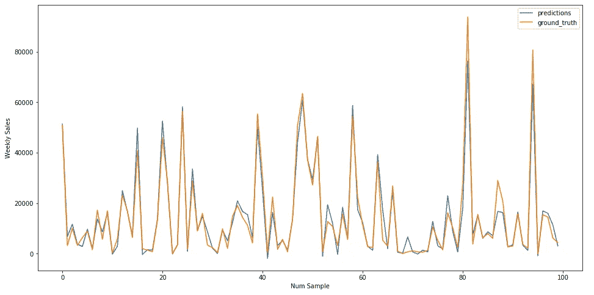

图 18:XG boost 模型的结果

XGBoost 模型的 R 平方值是基准模型的十倍以上。归一化 RMSE 比基准模型的 RMSE 小五倍。R 平方得分为 0.96，这意味着最终模型可以代表测试数据集中给定方差的 96%。RMSE 仍然在每周销售标准偏差的 19%。但周销量的幅度也很大，最低周销量为-4989，最高周销量为 693099.4(参见图 5)。当查看图 18 时，可以看到最终模型已经学习了底层结构，因此可以用作预测器，但是仍然需要考虑预测中的潜在异常值。