# 利用事件建模驱动的干预时间留住客户

> 原文：<https://towardsdatascience.com/retain-customers-with-time-to-event-modeling-driven-intervention-de517a39c6e3?source=collection_archive---------8----------------------->

## [实践教程](https://towardsdatascience.com/tagged/hands-on-tutorials)

## 使用 XGBoost 在正确的时间精确定位客户流失

由[查尔斯·弗伦泽](https://www.linkedin.com/in/cfrenzel/) l、[百川孙](https://www.linkedin.com/in/sunbc0120/)和[宋寅](https://www.linkedin.com/in/yin-song-19b2702b/)

获得一个客户通常比留住一个客户花费更多。

关注客户维系使公司能够在客户生命周期中最大化客户收入。

这篇博文将向你展示如何训练一个模型，使用 [XGBoost](https://github.com/dmlc/xgboost) 来预测客户流失事件的**风险** **和** **时间**。

结合[生产级端到端机器学习管道](/deploying-a-scalable-end-to-end-customer-churn-prediction-solution-with-aws-cbf3536be996)，如 AWS 上的[客户流失管道](https://github.com/awslabs/aws-customer-churn-pipeline)，有时间进行事件流失建模，这允许及时干预以停止客户流失。

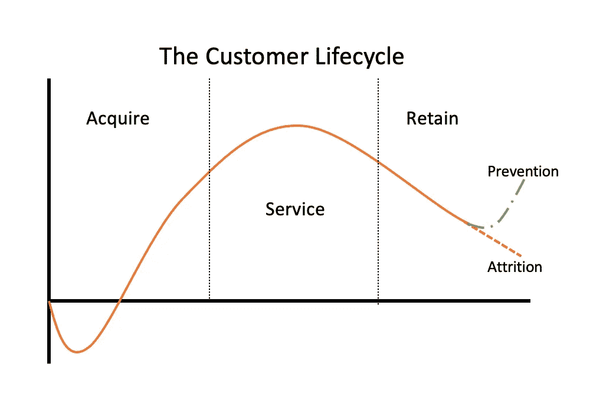

作者图片

客户流失或简称为[流失](https://en.wikipedia.org/wiki/Customer_attrition)是指客户在实现最大收益之前“离开”。停止这些活动以保持收入是如此确定，以至于基于流失的模型是首批投入生产的机器学习解决方案之一。

然而，这些模型很少被优化，因为它们依赖于二进制分类标志(是或否)。客户流失分类模型不会告诉**客户什么时候可能会离开，而只是表明这将在几天或几个月内发生。**

这篇博文将介绍如何在客户的生命周期中衡量流失风险**，以找到需要进行流失干预的 ***时间点*** 。**

## 范式转变:从仅事件到及时干预

流失模型可能更好的一个很好的理由是，许多模型是根据固定的二元结果的任意时间阈值设置的。这意味着时间保持不变！例如，设置一个任意的阈值，在 40 天的不活动之后，客户就会翻盘。

基于这样的启发标记客户会导致滑点，主要是:

*   顾客在门槛前翻腾。
*   离门槛很远很远的客户。
*   忽略客户一生的差异

将 40 天后可能离开的客户与 100 天后离开的客户同等对待可能是错误的。传统的客户流失建模没有进行这种区分。

例如，在下面的图表中，模型准确地捕获了客户 B，因为他们在设置阈值的确切时间点(40 天)离开。客户 A 实际上在阈值之后搅动，并且他们丢失了，因为模型不能解释他们。客户 C 做了相反的事情，停留的时间远远超过数据时间窗口。他们很可能会流失，但我们无法用分类模型来模拟何时流失。

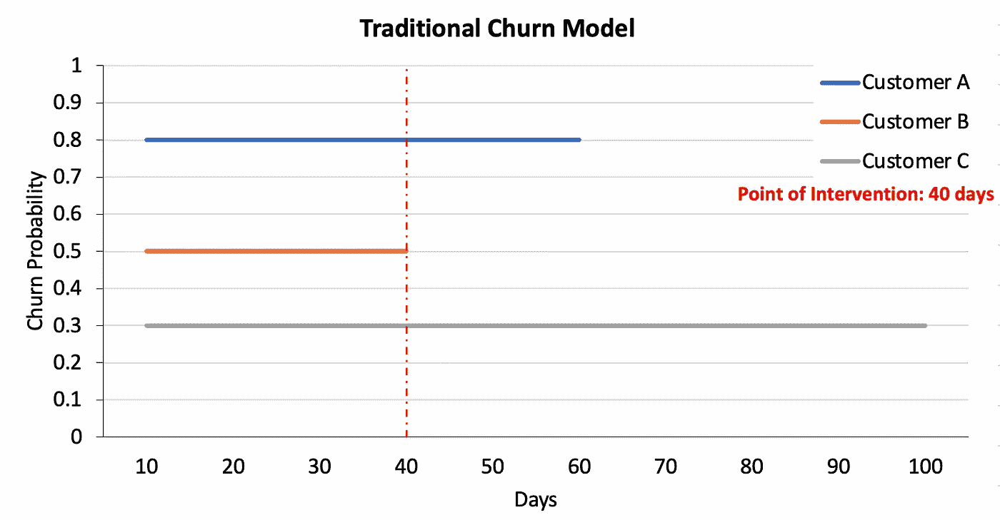

作者图片

这里唯一的时间点是“40 天内”阈值。由于它没有考虑时间，我们不清楚在什么时候需要营销干预，它会导致可预防的客户流失。

## 当知道*时，重新构建问题*

我们不使用二元分类器，而是将问题重新构建为依赖于时间的问题。这使我们能够在适当的时候进行干预，在客户流失发生之前阻止它。不再依赖于阈值，我们现在将流失设置为连续的时间条件事件。如下图所示，我们现在知道损耗**风险**最有可能发生的**时间**。

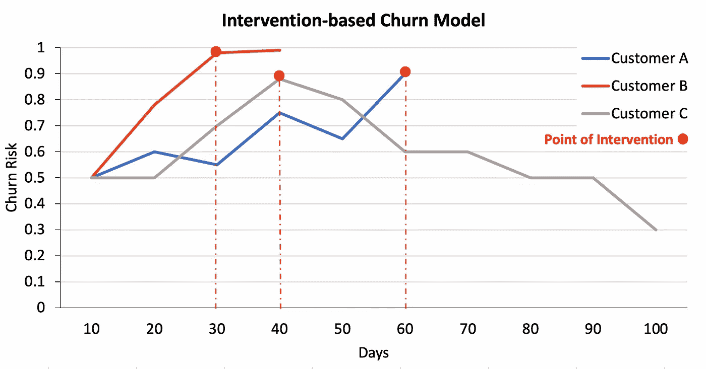

作者图片

时间不再保持不变，我们现在随着时间的推移跟踪风险**以确定何时需要营销干预来留住客户。如果我们为时间和事件建模，干预和防止损耗的正确时机是显而易见的。一种叫做[生存分析](https://en.wikipedia.org/wiki/Survival_analysis)的建模技术允许我们这样做，随着现代机器学习的出现，这现在是一项微不足道的任务。对生存分析及其背后的数学原理的深入探究超出了我们的范围，我们鼓励你查看所有关于 Medium 的关于数据科学的[好文章，以获得更多信息](/search?q=survival)。**

## 对数据的快速浏览

在本例中，您将使用一个虚构的电信公司的合成客户流失数据集，结果为“客户流失？”标记为真(已搅动)或假(未搅动)。功能包括客户详细信息，如计划和使用信息。客户流失数据集是公开的，在丹尼尔·t·拉罗斯的《T2 发现数据中的知识》一书中有所提及。作者将其归功于加州大学欧文分校的机器学习数据集仓库。所有代码的笔记本位于[这里。](https://github.com/awslabs/aws-customer-churn-pipeline/blob/main/notebook/coxph/Example_Churn_Surv.ipynb)

```
df = pd.read_csv("../../data/churn.txt")

# denoting churn and duration
df["event"] = np.where(df["churn?"] == "False.", 0, 1)
df = df.rename(columns={"account_length": "duration"})

del df['churn?']

df = df.dropna()
df = df.drop_duplicates()df.head()
```

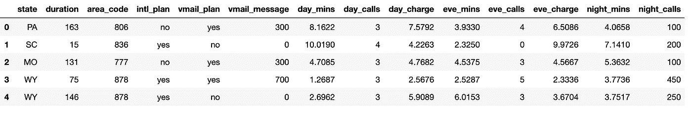

作者图片

进一步检查我们的目标会发现，总共有 5，000 条记录，其中 49.9%的记录最终被淘汰。数据集在目标上是平衡的。在真实世界的数据中，情况并非总是如此，流失事件可能是数百万条记录中的 1%。有补救的策略，但这超出了这篇博文的范围。

查看持续时间，表示为账户长度(我们的时间部分)，它显示中位数时间为 102 天，接近 101 天的平均值。

```
print("Total Records:",df.shape[0],"\n")
print("Percent Churn Rate:",df.event.mean())
print("")
print("Duration Intervals")
print(df['duration'].describe())Total Records: 5000 

Percent Churn Rate: 0.4996

Duration Intervals
count   5000.0000
mean     101.6758
std       57.5968
min        1.0000
25%       52.0000
50%      102.0000
75%      151.0000
max      200.0000
```

对于生存模型，数据不同于传统的分类问题，需要:

*   审查员——对我们来说，这些是尚未流失的客户。在这里阅读关于权利审查的内容。
*   持续时间——客户活动的持续时间。在这种情况下，是以天为单位的`Account Length`。
*   Event —二进制目标，在这种情况下，如果他们终止了标记为`Churn?`的电话计划。

我们可以绘制时间线上的前 10 个客户，以了解[右删](https://en.wikipedia.org/wiki/Censoring_(statistics)#:~:text=Right%20censoring%20%E2%80%93%20a%20data%20point,subjects%20remaining%20are%20right-censored.)数据是如何工作的，以及问题是如何形成的。

```
ax = plot_lifetimes(df.head(10)['duration'], df.head(10)['event'])

_=ax.set_xlabel("Duration: Account Length (days)")
_=ax.set_ylabel("Customer Number")
_=ax.set_title("Observed Customer Attrition")
```

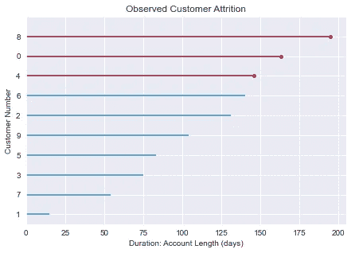

作者图片

在上图中，红线表示客户离开的时间，圆点表示具体的时间点。蓝线表示在 x 轴上测量的持续时间内仍处于活动状态的客户。

在这里，我们看到客户号 8 直到第 195 天才流失，客户号 0 和 4 分别在第 163 天和第 146 天离开。所有其他客户仍然活跃。

请注意所有客户是如何被设置在相同的时间尺度上的，因为数据是**分析对齐的**。每个顾客可能在不同的时间来，但是我们把日子定得一样。这让我们能够正确审查客户流失事件的数据。在建模开始之前，真实世界的数据需要审查和校准。

## 流失的风险

一个更有用的方法可能是估计[生存函数](https://en.wikipedia.org/wiki/Survival_function)或客户流失前的天数。为此，我们将使用[卡普兰·迈耶估算器](http://en.wikipedia.org/wiki/Kaplan%E2%80%93Meier_estimator)来计算流失发生前的时间。估计量定义为:

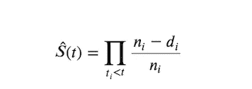

来源:生命线

其中，𝑑𝑖是𝑡时间点的客户流失事件数量，𝑛𝑖是𝑡.时间点之前面临客户流失风险的客户数量

我们将使用伟大的 [python 包 lifelines](https://github.com/CamDavidsonPilon/lifelines) 来绘制生存函数，因为该函数是最终流失模型的一个组件。

```
kmf = KaplanMeierFitter()

kmf.fit(df['duration'], event_observed=df['event'])

kmf.plot_survival_function()
_=plt.title('Survival Function for Telco Churn');
_=plt.xlabel("Duration: Account Length (days)")
_=plt.ylabel("Churn Risk (Percent Churned)")
_=plt.axvline(x=kmf.median_survival_time_, color='r',linestyle='--')
```

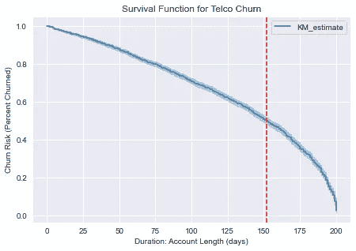

作者图片

我们来看看中位存活时间。这是一半的顾客产生的原因。根据这张图，用红色虚线标记的地方，大约 152 天，一半的客户流失。这是有帮助的，因为当需要干预时，它给*整体*基线。然而，对于每个客户来说，这是没有意义的。

缺少的是**每个客户流失风险最高的时间点**。

为此，我们将使用[考克斯比例风险](https://en.wikipedia.org/wiki/Survival_analysis#Cox_proportional_hazards_(PH)_regression_analysis)创建一个模型，该模型使用对数风险函数 *h(x)* 。风险函数以客户在时间 *t* 或更晚之前的剩余率为条件，这允许估计随着时间**推移**的流失风险。这将使我们能够对每个客户进行评分，并预测何时需要营销干预。然而，在此之前，我们需要对数据进行预处理。

## 数据分割和预处理

首先，我们将数据分为训练和测试。我们将使用测试集作为例子的验证。在实践中，您需要所有这三个拆分，这样您就不会调整到验证集。

接下来，我们获取数字特征和分类特征，然后对它们进行预处理以用于下游建模。在类别的情况下，我们将首先用常量进行估算，然后简单地对它们进行一次性编码。在数字的情况下，我们将填充中间值，然后将它们标准化为 0 和 1 之间的值。为了简单起见，这些都包含在 Sklearn 的[管道](https://scikit-learn.org/stable/modules/generated/sklearn.pipeline.Pipeline.html)和[列变换器](https://scikit-learn.org/stable/modules/generated/sklearn.compose.ColumnTransformer.html?highlight=columntransformer#sklearn.compose.ColumnTransformer)中。

作为[搅动管道](https://github.com/awslabs/aws-customer-churn-pipeline)的一部分，所有这些步骤都包含在最终的预处理器中，保存起来供推断时使用。

```
df_train, df_test = train_test_split(df , test_size=0.20, random_state=SEED)numerical_idx = (
        df_train.select_dtypes(exclude=["object", "category"])
        .drop(['event','duration'],1)
        .columns.tolist()
    )

categorical_idx = df_train.select_dtypes(exclude=["float", "int"]).columns.tolist()

numeric_transformer = Pipeline(
        steps=[
            ("imputer", SimpleImputer(strategy="median")),
            ("scaler", StandardScaler()),
        ]
    )

categorical_transformer = Pipeline(
        steps=[
            ("imputer", SimpleImputer(strategy="constant", fill_value="missing")),
            ("onehot", OneHotEncoder(sparse=False, handle_unknown="ignore")),
        ]
    )

preprocessor = ColumnTransformer(
        [
            ("numerical", numeric_transformer, numerical_idx),
            ("categorical", categorical_transformer, categorical_idx),
        ],
        remainder="passthrough",
    )

train_features = preprocessor.fit_transform(df_train.drop(['event','duration'],1))
test_features = preprocessor.transform(df_test.drop(['event','duration'],1))
```

## 转换 XGBoost 的目标

我们将使用 XGBoost 的 [DMatrix](https://xgboost.readthedocs.io/en/latest/python/python_api.html#xgboost.DMatrix) 格式来运行常规的非 scikit API。对于生存函数，这需要一个转换，将持续时间设置为目标，然后使其对于事件为正，对于非事件为负。这不是一个事件和持续时间或二元结果的元组，而是一个正/负的单一连续变量作为目标。更多关于 XGBoost 中生存是如何工作的，请看这个[教程](https://xgboost.readthedocs.io/en/latest/tutorials/aft_survival_analysis.html)。

```
def survival_y_cox(dframe:pd.DataFrame) -> np.array:
    """Returns array of outcome encoded for XGB"""
    y_survival = []

    for idx, row in dframe[["duration", "event"]].iterrows():
        if row["event"]:
            # uncensored
            y_survival.append(int(row["duration"]))
        else:
            # right censored
            y_survival.append(-int(row["duration"]))
    return np.array(y_survival)

dm_train = xgb.DMatrix(
    train_features, label=survival_y_cox(df_train), feature_names=feature_names
)

dm_test = xgb.DMatrix(
    test_features, label=survival_y_cox(df_test), feature_names=feature_names
)
```

## 关于危险函数的更多信息

风险功能提供客户流失**风险**——告诉我们客户流失最有可能发生的时间。

生存函数 *S(t)* 返回超过某个时间点的客户流失概率 *S(t) = P(T > t)* ，而风险函数 *h(t)* 给出客户停留到时间 T 的近似概率，使得:

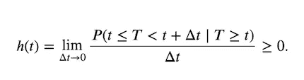

来源:生命线

另一方面，利用危险函数，也可以得到生存函数，因为:

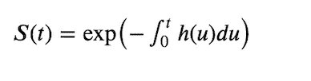

来源:生命线文档

## 梯度推进和 Cox 的部分似然

在梯度增强的情况下，多个基本学习器被组合以获得增强的整体学习器集合，其被定义为以下的加法模型:

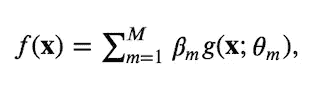

来源:sci kit-生存文档

对于生存分析情况，目标是最大化对数部分似然函数，但是用加法模型代替传统的线性模型 *f(x)* :

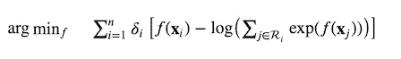

资料来源:sci kit-生存文件

关于这方面的更多信息，请参见这个[优秀的 python 库 Scikit-Survival 教程](https://scikit-survival.readthedocs.io/en/latest/user_guide/boosting.html)。

正常的参数在这里都适用，除了我们已经把`objective`改为`surivial:cox`这将允许训练一个增强的生存树。

```
params = {
    "eta": 0.1,
    "max_depth": 3, 
    "objective": "survival:cox",
    "tree_method": "hist",
    "subsample": 0.8,
    "seed": 123
}
bst = xgb.train(
    params,
    dm_train,
    num_boost_round=300,
    evals=[(dm_train, "train"), (dm_test, "test")],
    verbose_eval=int(1e1),
    early_stopping_rounds=10
)[0]	train-cox-nloglik:7.25501	test-cox-nloglik:5.86755
...
[151]	train-cox-nloglik:6.67063	test-cox-nloglik:5.39344
```

## 关于预测的一个注记

该模型的预测以风险比的形式返回(即，比例风险函数 *h(t) = h0(t) * HR* 中的 HR = exp(marginal_prediction)。这意味着输出可以是指数边际预测，也可以是非指数边际预测。为了预测客户流失最有可能发生的时间，我们需要指数化的版本，因为它直观地反映了一种概率(即使从技术上讲，这并不是真正的概率)。更多信息见[输出如何发生见](https://datascience.stackexchange.com/questions/52097/what-is-the-outcome-of-a-cox-regression-in-xgboost)。

## 检查全球预测

然后，我们可以根据时间 *t* (在这种情况下为账户长度)来计算风险分数或流失概率，并查看何时最有可能发生流失。

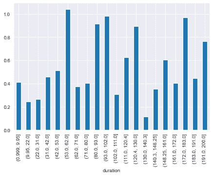

分桶流失风险(作者图片)

将这些值分成时间段显示，最高流失风险发生在第 53 天到第 62 天。在这段时间之后，最可能的损耗时间是在第 80 到 102 天。实际上，您应该忽略从第 191 天到第 200 天的最后一根棒线，因为这是截断点。

# 评估绩效

在生存模型的情况下[哈勒尔和谐指数](https://statisticaloddsandends.wordpress.com/2019/10/26/what-is-harrells-c-index/)和[布里埃分数](https://en.wikipedia.org/wiki/Brier_score)通常用于评估生存模型。

## 哈勒尔索引(哈勒尔等人，1982 年)

**一致性指数**或 **C 指数**是 ROC 曲线(AUC) 下[区域的概括，可以考虑删失数据。](https://en.wikipedia.org/wiki/Receiver_operating_characteristic)

它应该被认为是模型的拟合优度度量，该度量确定了模型基于个体风险评分正确提供可靠生存时间排序的能力。

***C = 0.5*的值表明风险分值不比抛硬币好多少。**

这表示为一致对的数量/(“一致对”的数量+“不一致对”的数量)或:

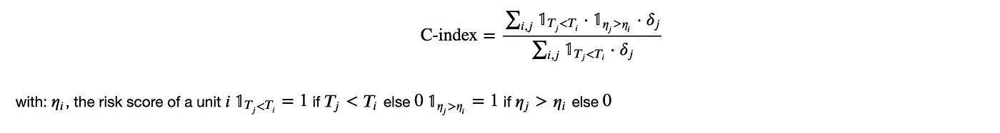

资料来源:PySurvival 文件

## 布赖尔乐谱(布赖尔 1950)

Brier 评分用于评估给定时间 *t* 的预测生存函数的准确性。它代表观察到的生存状态和预测的生存概率之间的平均平方距离，并且总是 0 到 1 之间的数字，0 是最佳可能值。

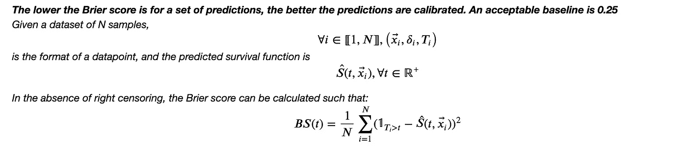

资料来源:Pysurvival 文件

然而，如果数据集包含被右删截的样本，则有必要通过加权来调整分数。这就是 [Scikit-Survival 的 Brier 评分标准](https://scikit-survival.readthedocs.io/en/stable/api/generated/sksurv.metrics.brier_score.html)的用处。如他们的文件中所述，依赖于时间的 Brier 分数是在时间点 *t* 的均方误差

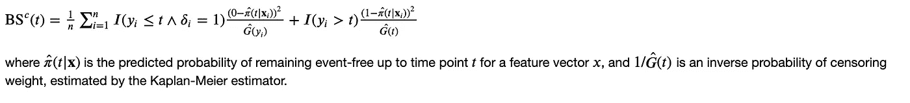

来源:sci kit-生存文档

这意味着测量现在根据右删失数据进行了调整，因此更加准确。

让我们给模型打分！

```
*print("CIC")
print(
    surv_metrics.concordance_index_ipcw(
       y_train,
       y_test,
      df_test['preds'],
        tau=100 # within 100 days
    )
)

print("Brier Score")
times, score = surv_metrics.brier_score(
y_train,y_test, df_test['preds'], df_test['duration'].max() - 1
)
print(score)**CIC
(0.7514910949902487, 177342, 58706, 0, 1218)

Brier Score
[0.37630957]*
```

这些结果是可以接受的，因为这些数据并没有考虑到生存分析。一致性指数达到 0.75，优于简单随机概率。欧石南的分数是 0.376，不算很高。理想情况下，我们希望它是 0.25 或更低，正如 [Pysurvival 文档指出的](https://square.github.io/pysurvival/metrics/brier_score.html)。

还有其他方法来进一步评估这一点。例如， [Scikit-survival](https://github.com/sebp/scikit-survival) 软件包提供了多种评估指标，如 ROC 下的[时间相关区域等。](https://scikit-survival.readthedocs.io/en/stable/user_guide/evaluating-survival-models.html#Time-dependent-Area-under-the-ROC)

# *模型可解释性与 SHAP*

好消息是[SHAP(SHapley Additive exPlanations](https://github.com/slundberg/shap)为基于树的集成提供了一种高速精确算法，以帮助解释模型中的特征重要性。具体来说，它将允许用户了解哪些因素会增加和降低客户流失风险。

```
*explainer = shap.TreeExplainer(bst, feature_names=feature_names)
shap_values = explainer.shap_values(test_features) 

shap.summary_plot(shap_values, pd.DataFrame(test_features, columns=feature_names))*
```

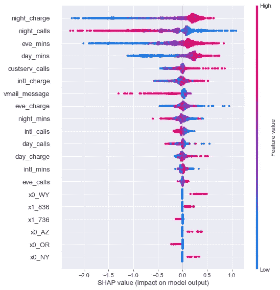

作者图片

此外，我们现在在客户层面解释了如何计算每个流失风险分值。这有助于为干预策略的选择提供信息。例如，夜间收费、夜间通话和夜间通话时间都会导致客户流失。加上每天的通话时间(作为一个积极的预测因素)表明，显然在晚上或夜间打电话的客户面临更高的风险。这可以进入干预策略，通过设置干预通信在晚上和傍晚向处于危险中的客户发出。

这提供了易于向业务用户展示的细节，并提供了进一步分析哪些功能会导致客户流失的方法。

```
*idx_sample = 128
shap.force_plot(
    explainer.expected_value,
    shap_values[idx_sample, :],
    pd.DataFrame(test_features, columns=feature_names).iloc[idx_sample, :],
    matplotlib=True,
)

print(f"The real label is Churn={y_test[idx_sample][0]}")*
```

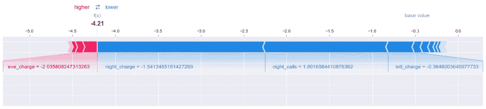

一个非搅动者是如何计算出来的，图片由作者提供

```
*The real label is Churn=False*
```

最后，由于这是一个基于树的模型，我们也可以画出树的样子。虽然我们设置了 100 棵树来训练，但是很早就停止了，这次运行的最佳迭代是 67 棵树。让我们只看第一棵树，看看它的分裂来判断理解推理是如何运行的。

```
*xgb.plot_tree(bst, rankdir="LR", num_trees=0)
fig = plt.gcf()
fig.set_size_inches(150, 100)*
```

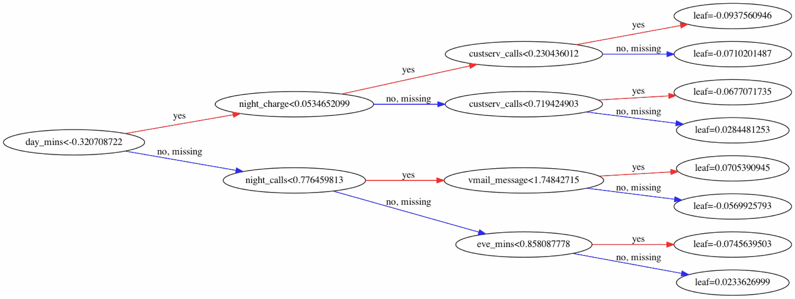

第一棵树，作者图片

不出所料，最具预测性的特征是它首先分裂的特征。在这种情况下，这意味着夜间费用，夜间通话，白天和晚上分钟分裂。显然，这个树也是向业务用户展示您的模型正在做什么的好方法。

# *最终检查*

在我们的最后检查中，我们将把问题作为一个分类器来处理，因为我们可以这样做。由于模型本身是以时间为条件的，所以这些并不是评估它在技术上做得如何的真正好的指标。我们只是为反对者运行这个，并表明它是可行的。

```
*from sklearn import metrics

y_preds = df_test.preds.apply(lambda x : np.exp(x))
y_pred = np.where(y_preds > 0.5, 1, 0)

print(f"Accuracy score: {metrics.accuracy_score(df_test.event, y_pred)}")
print(f"Area Under the Curve {metrics.roc_auc_score(df_test.event, y_pred)}")
print("")
print(metrics.classification_report(df_test.event, y_pred))**Accuracy score: 0.932
Area Under the Curve 0.9339674490815218

              precision    recall  f1-score   support

           0       0.97      0.90      0.93       527
           1       0.89      0.97      0.93       473

    accuracy                           0.93      1000
   macro avg       0.93      0.93      0.93      1000
weighted avg       0.94      0.93      0.93      1000*
```

令人惊讶的是，该模型获得的结果优于 2017 年该数据集首次出现在博客世界时[报告的 86%的准确率。我们不仅有准确性，还能在时识别出**。这使得及时的营销干预能够留住客户。**](https://aws.amazon.com/blogs/machine-learning/predicting-customer-churn-with-amazon-machine-learning/)

## *结论*

这篇博文展示了如何用时间组件来训练客户流失模型。使用带有 Cox 比例风险的生存分析，我们可以通过确定客户流失风险最高的时间来防止客户流失。这允许主动、及时的干预来阻止客户离开。

现在你有了一个模型，是时候生产它了，就像 AWS 上的[客户流失管道，它包括一个流失时间事件建模的模板。一旦配置了管道，您就可以对记录运行推理，通过批量推理来累积分数，从而做出干预决策。](https://github.com/awslabs/aws-customer-churn-pipeline)


按天间隔划分的客户风险(图片由作者提供)

(上面显示了一个表格，显示了客户在几天内批处理作业的累积结果。现在有了客户流失风险历史记录，可以监控并标记何时进行干预。)

使用机器学习进行生存分析是一种解决客户流失等问题的好方法。我们鼓励您查看下面的参考链接，了解所有可用的不同技术。

## *参考文献*

[*生命线，卡梅隆戴维森-皮隆*](https://github.com/CamDavidsonPilon/lifelines) *2014*

[*XGBoost:一个可扩展的树提升系统，陈& Guestrin 2016*](https://github.com/dmlc/xgboost)

[*PySurvival:生存分析建模开源包，Fotso 2019*](https://github.com/square/pysurvival/)

[*scikit-survival:基于 scikit-learn 构建的时间-事件分析库，Sebastian Polsterl 2020*](https://github.com/sebp/scikit-survival)

[*SHAP(沙普利补充解释)，伦德伯格 2017*](https://github.com/slundberg/shap)