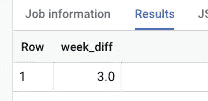
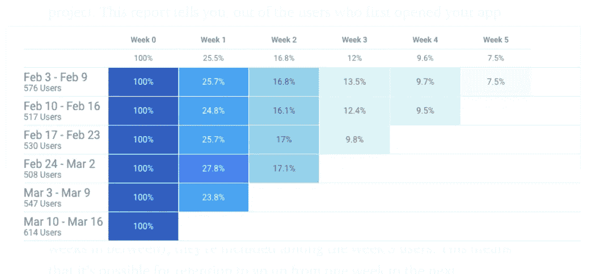
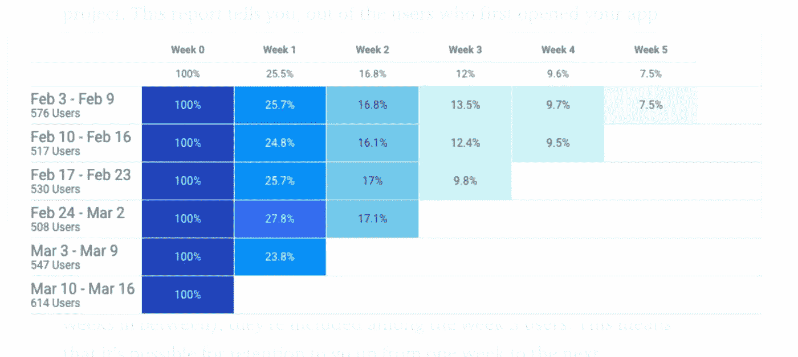

# 留存和日活跃用户解释。

> 原文：<https://towardsdatascience.com/retention-and-daily-active-users-explained-79c5dab1bf84?source=collection_archive---------10----------------------->

## 针对 Firebase 用户、机器学习爱好者和营销人员的完整 Data Studio 指南和 BigQuery 教程。你想知道的。包括数据工作室模板。


Data Studio 模板。作者图片

你有没有想过如何减少用户流失，节省用户获取的费用？这篇文章是关于如何统计那些在你的应用中停留在 T1 的用户，以便让 T2 了解是什么让他们停留在 T3。

## 这篇文章是写给谁的？

*   负责创建自定义用户留存仪表板的营销人员。
*   可能想要创建更好报告的分析师。
*   人工智能和人工智能专家肯定想预测用户流失。
*   可能想质疑其保留数字的 Firebase 用户。

## 先决条件

*   SQL 的基础知识
*   [谷歌开发者账户](https://console.developers.google.com)。它是免费的。
*   [BigQuery](https://cloud.google.com/bigquery/) access。它是免费的。
*   [数据工作室](http://datastudio.google.com/)访问。它是免费的。

如果你喜欢这个模板，你可以从[这里](https://datastudio.google.com/u/0/reporting/28036fe6-26ea-4eff-bdd1-70b3a78fd7e9/page/umInB/preview)下载。它是免费的。所有数据集都包含在此模板中。在本文最后阅读如何复制。

## 基础

我将使用 **BigQuery** (BQ)和 **Data Studio** (DS)来处理数据。

我们需要的所有数据都将包含在下面的 SQL 中。所以这是一个非常小的数据集，运行它不需要任何成本。

SQL 可以很容易地适应任何其他数据仓库，但在 BQ 中运行它并在 DS 中可视化更容易。所以不要犹豫，尝试一下吧。

我们来看一些**用户活动示例**(复制粘贴后在 BQ 中运行即可):

这将给我们一个**模拟出来的**用户活动表:


示例用户活动表。BigQuery。作者图片

如果你使用 **Firebase** 或 **Google Analytics** 你可以提取数据并上传到 BigQuery 中做进一步分析。我在之前的一篇文章中写道:

[](/i-stopped-using-firebase-dashboards-ive-built-my-own-instead-299631185b41) [## 我不再使用 Firebase 仪表盘。我自己建了一个。

### 你如何解释火基数字？以下是答案。包括简洁的模板以及示例 Firebase 数据集…

towardsdatascience.com](/i-stopped-using-firebase-dashboards-ive-built-my-own-instead-299631185b41) 

现在，当我们有数据时，我们需要一个视图来查看用户在注册后的每一天是否活跃，然后统计活跃的用户。


保留表示例(作者图片)

要计算 **BigQuery** 中每天的活跃用户数，可以使用下面的 SQL。有点难看，但像这样的东西应该工作:

用户保留表

对于许多营销人员来说，代表最大兴趣的指标将是 **30 天留存**，因为如果用户在第 30 天活跃，这意味着它已经使用应用程序 30 天了。如果用户在过去 30 天内至少活跃一次，则该用户将成为**月活跃用户** ( **MAU** )。

然而，这个用户不一定是一个活跃的用户。

> 我们需要区分可测量的用户活动(例如，你的用户群的 K-means 聚类)和简单地活跃为 **MAU** 。

例如，如果一个用户打开了你的应用程序，然后卸载了它，这是一个活跃的用户吗？是的，它是。

在这篇文章中，我将讨论如何计算用户登录次数，并生成 DAU/MAU 指标。

**新活跃用户**是指在指定时间段内，首次与你的 app 互动的用户。(例如创建一个帐户)然后开始每天、每周或每月使用它。这些用户通常会受到他们所经历的用户入职流程的严重影响。

**返回活跃用户**是指经过一段时间的不活跃后，继续回到你的应用的用户，与你的业务的留存率和经常性收入指标密切相关。

## 现在让我们创建一个新的数据源，并在 Data Studio 中可视化我们的数字。

我们并不真的需要在 SQL 中使用聚合并将它物化，因为我们的数据集相对较小，Data Studio 可以为我们做聚合。

> **数据源:**

你可以看到我创建了一个名为`user_pseudo_id_percent`的**新领域**。稍后我们将使用它来显示保留用户的百分比。

现在，让我们添加一个新列`week_`，我们将使用它来计算每周的保留时间。尝试运行这段 SQL，看看会发生什么:

```
select ceil(DATE_DIFF('2020-10-25', '2020-10-10', DAY)/7) AS week_diff
```



周差异

例如，在 **Firebase** 中，我们有一个类似的东西叫做**每周保留群组**。



Firebase 新用户保留示例(图片由作者提供)

让我们将这个新字段添加到我们的数据源:

将每周分组添加到保留中

为了准确报告留存率，您的分析工具需要能够识别同一用户，即使他们在六个月后使用不同的浏览器或设备登录。这可能会成为一个真正的挑战，因为

> …在现实生活中，当用户拥有不同的帐户和多台设备时，事情会变得更加复杂。

## 什么是“活跃用户”

让我们假设每个客户端应用程序在运行时每天都会登录几次。每个登录事件都可以与**用户 id** 和**设备 id** 一起记录到您的数据湖/数据仓库中。

这差不多就是 **Firebase** 记录用户的方式。默认情况下，您将拥有`user_pseudo_id`,并且可以像这样启用`user_id`:

[](https://firebase.google.com/docs/analytics/userid) [## 设置用户 ID | Firebase

### Google Analytics 有一个 setUserID 调用，它允许你为使用你的应用的个人存储一个用户 ID。这通电话…

firebase.google.com](https://firebase.google.com/docs/analytics/userid) 

您可以做很多事情来监听这些事件，甚至在将它们发送到数据仓库之前对它们进行预处理，以得到您需要的数据。像 **Kinesis** 或 **Kafka** 这样的东西可以很容易地从你的微服务中传输事件数据。

> —那么什么是活跃用户呢？
> 
> —这取决于您希望应用于数据集和报表的业务逻辑。

活跃用户通常被报告为**每月活跃用户(MAU)** 、**每周(WAU)** 和**每天(DAU)** 。让我们用一个可视化的例子来进一步说明活跃用户:


DAU、WAU 和每月活跃用户。作者图片

在上图中，您可以看到用户注册后每天登录。每一个彩色圆圈都暗示着用户在那天很活跃。用户`'J'`(‘**J’**代表约翰纳斯)在第 1-6 周都很活跃。不过还是算 1 MAU ( **月活跃用户**)。因此，我们可以看到该月有 2 个活动用户，因为所有用户在该月都至少活动过一次。你可能注意到用户 id ' `E01` ' ('E '是 Emma 的)有 2 个设备( **user_pseudo_id 2001 和 2000** )。

我们计算了**用户**，这就是为什么它是 2(不是 3) MAU。所以你可以看到，这完全取决于方法论。

> 在这种情况下，活跃用户数可能会轻松增加一倍或两倍。想象一下，约翰用他的一台设备创建了多个账户。

我们稍后将更好地研究如何解决这个问题。

如果我们将范围缩小到周 **(WAU)** 我们可以看到在**周**1–3 期间有 2 个**活动** **用户**，而在**周 4** 期间只有**个** **1 个**。我看到人们在分析不同时间段(每月、每周、每天)的用户活动数据时，经常会质疑这些数据，并认为这些数据有问题，而事实并非如此。

> 如果一个用户在一个月的每一天都访问你的应用程序，那就是单个用户。 ***不是 30 个不同的用户。***

如果你喜欢上面的模板，你可以简单地从 [**复制到这里**](https://datastudio.google.com/u/0/reporting/28036fe6-26ea-4eff-bdd1-70b3a78fd7e9/page/umInB/preview) 。

> 数据集:


Data Studio 保留模板。第二页。作者图片

## 保留

我们可能想要回答以下问题:

> 在第**天** 1，2，…，n，有多少新用户是活跃的？

这是**日常**的滞留队列。这是用户注册后的天数(不是日期)。一些帐户可能在不同的日期注册。

> 在第**周** 1，2，…，n，有多少新用户是活跃的？

这是**每周**保留队列(注册日期后的周数)。

> 在**月** 1，2，…，n 有多少新用户是活跃的？

**月度**留存群组(登记日之后的月份编号)。

***让我们为我们的保留群组创建一个数据集。***

每日、每周和每月保留组

要回答第一个问题

> 在**日** 1，2，…，n，所有新用户中有多少是活跃的？

我将使用 **Data Studio** 和上面的数据集，默认聚合设置为 MAX。

我将使用 **day_number** 、 **week_diff** 和 **month_diff** 作为数据透视表中的维度、行和列。

我将使用`user_pseudo_id` ( **device_id** )来统计独立用户，因为这几乎是 **Firebase** 中的标准。

> 结果:


每日保留队列

> 在第**周** 1，2，…，n，有多少新用户是活跃的？


保留周刊

还记得那个看起来很熟悉的 **Firebase** 保留视图吗？它简单地倒退 5 周，并将`first_seen_week`添加到行中:



我们可以在 Data Studio 中通过将`first_seen`添加到我们的数据集来实现这一点:


Data Studio 中的每周保留。作者图片

或者我们可以添加`first_seen_week`:

`*EXTRACT(WEEK FROM first_seen) AS first_seen_week*`

我已经添加了另一个 **device_id** ，它将在 11 月 1 日**与**在**第一次看到**，新的数据集将是(记住现在我们需要在分区中使用`first_seen`进行行分组):

> 如何更好地可视化以留住人才？

如果我们能以日历的形式显示我们的保留率会怎么样？

# 日历图表

我们通常使用数据透视表来可视化保留群组的数据，但在日历上查看相同的数据通常会更有见地。


在下一个例子中，我将假设**每 30 天**的保留期等于**一个月**。因此，它实际上不是一个日历月，但没有什么可以阻止您显示日历月的保留率，而不是保留组。只要记住它会有完全不同的意义。

事实上，在许多情况下，您可能希望简化显示保留时间，如下所示:


按活动日期保留

使用活动日期而不是每天、**每周**或**每月**分组是有意义的，因为这样更直观，更容易理解。

## 我们还能对保留做些什么？

*   我们可以在之前的问题中添加日期。例如，在 **DS_START_DATE** 和 **DS_END_DATE** 之间注册的新用户中有多少人在 **day** 1，2，…，n 是活跃的？
*   我们也可以将`first_seen`或`registration_date`放在 X 轴上，用**线图**显示 3、7、30 天的留存。
*   在现实生活场景中，我们通常会有`registration_date`而不是 first_seen，所以我们的数据集可能需要一点调整。
*   我们可以使用**日历月**作为保留群组。只要记住它和第一、第二等等不一样。注册后一个月。对于在`2020–11–03`的`2020–10–01`活动日期注册的用户，将被**月 2 日**保留。然而，如果我们使用日历日期，那就是一个月。
*   添加**用户属性**(例如来自 **Google Analytics** 的活动、来源、媒体)并在行分组中使用它来查看不同活动的留存率可能是非常有见地的。
*   确定**真正的唯一用户**并分别计算他们的留存率。这可能会对保留数字产生巨大影响。拥有多台设备的用户或者和拥有多个用户账号的用户一样重新安装 App 的用户或者垃圾邮件发送者真的很难统计。毫无疑问，他们可能会歪曲你的保留数字。
*   如果我们使用**自定义保留组**，例如第 7 天+-1 天或第 30 天+-1 天，看看会发生什么可能会很有趣。

> 还记得 30 天保留期以及它对营销人员如此重要的原因吗？

*   您还可以计算不同用户群的**留存率。例如，对于那些符合特定标准的人。或者，执行一个快速的 **K 均值分析**来对你的用户进行聚类，然后计算留存率，这可能非常有用。**

## 结论

这就把我带到了这篇文章的结尾。使用这个漂亮的**模板**，你可以轻松模拟用户活动数据，并对你的留存报告进行单元测试。

我们刚刚在 **BigQuery** 和 **Data Studio** 中使用了 5 种不同的方法来显示用户留存率，并且您可以使用 **Firebase、Google Analytics** 数据和这个小**报告**做更多的事情。

只需在 **Data Studio** 中进行一些简单的调整，这个模板就可以变成一个漂亮的实时分析仪表板，用来更好地了解你的用户行为。

> **保留率**是一个非常重要的指标，因为能够了解**用户离开的原因、时间和地点**可能有助于您了解他们这样做的原因。

保留分析是一个非常强大的工具，旨在解释用户流失。利用这些知识，营销人员可以**通过修复应用程序错误、改进应用程序功能和建立更成功的营销渠道来提高保留率**。

众所周知，获得新用户的成本高于留住现有用户的成本。

因为流失的用户可以转化为收入的直接损失，预测可能流失的用户可以帮助公司挽回这一损失。这就是为什么对保留的不同观点、解释保留数字的方法以及解释用户流失的原因在建立机器学习模型(例如，流失预测)中变得越来越重要。

***感谢阅读！***

## 如何复制此模板

1.  点击此[链接](https://datastudio.google.com/u/0/reporting/28036fe6-26ea-4eff-bdd1-70b3a78fd7e9/page/umInB/preview)并点击**使用模板**


复制模板。作者图片

2.单击复制包含数据集的报告:


3.有些部件会显示为损坏，但单击一个部件，然后单击编辑


4.选择您的**计费项目**，点击**重新连接**:


成功了！


在[datastudioguides.com](http://datastudioguides.com/)上有更多的模板和教程

## 推荐阅读:

[](https://datastudioguides.com/data-visuals-with-data-studio/) [## 如何用 Google Data Studio 可视化数据

### Data Studio 是当今最强大的数据可视化工具之一，也是那些希望…

datastudioguides.com](https://datastudioguides.com/data-visuals-with-data-studio/) [](/i-stopped-using-firebase-dashboards-ive-built-my-own-instead-299631185b41) [## 我不再使用 Firebase 仪表盘。我自己建了一个。

### 你如何解释火基数字？以下是答案。包括简洁的模板以及示例 Firebase 数据集…

towardsdatascience.com](/i-stopped-using-firebase-dashboards-ive-built-my-own-instead-299631185b41) [](https://firebase.google.com/docs/analytics/userid) [## 设置用户 ID | Firebase

### Google Analytics 有一个 setUserID 调用，它允许你为使用你的应用的个人存储一个用户 ID。这通电话…

firebase.google.com](https://firebase.google.com/docs/analytics/userid) [](https://support.google.com/firebase/answer/6317510?hl=en) [## 军团

### 群组是指在同一时间开始使用你的应用的一组用户(比如在同一天，或者在同一个…

support.google.com](https://support.google.com/firebase/answer/6317510?hl=en) [](https://stackoverflow.com/questions/60782636/firebase-retention-ratescohort) [## 火源保留率(队列)

### 感谢贡献一个堆栈溢出的答案！请务必回答问题。提供详细信息并分享…

stackoverflow.com](https://stackoverflow.com/questions/60782636/firebase-retention-ratescohort) [](https://cloud.google.com/bigquery/docs) [## BigQuery 文档|谷歌云

### 交互式分析大型数据集。

cloud.google.com](https://cloud.google.com/bigquery/docs) [](https://firebase.google.com/) [## 重火力点

### 受 Google 支持，受应用程序开发团队喜爱-从初创公司到全球企业，所有产品都在扩展 _ 更多…

firebase.google.com](https://firebase.google.com/)