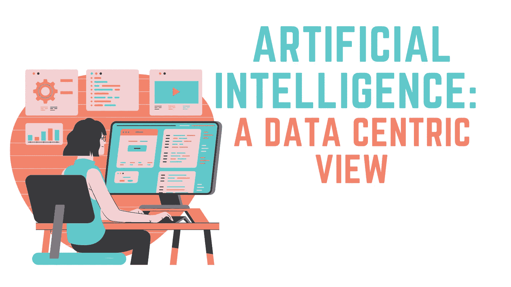
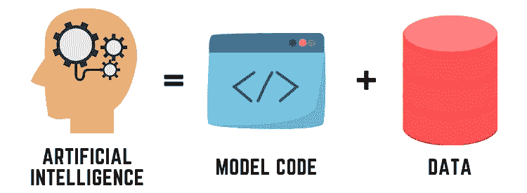
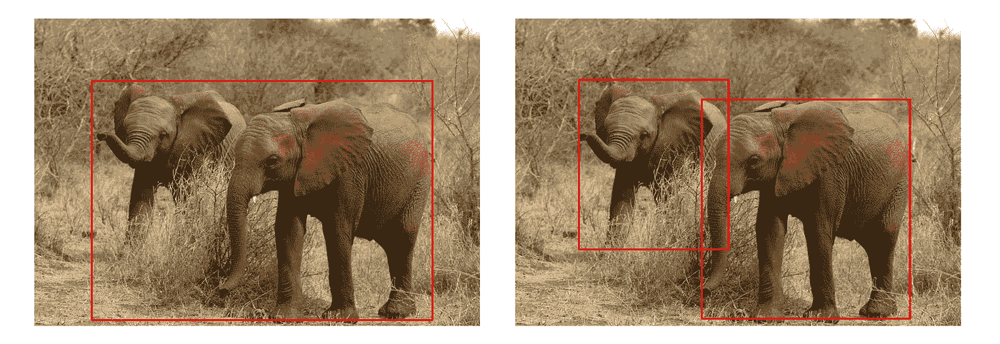
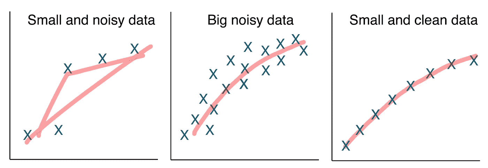
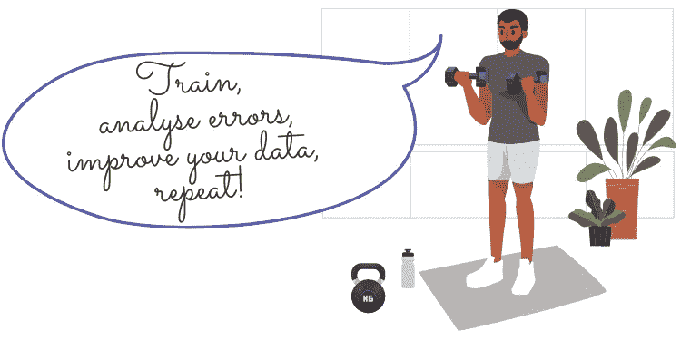

# 反思我们如何处理人工智能问题

> 原文：<https://towardsdatascience.com/rethinking-how-we-approach-ai-problems-909dad4a7f3d?source=collection_archive---------38----------------------->

## 让我们关注数据

*图片通过 Canva 在* [下一次设计使用许可](https://www.canva.com/policies/onedesign/) *给作者*。

当我们谈论机器学习和人工智能时，在大多数情况下，我们会谈论我们用来处理分类或回归任务的**模型**:一些专家承诺他们对集成模型的忠诚，如梯度增强决策树。其他人则通过微调高度复杂的神经网络架构来试试运气。有些人甚至更进一步，试图两全其美，将各种模型堆在一个巨大的黑盒子里，以获得尽可能高的准确度。

# 但是为什么从来没有人谈论数据呢？

*图片通过 Canva 在* [下一次设计使用许可](https://www.canva.com/policies/onedesign/) *给作者*。

很长一段时间以来，我们经历了一个研究、文献和在线人工智能教程专注于算法和模型的时代，并建议为了成为更好的机器学习专家并取得更好的结果，我们应该使用更复杂的模型，调整超参数，堆叠它们，如果我们目睹过度拟合，那么简单地执行一些正则化。然而，为什么大多数教科书和教程几乎完全忽略了实际进入模型的数据的重要性？我相信是时候进行范式转换了！

# 人工智能的移动部件

*图片 via Canva 根据* [一个设计使用许可](https://www.canva.com/policies/onedesign/) *给作者*。

在一个非常抽象的层面上，可以说人工智能有两个组成部分:经过训练的**模型及其代码**(例如神经网络)输出一些预测，以及用于训练模型的**数据**。如上所述，我们目前生活在一个最关注改进模型的时代，例如通过微调参数。*来自深度学习的吴恩达。AI* 称之为**以模型为中心的观点**，并将其与他称之为**以数据为中心的另一种新方法区别开来。**

## **以模型为中心**

在已经讨论过的以模型为中心的观点中，我们首先下载并收集我们可能得到的所有数据，然后开发一个性能良好的模型。基于该基线，**数据被固定**，并且**模型**和代码被**迭代改进**(例如，通过改变模型架构或调整参数)，直到达到令人满意的精度水平。

## **以数据为中心**

在以数据为中心的方法中，焦点放在数据上，而不是模型上:在为任务找到一个非常合适的模型后，**模型的代码被固定下来**，而**的数据质量被迭代地提高。**这里的主要转变是，处理数据不再是预处理步骤！处理数据不是我们只做一次的事情，而是我们反复改进的核心部分。使用这种方法，数据的**一致性**至关重要。

> “在机器学习生命周期中，没有任何其他活动比改善模型可以访问的数据具有更高的投资回报。”— [戈杰克](https://medium.com/gojekengineering/feast-bridging-ml-models-and-data-efd06b7d1644)

# 变得更加以数据为中心

*图片通过 Canva 在* [下一次设计使用许可](https://www.canva.com/policies/onedesign/) *给作者*。

本文的目的不是让你完全忽略你的模型，而是激励你花一些时间处理数据，而不是把所有的东西都投入到模型中。因为毕竟 AI 有两个运动的部分，模型和代码，为什么只专注一个呢？如果你想更多地了解如何变得更加以数据为中心，这里有一些来自*吴恩达*的指导方针，可以帮助你开始——然而它们中的大多数都有一个共同点:**一致性。**

## 一致的 y 标签

数据以多种形式出现，但是监督学习任务的每个数据集的共同点是 y 标签。这些 y 标签或者是自动收集的，或者是在(半)人工注释过程中添加的。然而，它们经常不一致或没有错误，并且模型最终学习到阻碍性能的矛盾信号。

下图描述了大象检测器图像识别任务的不一致标签。为了训练这个检测器，大象的图像被手动标注了边界框。但是哪个选择更正确呢——左派还是右派？如果任务不是数大象，而是简单地判断图像中是否包含动物，那么这两个版本都完全没问题。然而，重要的是如何在训练图像上绘制边界框的方式是一致的，否则，分类器将不能正确地学习。

大象不一致的包围盒注释— *图片由作者*拍摄

## 如何发现不一致？

寻找这些不一致的地方，尤其是当你的数据集很大的时候，是非常耗时的。根据经验，*吴恩达*指出，如果数据集不超过 10.000 个观察值，寻找不一致之处并专注于数据效果最好。在这种数据集规模下，通过正确的工作流程，可以在合理的时间内发现并手动修复不一致之处，并且与专注于模型相比，可能会在准确性方面产生更大的性能提升。

> “从以数据为中心的角度来看，< 10,000 examples” — Andrew Ng

***的问题有很大的改进空间。例如:量化改进***

*如果你有 500 个观察值，其中 12%的观察值被不一致或不正确地标记，下面的方法证明是同样有效的:*

*   *修复不一致(重新标记数据)*
*   *收集另外 500 个新观察值(训练集加倍)*

*来自*[*https://www . deep learning . ai*](https://www.deeplearning.ai/wp-content/uploads/2021/06/MLOps-From-Model-centric-to-Data-centric-AI.pdf)

发现标签不一致的一种方法是使用多个标签，并观察它们如何解释和注释数据。例如，如果你从事一项语音识别任务，你雇用五个人来转录音频序列，以便能够训练你的分类器，不要简单地把你的数据分成五部分，然后看着标签员做他们的工作！最好从一小部分数据开始，向多个贴标机显示相同的观察结果。很有可能你会发现标签员转录音频序列的不同之处，不是因为有些人懒惰或者做得不好，而是因为最初没有建立标准！想象一下同一个句子的这两种转录:

*图片经由 Canva 在*下[一个设计使用许可](https://www.canva.com/policies/onedesign/)给作者。

*   **转录 1:** *“嗯……明天要下雨了”*
*   **转录 2:****明天会下雨**

*然而，两种转写都没问题，因为对于如何转写填充词(如“uhm ”)没有一致同意的标准,标签中出现了不一致。这些不一致很可能会降低语音识别模型的性能。因此，就如何处理这些歧义做出决定并就标准达成一致是非常重要的。可以想象，您将无法在注释过程之前定义所有必要的标准，并且在注释过程中可能会出现新的不一致。因此，将此视为迭代方法非常重要！*

## *如何修复不一致？*

*如上所述，修复不一致是一个迭代的方法。一旦您知道数据标签中的不一致，您应该考虑以下步骤作为蓝图:*

*   ***找出** **与这些歧义和不一致的例子***
*   ***就标准**达成一致，决定如何对其进行标记/处理(例如，在上面的例子中，是否应该转录或省略*“uhm”*)*
*   ***在专用标签说明手册中记录**新标准*

*只有当标准**是可复制的**并且用**有意义的**例子很好地记录下来，你才能确保被雇佣的贴标员或者如果你雇佣其他人来做这项工作，在不确定的情况下知道该怎么做。因此，重要的是，标签说明应包括边界情况、未遂事件和混淆的例子，而不仅仅是明确的假例子。*

**

**图片 via Canva 下* [一个设计使用许可](https://www.canva.com/policies/onedesign/) *给作者*。*

## *如果重新标记和修复不一致不是一个选项呢？*

*有时，例如由于预算或时间原因，不可能修复整个数据集中的不一致。但是，如果您希望充分利用您的数据并坚持以数据为中心的观点，您可以考虑以下选项:*

*   *收集更多数据(也不总是可行的)*
*   *使用数据扩充(给现有的观察增加一些噪音和变化)*
*   *扔掉不一致的和包含太多噪音的例子*
*   *专注于最有改进潜力的数据子集——使用错误分析*

*随后，将更详细地讨论最后两个选项。*

## *抛弃观察—从大数据到好数据*

**

**图片经由 Canva 在*下[一个设计使用许可](https://www.canva.com/policies/onedesign/)给作者。*

*这个选项可能非常违反直觉。**但是数据越多并不总是越好！**拥有大型数据集只有在它是“好”数据的情况下才有帮助，但是如何定义“好”数据集呢？一般来说，您可以看出高质量数据集的四个特征:*

1.  *一致且不含糊的标签*
2.  *观察涵盖了最重要的案例*
3.  *训练数据有来自生产数据的及时反馈。特别是在数据漂移方面)*
4.  *数据集大小合适(不要太小)*

*如果你的数据不符合上述标准，你可能要考虑花费一些来改善它，或者如上所述，删除糟糕的观察！“良好”数据和模型性能的关系示例性地(简化)显示在下图中:*

**

*图像灵感来自[吴恩达](https://www.deeplearning.ai/wp-content/uploads/2021/06/MLOps-From-Model-centric-to-Data-centric-AI.pdf)，由作者重新绘制和改编*

*如果你有一个很小的数据集，只有很少的噪声观测值，那么拟合一个稳健的函数(红线)是很困难的(左)。如果您有一个包含大量噪声的大型数据集，那么拟合一个稳健的函数是可能的，并且可能会产生良好的结果(中间)。如果数据质量非常高的观测值很少，在本例中可以拟合最佳函数。*

## *执行错误分析，重点关注要改进的数据子集*

*如上所述，有时改进整个数据集会非常耗时，尤其是在处理大数据时。此外，正确地确定优先级通常是很重要的，这样可以避免在问题上浪费时间，一旦这些问题得到解决，可能不会真正显著地提高模型的性能。因此，专注于数据子集通常似乎是正确的做法。这里有一些实用的指导方针和选项，您可以在执行错误分析时遵循:*

*   *在进行分类时，使用**混淆矩阵**作为工具，首先了解哪个类别表现最差。通常这是更深入调查的良好起点。*
*   *如果您对**人类的表现水平**(人类专家如何完成相同或相似的任务)有任何了解，请尝试在错误分析中包含此信息:寻找估计的人类表现水平与您的模型表现之间的最大准确度差距。这个类有最大的改进潜力——因此从修复这个类的数据开始是最好的选择！通常不可能获得对人类性能水平的估计，在这种情况下，尝试寻找相关领域的研究或调查过去制作的机器学习模型的性能！*
*   *仔细看看错误分类的观察结果，试着看看你是否能找到一个**模式**。例如，如果您从事图像分析工作，您可以调查错误分类的图像是否显示出某种类型的噪声，例如变化的光照条件、不清晰，或者它们是否可能被错误标注。如果有多种模式的噪音，集中在出现频率最高的一种。*

*你如何处理噪声是高度依赖于具体情况的。如果在生产中不希望出现噪声(例如，由被替换的旧传感器采集的图像)，则可能值得移除或重新标记错误分类的图像。但是，如果生产中会出现噪声(例如，改变照明条件)，您可以尝试向数据集中添加更多包含相同噪声信号的图像。第二种选择是人为地增加数据集，例如，使一些现有的图像变亮或变暗。在这两种情况下，您都将为模型提供更多的示例，从中学习，最终提高性能。*

**

**图片通过 Canva 在* [下一次设计使用许可](https://www.canva.com/policies/onedesign/) *给作者*。*

*最后，重要的是要说，误差分析不是一步到位的方法，而是必须是迭代的:训练你的模型，执行误差分析，改进你的数据(子集)和重新训练你的模型。重复此操作，不断提高模型的准确性。*

# *最后的想法和限制*

*本文向您展示了为什么专注于改进数据而不是模型可能会有回报。此外，还讨论了如何变得更加以数据为中心的准则。但是，任何东西都有一些限制，在这里列出一些限制是很重要的:*

*   *对于图像、视频或音频序列等非结构化数据，拥有以数据为中心的视图通常更容易。在处理结构化表格数据时，在数据中寻找模式和修复标签通常要困难得多。*
*   *数据集越大，就越难确保数据集的一致性。在数据集的改进上花费的时间最大，数据集的大小< 10，000 个观察值*

*尽管本文的重点是建立数据集中的一致性，但这里也必须强调数据科学和要素工程的重要性。使用具有数千个参数的复杂模型不应被用作不执行适当的数据科学和获得对您的数据的真正理解的借口。通常，与忽略数据和使用非常复杂的模型(如神经网络)相比，花更多的时间结合简单的模型分析和修复数据集可以获得更好的性能。最近可以看到的一个趋势是，机器学习专家认为适当的特征工程并不重要，因为神经网络被认为是强大的学习器，不需要这些耗时的步骤。最近，这种趋势已被证明是有问题的，因为预测来自几乎没有可解释性的黑盒模型，机器学习专家通常无法解释为什么模型会预测一些东西。*

## *更多材料*

*【2021】吴恩达 — MLOps:从以模型为中心到以数据为中心的 AI[PDF]:[https://www . deep learning . AI/WP-content/uploads/2021/06/MLOps-From-Model-centric-to-Data-centric-AI . PDF](https://www.deeplearning.ai/wp-content/uploads/2021/06/MLOps-From-Model-centric-to-Data-centric-AI.pdf)*

***【2】****吴恩达**—与安德鲁关于 MLOps 的对话:Youtube 上从以模型为中心到以数据为中心的人工智能:[https://www.youtube.com/watch?v=06-AZXmwHjo&t](https://www.youtube.com/watch?v=06-AZXmwHjo)*

***【3】****深度学习。人工智能**——以数据为中心的人工智能:Youtube 上的真实世界方法:[https://www.youtube.com/watch?v=Yqj7Kyjznh4](https://www.youtube.com/watch?v=Yqj7Kyjznh4)*