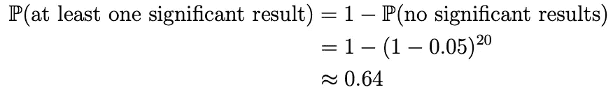
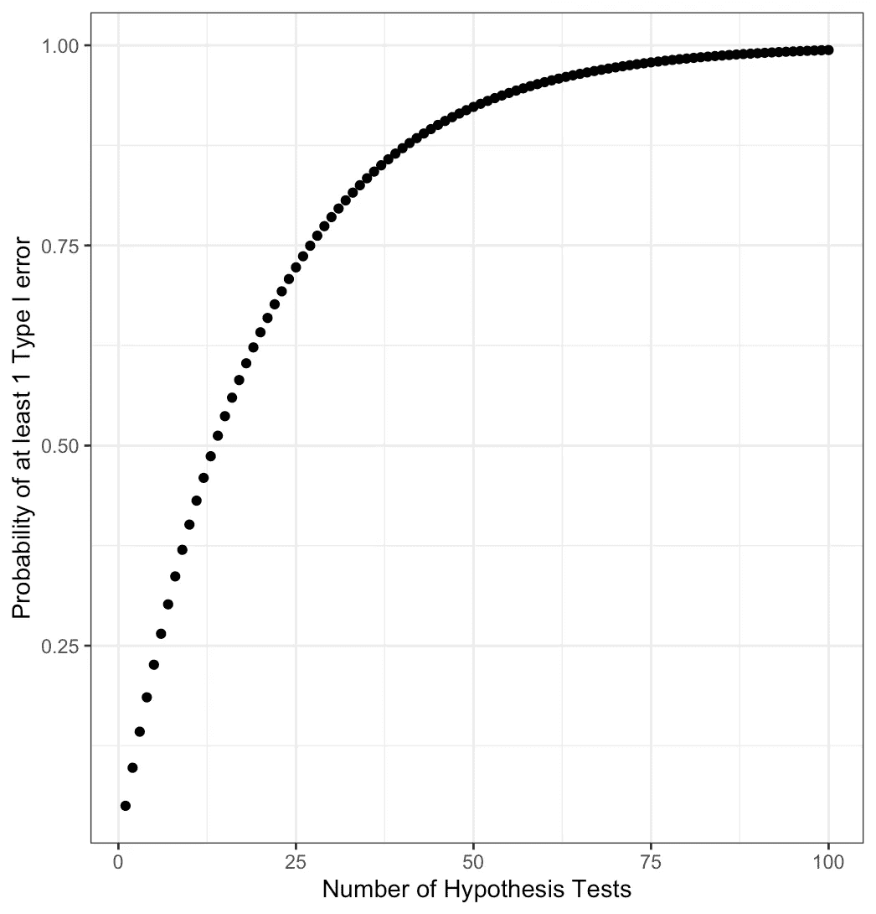
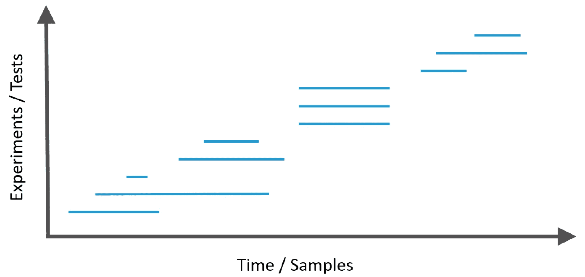
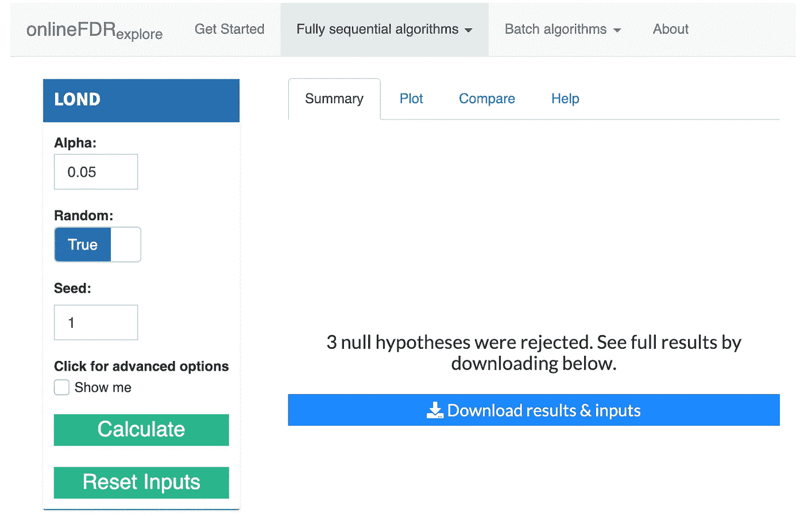

# 反思我们如何对抗多重假设检验

> 原文：<https://towardsdatascience.com/rethinking-how-we-combat-multiple-hypothesis-testing-16c4eb912690?source=collection_archive---------19----------------------->

## [入门](https://towardsdatascience.com/tagged/getting-started)

## 更强大的“在线”方法

由[大卫·特拉维斯](https://unsplash.com/@dtravisphd?utm_source=medium&utm_medium=referral)在 [Unsplash](https://unsplash.com?utm_source=medium&utm_medium=referral) 上拍摄的照片

# **前言**

这篇文章不是一篇技术文章，也不是一篇关于控制 I 型和 II 型错误率的所有不同方法的综合文章。这篇文章将假设一些背景知识，并主要集中在激发一个新的范式，以打击多重假设检验问题，并介绍一套工具，在 R and R 闪亮，你可以使用。

# 背景

如果你以前做过统计或读过关于某项发现的研究论文，那么数字 *0.05* 应该会让你想起。指的是 0.05 的**显著性阈值**。这意味着，如果零假设为真，结果有 5%的可能性是“令人惊讶的”。在假设检验中，我们将我们的 **p 值**与显著性阈值进行比较。p 值是观察结果的**概率或更极端的概率，假设零假设是正确的。0.05 这个神圣的数值据说起源于剑桥统计学家 RA Fisher，他在 1926 年提出了当时新颖的统计学意义的概念。他任意选择了这个值，我们可以从他的论文中引用:**

> 就个人而言，作者倾向于将显著性的低标准设定在 5%
> 点，并完全忽略所有未能达到这一水平的结果。

从那时起，世界各地的科学家基本上都坚持 5%的门槛。如果假设检验返回的 p 值低于 0.05，您拒绝零假设，并得出结论，您有一些证据来支持您的替代假设。如果它高于 0.05，你不能拒绝零假设。

这很好，但是如果你要做很多很多假设测试呢？考虑这样一个场景，我们已经进行了少量假设检验，比如说 20 次，所有这些检验都是真的无效(这在现实生活中我们永远不会知道)。如果我们问自己，由于偶然，观察到至少一个重要假设检验的概率是多少，我们可以计算:

64%是一个相当高的概率，因为在仅仅 20 次测试中，至少有一个重要结果是偶然观察到的，所以你可以想象当我们有 1000 次假设测试时，这个概率会发生什么。一万次测试。一百万次测试。即使进行了 100 次假设检验，正如您在下图中看到的，观察到至少一个重要结果的概率接近 1，或 100%确定性。那我们该怎么办？

# 传统方法:Bonferroni 和 Benjamini-Hochberg

在统计推断中，我们有两个(通常是相互竞争的)目标。第一是尽量减少犯第一类错误的概率，或者在我们不应该拒绝零假设的时候拒绝零假设。这就是我用上面的玩具例子演示的。过去和现在都有很多关于如何控制 I 型错误率的研究，但在本文中，我将主要关注控制**错误发现率**和**家庭错误率。**

区分这两者是最重要的。**家庭式错误率(FWER)** 是使*产生任何*类型 I 错误的概率。 **Bonferroni 校正**通过将每个单独测试的显著性水平降低到 *0.05/n* 来保证 FWER 将小于我们选择的显著性阈值(让我们使用 0.05)，其中 *n* 是假设测试的总数。

现在是告诉你统计推断的第二个目标的好时机。即最大化**功效**，或者最小化**第二类错误**(在应该拒绝零假设的时候没有拒绝)。管理这两个目标是一个持续的平衡行为。众所周知，Bonferroni 的修正非常保守，这意味着我们可能会错过潜在的发现，因为我们设置的显著性阈值太严格了。

因此，我们可能要考虑控制一个不同的指标——**错误发现率(FDR)** ,或者错误拒绝占所有拒绝的预期比例。它必然不那么严格，因为现在我们可以接受一些假阳性的数量，而通过控制 FWER，我们不希望有任何假阳性。这种思维方式的转变是可以接受的，尤其是在基因组学等领域，我们在数百万个基因中进行测试。通过控制 FDR，我们拥有了更高的统计能力，或发现重大发现的能力。一切都好，对吧？

这个引导性问题的答案是*其实不是*。在我们现代的数据密集型时代，有两个主要挑战。

1.  随着时间的推移，对相关数据进行假设检验的次数是未知的，并且可能非常多
2.  数据存储库被越来越多地使用，并随着时间的推移而增长。

这两个挑战都是由于当前的科学研究范式而表现出来的——通常，不同地方的许多团队都在研究同一个问题。这意味着对于任何给定的团队，没有人知道有多少假设被测试。约翰·约安尼迪斯在他的著名论文[“为什么大多数发表的研究结果是错误的”](https://journals.plos.org/plosmedicine/article?id=10.1371/journal.pmed.0020124)中陈述了这一点。

> 一项研究发现不太可能是真的……当更多的团队参与到一个科学领域来追求统计意义时。

事实证明，许多研究人员很可能仍然在一个**离线设置**中控制多重假设检验。它指的是多重假设检验程序(比如 Bonferroni)一次考虑所有 p 值的设置(还记得在 Bonferroni 中我们除以总假设检验的次数吗)？那么，谁知道假设检验总数是多少呢？这是你的研究小组做的所有测试吗？是大纽约地区的所有测试吗？怎么会有人知道？如果不考虑之前的发现，我们到底在控制什么？在某些研究领域将其结果存放在公开可用的数据存储库中的情况下，固定的显著性阈值无法适应不断增长的假设数量。

# 新方法:在线控制

我们现在已经达到了我们的主要动机——在现代数据时代，假设检验已经采取了一种不同的形式，我们称之为**在线设置**。它的[定义](https://arxiv.org/abs/1502.06197)为:

> 假设连续不断地出现。在每一步，研究者必须决定是否拒绝当前的无效假设，而不需要知道假设的数量(可能是无限的)或未来的 p 值，而仅仅基于以前的决定。

到达数据流的假设示意图

一个不断发展的研究领域已经出现来解决这个问题，我有极好的机会加入这个跨越美国和英国的不断发展的社区并做出贡献。我帮助开发了一个 R 包，其中包含各种在线控制 FDR 和 FWER 的算法**以及一个闪亮的应用程序，使非编码人员可以轻松使用这个包。**

标志

这些算法背后的数学是非常技术性的，所以请记住以下好处:

1.  你可以利用你的领域知识对假设进行排序，以增加统计能力(通过首先拒绝某些假设)*，同时仍然控制你的 I 型错误*。这样你就能更好地实现上述两个目标！
2.  这些算法使用显著性阈值，比如说 0.05，作为一种支出预算，其中你花费 0.05 的一部分来执行假设检验，如果你有所发现(拒绝零假设)，你就可以拿回一些“财富”！
3.  最后，如果你在我们当前的科学时代坚持传统的方法，你很可能会得出错误的结论。

阿尔法财富如何运作的高级示意图

# 在 R 中做

如果你已经做到了这一步，并对亲眼目睹这一奇迹感到兴奋/好奇，这里有一份如何开始的清单。

*   阅读我们的[快速入门指南](https://dsrobertson.github.io/onlineFDR/articles/onlineFDR.html)
*   让你自己熟悉一些[我们的算法](https://dsrobertson.github.io/onlineFDR/articles/onlineFDR.html#which-algorithm-do-i-use-)，它们有什么不同，以及在什么情况下你应该使用它们
*   下载[包](https://github.com/dsrobertson/onlineFDR)或者打开[我闪亮的应用](http://shiny.mrc-bsu.cam.ac.uk/apps/onlineFDRexplore)，这样你就可以开始在线控制了
*   如果你想了解更多关于这个包的信息，请看这篇文章。如果你对所有血淋淋的数学细节感兴趣，请参阅我们的插图中的*参考文献*部分。

onlineFDR 探索闪亮应用截图

作为这些算法的一个例子，让我们看看 SAFFRON 算法在模拟假设测试的样本数据集上做了什么。

请注意 Bonferroni(技术上是 Bonferroni 的一个版本，说明了无限假设测试，这就是为什么你会看到它是非常数)如何随着测试的增加而变得越来越保守，但 SAFFRON 处理信息的方式要聪明得多，当它有所发现时，可以获得一些“预算”。这样，我们能够保持我们的力量，同时也最大限度地减少我们犯的第一类错误。

# 总结想法

多重假设检验是统计推断的核心问题之一。可重复性、出版偏见和“p-hacking”是阻碍良好研究和科学进步的障碍。在我们的大数据时代，随着世界各地的研究小组进行越来越多的假设测试，所有研究人员开始转向更准确和有效的错误测试框架变得越来越重要。所以，我希望你们仔细考虑一下 0.05，更仔细地考虑一下如何控制它。