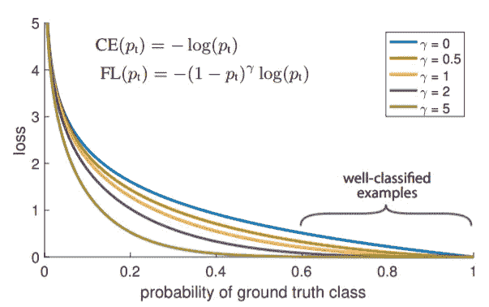
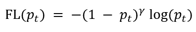

# RetinaNet:失焦之美

> 原文：<https://towardsdatascience.com/retinanet-the-beauty-of-focal-loss-e9ab132f2981?source=collection_archive---------22----------------------->

## 改变游戏的一阶段物体检测模型！

[Unsplash](https://unsplash.com/s/photos/retina?utm_source=unsplash&utm_medium=referral&utm_content=creditCopyText) 上 [Arteum.ro](https://unsplash.com/@arteum?utm_source=unsplash&utm_medium=referral&utm_content=creditCopyText) 拍摄的照片

对象检测已经成为众多领域应用的福音。因此，可以肯定地说，它比其他一些领域更值得研究。多年来，研究人员不懈地致力于改进对象检测算法，并成功地做到了这一点，以至于我无法将 5 年前的对象检测算法的性能指标与今天的进行比较。所以为了更全面的观点，我想建立一个我们如何到达这里的前提。

# 目标检测

图 1 —目标检测示例(照片由[莎伦·麦卡琴](https://www.pexels.com/@mccutcheon?utm_content=attributionCopyText&utm_medium=referral&utm_source=pexels)从[像素](https://www.pexels.com/photo/person-holding-siamese-cat-and-chihuahua-1909802/?utm_content=attributionCopyText&utm_medium=referral&utm_source=pexels)拍摄)

对象检测开始时是一个两阶段的实现，在第一阶段检测图像中的对象(定位)，在第二阶段对其进行分类(分类)。该过程的早期先驱是 RCNN 及其后续改进(快速 RCNN，更快 RCNN)。它们的实现是基于区域提议机制的，正是这种机制在后来的版本中得到了主要的改进。还有另一种物体检测方法，其中定位和分类在单个步骤中执行。尽管一些网络在早期阶段执行单级对象检测，例如 SSD(单次检测器)，但 YOLO 在 2016 年彻底改变了该领域。YOLO 能够用边界框定位物体，并立刻计算出它们的等级分数。由于其令人难以置信的速度，YOLO 是大多数实时应用程序的首选模型。沿着同样的思路，宗-林逸等人发表了一篇论文，“密集物体探测的[焦点损失](https://arxiv.org/abs/1708.02002)”，其中介绍了一种称为 RetinaNet 的探测器。它胜过当时市场上的所有其他型号。在深入 RetinaNet 的本质之前，我将讨论焦点丢失的概念。

# 焦点损失

焦点损失被设计为在密集检测器训练期间通过交叉熵损失观察到的类别不平衡的补救措施。我说的类别不平衡是指(或作者指的是)前景和背景类别的差异，通常是 1:1000 的比例。

图 2-交叉熵和焦损失之间的比较

暂且忽略公式吧。考虑γ = 0 的情况，对应交叉熵。如果你观察曲线，你会发现即使对于分类良好的例子，损失也不是微不足道的。现在，如果我加入阶级不平衡的问题，那里有大量的容易否定的东西，它倾向于压倒前景阶级。

为了解决这个问题，作者增加了一个可调聚焦参数的调制因子。因此，焦点损失的公式变为:

图 3 —焦点丢失(作者提供的图片)

如果你注意到，负项和对数项构成了交叉熵损失，γ代表可调参数。如果我考虑一个具有低概率 p_t 的错误分类样本，调制因子实际上是不变的，而如果概率 p_t 很高(容易分类)，那么损失函数将趋向于 0。从而降低容易分类的样本的权重。这就是聚焦损失如何区分易分类和难分类样本的。

最后，损失函数还有一个附加项，即平衡因子α。α对应于一个权重因子，该权重因子或者用反向类别频率计算，或者作为交叉验证优化变量。焦点损失公式现在变为:

图 4 —修改后的焦损失(作者提供的图片)

作者(通过实验)注意到焦点损失形式不需要精确。相反，有几种形式可以整合样本之间的差异。

# RetinaNet

RetinaNet 实际上是由一个主干网和两个特定任务子网组成的网络组合。主干网络是一个纯卷积网络，负责计算整个图像的卷积特征图。第一个子网对主干网的输出执行卷积分类，第二个子网对主干网的输出执行卷积包围盒回归。总体架构看起来非常简单，但作者调整了每个组件以改善结果。

## 特征金字塔网络主干

作者实现了由 T. Y. Lin 等人提出的特征金字塔网络(FPN)作为主干网络。FPN 通过横向连接实施自上而下的方法，提供了丰富的多尺度要素金字塔。对于 RetinaNet 来说，FPN 是建立在 ResNet 架构之上的。金字塔有 5 个等级，从 P₃到 P₇，其中分辨率可以计算为 2ˡ，其中 l 对应于金字塔等级，在本例中为 3 到 7。

图 5 —包含单个组件的 RetinaNet 架构

## 锚

RetinaNet 使用平移不变的锚盒，分别在 P₃到 P₇级别上具有从 32 到 512 的区域。为了加强更密集的覆盖范围，锚增加了{2⁰,2^(1/3),2^(2/3)}.的大小所以，每个金字塔等级有 9 个锚。每个锚被分配一个分类目标 K 的独热向量和一个盒回归目标的 4 向量。

## 分类子网

分类子网是附加到每个金字塔等级的 FCN，其参数在所有等级之间共享。考虑通道的数量 C 为 256，锚 A 为 9，分类目标的数量 K，特征图通过具有 C 滤波器的四个 3×3 conv 层馈送。这是继 ReLU 激活和另一个 3×3 conv 层，但与 K×A 过滤器的应用。最后，sigmoid 激活被附加到每个空间位置的 K×A 二元预测的输出。所以，最终输出变成(W，H，K×A)，其中 W 和 H 分别代表特征图的宽度和高度。为了获得更好的结果，作者在分类子网的参数不与回归子网共享的地方做了一点修改。

## 箱式回归子网

如果参考图 5，可以看到分类子网和回归子网同时接收到特征映射。因此，它们并行运行。对于回归，将另一个小 FCN 附加到每个金字塔等级，以回归从每个锚定框到附近地面实况对象(如果存在)的偏移。整个结构类似于分类子网，但区别在于输出不是 K×A，而是 4×A。具体数字“4”代表用于确定偏移量的参数，即中心坐标以及宽度和高度。对象分类子网和盒回归子网虽然共享一个公共结构，但使用不同的参数。

## 模型的整体流程

让我们取一个样本图像，并将其馈送给网络。第一站，FPN。在这里，图像将在不同的尺度(4 个级别)上进行处理，在每个级别上，它将输出一个特征图。每个级别的特征图将被提供给下一个组件包，即分类子网和回归子网。FPN 输出的每个特征图然后由分类子网处理，并且它输出具有形状(W，H，K×A)的张量。同样的，回归子网会处理特征图，会输出 a (W，H，4×A)。这两个输出被同时处理，并发送给损失函数。RetinaNet 中的多任务损失函数由用于分类的修正聚焦损失和基于回归子网产生的 4×A 通道向量计算的平滑 L1 损失组成。然后损失被反向传播。这就是模型的整体流程。接下来，让我们看看该模型与其他对象检测模型相比表现如何。

# 情况如何？

图 6 —结果对比

从上表可以明显看出，采用 ResNeXt-101 主干的 RetinaNet 优于之前提出的所有其他两级和一级模型。唯一有 0.9 错误的类别是大型对象的 AP。

# 我想实现 RetinaNet，我应该注意什么？

当然，每个问题陈述都是不同的，作者建议的一些参数可能不适合你。但是作者进行了严格的研究来获得这些最佳结果。所以，我觉得它们可以很好地解决一般问题，或者至少，它们可以作为一个基本参数集，用户可以进一步调整它们。

1.  γ = 2 在实践中工作良好，RetinaNet 对γ ∈ [0.5，5]相对鲁棒。分配给稀有类的权重α也有一个稳定的范围，但它与γ相互作用，因此必须同时选择两者。一般来说，当γ增加时，α应该稍微减少。对作者来说，最合适的构型是γ = 2，α = 0.25。
2.  使用 0.5 的交集(IoU)阈值将锚点分配给地面实况对象框；并且如果它们的 IoU 在[0，0.4]中，则返回到背景。由于每个锚点被分配给至多一个对象框，所以其长度 K 标签向量中的相应条目被设置为 1，而所有其他条目被设置为 0。如果锚点未被赋值(这可能发生在[0.4，0.5]中的重叠)，则它在训练期间被忽略。
3.  为了提高速度，在阈值检测器置信度为 0.05 之后，每个 FPN 级别仅解码来自至多 1k 最高得分预测的盒预测。来自所有级别的顶部预测被合并，并且应用阈值为 0.5 的非最大值抑制来产生最终检测。
4.  除了 RetinaNet 子网中的最后一个图层之外，所有新的 conv 图层都使用偏差 b = 0 和σ = 0.01 的高斯权重填充进行初始化。对于分类子网的最终 conv 层，偏置初始化被设置为 b = log((1π)/π)，其中π指定训练每个锚的开始应该被标记为置信度为τπ的前景。π的值在所有实验中都是 0.01。

# 摘要

总之，RetinaNet 在推出时对物体探测领域进行了重大改进。一级检测器优于两级检测器的想法是非常不现实的，但 RetinaNet 使其成为现实。从那时起，有许多新的算法被设计来进一步改进这些结果，随着我不断发现它们，我肯定会将它们记录到新的文章中。所以，敬请期待下一期！

我希望你喜欢我的文章，如果你想联系我:

1.  我的网站:[https://preeyonujboruah.tech/](https://preeyonujboruah.tech/)
2.  Github 简介:【https://github.com/preeyonuj 
3.  上一篇媒体文章:[https://towards data science . com/the-implications-of-information-theory-in-machine-learning-707132 a 750 e 7](/the-implications-of-information-theory-in-machine-learning-707132a750e7)
4.  领英简介:【www.linkedin.com/in/pb1807 

# 参考

[1]密集目标检测的焦损失—[https://open access . the CVF . com/content _ ICCV _ 2017/papers/Lin _ Focal _ Loss _ for _ ICCV _ 2017 _ paper . pdf](https://openaccess.thecvf.com/content_ICCV_2017/papers/Lin_Focal_Loss_for_ICCV_2017_paper.pdf)