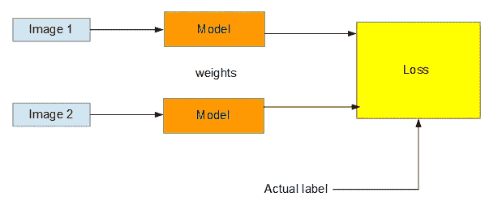
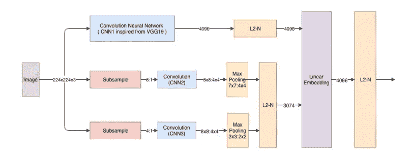
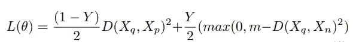
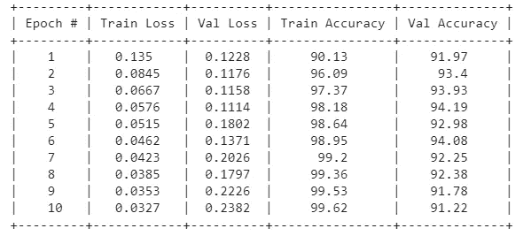
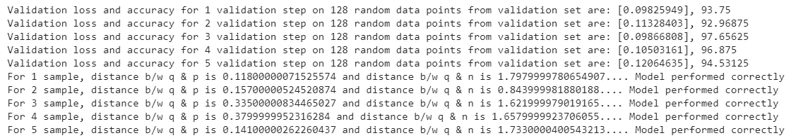
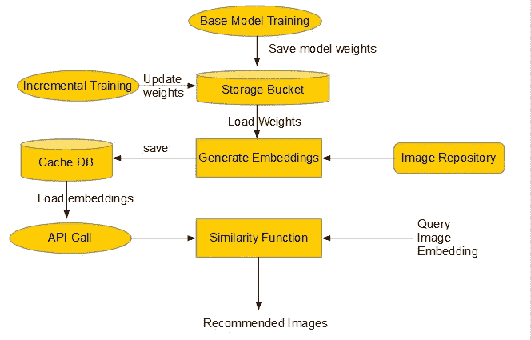

# 使用深度学习检索相似的电子商务图像

> 原文：<https://towardsdatascience.com/retrieving-similar-e-commerce-images-using-deep-learning-6d43ed05f46b?source=collection_archive---------21----------------------->

## 基于从多尺度卷积神经网络学习的嵌入生成图像推荐

***目录***
1。简介
2。商务问题
3。映射到深度学习问题
4。使用的数据集
5。模型架构
6。损失函数
7。实施概述
8。构建数据管道
9。定义模型架构
10。定义损失和精度功能
11。定义步进功能
12。最终流程
13。验证结果
14。了解部署
15。未来工作&结论
16。参考

1.  ***简介:*** 视觉推荐对于任何电子商务平台来说都是至关重要的功能。它赋予平台即时推荐与用户正在浏览的产品相似的产品的能力，从而抓住他/她的即时意图，这可能导致更高的客户参与度(CTR ),从而提高转化率。在这个案例研究中，我们试图实现一个研究工作，使用暹罗网络为核心检索类似的电子商务图像。为此，我们将按照下面的[论文](https://arxiv.org/pdf/1901.03546v1.pdf)重复所做的工作。我们将尽量只涵盖有助于我们理解和实现工作的重要部分。如果你不能把这些点联系起来，请随意阅读这篇论文。
2.  ***商业问题:*** 找到看起来与特定产品相似的产品是现代电子商务平台的重要特征。如果正确利用这些信息，可以提升用户体验和购买转化率。检索给定查询图像的相似电子商务图像可以用于各种场景。一个这样的场景可以是推荐相似的产品，相似性可以是在形状、颜色、图案等方面。所以，我们想建立一个系统，如果用户寻找一个特定类型的产品，得到类似产品的推荐。
3.  ***映射到深度学习问题:*** 如上所述，我们正在尝试使用从一幅图像中提取的特征来获取(推荐)与那幅图像相似的产品。我们可以通过多种方式来解决这个用例。一种这样的方法是使用多尺度连体网络来识别相似的图像。下图显示了一个简单的连体网络:



作者图片

在暹罗网络中，我们基本上传递 2 对图像，一对属于相似的图像，另一对属于不相似的图像。核心思想是模型基于图像的相似性和不相似性来学习权重。如果我们可以通过使用这样的架构生成嵌入来捕获细粒度的视觉细节。我们其实可以利用这些嵌入来推荐类似的产品。这项工作的主要贡献是一个由多尺度深度 CNN 组成的连体网络，它学习图像的 4096 维嵌入，以捕捉视觉相似性的概念。此外，我们需要确定损失函数，我们将使用对比损失来实现。给定一幅图像，我们将如何处理，首先我们将识别一幅相似的图像，然后是一幅不相似的图像。一旦我们有了这些图像。我们将把这些图像传递给我们的模型进行嵌入。那么这些嵌入将用于计算损失。基于损失值，我们将学习权重，直到我们达到收敛。模型性能将使用精确度来衡量。

**4。*使用的数据集:*** 对于这项工作，我们使用了三元组数据进行训练和验证。三元组数据由查询图像、正图像(类似于查询图像)和负图像(相对不同于作为正图像的查询图像)组成。查询图像可以是野生图像(人们在日常不受控制的设置中穿着衣服)或目录图像(模特在受控制的设置中穿着衣服，如电子商务应用程序中所示)。而正图像和负图像可以是类别内的(与查询图像相同的产品类别)或类别外的(不同于查询图像的其他产品类别)。本案例研究中使用的数据由论文作者在下面的[链接](https://console.cloud.google.com/storage/browser/fynd-open-source/research/MILDNet/)中提供。他们通过编程从 4 个不同的数据集生成了这些三元组。样本数据如下所示:


作者图片

**5。*模型架构:*** 实现了以下架构:



Img 资料来源:[https://arxiv.org/pdf/1901.03546.pdf](https://arxiv.org/pdf/1901.03546.pdf)

如已经示出的，暹罗网络包括两个具有共享权重的卷积神经网络，其在训练期间通过最小化损失函数而被优化。其工作原理是，网络将两幅图像作为输入，但我们有 2 对图像，第一对图像相似，第二对图像不相似。因此，对于任何一个查询(锚)图像，我们将有两个以上的图像与之相关联。一个是正像(相似)，另一个是负像(不相似)。一旦这些图像对被识别，我们通过网络将这些输入图像映射到嵌入空间。如果相似图像的嵌入距离很近，而不相似图像的嵌入距离很远，那么网络已经学习到了一个好的嵌入。
**了解架构的各个组成部分:**模型架构有多个部分。第一部分是深度 CNN。深度 CNN 在训练过程中很容易学会将强方差编码到它们的结构中，这使得它们在图像分类中取得了很好的性能。因此，对于这一部分，我们使用类似于 VGG19 的卷积神经网络的架构。该 CNN 用于编码强方差并捕获图像中存在的语义，因为它有 19 个卷积层。在 19 层中，顶层擅长编码图像特征的复杂表示。类似 CNN 的 VGG19 具有高的全向容量，因为它的 4096 维最终层允许网络有效地将信息编码到子空间中。
另外两个 CNN 使用较浅的网络架构来捕捉下采样图像。由于较浅的架构，这些 CNN 的方差较小，用于捕捉更简单的方面，如形状、图案和颜色，从而形成图像的视觉外观。
因此，使用三个不同的卷积神经网络代替单个 CNN，并使它们共享较低的层，使得每个 CNN 独立于其他两个。最后，来自三个卷积神经网络的嵌入被归一化并与 4096 维线性嵌入层组合，该嵌入层将输入图像编码并表示为 4096 维向量。为了防止过拟合，使用了 L2 归一化。

6. ***损失函数:*** 对比损失函数是基于距离的损失函数，与基于预测误差的损失函数相反。像任何其他基于距离的损失函数一样，它试图确保语义相似的例子紧密地嵌入在一起。
当相似图像对(标号 Y = 0)被输入网络时，下图的右侧加法部分无效，损失等于包含两个相似图像嵌入之间的正对距离的部分。因此，如果两个图像在视觉上相似，梯度下降减少了它们之间的距离，这是由网络学习的。
另一方面，当两个不同的图像(标签 Y = 1)被馈送到网络时，左边的加法部分消失，等式的剩余加法部分基本上作为铰链损失函数工作。如果图像对完全不相似，并且网络输出其接近度大于 m 的一对嵌入，则损失函数值最大化到零，否则如果图像有些相似，则当存在误差时，我们通过优化权重来触发接近度最小化。
m 值是阴性和阳性样本之间的分离界限，由经验决定。当 m 较大时，它会将不同的和相似的图像推得更远，从而充当边距。在这项工作中，我们使用 m = 1。



对比损失函数

7. ***实施概述:*** 研究工作的实际实施可以在[这里找到](https://github.com/gofynd/mildnet)。我们不会复制相同的代码，相反，我们将使用 TensorFlow 2 来实现这项工作，其中我们将使用 tf.data 创建输入管道，并且为了进行训练，我们将创建自定义的训练循环。

8. ***构建数据管道:*** 为了构建我们的输入管道，我们将使用 tf.data。数据集 API 允许您构建一个异步的、高度优化的数据管道，以防止您的 GPU 数据匮乏。它从磁盘加载数据(图像或文本)，应用优化的转换，创建批处理并将其发送到 GPU。以前的数据管道让 GPU 等待 CPU 加载数据，导致性能问题。部分官方资料来源: [API 文档](https://www.tensorflow.org/api_docs/python/tf/data)、[数据集快速入门](https://www.tensorflow.org/guide/datasets_for_estimators)、[程序员指南](https://www.tensorflow.org/guide/datasets)、[官方博客文章](https://developers.googleblog.com/2017/09/introducing-tensorflow-datasets.html)、[来自 tf.data 创建者的幻灯片](https://docs.google.com/presentation/d/16kHNtQslt-yuJ3w8GIx-eEH6t_AvFeQOchqGRFpAD7U/edit#slide=id.p)、 [Origin github 发布](https://github.com/tensorflow/tensorflow/issues/7951)、[Datasets API 的 Stackoverflow](https://stackoverflow.com/questions/tagged/tensorflow-datasets) 标签。
我们的第一个管道方法是获取图像路径，我们从读取输入文件(train/val/test)开始，这些文件包含我们的三元组信息，附加图像存在的实际路径，最后返回包含每个三元组图像完整路径的最终列表。

获取图像路径函数

然后，我们定义两个函数来处理完整的输入管道。这些功能是:

图像解析功能

输入管道

上面的函数使用 tf.data 来定义输入管道。在上面的实现中，我们从一个数组中读取输入文件名，该数组包含每个图像的输入文件路径的细节。然后我们把内容打乱读。然后，我们使用 input_parser 映射读取内容，以获得每个图像的特征向量，然后返回作为数据集对象的最终张量，该张量将在建模期间使用。

9. ***定义模型架构:*** 我们已经了解了什么是架构，所讨论的架构的代码实现是:

体系结构

10. ***定义损失和精度函数:*** 我们已经讨论过损失函数，下面代码是对比损失函数的损失实现。该函数计算一批图像的损失。对于一个批次，首先计算每对的损失值。一旦我们有了这个值，这个值就被加到最终损失上，然后损失通过除以 batch_size 的 2 倍来归一化。在损失等式中，标签 Y = 1 被分配给不同的或负的图像对，而 Y = 0 被分配给相似的或正的图像对。

损失实现

对于精确度函数，计算一个批次的精确度。如果 neg_dist > pos_dist，它通过批处理获取每个图像、batch_size 和迭代器的嵌入张量，给出值 1，否则给出值 0。它最终返回一个批次的最终精度。

11. ***定义阶跃函数:*** 到现在我们已经看到了数据管道函数、模型架构、损耗定义，现在是时候定义封装了网络前向和后向通路的阶跃函数了。为此，我们将使用[梯度胶带](https://www.tensorflow.org/api_docs/python/tf/GradientTape)。tf。GradientTape 允许我们跟踪张量流计算，并根据给定变量计算梯度。GradientTape 是 TensorFlow 2.0 中的一个全新功能，可用于 [**自动微分**](/automatic-differentiation-explained-b4ba8e60c2ad) 和 [**编写自定义训练循环**](https://www.pyimagesearch.com/2020/03/23/using-tensorflow-and-gradienttape-to-train-a-keras-model/) **。** GradientTape 可以用来编写定制的训练循环。

在我们的实现中，我们将使用两步功能，一步是训练步骤，另一步是验证步骤。训练步骤是进行实际训练的地方。在我们的例子中，由于我们正在处理三元组，对于一个批次，我们首先找到该批次中每个图像的嵌入，这样我们得到查询、正面和负面图像的嵌入。这种嵌入是使用已定义的模型架构生成的。有了这些数据后，我们将计算该批次的损耗和准确度，然后根据损耗，使用梯度带计算梯度。一旦我们有了这些梯度，我们就使用优化器对象来更新权重。代码实现:

训练步骤

tf.function decorator 用于使 TensorFlow 自动签名工作，并加速其内部操作的执行。当我们第一次调用@tf.function decorator 时，TensorFlow 会首先将它转换成图形，然后执行它，之后，当我们再次调用该函数时，它只会执行图形。验证步骤负责给出一个时期内每一步验证数据的验证损失和准确性。该函数使用模型(用更新的权重训练)来生成嵌入，并且基于这些嵌入，我们计算损失和准确度。

val 步骤

12. ***最终流程:*** 一旦定义了所有的帮助器函数，下一步就是定义最终的流程方法，它将负责创建定制训练，它有多个部分，我们将分解这些部分。
我们首先定义训练和验证 csv 文件的路径。完成后，我们生成两个列表，一个包含训练路径，另一个包含验证集路径。这个列表是通过调用 get_image_path()函数生成的。最后，我们使用 tf.metrics.Mean 测量训练丢失和训练准确性

```
train_csv_file = '/content/drive/My Drive/data/tops_train.csv'
cv_csv_file = '/content/drive/My Drive/data/tops_val.csv'
train_data_path = get_image_path(train_csv_file)
validation_data_path = get_image_path(cv_csv_file)
train_loss = tf.metrics.Mean(name="train_loss")
train_accuracy = tf.metrics.Mean(name="train_acc")
```

然后，我们将启用 GPU 的使用，然后开始我们的每个时代的流程。在 epoch 循环中，我们首先调用返回数据集对象的 input_pipeline()函数，然后将迭代器链接到这个函数。最后，我们开始逐步训练，步长等于数据点数// batch_size。完成后，我们将调用 step 函数进行训练，我们继续记录在一个时期内每一步训练中获得的分数，最后，当完成后，我们使用验证集来计算损失和准确性，并打印训练和验证的最终结果。模型权重也在每个历元后保存。我们还将分数写入 tensorboard，这可以使用以下代码完成:

```
with tf.name_scope("per_epoch_params"):
  with wtrain.as_default():
    tf.summary.scalar("loss", train_loss.result().numpy(), step=epoch)
    tf.summary.scalar("acc", train_accuracy.result().numpy(), step=epoch)
    wtrain.flush()
  with wval.as_default():
    tf.summary.scalar("loss", round(np.mean(np.array(val_loss)), 6), step=epoch)
    tf.summary.scalar("acc", round(np.mean(np.array(val_accuracy)), 2), step=epoch)
    wval.flush()
```

流程功能的全面实施:

流量函数

一旦我们所有的步骤都定义好了，我们就可以使用下面的代码调用整个流程:

主要功能

在运行 10 个时期后，在第 4 个时期看到了最好的结果，来自该时期的权重然后被用于在验证和测试集上检查模型性能。



培训结果

**结果:**我们在验证集上得到了 94.19 的准确率。

13. ***验证结果:*** 我们已经在验证集本身上定义了一个验证块，它取一批 128 张图像并返回一个分数。它进行 5 次迭代，图像随机取自验证集。除此之外，我们还采用了 5 组不同的三元组，看看模型是否能够正确识别相似的图像和不同的图像。代码实现:

验证块

这可以通过以下方式调用:

执行验证块

上述单元格的结果:



验证结果

14. ***了解部署:*** 整个架构可以使用以下流程进行部署:



作者图片

**基础模型训练:**这是我们在之前的笔记本中看到的部分，我们在那里建立一个管道，并根据可用的训练集进行全面训练，一旦完成，我们将最好的模型重量保存到一个存储桶中(例如:S3)。
在进行增量训练之后，更新的模型权重再次存储在存储桶中。
**生成嵌入:**一旦我们的训练完成，我们就可以生成我们数据存储库中所有图像的嵌入，为此我们需要首先从数据存储库中加载所有图像，并加载模型权重，然后基于此生成最终嵌入。

colab 中使用了以下函数来描述部署:

对于任何查询图像，调用该函数来生成对应于该图像的嵌入…

输入管道函数使用此函数来映射图像路径，并将它们转换为表示图像的张量

这是我们的输入管道函数，它实际上读取所有图像路径，并用于最终为图像库中已经存在的所有图像生成嵌入

在上面的单元格中，我们首先定义图像出现的路径，然后生成 2 个列表，一个用于查询，其余的用于图像。一旦完成，我们正在加载最佳模型的重量。然后，由于内存问题，我们通过批量大小为 128 个图像的数据集进行迭代，以生成大小为 28，4096 的张量。最后，我们将所有这些张量连接起来，以嵌入图像库中的所有图像。

以上代码是余弦相似性的简单实现，当给定两幅图像的嵌入时，这将返回这些图像有多相似，值越高，图像越相似。

上述函数用于查找查询图像的前 n 个相似图像。给定一个基于余弦相似性的图像，它会给出该图像的索引和它与该查询图像的得分，最后根据 k 的值，它会返回与基于图像嵌入之间余弦相似性的查询图像相似的前 k 个图像。

在上面所有图像的单元格中，我们实际上找到了前 10 个 NN，并将结果存储在最终列表中。测试样品上看到的结果:


作者图片


作者图片

15. ***未来作品&*** ***结论:*** 以上结果是在亚马逊一些报废的 16k 图片上。这些建议似乎不错，我们可以通过增强图像来进一步提高性能。整个实现分为 3 个部分。一个简单的 EDA 上的数据，我们有，培训实施和推理(部署步骤)。你可以在这里找到完整的代码。

16. ***参考文献:***

[https://www.appliedaicourse.com/](https://www.appliedaicourse.com/)[https://arxiv.org/pdf/1901.03546v1.pdf](https://arxiv.org/pdf/1901.03546v1.pdf)
[https://medium . com/predict/face-recognition-from-scratch-using-siamese-networks-and-tensor flow-df 03 e 32 F8 CD 0](https://medium.com/predict/face-recognition-from-scratch-using-siamese-networks-and-tensorflow-df03e32f8cd0)
[https://cs230.stanford.edu/blog/datapipeline/](https://cs230.stanford.edu/blog/datapipeline/)
[https://www . Sri Jan . net/blog/building-a-high-performance-data-pipeline-with-tensor flow](https://www.srijan.net/blog/building-a-high-performance-data-pipeline-with-tensorflow)

*你也可以在**[***Linkedin***](https://www.linkedin.com/in/abhishek-khatri-88485848/)**和*[***Github***](https://github.com/khatria)***上找到并与我联系。*** 作品到此结束，感谢阅读！**