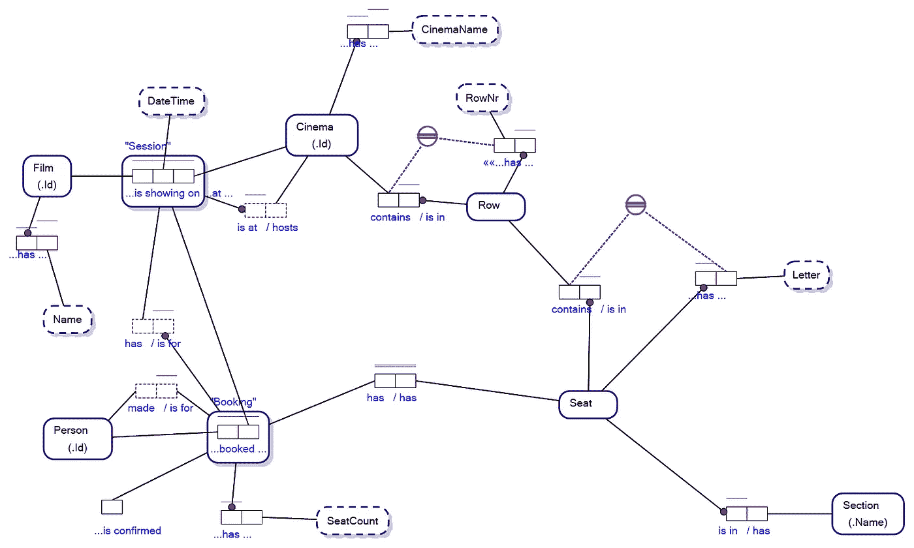

# 自然语言查询中的返回子句

> 原文：<https://towardsdatascience.com/return-clauses-in-natural-language-queries-74a4a2fd53e6?source=collection_archive---------26----------------------->

## 将 openCypher 的元素整合到 FEQL (FactEngine 查询语言)中

包含 RETURN 子句的 FEQL 查询。图片作者。

FactEngine 是一个从根本上重新思考如何从概念上定义、查看和查询数据库的计划。重点是利用[对象-角色建模](/why-learn-object-role-modelling-4eebd93dcda2)主干在知识图上提供自然语言查询。典型的 FactEngine 查询如下所示:

典型的事实引擎查询。图片作者。

为了实现查询编写的相对简单性， [FactEngine 架构](/the-factengine-architecture-6d90ac09b8b8)首先要求数据库模式(或者是图形，或者是物理层的关系)被定义为对象-角色模型。

为了证明这一点，我通常会查看一个影院预订数据库的概念模型:

点击放大。ORM 图表示例。电影院预订模式。图片作者。

在[的一篇早期文章](/what-is-a-graph-database-249cd7fdf24d)中，我描述了同一个模式如何被视为一个图表或关系模式，对于外行来说，这看起来像是意大利面条出错了:

属性图和实体关系图之间的态射。图片作者。

论文的关键在于，当使用对象-角色模型覆盖时，关系数据库可以像图形数据库一样用自然语言查询；这是通过尊重图形和关系数据库之间的形态来实现的。

## 但是有一个小问题

自然语言查询是理想化的，但是处理自然语言查询的软件可能非常难以编写，有时需要使用机器学习的黑魔法式编程来解释自然语言。

机器学习类型安排的问题是，它们没有覆盖超出其训练范围的大量可感知的用例，并且需要就如何处理它们覆盖的用例进行训练。

相比之下，像 SQL 和 openCypher 这样的数据库查询语言，它们的语法可以清晰地表达几乎任何您想对数据库提出的查询。

在我看来，需要使用机器学习来处理自然语言查询是不对的，所以 FactEngine 没有使用任何机器学习，只是一种受控的自然语言，凭借模式本身来适应所研究的模式。在这种程度上，查询语言更接近于新兴的图形查询语言标准。

## FEQL(事实引擎查询语言)中的返回类型查询

作为所面临问题的一个例子，最明显的莫过于对我们的影院预订模式提出以下问题:

> "每个电影院的每个区域有多少个座位？"

所有形式的机器学习和复杂的试探法都需要将该查询转换为对我们的影院预订模式的机器可解释的查询。

FactEngine 摒弃了令人费解的试探法，而是提供了一种受控的自然语言。

为了获得这个示例的结果，FactEngine 借鉴了新兴的图形查询标准，将 RETURN 子句放在查询的自然语言部分下面…首先询问每个电影院的每个区域有哪些座位，然后返回所需的信息和数量，如下所示:

这感觉有点像作弊，将 SQL 和标准化图形查询语言的元素合并到基于自然语言的查询语言中，但这足够直观，对于熟悉 SQL 和一般图形查询语言的人来说会很自然。

## 两全其美

为什么要对数据库进行自然语言查询？嗯，因为我甚至不能用 Cypher、 [openCypher](https://opencypher.org/) 或 [GQL](https://www.gqlstandards.org/) 编写上面的查询……我懒得学习语法。受控自然语言查询非常容易编写和理解，以至于用自然语言编写的图形查询的好处远远超过了编程工作，最终结果是易于使用和理解……依我看。

在我看来，到目前为止，在数据库上引入自然语言查询的努力是如此复杂和做作，以至于它们似乎永远也不会推向市场，也不会迷失在研究的好奇世界中。我更希望有一门容易理解和实际可用的语言，而不是沉溺于假设和可能的世界。虽然我为研究努力喝彩，但我最深切的感受是，需要有一个分界点，在这里你可以说，“已经够了。我们可以尝试解决世界上的所有问题，或者用一种不那么理想化的方法，推出一些在现实世界中实际可用的东西”。

因此，FEQL 现在包含了一个 RETURN 子句，非常像您所熟悉的图形查询语言，同时尽可能地保留了自然语言查询的理想主义。"每个电影院的每个区域有多少个座位？"可以等到机器学习的努力赶上来。

感谢阅读。如果时间允许，我会写更多关于自然语言查询、对象-角色建模、图形查询和概念建模的文章。

【https://github.com/cjheath/activefacts】NB 本文中表达的模型是 DataConstellation 的原始版权的衍生，正如之前在 GitHub 上的 ActiveFacts 项目下分享的:

— — — — — —结束— — —