# 重复使用纸质过滤器冲浓缩咖啡

> 原文：<https://towardsdatascience.com/reusing-paper-filters-for-espresso-ef1899ae2b35?source=collection_archive---------41----------------------->

## 咖啡数据科学

## 高级滤纸理论第三部分

之前，我已经讨论过纸质过滤器如何影响[流量](https://link.medium.com/4Qha82BrCcb)以及将它们[切割成合适的尺寸](https://link.medium.com/fVPJ3ICrCcb)对它们的效率有多重要。在这篇文章中，我将回答今天的重要问题:我能有多懒？对于浓缩咖啡，我可以使用任意一款[纸质过滤器](https://link.medium.com/JX3yCHHrCcb)多少次？

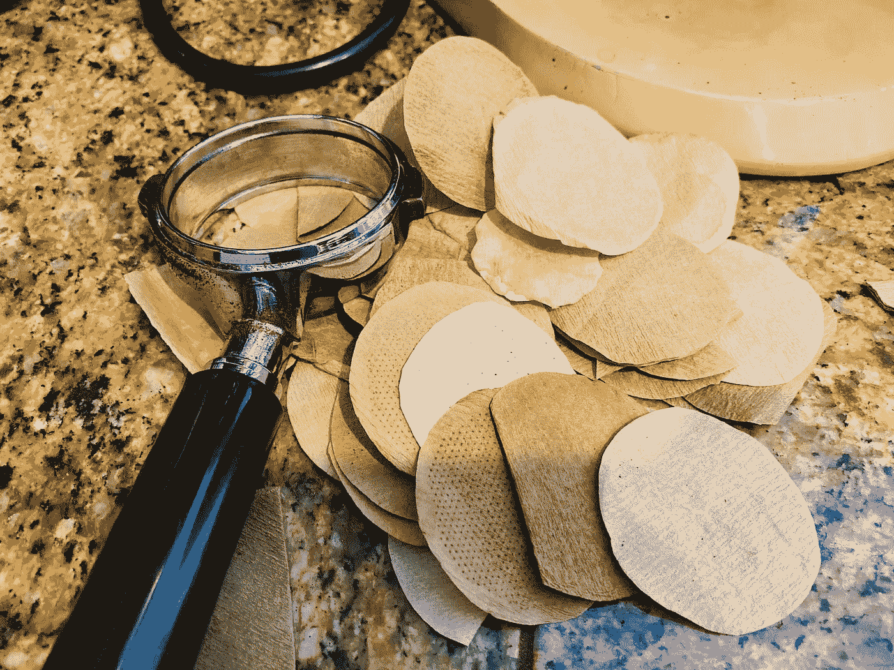

我将在几个月的时间里从统计的角度来看这个问题，以及一些与底部过滤器相关的精确例子。

在顶部使用纸质过滤器可以重复使用很多次，但我的机器在顶部使用过滤器时表现更差。对于底部过滤器，一次性使用是最好的，或者在正确的清洗后使用。在这种情况下，第二次使用是非常引人注目的。对于中间的过滤器，似乎在 4 到 6 之间的某处使用它是最佳的。这在进行[断续捣固](https://link.medium.com/juHgDbQrCcb)或[断续浓缩](https://link.medium.com/sYiO6NLrCcb)时使用。

# 镜头性能指标

我将这些定义放在这里，因为在这一节之后，我将使用这些指标评估不同数量的纸质过滤器。

我使用了两个指标来评估镜头之间的差异:[最终得分](https://link.medium.com/uzbzVt7Db7)和[咖啡萃取](https://link.medium.com/EhlakB9Db7)。

最终得分是 7 个指标(强烈、浓郁、糖浆、甜味、酸味、苦味和余味)记分卡的平均值。当然，这些分数是主观的，但它们符合我的口味，帮助我提高了我的拍摄水平。分数有一些变化。我的目标是保持每个指标的一致性，但有时粒度很难，会影响最终得分。

使用折射仪测量总溶解固体(TDS ),该数字用于确定提取到杯中的咖啡的百分比，并结合一杯咖啡的输出重量和咖啡的输入重量，称为提取率(EY)。

# 纸时代

我重复使用我的过滤器，因为切割它们需要时间，如果没有必要，我也不喜欢浪费。我还记录了每个过滤器的使用时间(即使用了多少次)。所以年龄 1 是一个新的过滤器。然后我看了一些标准的性能指标。

从最终得分来看，味道似乎略有下降。对于 EY 和 TDS，在使用 6 次左右后有明显的下降。

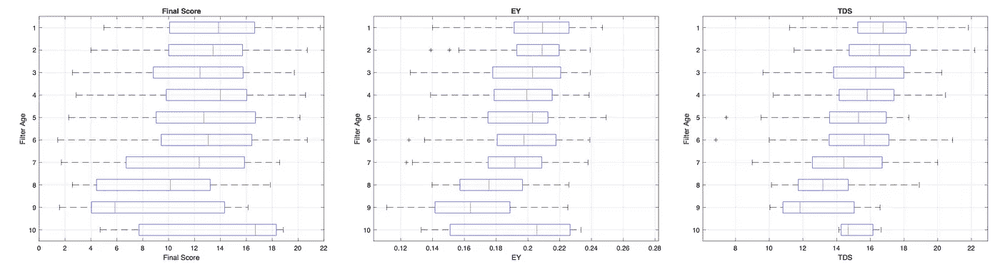

所有图片由作者提供

年龄并不影响纸张重量，所以剩余的固体量很少，但它们有影响。

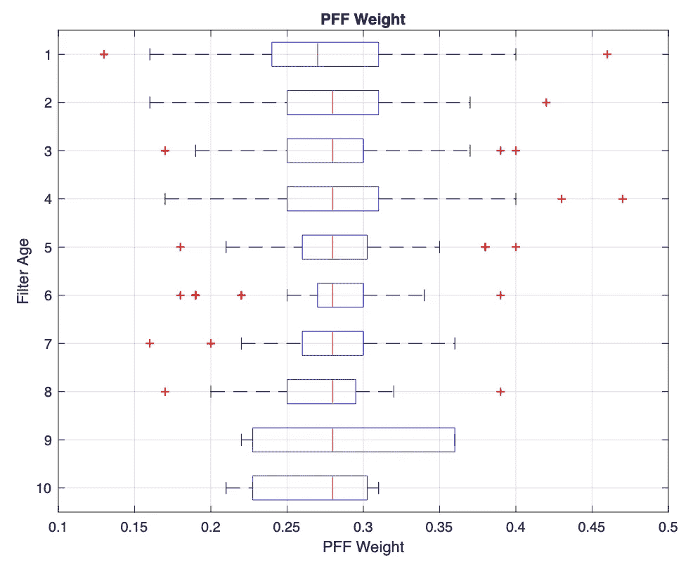

对覆盖过滤器的时间(TCF)和总时间也有影响。 [TCF 是一个很好的流量指标](https://link.medium.com/X3ttbW3rCcb)，但在这个图表中，这个变量并没有完全与烘焙时间分开。

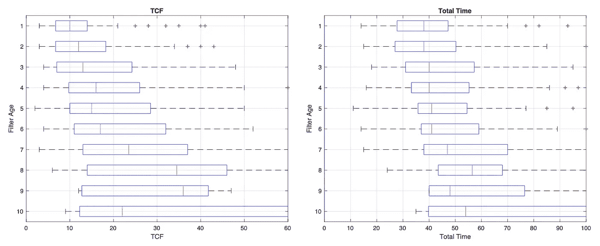

我将 TDS 和 EY 在控制图中与所有数据进行了比较，然后是新的、有点新的和旧的数据。

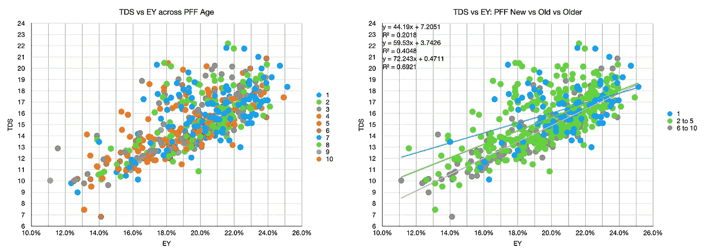

在这些图表中似乎没有太多的分离。所以我用平均值来总结数据。

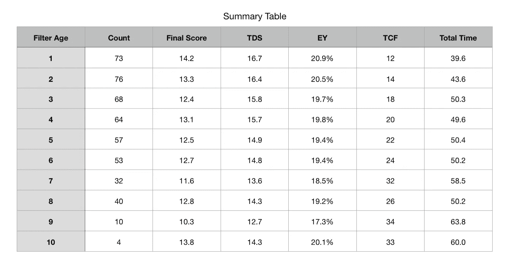

可以对这些数据进行总结，从平均值来看，趋势似乎很明显。

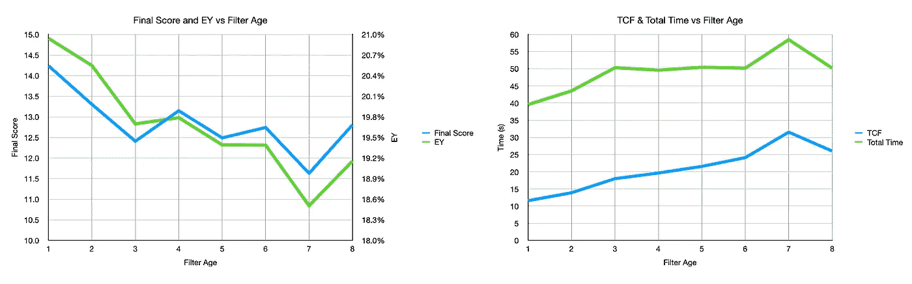

首选是使用新的过滤器或适当清洁的过滤器。

# 不要重复使用底部过滤器

底部过滤器只能使用一次。不管什么原因，都清理不干净不堵。我开始用一个是因为一些高难度的烘焙，一旦发现这个事实，我就改只用新鲜的。在这个测试中，我使用了一次过滤器，冲洗它，让它干燥，并再次使用它与所有其他拍摄参数相同。

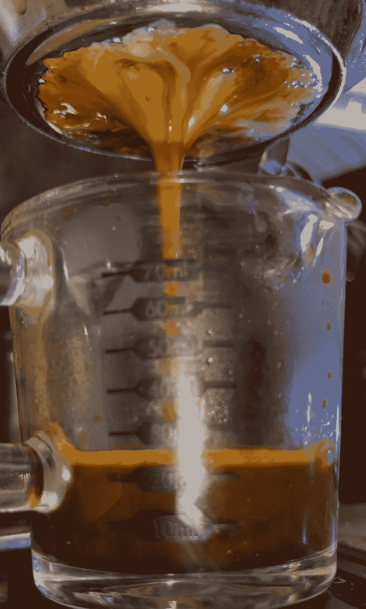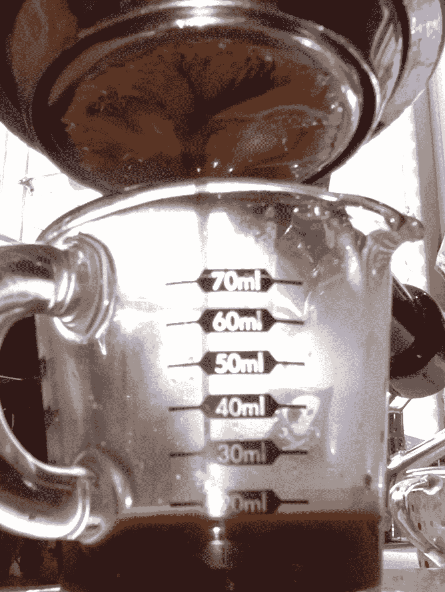

左是第一次使用，右是第二次使用

这种差异在球后分析中尤其明显。较暗的点表示由于其他地方的通道流动缓慢。冰球的上半部分是一个轻得多的夯实，所以如果它均匀地分崩离析，这通常表明更均匀和更好的提取。在这种情况下，这是第一次使用过滤器。第二次，顶层有更大的团块，特别是在中间，这表明没有发生足够的提取。

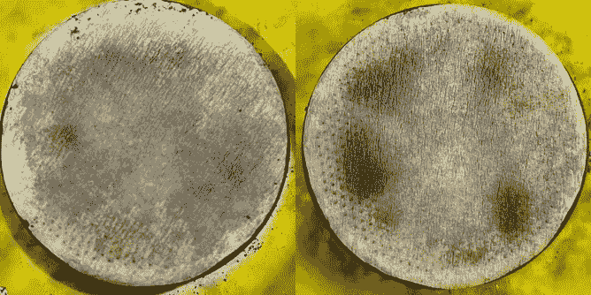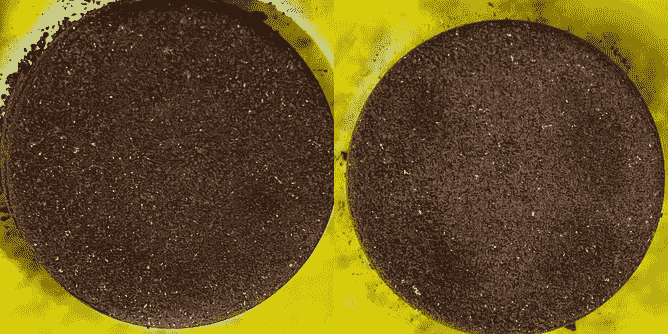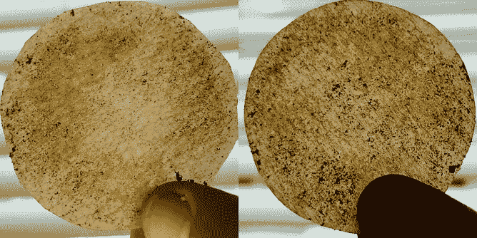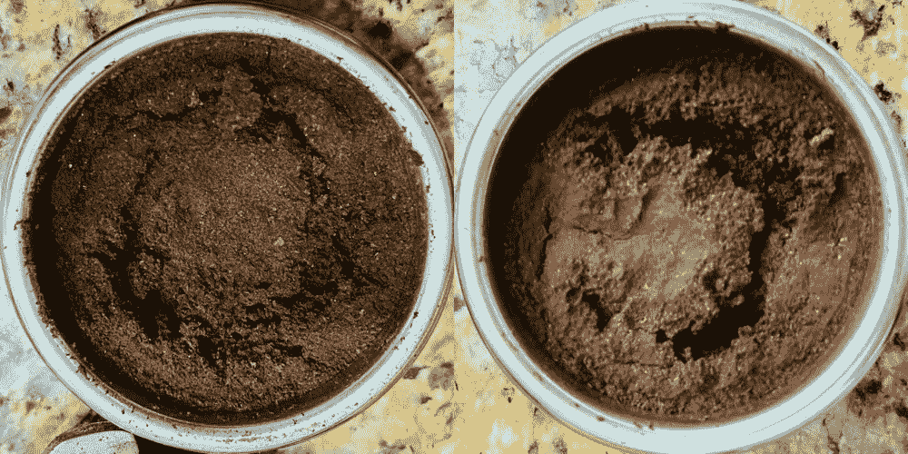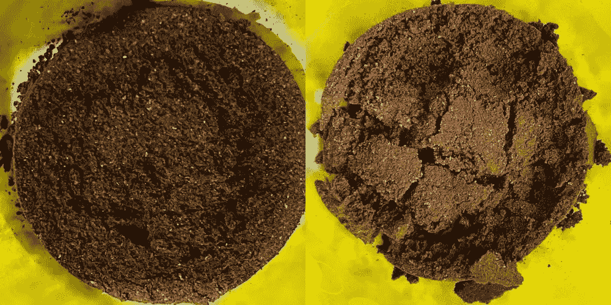

左图是第一次使用底部的纸质过滤器，右图是第二次使用相同的纸质过滤器。

我们可以看看镜头的流速，很明显曾经用过的新 vs 差别很大。流速慢了很多。作为参考，预注入为 45 秒，流量的抖动是由于[压力脉动](https://link.medium.com/Iske1ZpsCcb)造成的。

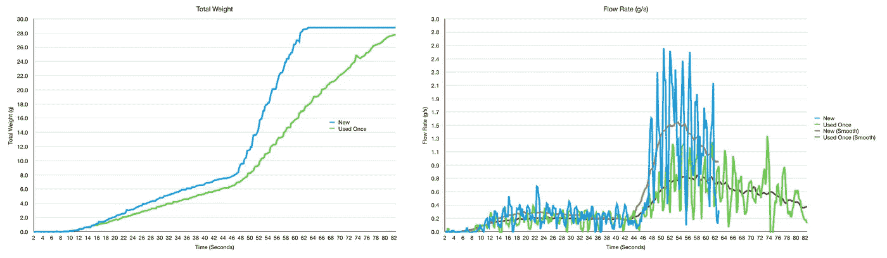

当我们观察平滑流速时，预输注期间的峰值较低，然后变得更加恒定。输液也是如此。蓝线更能代表真正好的照片的样子。

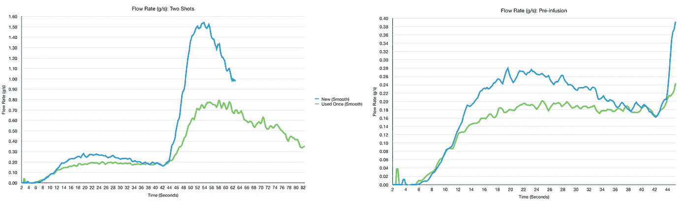

新的过滤器具有更高的 TDS、EY 和味道。这表明一些咖啡残留在过滤器中，甚至在冲洗后仍然限制流动。

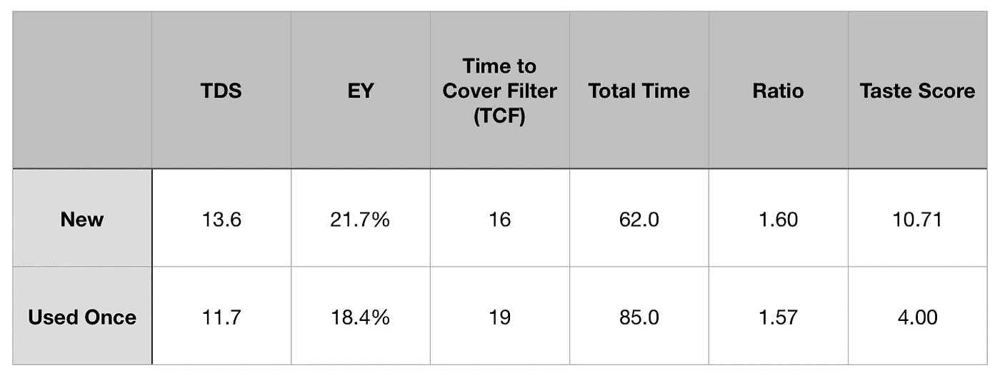

这让我想知道当过滤器用肥皂清洗并重复使用时会发生什么。

# 清洁纸质过滤器

我想看看我是否能清洁纸质过滤器，尽管许多人建议我使用新的。我不重复使用纸质过滤器的问题归结于成本、浪费和时间。通过清洗它们，我可以在这三个方面节省自己，因为批量清洗比单独切割更快。

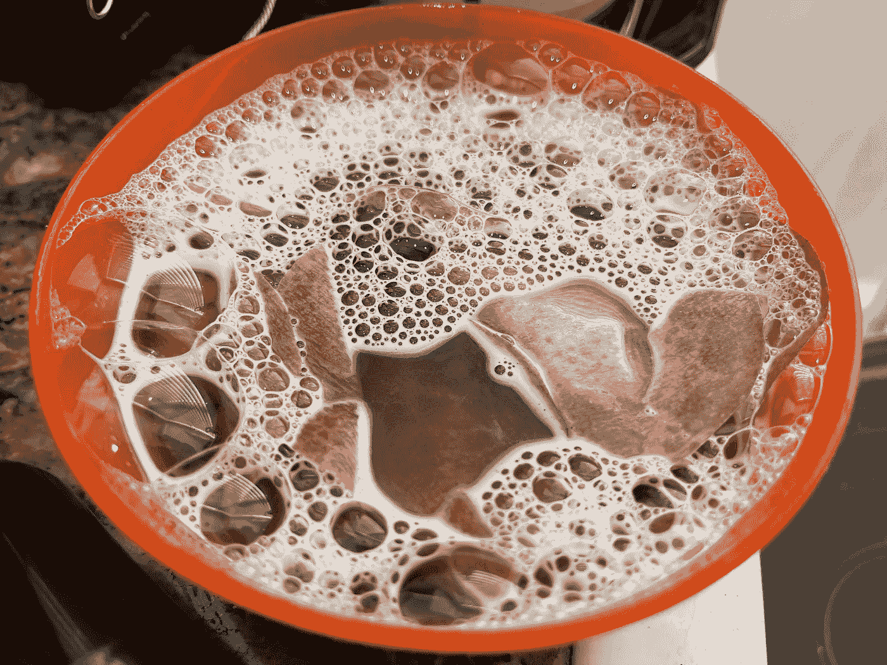

以前，我只冲洗过过滤器。然后我试着用肥皂和水，这比重复使用过滤器要好。然而，它没有使用新的过滤器好。

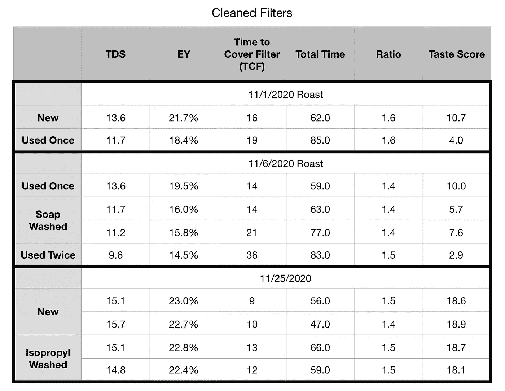

然后我试了异丙醇。那似乎起了作用！结果与新过滤器如此相似，以至于很难区分味道和提取率。

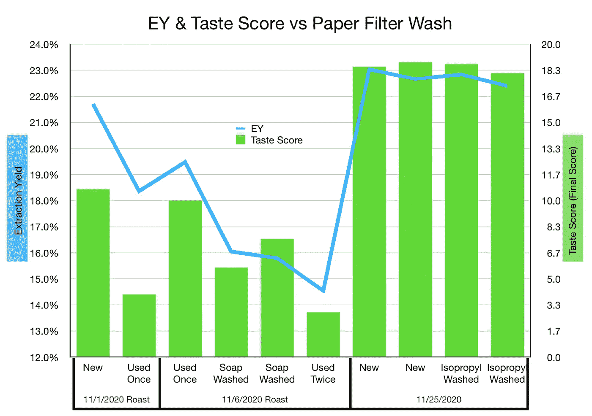

这项研究极大地影响了我的行为，因为它把数字放到了一个不太为人理解的技术上。我现在已经改用新的纸质过滤器或异丙基水洗过滤器，它帮助我保持了一致性，拍出了优秀的照片。

此外，在撰写这一系列文章时，我决定再看看布料过滤器，我已经在一个断续的夯实镜头中将中间的过滤器切换为布料过滤器。这极大地改变了流动和拍摄，所以我也决定看看其他材料的咖啡中间或底部的这一层。我对更好的投篮和技术感兴趣，但更重要的是，我很想更好地了解冰球内部的一切是如何运作的。

如果你愿意，可以在 Twitter 和 YouTube 上关注我，我会在那里发布不同机器上的浓缩咖啡视频和浓缩咖啡相关的东西。你也可以在 [LinkedIn](https://www.linkedin.com/in/robert-mckeon-aloe-01581595?source=post_page---------------------------) 上找到我。也可以关注我[中](https://towardsdatascience.com/@rmckeon/follow)。

# 我的进一步阅读:

[使用模式识别比较咖啡](/comparing-coffee-using-pattern-recognition-35b92cca4502)

[咖啡数据回顾:等级和口味](https://link.medium.com/1lDMQUH0Hbb)

[按地区、工艺、等级和价格分类的咖啡](/coffees-by-region-process-grade-and-price-7e17c3c44baf)

[家庭烘焙咖啡的经济学](/the-economics-of-home-roasting-coffee-93003ea31ee8)

[咖啡豆脱气](/coffee-bean-degassing-d747c8a9d4c9)

[解构咖啡:分割烘焙、研磨和分层以获得更好的浓缩咖啡](/deconstructed-coffee-split-roasting-grinding-and-layering-for-better-espresso-fd408c1ac535)

[浓缩咖啡的预浸:更好的浓缩咖啡的视觉提示](/pre-infusion-for-espresso-visual-cues-for-better-espresso-c23b2542152e)

[咖啡的形状](/the-shape-of-coffee-fa87d3a67752)

[搅拌还是旋转:更好的浓缩咖啡体验](https://towardsdatascience.com/p/8cf623ea27ef)

[香辣意式浓缩咖啡:热磨，冷捣以获得更好的咖啡](/spicy-espresso-grind-hot-tamp-cold-36bb547211ef)

[断续浓缩咖啡:提升浓缩咖啡](https://link.medium.com/vmI2zVeQabb)

[用纸质过滤器改进浓缩咖啡](/the-impact-of-paper-filters-on-espresso-cfaf6e047456)

[浓缩咖啡中咖啡的溶解度:初步研究](/coffee-solubility-in-espresso-an-initial-study-88f78a432e2c)

[断奏捣固:不用筛子改进浓缩咖啡](/staccato-tamping-improving-espresso-without-a-sifter-b22de5db28f6)

[浓缩咖啡模拟:计算机模型的第一步](https://towardsdatascience.com/@rmckeon/espresso-simulation-first-steps-in-computer-models-56e06fc9a13c)

[更好的浓缩咖啡压力脉动](/pressure-pulsing-for-better-espresso-62f09362211d)

[咖啡数据表](https://towardsdatascience.com/@rmckeon/coffee-data-sheet-d95fd241e7f6)