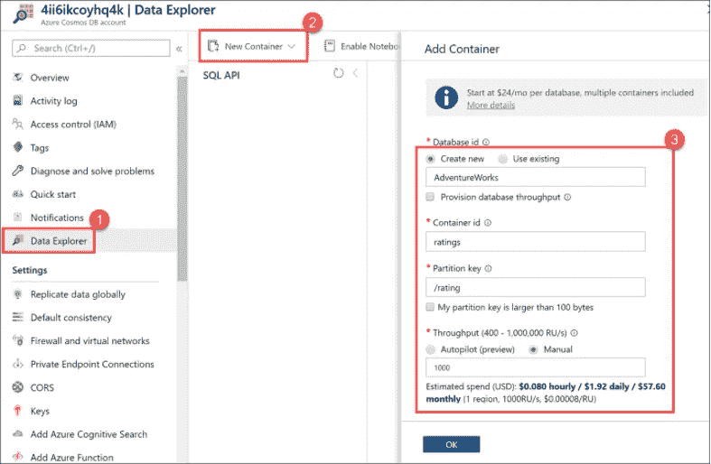
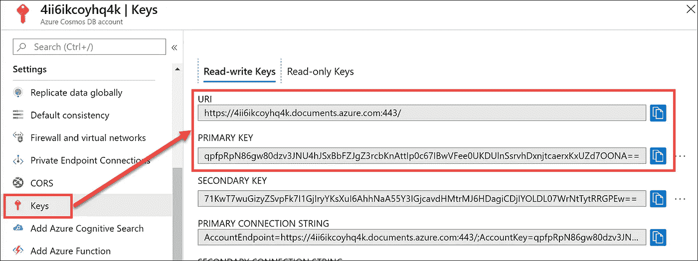
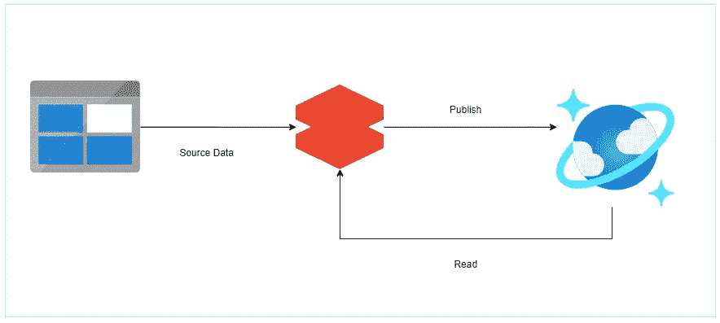
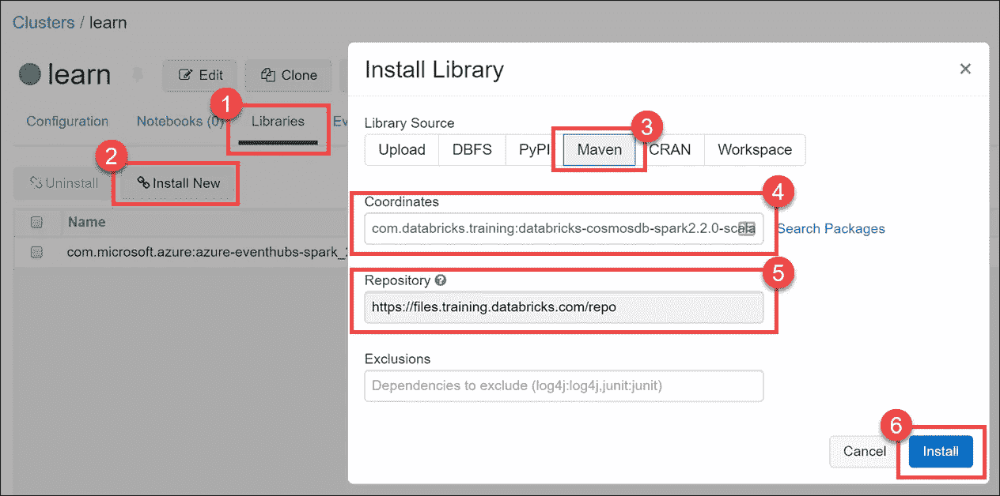
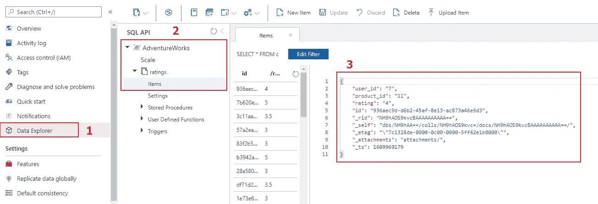

# 揭示:一种简单得可笑的将 Azure Cosmos DB 与 Azure Databricks 集成的方法

> 原文：<https://towardsdatascience.com/revealed-a-ridiculously-easy-way-to-integrate-azure-cosmos-db-with-azure-databricks-4314cce0259b?source=collection_archive---------10----------------------->

## Azure Cosmos DB 的简单 3 步数据块教程


由 [Unsplash](https://unsplash.com/s/photos/universe?utm_source=unsplash&utm_medium=referral&utm_content=creditCopyText) 上 [Greg Rakozy](https://unsplash.com/@grakozy?utm_source=unsplash&utm_medium=referral&utm_content=creditCopyText) 拍摄的照片

巴迪，我们的数据工程师新手，最近发现了[在 Databricks](/spark-essentials-how-to-read-and-write-data-with-pyspark-5c45e29227cd) 中读写文件的终极备忘单，现在正在 Azure 世界中升级。

在本文中，您将发现如何无缝集成 **Azure Cosmos DB** 和 **Azure Databricks** 。Azure Cosmos DB 是 Azure 云平台中的一项关键服务，它为现代应用程序提供了一个类似 NoSQL 的数据库。

作为一名数据工程师或数据科学家，您可能希望使用 Azure Cosmos DB 来提供使用 Azure Databricks 建模和准备的数据，或者您可能希望使用 Databricks 来分析 Azure Cosmos DB 中已经存在的数据。无论你的目的是什么，只要遵循这个 3 步指南就可以开始了。

## Azure Cosmos DB 是什么？

对于外行人来说， [Azure Cosmos DB](https://docs.microsoft.com/en-us/azure/cosmos-db/introduction) 是名副其实的微软多模型数据库，可以在全球范围内管理数据。它和它的对手 [**AWS DynamoDB**](https://docs.aws.amazon.com/amazondynamodb/latest/developerguide/Introduction.html) 一样属于“NoSQL 数据库即服务”栈。

在 Cosmos DB 中，每一项数据都存储在与模式无关的容器中，这意味着您不需要遵循任何特定的数据模式。

Cosmos DB 支持多模型 API，如 MongoDB、Cassandra API、Gremlin API 和默认的核心 SQL API。

核心 SQL API 为您提供了类似 JSON 的 NoSQL 文档库，您可以使用类似 SQL 的语言轻松查询它。

尽管 Cosmos DB 有着花哨的名字和强大的功能，但它基本上是一个数据存储，一个我们可以读写的数据存储。

通过与大量 Azure 服务的无缝集成， [Azure Databricks](https://docs.microsoft.com/en-us/azure/databricks/scenarios/what-is-azure-databricks) 正是这项工作的合适工具。

> 为了执行这个练习，您必须拥有一个运行着 Cosmos DB 和 Databricks 服务的 Azure 订阅。如果您没有，请按照下面的步骤获得它并免费创建服务！

如果您已经有 Azure 订阅，请跳到下一部分。

**如果你没有 Azure 订阅**在这里获得一个[免费试用版，这很容易，不到两分钟。(您需要提供您的信用卡信息，但不要担心您不会被收取任何费用)](https://azure.microsoft.com/en-us/free/)

现在，我们只需要一个 Cosmos DB 帐户和一个 Databricks 工作区。

## 如何创建 Azure Cosmos DB？

微软使用快速入门模板让在 Azure 上部署服务变得越来越容易。

按照快速入门模板的链接到[部署 Azure Cosmos DB](https://github.com/Azure/azure-quickstart-templates/tree/master/101-cosmosdb-create-account) ，点击**部署到 Azure，**这将在浏览器上打开 Azure 门户。查看步骤并创建您的服务。在你喝下一杯咖啡之前，Cosmos DB 帐户就会准备好

创建帐户后，您需要创建一个数据库和一个容器来存储您的数据。按照下面的示例创建一个名为 AdventureWorks 的数据库和一个名为 ratings 的容器。

导航到您部署的 Cosmos DB 帐户，点击**数据浏览器** → **新容器** →命名您的数据库**AdventureWorks**→您的容器**评级** →分区键为**/评级→** 选择**吞吐量手册**并将其设置为 1000。



来自[微软文档](https://docs.microsoft.com/en-us/learn/modules/integrate-azure-databricks-other-azure-services/1-introduction)的插图

最后一步是从 Keys 部分复制 Azure-Cosmos DB 读写密钥，如下所示。您将需要这个来验证您的 Databricks 工作空间，以访问 Cosmos DB 帐户。



来自[微软文档](https://docs.microsoft.com/en-us/learn/modules/integrate-azure-databricks-other-azure-services/1-introduction)的插图

## 如何创建 Azure Databricks workspace？

类似地，通过下面的链接[部署 Azure Databricks workspace](https://github.com/Azure/azure-quickstart-templates/tree/master/101-databricks-workspace) 。一旦部署了工作空间，您需要做的就是创建一个集群。

导航到您的 Databricks 工作区，在左侧选择 Clusters，并创建一个新集群(选择 Scala 2.11 版本，这是支持我们接下来将安装的 cosmosdb 库的版本)。选择集群模式作为标准模式(如果标准集群出现任何问题，请尝试单节点)。

> 哇，这比超速罚单还快！

## **简单的 3 步指南**

1.  在你的 Databricks 集群上安装最新的 azure-cosmosdb-spark 库。
2.  使用 Spark 连接器将数据写入 Cosmos DB。
3.  使用 Spark 连接器从 Cosmos DB 读取数据。



Cosmos DB Azure Databricks 模式(图片由作者提供)

## 如何安装 cosmosdb 库？

步骤 1:初始设置和安装。

在左侧导航中，转到您的**集群**，并选择您创建的集群。如果它没有运行，现在就启动它。

选择**库**选项卡，并选择**安装新的**。在安装对话框下，选择 Maven 并插入以下内容:

坐标:`com.databricks.training:databricks-cosmosdb-spark2.2.0-scala2.11:1.0.0`

知识库:`https://files.training.databricks.com/repo`

注意:目前支持带有 [Scala 2.11 的 Databricks 运行时版本](https://docs.microsoft.com/en-gb/azure/cosmos-db/spark-connector#bk_working_with_connector)，因此请确保您的集群运行的是 Scala 2.11 版本。



来自[微软文档](https://docs.microsoft.com/en-us/learn/modules/integrate-azure-databricks-other-azure-services/1-introduction)的插图

## 如何向 Azure Cosmos DB 写入/发布数据？

步骤 2:将数据写入 Azure Cosmos DB

为了将数据写入 Azure Cosmos DB，我们需要准备一个配置，告诉 Spark 如何连接和验证 Cosmos 容器。

```
URI = "cosmos-db-uri"
PrimaryKey = "your-cosmos-db-key"CosmosDatabase = "AdventureWorks"
CosmosCollection = "ratings"writeConfig = {
  "Endpoint": URI,
  "Masterkey": PrimaryKey,
  "Database": CosmosDatabase,
  "Collection": CosmosCollection,
  "writingBatchSize":"1000",
  "Upsert": "true"
}
```

在新笔记本中，创建上述配置变量。 **URI** 和 **PrimaryKey** 是我们之前从你的 Azure Cosmos DB 帐户的 **Keys** 部分复制的值。

现在我们只需要一些数据。将评级样本 csv 文件(从 [GitHub 这里](https://github.com/xavier211192/Apache-Spark/blob/main/Cosmos%20DB/ratings.csv)下载)上传到您的 Databricks 工作区。

```
ratingsDF = spark.read.format("csv")\
            .option("header","true")\
            .load("/FileStore/tables/ratings.csv")
```

上述命令将一个包含 100 行的示例 ratings csv 文件读入 dataframe。

```
(ratingsDF.write
  .mode("overwrite")
  .format("com.microsoft.azure.cosmosdb.spark")
  .options(**writeConfig)
  .save())
```

最后，上面的命令使用 Spark DataFrame writer 将数据推入我们的 Cosmos DB 容器。

通过进入 Cosmos DB 帐户→ **数据浏览器**→**AdventureWorks**→**ratings**，验证数据确实在您的 Cosmos DB 容器中。



> 那是轻而易举的事！

## 如何从 Azure Cosmos DB 读取数据？

步骤 3:从 Databricks 中查询 Azure Cosmos DB 中的数据

在这一步中，我们将读取刚刚推入评级容器的数据。我们首先需要创建一个名为 readConfig 的新配置设置，它将包含一个读取 10 行数据的自定义查询。

```
URI = "cosmos-db-uri"
PrimaryKey = "your-cosmos-db-key"CosmosDatabase = "AdventureWorks"
CosmosCollection = "ratings"
query = "Select top 10 * from ratings"readConfig = {
  "Endpoint": URI,
  "Masterkey": PrimaryKey,
  "Database": CosmosDatabase,
  "Collection": CosmosCollection,
  "query_custom": query
}
```

定制查询是一个简单的 SQL 查询，将在 Cosmos DB 容器上执行。您还可以编写包含 where 条件的复杂查询。对于这个练习，一个简单的选择就足够了。

最后的启示是，一旦 readConfig 设置完毕，我们只需使用 Spark DataFrame writer 将数据从 Cosmos DB 读入 dataframe。

```
readDF = (spark.read
  .format("com.microsoft.azure.cosmosdb.spark")
  .options(**readConfig)
  .load())
```

像读写数据一样，您也可以遵循类似的模式来更新 Cosmos DB 容器中的记录。只需将您想要更新的数据读入数据帧，并使用您的更新操作该数据帧。完成后，只需使用 writeConfig 推送更新的数据帧。你可以在这个 [GitHub 链接](https://github.com/xavier211192/Apache-Spark/blob/main/Cosmos%20DB/CosmosDB.py)中找到完整源代码的例子。

## 结论

Azure Cosmos DB 和 Azure Databricks 是微软的旗舰服务，结合在一起，它们变得更加强大，知道如何做将使你足智多谋。

这篇文章的要点是:

*   什么是 Azure Cosmos DB，如何创建 Cosmos DB 帐户？
*   如何创建 Azure Databricks 工作区？
*   如何将数据写入 Azure Cosmos DB？
*   如何从 Azure Cosmos DB 读取数据？

所有这些都不花一美元，完全免费！

你对 Azure Cosmos DB 有什么看法？分享你的经验，如果文章很有见地，与你的同行分享。

[链接到 Github 源代码:](https://github.com/xavier211192/Apache-Spark/blob/main/Cosmos%20DB/CosmosDB.py)

如需方便的 Spark 备忘单，请查看:

</spark-essentials-how-to-read-and-write-data-with-pyspark-5c45e29227cd>  

有关 SQL 的基本介绍，请参阅:

<https://medium.com/better-programming/absolute-beginners-guide-to-sql-601aad53f6c9>  

# 参考

1.  [https://docs . Microsoft . com/en-us/learn/modules/integrate-azure-data bricks-other-azure-services/1-简介](https://docs.microsoft.com/en-us/learn/modules/integrate-azure-databricks-other-azure-services/1-introduction)
2.  [https://docs . Microsoft . com/en-GB/azure/cosmos-db/spark-connector # bk _ working _ with _ connector](https://docs.microsoft.com/en-gb/azure/cosmos-db/spark-connector#bk_working_with_connector)
3.  [https://docs . data bricks . com/data/data-sources/azure/cosmos db-connector . html](https://docs.databricks.com/data/data-sources/azure/cosmosdb-connector.html)