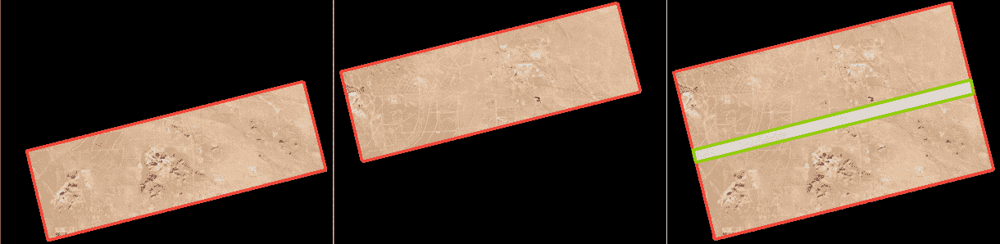
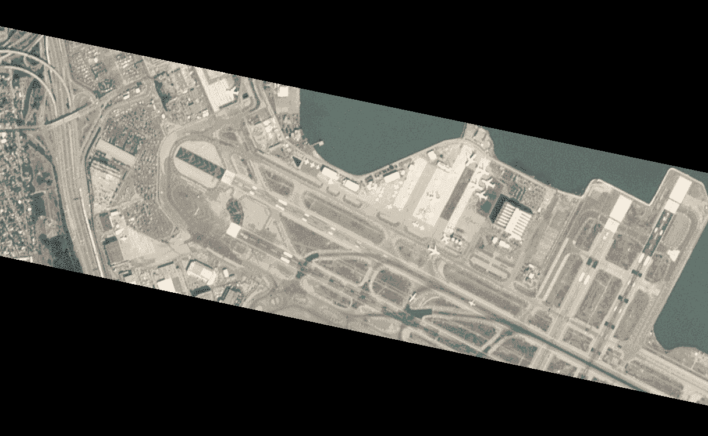
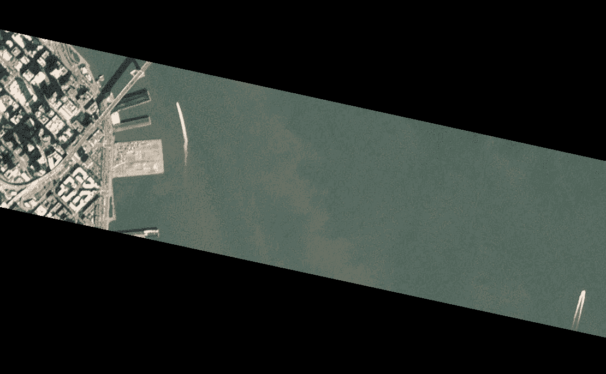

# 用卫星图像揭示运动

> 原文：<https://towardsdatascience.com/revealing-motion-with-satellite-imagery-b101c83fd1c6?source=collection_archive---------29----------------------->

## 使用行星图像观察云的移动、飞机的起飞等等

从 PlanetScope 图像中看到的云运动(图片由作者提供)

这篇文章概述了我的行星运动项目，演示了如何寻找和处理成对的行星图像来突出快速变化。参见 [*此处的*](https://github.com/rhammell/planet-movement) *项目代码。*

卫星图像被广泛用于监测地球上任何地方正在发生的变化。从观察整个季节作物的健康状况，到跟踪十年来冰川的融化，这些图像可以用来记录地球上的物体如何随着时间的推移而变化。

谷歌定时界面(图片由作者提供)

谷歌最近发布了[时间推移](https://earthengine.google.com/timelapse/)，这是一个互动工具，展示了从多年卫星图像中捕捉到的一些长期变化。

卫星在地球上同一地点连续拍摄图像的时间长度被称为“重访率”。从历史上看，对于地球上的大多数地方来说，这个速率大约是几天到几周，这是由单个成像卫星的周期轨道决定的。这种长度的重访率对于跟踪长期变化很有用，但会错过捕捉在较短时间内发生的任何动作。

较新的商业图像提供商，如 [Planet](https://www.planet.com/) ，正转而使用小卫星星座，这些小卫星协同工作，在更短的时间尺度上收集图像。他们的 PlanetScope 星座每天拍摄整个地球的图像，他们的 SkySat 卫星可以在不到一小时的时间内拍摄地球上同一地点的图像。这些缩短的重访率为更快速变化的事件提供了新的见解。

尽管如此，地球上仍有一些事件发生得太快，即使以这样的速度也无法捕捉到。然而，一个在更短的时间尺度上探测变化的机会存在于行星已经收集的图像中。

# “2 秒”重访率

Planet 的 [PlanetScope](https://www.planet.com/products/planet-imagery/) 图像在线性飞行扫描中收集，当一颗卫星沿着其轨道运行时，每隔几秒钟就会周期性地收集一张新图像。由于拍摄每幅图像的时间以及卫星的飞行距离，扫描中的每幅背靠背图像之间都有少量的地理重叠。

下图显示了一个这样的例子。左边和中间显示了相隔几秒钟的飞行扫描中捕捉到的两幅图像，它们的地理足迹以红色突出显示。右图显示了两幅图像的叠加，并以绿色突出显示了它们之间的重叠部分。

一对行星镜图像，重叠部分用绿色突出显示(图片由作者提供)

这个重叠区域，在大约 2 秒的时间内被拍摄了两次，基本上为地球的这一部分提供了“2 秒”的重访率。在捕捉到这种重叠的地方，有机会看到更快的变化。

# 寻找图像对

在给定的飞行扫描中出现这种重叠完全是偶然的。没有行星计划这些重叠发生在哪里，所以让它们发生在感兴趣的特定区域只是运气，而不是保证。

为了帮助寻找和处理显示这种重叠的图像对，我开发了[行星运动](https://github.com/rhammell/planet-movement)项目。它包含 Python 脚本，这些脚本包含用于过滤 Planet API 搜索结果以识别图像对的函数，以及用于将图像处理成可视化输出的函数。

此代码可用于搜索特定的地理空间区域，以查找那里是否存在任何重叠对，并在从 Planet 下载图像后，通过裁剪重叠区域并创建两幅图像之间的 GIF 动画来处理它们。

动画输出有助于轻松解释可视化，当图像来回闪烁时，我们的眼睛会自然地感知到两个图像之间的变化。

# 观看飞机起飞

以下是此流程可以捕获的事件类型的示例。这里的 GIF 动画显示了地面上物体的运动，这在使用遥感影像时通常是看不到的。

这第一对图像是在旧金山机场上空拍摄的，揭示了多架飞机的运动。一架飞机起飞中，另一架在跑道上滑行。

旧金山机场的飞机起飞(图片作者提供)

同一机场上空的另一对图像显示了两架飞机以不同的速度滑行，以及附近高速公路上的汽车运动。

旧金山的飞机滑行和汽车运动(图片由作者提供)

这张照片是在一个风力农场上空拍摄的。在这里，涡轮机叶片的阴影揭示了它们在图像之间的几秒钟内旋转。还可以观察到云及其阴影的运动。

云的移动和涡轮阴影(图片由作者提供)

在旧金山湾上空的这两幅图像中，你可以看到高速公路上两艘船和汽车的运动。

旧金山的船和汽车运动(图片由作者提供)

这些图像对中的每一个都展示了一种不同的物体运动，这种运动在仅仅观看静态卫星图像时通常是观察不到的。这一运动提供的额外背景可以让我们更深入地了解在被监测的地方到底发生了什么。

在不久的将来，从太空提供视频的卫星将变得更加普遍，并更好地提供这里看到的好处。然而，由于这一过程与行星的行星镜图像一起工作，这些图像仍然是例行收集的，它将仍然是分析这种运动的一种选择。