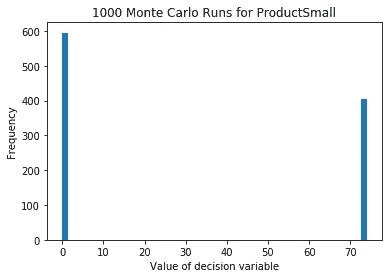
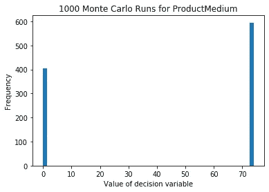
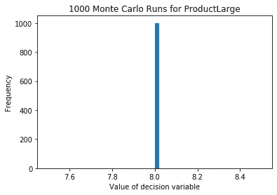

# 使用 Python 中的蒙特卡罗模拟揭示线性优化问题的鲁棒性

> 原文：<https://towardsdatascience.com/revealing-robustness-in-linear-optimization-problems-using-monte-carlo-simulation-in-python-c999c836aa02?source=collection_archive---------35----------------------->

## 线性规划是在给定一组约束的情况下确定最小化和最大化问题的最优解的一个很好的工具。通过将蒙特卡罗模拟应用于这样的程序，我们可以看到最优解是如何随着随机冲击而变化的。


由 [Unsplash](https://unsplash.com?utm_source=medium&utm_medium=referral) 上的 [Edge2Edge 媒体](https://unsplash.com/@edge2edgemedia?utm_source=medium&utm_medium=referral)拍摄

**我们将做以下工作:**
>使用纸浆构建一个确定性线性规划问题
>对该问题应用蒙特卡罗模拟
>使用数据可视化解释结果

我们要解决的线性规划问题如下:

一家专业工业窗户制造商的产品线中有三种产品，分别称为“小型”、“中型”和“大型”。我们得到以下数据:

***1。*** *关联营业利润 pr。积分别是 12，12.5，12。* ***2。*** *所需工时请购单。产品分别是 2.5、3 和 8，总共有 1000 小时可用于生产。* ***3。*** *所需 pr 的平方英尺。产品分别为 18、18 和 19，在工厂* ***共有 1500 平方英尺。*** *一份交货合同强制生产至少 8 扇大窗户*

使用上述数据，确定制造商的利润最大化生产计划:

让我们用 python 实现这个线性编程包，PuLP。通过在 cmd 行中写入以下文本，可以轻松安装 PuLP:

```
pip install pulp
```

线性程序的实现如下:

优化的目标函数和决策变量给出了以下内容:

*目标函数* = **1021.00**

*生产大型* = **8** *生产中型* = **74** *生产小型* = **0**

因此，没有任何其他生产计划能比这一精确组合带来更高的利润。看起来“中等”是有利可图的，也不会消耗太多的约束条件，因此对该产品的大量分配似乎是有效的。然而，如果对中等尺寸窗户的需求非常不稳定，该怎么办呢？我们仍然冒着产量高达 74 辆的风险吗？

让我们假设“中等”窗口的利润遵循基于历史数据的 N(0，2)正态分布。

我们对目标函数进行这些修改，并设置一个选择的种子。这些变化可以在第 3、6、7 和 18 行找到。所有其他因素保持不变:

稍作修改的优化程序现在给我们提供了以下结果:

*目标函数=* **984.00**

*生产‘大型’=***8** *生产‘中型’=***0** *生产‘小型’=***74**

请注意，新的优化生产计划将中等尺寸窗户的产量设置为零！正如我们可以清楚地看到的，将确定性模型暴露于随机性可以真实地揭示生产计划的稳健性。当进一步检查目标函数时，我们可以看到，对于这个特定的模拟实验，“中等”的利润被设置为 10.5(这可以通过打印*模型* *v* 变量来完成)。这显然有利于小尺寸窗户的更多生产，因为利润相对于“中型”窗户更高，而且消耗的工时也更少。

然而，我们不应该满足于仅仅一个实验。因此，让我们对这个优化问题进行 1000 次蒙特卡罗模拟，并以直方图解释结果:

上面的代码生成以下优化决策变量的直方图:



从 1000 次模拟运行中，有几个有趣的见解。首先，显然不令人吃惊的是，大窗户的产量将永远保持在 8。这是由于 8 小时 pr 的工作时间消耗。单位明显多于其他两个。其次，我们看到“小”和“中”的最佳选择在 0 和 74 之间移动，中间没有观测值。由于“中型”最初的利润比“小型”高 0.5 倍，因此最好在 600 次模拟运行中最大限度地提高产品产量。同样，74 个小窗口的生产在 40%的模拟运行中是最优的。作为生产计划员，这是非常有价值的信息，应该制定策略来降低执行错误生产计划的风险。看起来，相信像最初那种确定性模型可能会产生戏剧性的后果。

总之，应该非常小心地跟踪确定性优化模型的输出。运行模拟并将其暴露于随机性(即使是最轻微的)应该会揭示出最优命题在一开始是多么好。

> *我喜欢用的一个很好的比喻是:*
> 一个士兵正在努力寻找他的最佳射击位置，以便保持稳定的瞄准。当中士经过并试图稍微打扰士兵时，我们很好地了解了士兵们的瞄准和射击姿势。在这里，瞄准是优化，受到干扰是模拟。