# 揭示神经网络看到和学到什么:PytorchRevelio

> 原文：<https://towardsdatascience.com/reveling-what-neural-networks-see-and-learn-pytorchrevelio-a218ef5fc61f?source=collection_archive---------20----------------------->

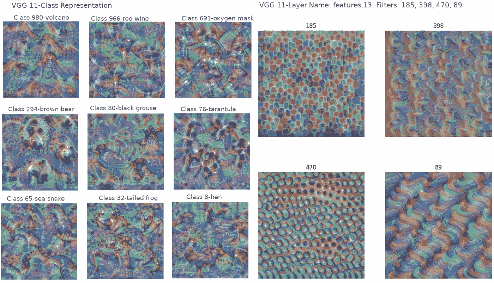

图片来自[0]

# 介绍

线性和经典的学习模型，如逻辑回归[1]，SVM[2]，决策树，…很容易理解和分析。另一方面，深度神经网络很难理解，所以人们将其称为黑盒。幸运的是，已经发明了很多方法，让我们在某种程度上了解这些网络。在这篇文章中，我们将介绍其中的一些方法，同时我们也推荐 [PytorchRevelio](https://github.com/farhad-dalirani/PytorchRevelio) [0】，一个包含这些方法的工具包。

# 为什么理解深度神经网络看到的东西很重要？

深度神经网络，特别是卷积神经网络，在大数据集和新的训练方法的帮助下，避免了梯度消失等问题，达到了高性能。因此，它们取代了许多计算机视觉任务中的旧方法，如分类、检测、语义分割、跟踪、场景重建等。

Grad-CAM[3]论文为理解神经网络所见的重要性提供了以下理由:

> 可解释性很重要。为了建立对智能
> 系统的信任，并推动它们有意义地融入我们的日常生活，很明显，我们必须建立“透明的”
> 模型，这些模型能够解释为什么它们预测它们所预测的
> 。

通过理解为什么模型对输入的预测是错误的，我们可以想出解决模型问题的方法。

当一个模型在给定的任务中表现得比人更好时，我们可以通过理解它为什么做出那个决定来学习新的东西。

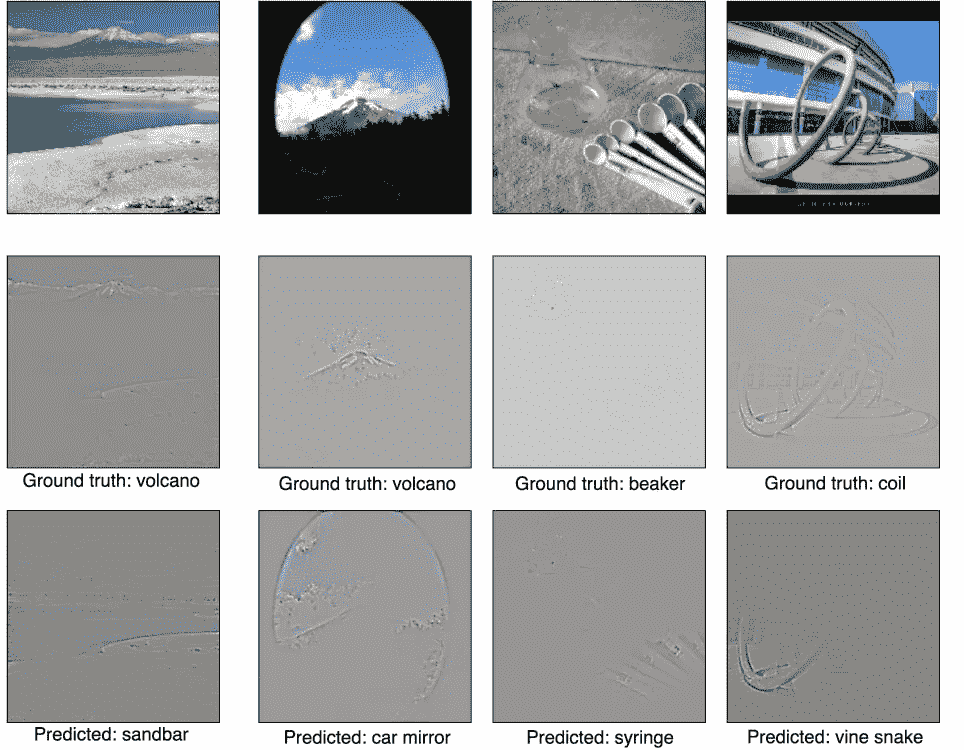

图片来自[3]。

上面的图像的第一行包含四个图像给 VGG-16 在 ImageNet 上训练[4]。这些图像被分类到错误的类别中。在第三行中，在理解神经网络的方法的帮助下，描绘了激发错误类别变得活跃的像素。例如，第四个图像是一个线圈。然而，它被归类为藤蔓蛇。原因是第三行显示的绿色曲线。

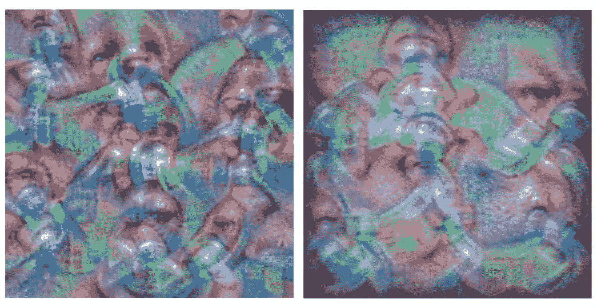

图片来自[0]

PytorchRevelio 工具包通过使用两种不同的方法来获得上面的图像。这些图像是在 ImageNet 上训练的 VGG11[4]的分类标签 691-氧气面罩的表示。在这些图像中，不仅氧气面罩的图案可见，而且它们还包含噪声和眼睛形状。这就提出了一个问题，这个模型是否对这个阶层有偏见。它能够正确分类不在人脸上的氧气面罩图像吗？

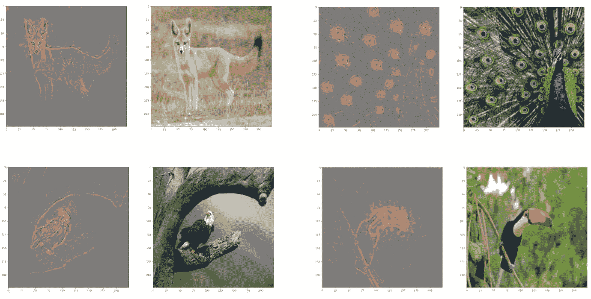

图片来自[0]

红色像素显示了在 ImageNet 上训练的 ResNet-50 [5]集中对动物图像进行分类的部分图像，如巨嘴鸟、狐狸、鹰和孔雀。这些红色像素是通过使用 [PytorchRevelio](https://github.com/farhad-dalirani/PytorchRevelio) 获得的。例如，在对巨嘴鸟进行分类时，ResNet-50 主要考虑它的喙，而其他部分则不太重要。为了将图像分类为孔雀类，网络主要使用其羽毛上的眼睛图案。如果巨嘴鸟的喙被遮挡，网络能正确分类吗？

以上图像是通过激活最大化、显著图、Grad_CAM 等不同方法创建的。通过使用这些方法，回答了许多问题，并提出了新的重要问题。

# 激活最大化

激活最大化是一种为神经网络中的神经元/过滤器已经学习的特征寻找表示的方法。激活最大化可以在本文中找到:“[可视化深层网络的更高层特征](https://www.researchgate.net/publication/265022827_Visualizing_Higher-Layer_Features_of_a_Deep_Network)”[6]。在这种方法中，通过从诸如高斯分布的分布中随机抽取像素来创建图像。然后这个图像被传送到网络。计算神经元/滤波器的输出相对于图像的梯度。将梯度添加到图像中，以找到为神经元创建更大输出的更好的图像(梯度上升法，用于最大化)。新图像经历相同的过程，这种情况会发生几次。在每一步中获得一个新的图像，该图像比前一步更多地激活目标神经元/滤波器。

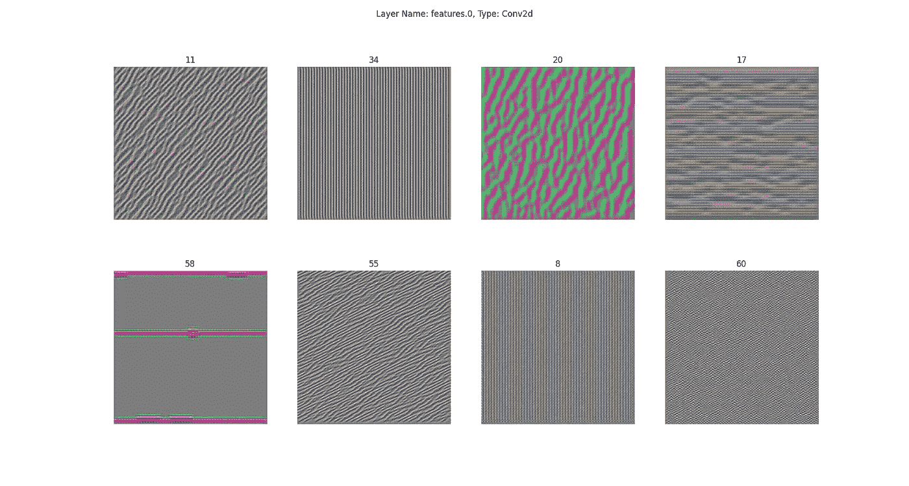

图片来自[0]

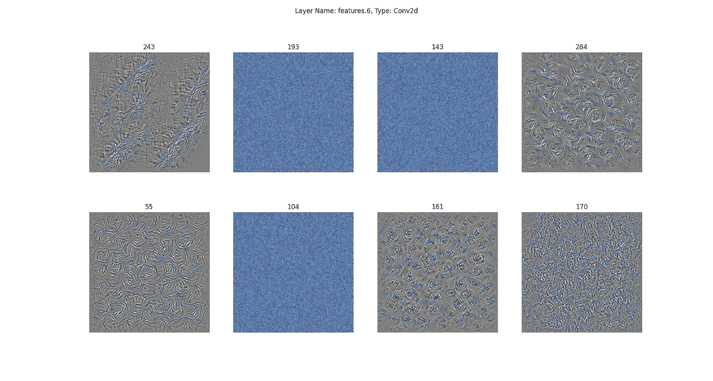

图片来自[0]

上面这两幅图像代表了 AlexNet[7]中名为“features.0”和“features.6”的图层中的一些学习过的过滤器。第一张图片中的滤镜属于 AlexNet 的第一层；他们已经学会了简单的特征，例如不同方向的边。第二个图像中的滤镜位于深度较高的图层中。如图所示，他们已经学会了更复杂的功能。然而，这种方法有一些缺点。例如，如果我们举例说明最后一层(输出层)的特征，我们将看到获得的表示非常模糊。接下来的两种方法将解决这个问题。

# 高斯模糊激活最大化

如果我们用激活最大化方法产生类的表示，我们不能容易地在学习特征的表示中找到想要的对象。会有很多高频图案降低它们的清晰度。有几种方法可以解决这些问题。最简单的方法之一是使用低通滤波器，如高斯模糊[8]。在每一步中，高斯滤波器应该应用于计算的梯度或获得的图像。其他一切都将与激活最大化方法相同。这种差异在下面的图片中是显而易见的。

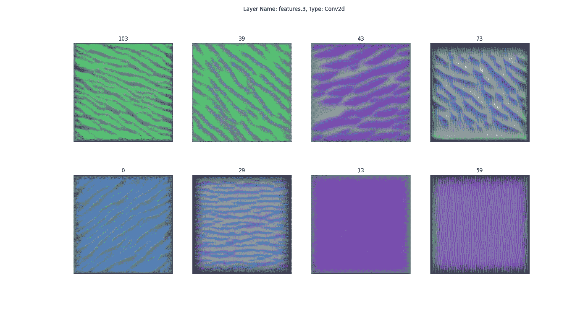

图片来自[0]

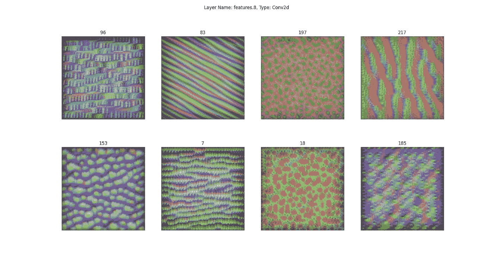

图片来自[0]

图片来自[0]

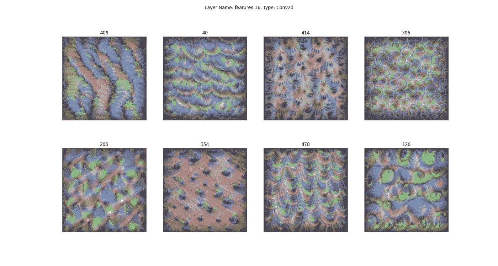

图片来自[0]

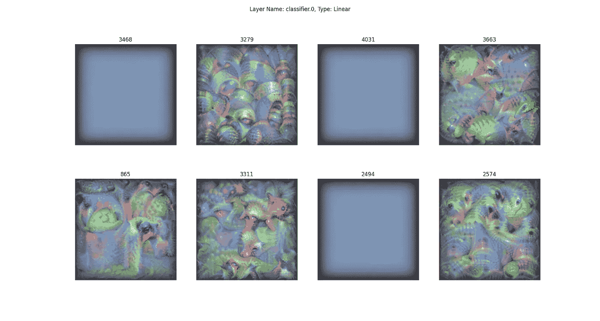

图片来自[0]

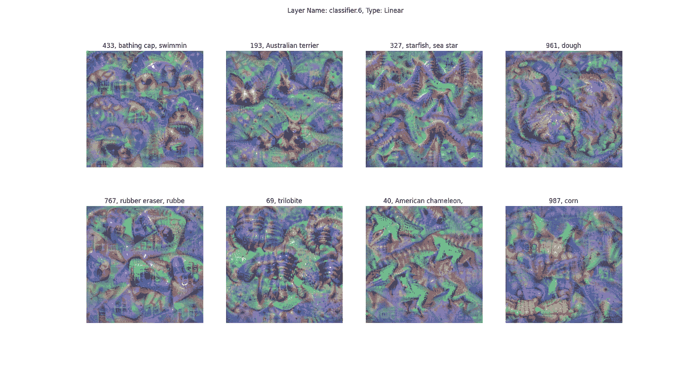

图片来自[0]

这些图像是通过使用高斯模糊方法的激活最大化获得的，该方法在 [PytorchRevelio](https://github.com/farhad-dalirani/PytorchRevelio) 中实现。这些代表了在 ImageNet 上训练的 VGG11 [4]的神经元/过滤器的一些习得特征。如图片所示，第一层的要素较为简单，在后面的层中逐渐变得更加复杂和抽象。

在**之下，通过进入更深的层，可以在所获得的特征的抽象**中观察到顺序:

1-边缘/拐角

2-纹理

三模式

4-对象的部件

5-整个对象

# 双边模糊激活最大化

该方法[9]类似于具有高斯模糊的激活最大化，但是双边滤波器被用作低通滤波器。虽然它像高斯滤波器一样模糊图像，但它保留了边缘。因此，获得了更好的表示。

# 显著图

显著图[10]是示出输入图像的每个像素在计算输出类别分数中的重要性的图。为了计算显著图，需要输入图像和目标类别。为了找到每个像素的重要性，我们计算 softmax 之前的最后一层网络的目标神经元的输出。然后将目标类的渐变设置为 1，其他输出设置为零。之后，计算输出相对于输入图像的梯度。梯度值越大，表示相应的像素越重要。计算显著图很快，因为它只需要一次向前和向后的传递。不幸的是，这种方法的输出不够好，但接下来的两种获得显著图的方法获得了令人印象深刻的结果。

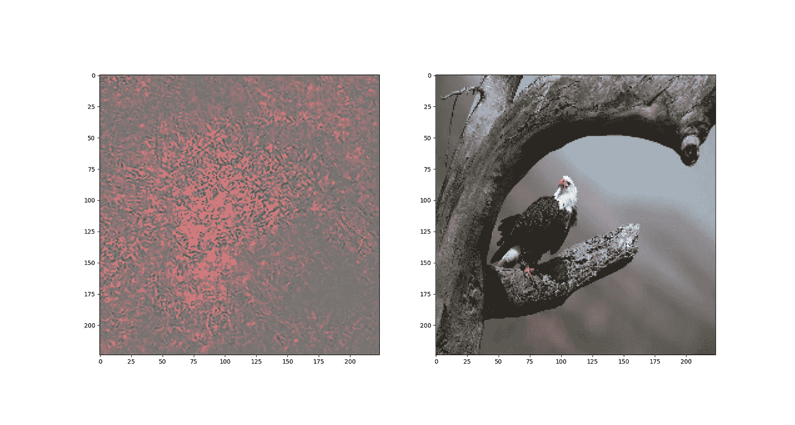

图片来自[0]

# 具有引导梯度的显著图

具有引导梯度的显著图与前面的方法相同。然而，它使用引导梯度[11]而不是梯度。

> 我们称这种方法为引导反向传播，因为它将来自更高层的额外引导信号添加到通常的反向传播中。这防止了负梯度的反向流动，对应于减少我们旨在可视化的更高层单元的激活的神经元。[11]

使用引导梯度极大地提高了所获得的显著图的质量。下面您可以看到 PytorchRevelio 计算的几个输出。差异是显而易见的。

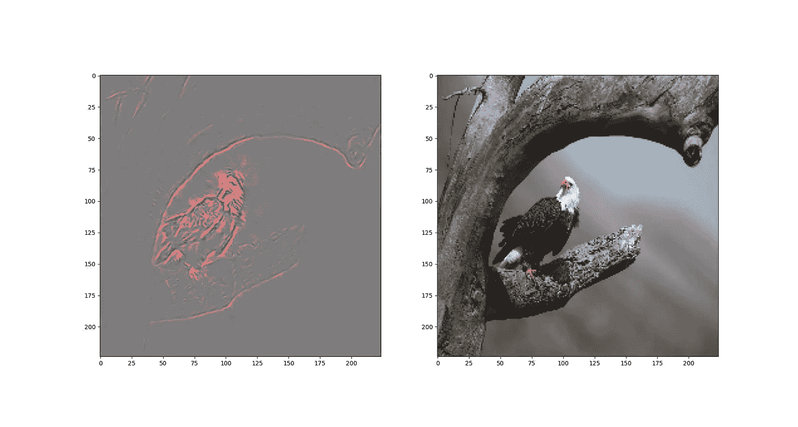

图片来自[0]

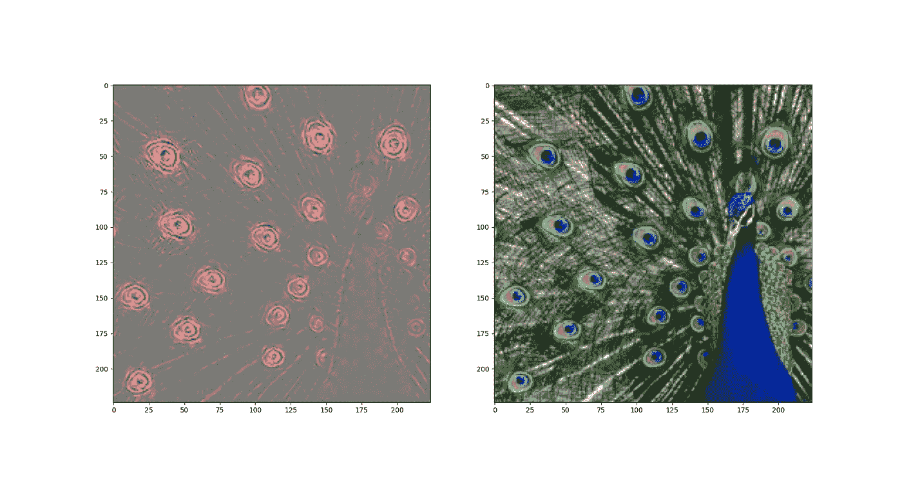

图片来自[0]

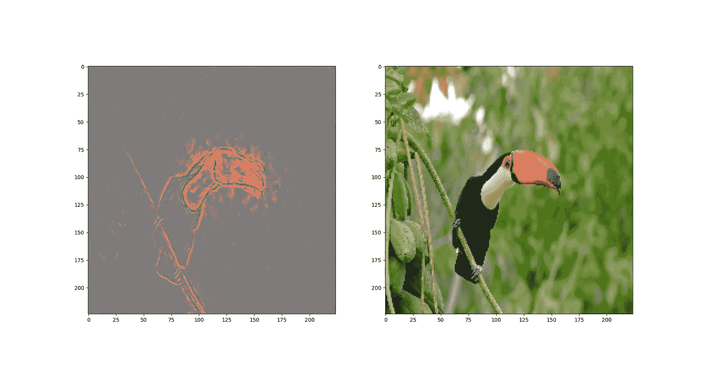

图片来自[0]

与前一种方法相比，这种方法产生的图像质量较高。然而，如果我们试图为给定的图像和包含几个不同对象的目标类绘制显著图，我们将观察到其他对象的部分也被标记。下图是这个问题的一个例子。虽然秃鹰是这幅图的目标职业，但是狮子的某些部位也有标记。下一个方法解决了这个问题。

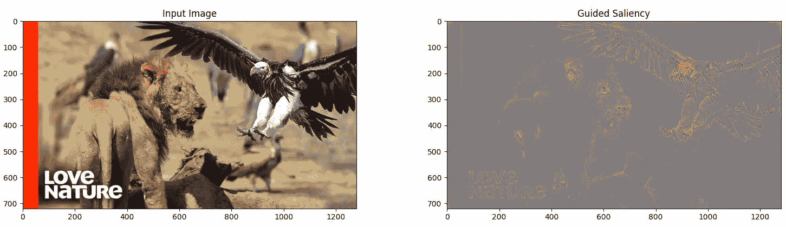

图片来自[0]

# 制导摄像机

Guided Grad-CAM [3]方法首先使用先前的方法获得输入图像和目标类别的显著图:“具有引导梯度的显著图”然而，它计算得到的显著图的逐元素乘积和矩阵 L，以消除显著图中不想要的像素。为了获得矩阵 L，它使用网络的最后一个卷积层的输出特征图。他们的理由如下:

> 此外，卷积层自然保留了全连接层中丢失的空间信息，因此我们可以预期最后的卷积层在高级语义和详细的空间信息之间具有最佳的折衷。[3]

和

> Grad-CAM 使用流入 CNN 最后一个卷积层的梯度信息，为每个神经元分配重要值，以做出感兴趣的特定决策。[3]

它使目标类的梯度等于 21，然后相对于最后一个卷积层的输出特征图计算目标类得分的梯度。现在，为了找到每个特征图的重要性，计算该特征图的相应梯度的平均值。为了获得矩阵 L，借助于计算的重要性，计算输出特征图的加权平均值，加权平均值的负元素被设置为零。如上所述，通过在矩阵 L 和引导梯度显著图之间执行逐元素乘积，获得最终的显著图。

在下图中，您可以看到在 ImageNet 上训练的 ResNet-50 [5]的该方法的一些输出。此外，为了进行比较，还提供了前面方法的输出。

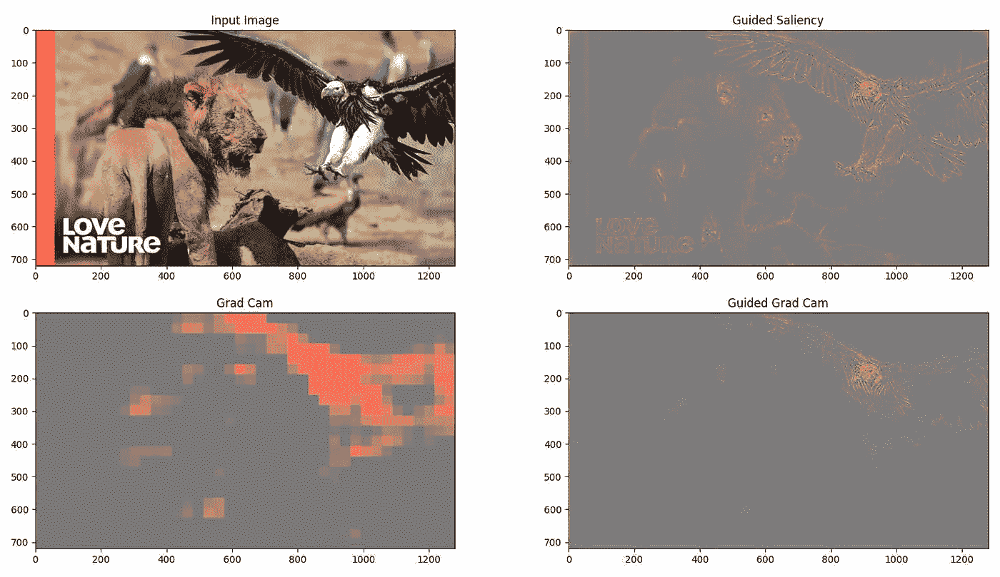

图片来自[0]

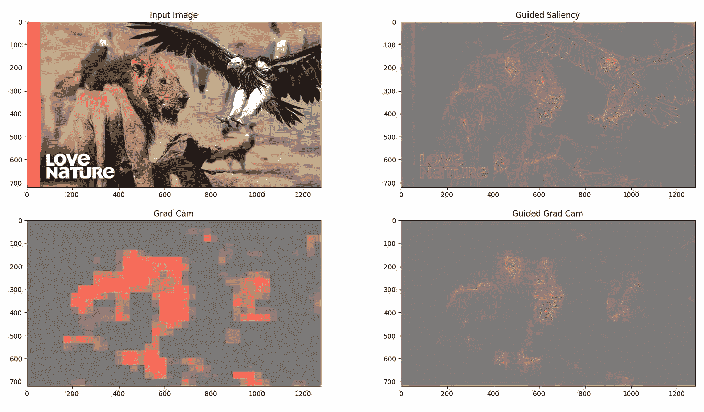

图片来自[0]

图片来自[0]

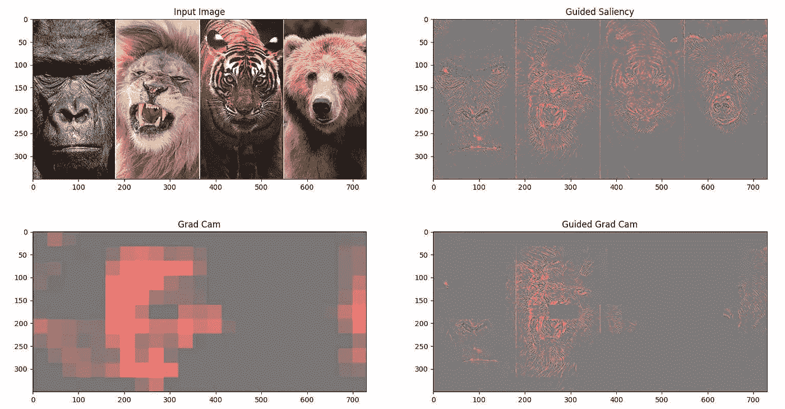

图片来自[0]

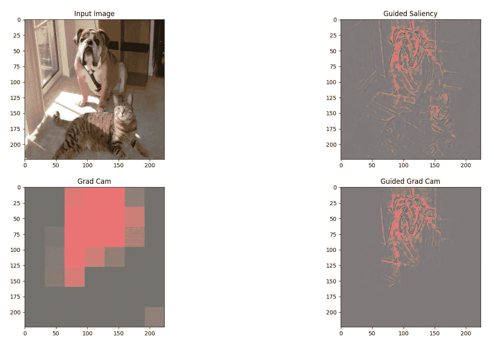

图片来自[0]

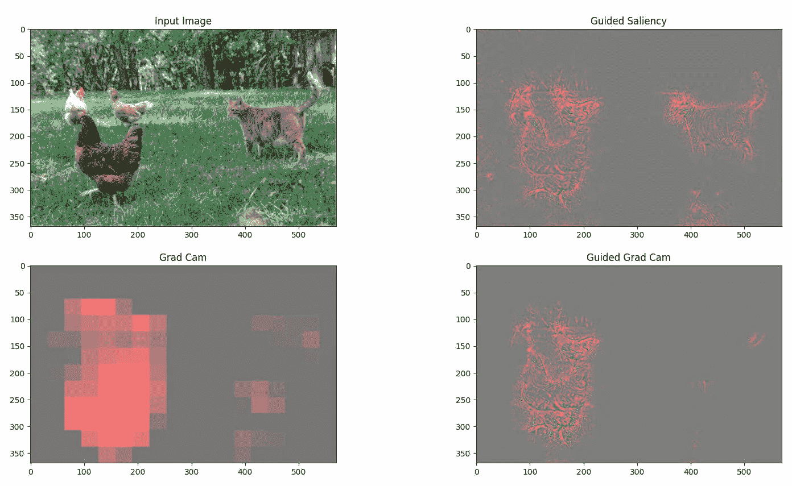

图片来自[0]

在上面的图像中，图像中有不止一个对象。与引导梯度显著图不同，在引导梯度 CAM 方法中，只有属于输入目标类别的对象部分被突出显示。

# 到目前为止 PytorchRevelio 中实现的方法

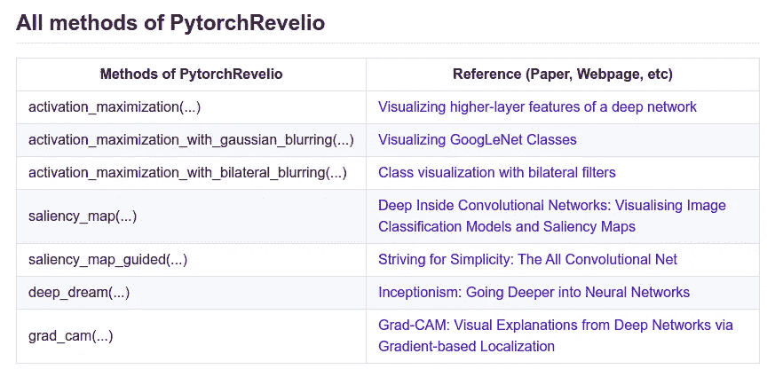

图片来自[0]

# 哪种方法性能更好？

*   列表中较高的方法在特征可视化方面表现更好:

1.  激活最大化双边模糊
2.  激活最大化高斯模糊
3.  激活 _ 最大化

*   列表中较高的方法对显著图执行得更好:

1.  grad_cam
2.  显著性 _ 地图 _ 导向
3.  显著性 _ 地图

更多细节以及如何使用 PytorchRevelio，请访问其 GitHub 页面:[https://github.com/farhad-dalirani/PytorchRevelio](https://github.com/farhad-dalirani/PytorchRevelio)

# 参考

[0] PytorchRevelio，【https://github.com/farhad-dalirani/PytorchRevelio】T2

[1]托勒斯·J·默雷尔·WJ。逻辑回归:将患者特征与结果联系起来。 *JAMA。*2016；316(5):533–534.doi:10.1001/jama

[2]科尔特斯，科琳娜和弗拉基米尔·瓦普尼克。"支持向量网络。"机器学习 20.3(1995):273–297。

[3] Selvaraju，Ramprasaath R .等人，“Grad-cam:通过基于梯度的定位从深度网络中进行可视化解释”*IEEE 计算机视觉国际会议论文集*。2017.

[4]西蒙扬、卡伦和安德鲁·齐泽曼。“用于大规模图像识别的非常深的卷积网络。” *arXiv 预印本 arXiv:1409.1556* (2014)。

[5]何，，等.“用于图像识别的深度残差学习”*IEEE 计算机视觉和模式识别会议论文集*。2016.

[6] Erhan，Dumitru，等，“深层网络的高层特征可视化”蒙特利尔大学(2009 年)

[7]克里热夫斯基、亚历克斯、伊利亚·苏茨基弗和杰弗里·e·辛顿。"使用深度卷积神经网络的图像网络分类."*神经信息处理系统进展*25(2012):1097–1105。

[8]au dun m . ygard，[https://www . au duno . com/2015/07/29/visualizing-Google net-classes/](https://www.auduno.com/2015/07/29/visualizing-googlenet-classes/)，2015 年。

[9]迈克·泰卡，[https://mtyka . github . io/deep dream/2016/02/05/bias-class-vis . html](https://mtyka.github.io/deepdream/2016/02/05/bilateral-class-vis.html)，2016。

[10] Simonyan，Karen，Andrea Vedaldi 和 Andrew Zisserman。"深入卷积网络内部:可视化图像分类模型和显著图." *arXiv 预印本 arXiv:1312.6034* (2013)。

[11]斯普林根伯格，乔斯特·托拜厄斯，等，“力求简单:全卷积网络。” *arXiv 预印本 arXiv:1412.6806* (2014)。