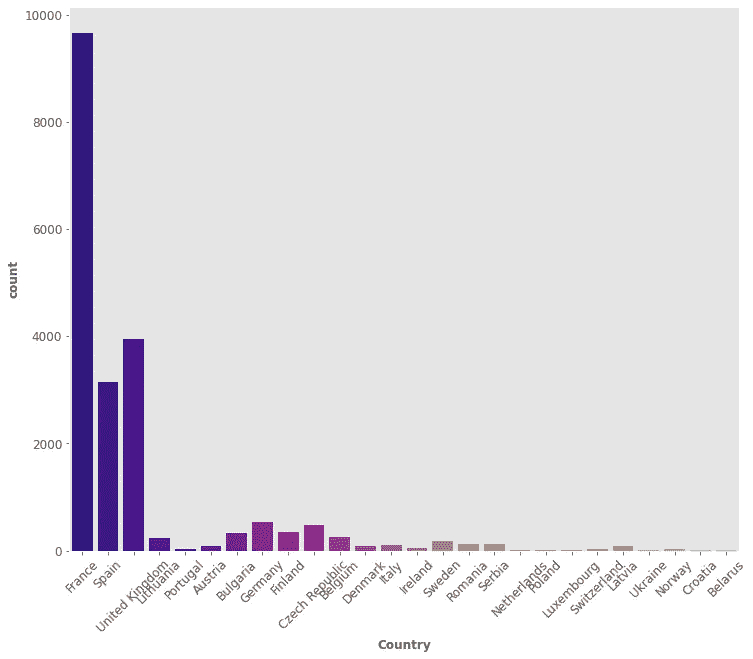
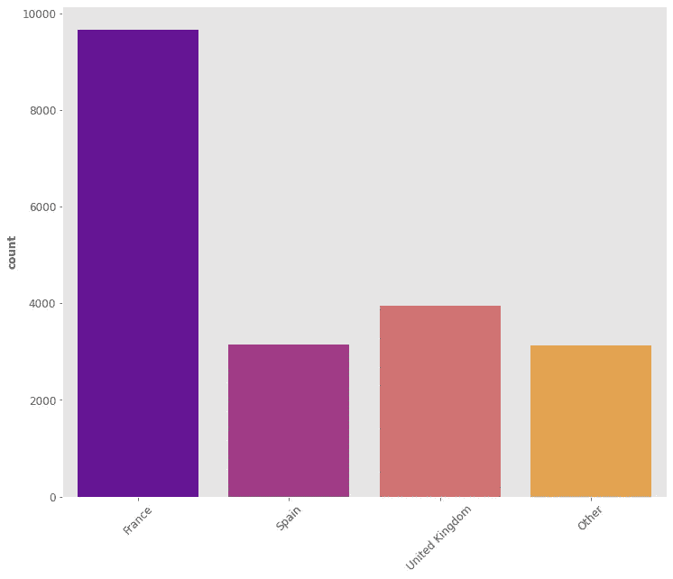
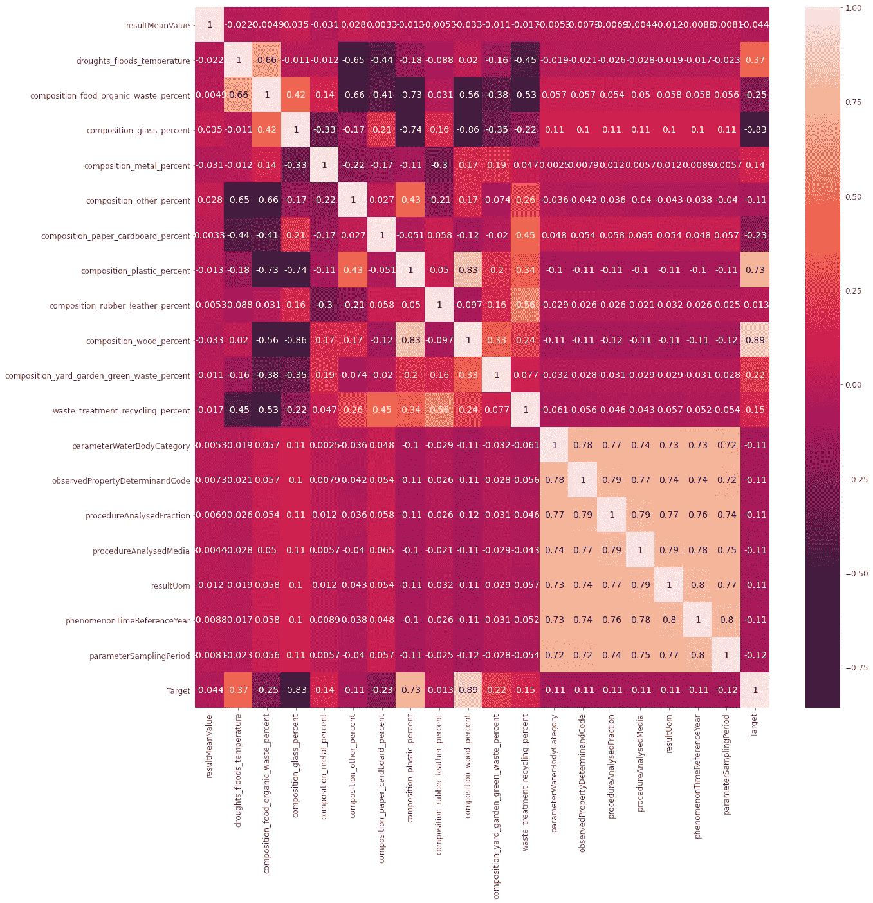
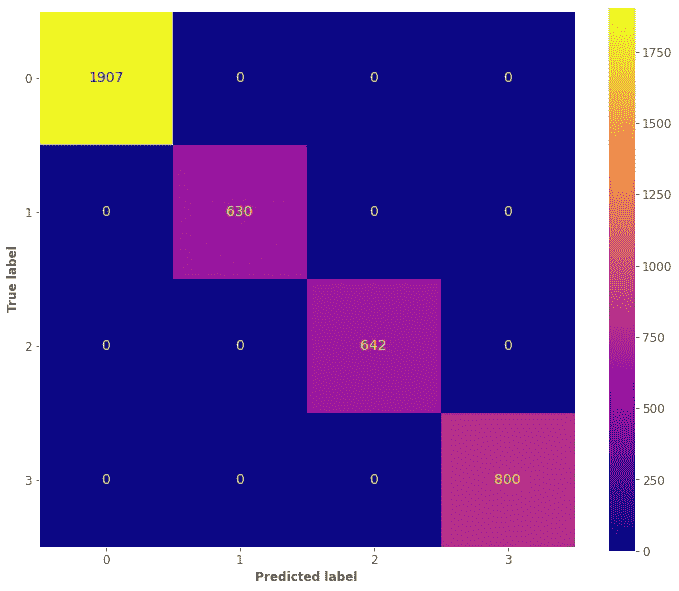
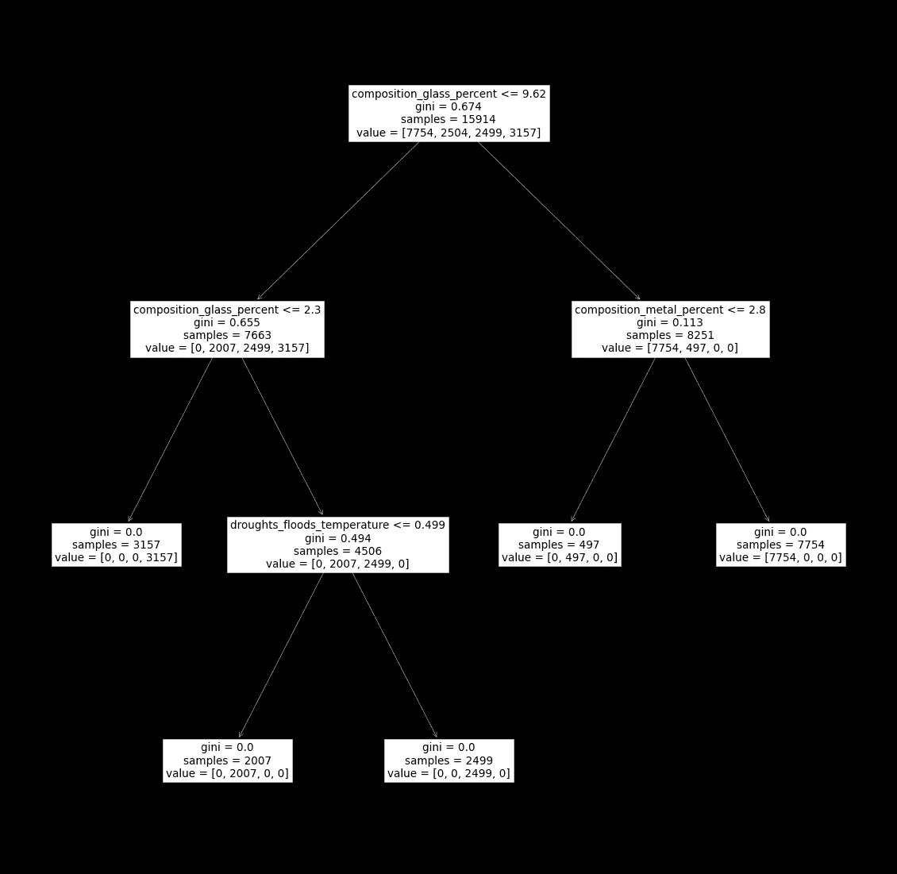

# 利用机器学习对水的属性进行逆向工程

> 原文：<https://towardsdatascience.com/reverse-engineering-water-properties-with-machine-learning-38315590f0d7?source=collection_archive---------28----------------------->


由 [Unsplash](https://unsplash.com/s/photos/water?utm_source=unsplash&utm_medium=referral&utm_content=creditCopyText) 上的 [mrjn 摄影](https://unsplash.com/@_mrjn_esf?utm_source=unsplash&utm_medium=referral&utm_content=creditCopyText)拍摄

## 考虑到水的特性，以下是如何理解水的来源。只有几行代码。

**机器学习**在日常生活中帮了我们很多，而且有时我们甚至没有完全意识到。主要原则(也是我们使用机器学习的主要原因)是，当一些事情真的很难理解时，我们仍然有机会用**数据**解决它。

虽然 ML 通常被用来解决问题，

> 另一个强大的选择是使用机器学习来进行逆向工程。

**但它实际上是什么意思呢？** 好吧，假设你创建了一个新的社交媒体，每次有人发布带有某个单词的内容(假设 **" *愚蠢* "** )时，你决定删除该内容，因为这违反了你的政策。想象一下，你的朋友决定使用你的社交媒体，而他们不知道这条规则。如果他们想知道为什么他们的帖子被删除了，他们必须对你的社交媒体进行逆向工程。**这基本上就是逆向工程的意思。**

在这篇博文中，我将向您展示如何使用**机器学习**、**以及几行代码对某个数据集进行逆向工程。**

特别是，我们会有一个数据集，解释某个地方某个水的所有**水属性**。鉴于这些属性，我们希望对它们进行逆向工程，并使用机器学习来实际检索**原产国。**

我们开始吧！

## 0.图书馆:

出于我们的目的，我们将使用 **Python** 。我们将使用一些著名的库，如 **sklearn、pandas、matplotlib** 和 **numpy。以下是您可以复制粘贴到笔记本中的完整列表:**

## 1.数据探索:

很好，我们差不多准备好了。不过，我们需要一个重要的东西:**数据。**你可以在这里下载数据集[，好消息是，这是一个相对较小的数据集。
正如我们想要**得到**这个国家一样，我们不想用一个**代理**这个国家本身作为一种财产。出于这个原因，我们将从数据中删除代理列。以下是最终结果:](https://www.kaggle.com/ozgurdogan646/water-quality-dataset)

我们得到了许多属性，许多非数字特征，以及**国家**列，这就是我们想要了解的。通过这样做，我们可以理解列的类型:

所以我们有一个**数字特征列表**和一个**非数字特征列表**:

这样我们就可以了解**每个**非数字特征**有多少个条目**；

这样我们可以检查**数字特征**的**相关性**:

现在让我们看看我们的**目标**栏，看看我们有多少个国家。



好吧，所以…这是一个烂摊子。让我们通过选择最频繁的类来使它更有序，并将其他类分组在一起。

> 注意:这完全没有必要！只是为了让事情更清晰易懂。请随意跳过这一部分。



**办法更好。**

## 2.机器学习:

当你在逆向工程一些东西时，可解释性是至关重要的。一个众所周知且可解释的机器学习模型被称为**决策树。** 但是它是如何工作的呢？好吧，让我们简单点。你玩过“**猜猜是谁？”**？这是一个著名的经典游戏，你必须通过向对手提问来了解某个角色。假设你必须猜**艾德·希兰**。它可能是这样的:

```
Is he an actor? **No** Is he a singer? **Yes** Is he a pop singer? **Yes** Is he from Canada? **No** Has he ginger hairs? **Yes
It’s Ed Sheeran!**
```

这正是决策树对我们的特征所做的，以了解国家。很简单，对吧？让我们成功吧！使用这些代码行，您可以**准备数据集**并查看**与目标列的关联**。



有了这几行代码，你可以真正地**训练**你的模型，并检查它的**性能**(训练/测试分割:80%/20%):



是一个**逆向工程任务**，所以应该是这样的！我们想要了解一个精确的模式，我们不想有任何错误。

这是逆向工程的结果:



那解释了一切！如果水超过一定的**金属**百分比属于某一类，同样的还有**玻璃**和**干旱 _ 洪水 _ 温度。**

## 3.结束语

由于机器学习，能够理解新的东西是令人惊讶和鼓舞的。我真的希望你喜欢这篇文章，并且像我写这篇文章和开发代码一样开心。

如果你喜欢这篇文章，你想知道更多关于机器学习的知识，或者你只是想问我一些你可以问的问题:

A.在 [**Linkedin**](https://www.linkedin.com/in/pieropaialunga/) 上关注我，我在那里发布我所有的故事
B .订阅我的 [**简讯**](https://piero-paialunga.medium.com/subscribe) 。这会让你了解新的故事，并给你机会发短信给我，让我收到你所有的更正或疑问。
C .成为 [**推荐会员**](https://piero-paialunga.medium.com/membership) ，这样你就不会有任何“本月最大数量的故事”，你可以阅读我(以及成千上万其他机器学习和数据科学顶级作家)写的任何关于现有最新技术的文章。

非常感谢，祝你有美好的一天！