# 使用纽约自行车共享数据进行反向地理编码

> 原文：<https://towardsdatascience.com/reverse-geocoding-with-nyc-bike-share-data-cdef427987f8?source=collection_archive---------27----------------------->

## [实践教程](https://towardsdatascience.com/tagged/hands-on-tutorials)

## 使用 Pandas 合并来增强来自 Nominatum 的区和邻居的城市自行车出行数据

纽约市自行车共享系统 Citi Bike 提供出行数据文件，因此任何感兴趣的人都可以分析该系统的使用情况。在本文中，我将展示如何通过反向地理编码自行车站点坐标来添加每个站点所在的区、社区和邮政编码，从而增强 Citi 自行车出行数据。


作者照片

在我之前的文章[探索纽约自行车共享数据](/exploring-bike-share-data-3e3b2f28760c)中，我展示了如何通过数据准备让花旗自行车出行数据变得更有用。关于如何安装所用工具的说明，请参阅那篇文章:Jupyter Notebook、Pandas、Seaborn 和 Pyarrow。

本文中使用的所有 Python 代码及其生成的输出可以在 Jupyter 笔记本 [locations.ipynb](https://github.com/ckran/bikeshare/blob/main/locations.ipynb) 中的 github 上找到。

## 下载花旗自行车旅行数据

[花旗自行车系统数据](https://www.citibikenyc.com/system-data)页面描述了所提供的信息，并提供了一个可下载数据的页面链接。在这篇文章中，我使用了 2020 年 9 月的数据。

在 Windows 上找到 202009 年的 NYC 文件，下载，解压到一个`bikeshare`目录。

在 Linux 上，从命令提示符发出命令:

```
mkdir bikeshare &&  cd bikeshare 
wget [https://s3.amazonaws.com/tripdata/202009-citibike-tripdata.csv.zip](https://s3.amazonaws.com/tripdata/202003-citibike-tripdata.csv.zip)
unzip 202009-citibike-tripdata.csv.zip
rm 2020009-citibike-tripdata.csv.zip
```

## 导入库和数据

启动 Jupyter，然后从浏览器窗口在您的`bikeshare`目录中创建一个新笔记本。

导入这些库。

```
import pandas as pd
import seaborn as sns
import matplotlib.pyplot as plt
```

然后将数据文件读入熊猫数据框并检查其形状。

```
df = pd.read_csv('202009-citibike-tripdata.csv')
df.shape(2488225, 22)
```

shape 属性告诉我们有多少行(和列)被读取，因此 9 月份有将近 200 万次访问。

# 计算行程

我以前看过最受欢迎的*车站*，但我也对最受欢迎的*行程感兴趣。*有多少种不同的行程，即始发站和终点站的组合？理论最大值是起点站的数量乘以终点站的数量:

```
counts = df[['start station id','end station id']].nunique()
counts
start station id    1087
end station id      1112
dtype: int64counts.agg('product')1208744
```

一位读者注意到有 25 个不同的终点站比起点站多，并问这是怎么回事？嗯，泽西城也有花旗自行车系统，所以有可能在那里的一个车站放下自行车。虽然从曼哈顿到乔治·华盛顿大桥很容易，但距离泽西城还有 13 英里，所以这不太可能。骑手也可以乘坐纽约水路轮渡，但实际上更合理的做法是在一个终点站放下自行车，过了河再去取另一辆。虽然我能解释清楚，但这样的旅行只有 60 次，这是一个微不足道的数字，所以我选择忽略它们。

因此，有 1000 多个车站，就有超过 120 万次*可能的*旅行。但是有多少是在 9 月份被骑过的呢？

```
df[['start station name','end station name']].\
     value_counts().count()317636
```

这显示了超过 30 万次或者大约三分之一的可能行程实际上有乘客。那么最受欢迎的旅行是什么？

我使用`value_counts`创建了一个系列`trips`来查找前二十个旅行。

然后`trip_names`用斜线将 s **起点站名**和 e **终点站名**连接起来，为这些旅程创建一个名称。

然后我可以使用`barplot`来显示旅行次数。

```
trips=df.value_counts(['start station name','end station name'])[:20]
trip_names=[trips.index[t][0] + ' / ' + trips.index[t][1] for t in range(len(trips))]plt.figure(figsize=(12,10))
sns.barplot( x= list(trips.values), y = trip_names, orient="h") ;
```

我注意到的第一件事是，许多旅程都有相同的起点和终点。我认出了许多中央公园附近的车站。所以看起来很多人都去公园兜风了。

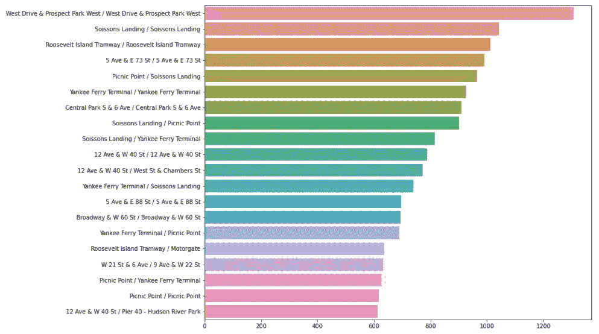

乘坐次数排名前 20 的旅行

我可以重新创建`trips`，省略**起点站 id** 和**终点站 id** 相同的“循环”或行程。

```
trips = df[df['start station id'] != df['end station id']].\
  value_counts(['start station name','end station name'])[:20]
```

然后重新创建`trip_names`并重新运行图表。

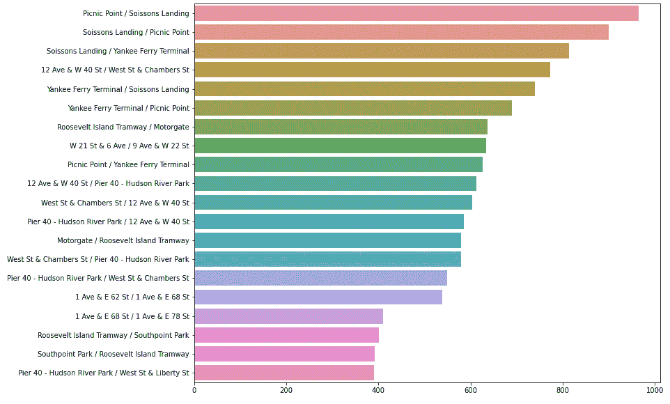

按乘坐次数排名的前 20 次旅行——省略循环

现在我注意到最热门的旅行是在名字像野餐点，Soissons Landing 和 Yankee Ferry Terminal 的车站之间。这些听起来不像是纽约市的地点！他们听起来像是在某个小岛上。事实证明，的确如此。

# 车站位置

关于站点在行程数据文件中的位置的唯一信息是其名称和 GPS 坐标。虽然坐标对于绘图来说是必要的，但是对于人类读者来说并没有太大的意义。但是，可以使用*反向地理编码将它们转换成完整的地址。*

有许多可用的地理编码 API，包括来自谷歌、ESRI、here、Mapquest 等的 API。有些是商业性的，大多数有免费等级或免费试用。

以前我用 ESRI，但免费试用后，你必须付费。因此，在本文中，我将使用使用 OpenStreetMap 数据的[nomim](https://nominatim.org/)。它是免费的，但是每秒钟有一个请求的限制。要使用它，请导入这些库:

```
from geopy.geocoders import Nominatim
from geopy.extra.rate_limiter import RateLimiter
```

为了符合他们的要求，将`user_agent`设置为您的应用程序名称或电子邮件地址。然后创建一个`reverse`函数，使用`RateLimiter`将查询次数限制为每秒一次。

```
geolocator = Nominatim(user_agent="bikeshare")
reverse = RateLimiter(geolocator.reverse, min_delay_seconds=1, max_retries=0)
```

默认情况下，`reverse`函数返回一个简单的值列表，这个列表很难解释，但是它提供了一个`raw`属性，这个属性以字典的形式返回这些值。从结果中，我可以提取出`address`元素，它也是一个字典。

举个例子，这里我传递了我之前工作的坐标。

```
reverse("40.75029943702441, -73.99221868612786").raw['address']
```

结果是一个包含该位置信息的字典。

```
{'building': 'Pennsylvania Station',
 'road': 'West 36th Street',
 'neighbourhood': 'Garment District',
 'suburb': 'Manhattan',
 'county': 'New York County',
 'city': 'New York',
 'state': 'New York',
 'postcode': '10018',
 'country': 'United States',
 'country_code': 'us'}
```

现在，我只需要对行程数据文件中所有唯一的站点进行这样的操作。首先，我将创建一个具有起点桩号 id、名称、纬度和经度的新数据框，并将其限制为桩号 id 的唯一值。

```
dfs=df[['start station id','start station name',\
'start station latitude','start station longitude']]\
.drop_duplicates(subset = ['start station id'])
```

然后重命名列，并将`index`设置为`stationid`。

```
dfs.columns=['stationid','station name','latitude','longitude']
dfs.set_index('stationid', inplace=True)
dfs
```

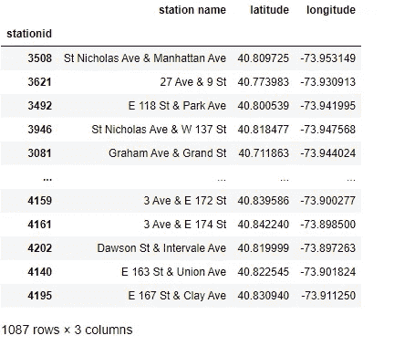

电台表

## 反向地理编码

现在我要给每个站打`reverse`。我看到这个月有 1087 个站点被使用。首先创建一个空列表。然后遍历元素，将数字纬度和经度转换成格式化的文本字符串。每个结果都被附加到列表中。

完成后，以数据框的形式查看列表，显示前十行。

**注意:**由于我们被限制为每秒一次通话，这意味着这将需要*十八分钟*才能完成。稍后我会将结果保存在一个文件中，这样我就不需要再次运行它。

```
locations=[]
for index, row in dfs.iterrows():
    locations.append(reverse("{}, {}".format(row['latitude'],\
    row['longitude'])).raw['address'])pd.DataFrame(locations[:10])
```

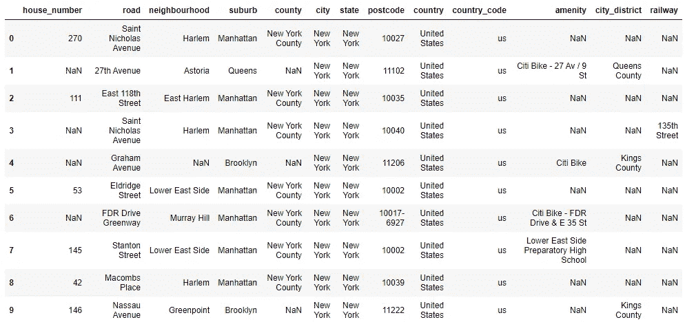

显示站点位置反向地理编码的表

这确实提供了关于空间站位置的有用信息。然而，我注意到一些差异。我看到**城市**总是*纽约，这对于曼哈顿来说是正确的，但是对于布鲁克林的地址，它应该是布鲁克林，而在皇后区，它们应该有一个实际的城市名称，如阿斯托里亚或福雷斯特山。布鲁克林和皇后区的**县**名称不出现在 county 中，而是出现在 **city_district** 中。然而,**郊区**列实际上包含了纽约市的区名，所以这更有用，因为**社区也是如此。***

我使用原始数据帧中的站点 id `index`创建了一个数据帧。然后，我只选择我感兴趣的三个列，我将把它们重命名为对纽约人有意义的名称。

```
dfstations = pd.DataFrame(index=dfs.index, data=locations,\
      columns=['neighbourhood','suburb','postcode'])dfstations.rename(columns={"neighbourhood":"neighborhood",\
      "suburb": "boro", "postcode": "zipcode"}\
      ,inplace=True )
```

因为只有五个区，所以我可以通过将`boro`从字符串转换为类别来节省空间并获得更好的性能。我可以为`neighborhood`和`zipcode`做同样的事情，因为它们的数量也有限。对于一个类别，每个名称只存储一次，指向名称的指针存储在单独的行中。

我注意到至少有一个邮政编码使用了 ZIP+4 格式，这是我不想要的，所以将它们都剥离为五个字符，并将其转换为一个类别。

```
dfstations['neighborhood'] = dfstations['neighborhood'].astype('category')
dfstations['boro'] = dfstations['boro'].astype('category')dfstations['zipcode'] = dfstations['zipcode'].str[:5].astype('category')
cols = ['neighborhood', 'boro']
```

然后我会将`station name`、`longitude`和`latitude`也添加到表格中。

```
dfstations[['station name','latitude','longitude']] =\
 dfs[['station name','latitude','longitude']]
```

然后检查创建的表。

`dfstations.head(10)`

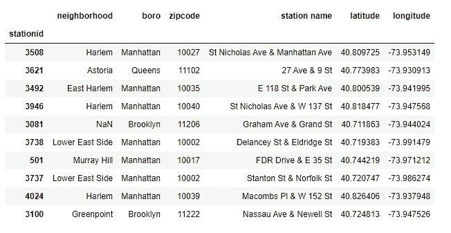

带有街区、行政区和邮政编码的车站

最后，我将这个表保存到磁盘上，这样以后就可以再次使用它，而不必重新创建它。我使用的是 Parquet column store 格式，它比 CSV 文件更节省空间，并且维护我创建的索引和数据类型。

```
dfstations.to_parquet('202009-stations.parquet')
```

我还在 github 上将这个文件保存为[202009-stations . parquet](https://github.com/ckran/bikeshare/raw/main/202009-stations.parquet)，这样你就可以将它下载到你的系统中，而不是自己创建。

```
dfstations = pd.read_parquet('202009-stations.parquet')
```

或者，你可以直接从 github 读取文件。

```
dfstations = pd.read_parquet('[https://github.com/ckran/bikeshare/raw/main/202009-stations.parquet'](https://github.com/ckran/bikeshare/raw/main/202009-stations.parquet'))
```

## 使用位置数据

现在，我可以查看上面提到的三个站点的位置数据，提供一个站点名称列表，以便使用`isin`方法。

```
dfstations.loc[dfstations['station name'].isin\
(['Yankee Ferry Terminal','Picnic Point','Soissons Landing'])]
```

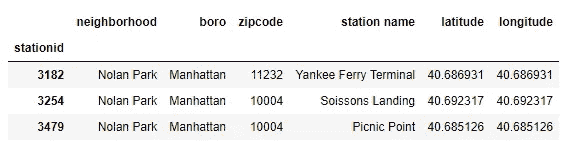

“诺兰公园”车站的位置详情

在这里，我看到所有三个车站都在诺兰公园，我不得不在谷歌上搜索，发现这是纽约港的一个岛屿上的公园。

## 探索站数据

现在我有了一个包含位置的车站表，我可以进一步研究这些数据。例如，我可以用 Seaborn `countplot`按区统计站点，并轻松创建一个图表。

```
sns.countplot(data=dfstations, x="boro") ;
```

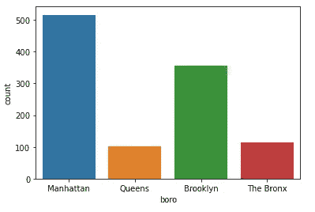

按行政区统计车站数量

我看到花旗自行车仍然主要服务于曼哈顿和布鲁克林。我还可以看到曼哈顿哪些街区的电视台最多。首先创建一个系列，包括曼哈顿拥有最多电视台的 25 个社区。然后用`barplot`给他们看。

```
nabes = dfstations['neighborhood'].loc[dfstations['boro']== 'Manhattan'].value_counts()[:25]plt.figure(figsize=(12,10))
sns.barplot( x=nabes.values , y=list(nabes.index), orient="h"  ) ;
```

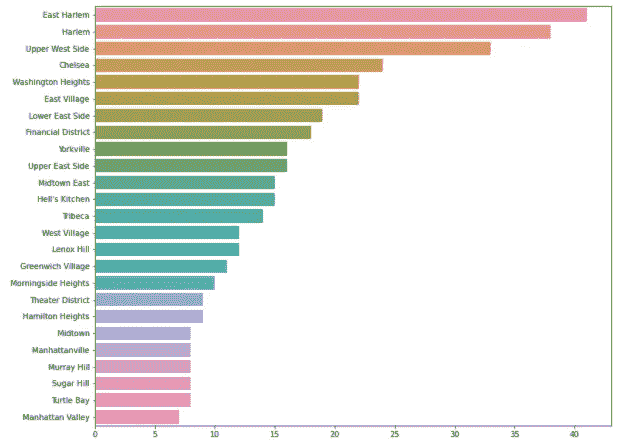

曼哈顿排名前 25 的社区

## 将车站位置与行程数据相结合

真正有用的是，您可以执行 SQL 所称的从带有站点的表到原始旅行数据文件的连接。熊猫把这个操作叫做`merge`。

前两个参数是数据框的名称(对于 stations 表，我使用了一个子集)，然后是可选的连接类型，可以是 inner(默认)、left、right 和 outer，其含义与 SQL 中的含义相同。因为车站表是从行程数据文件中的起始车站导出的，所以我知道它们都匹配。

因为匹配列在两个表中有不同的名称，所以我将它们明确指定为最后两个参数。

```
dfa=pd.merge(df, dfstations[['boro','neighborhood','zipcode']],\
how = 'inner',left_on='start station id', right_on='stationid')
```

仅使用车站表，我就可以计算每个区的车站数量。有了合并的表格，我可以做一个图表，显示从每个区开始的*次行程*的次数。在这里，我看到了花旗自行车*使用率*对曼哈顿的重要性。

```
sns.countplot(data=dfa, x="boro") ;
```

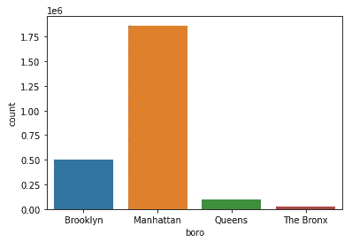

按行政区的行程计数

我可以做另一个连接来添加*和*站的位置细节。对于这个合并，我使用 left(外部连接),因为一些旅程在新泽西结束，所以它们不会被发现。

```
dfa=pd.merge(dfa, dfstations[['boro','neighborhood','zipcode']],\
how='left',left_on='end station id', right_on='stationid')
```

它会产生带有 _x 或 _y 后缀的列名。我可以用 boro 代替 station 做和本文第一个一样的图表。

```
trips=dfa.value_counts(['boro_x','boro_y'])[:10]
trip_names=[trips.index[t][0] + ' / ' + trips.index[t][1] for t in range(len(trips)) ]plt.figure(figsize=(12,10))
sns.barplot( x= list(trips.values), y = trip_names, orient="h") ;
```

图表显示，花旗自行车的“跨区”使用非常少。

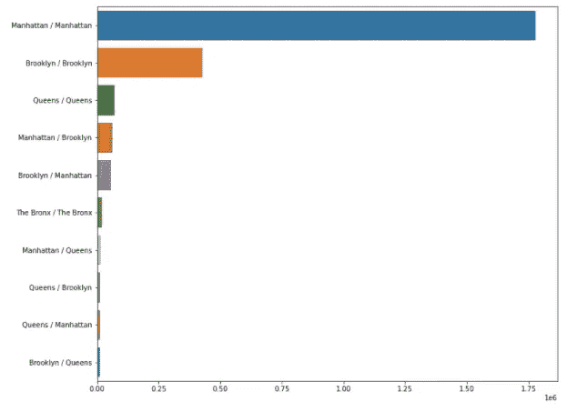

按起始区和结束区统计乘车次数

又一张图表，用街区代替自治市。在这里，我看到大多数花旗自行车的使用是在一个街区内，有时是在相邻的街区。

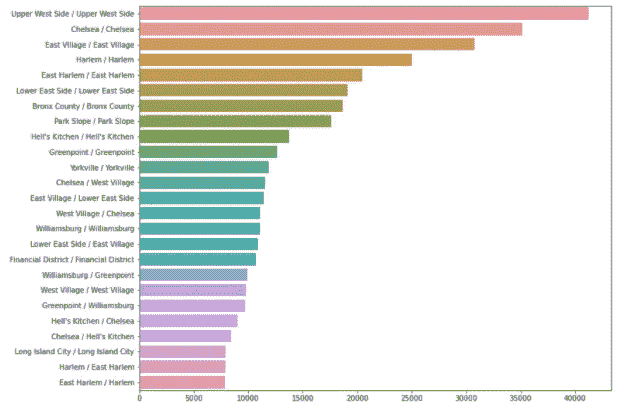

通过开始和结束邻域进行乘车计数

所以我可以看到更多的游乐设施在 UWS 开始和结束，比其他任何社区。切尔西对切尔西第二。但是我想看看其他经常去的地方，比如说切尔西。从这张图表中很难看出这一点。有没有更好的方法来可视化这些数据？事实上，期待我的下一篇文章[用和弦图可视化纽约自行车共享出行](/visualizing-nyc-bike-share-trips-with-a-chord-diagram-eb4c8e14366)。

# 结论

通过使用反向地理编码增加 Citi Bike trip 数据文件，为每次骑行的起点和终点添加行政区和社区信息，我可以对该系统的使用方式有更多的了解。

事实上，数据显示，花旗自行车在曼哈顿的使用率仍然高于其他行政区，几乎所有的行程都在同一个行政区开始和结束，而且大多数行程都在同一个或相邻的社区。尽管花旗自行车是为运输而设计的，但它也用于娱乐，这可以从返回出发地的旅行次数和完全在港口的一个岛上的旅行次数中得到证明。