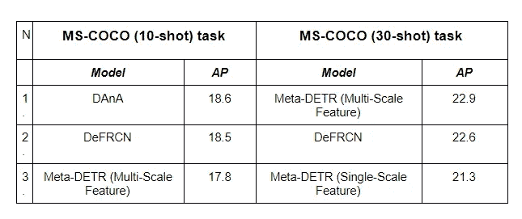
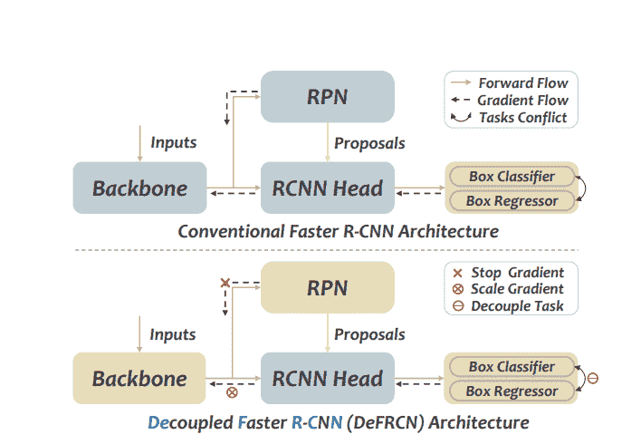
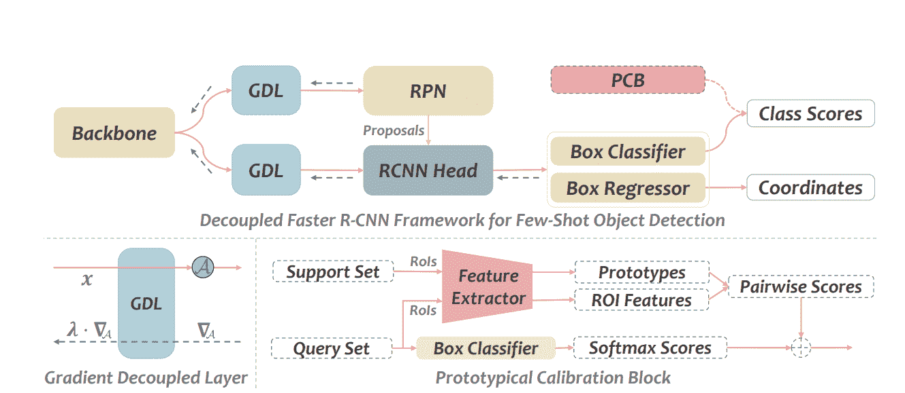
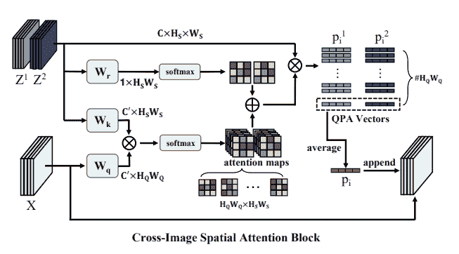
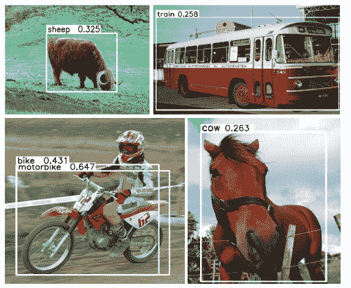

# 少镜头目标检测综述

> 原文：<https://towardsdatascience.com/review-on-few-shot-object-detection-185965e0e6a2?source=collection_archive---------6----------------------->

## 少镜头目标检测的介绍和综述

格伦·卡斯滕斯-彼得斯在 [Unsplash](https://unsplash.com?utm_source=medium&utm_medium=referral) 上拍摄的照片

用于分类和对象检测的深度学习解决方案是计算机视觉的最先进技术，这已经不是新闻了。尽管最近的 SOTA 算法具有很高的精度和速度，但有一个大问题:对于一个性能良好的解决方案，我们需要大量的数据。此外，必须对数据进行注释，这需要大量的手工工作。这就是一些新模式发展的原因，如[自我监督学习](/review-on-self-supervised-contrastive-learning-93171f695140)和少量学习。

少镜头分类的最新进展有助于显著提高分类中“学会学习”问题的性能，然而少镜头目标检测(FSOD)具有很大的发展和改进潜力。围绕这一主题已经进行了大量的研究。然而，与经典的对象检测或少量镜头分类相比，存在巨大的性能差距。

现在让我们更深入地了解 FSOD:

1.  少镜头目标检测的问题定义
2.  基准 3 最近的 SOTA 算法
3.  回顾并比较上述 3 篇论文。

## **少数拍摄对象检测**

少镜头对象检测旨在使用有限的监督和带注释的样本来概括新的对象。设(S1，… Sn)是一组支持类，Q 是一个有多个实例和背景的查询图像。对于给定的(S1，… Sn)和 Q 模型，目标是从 Q 中找到的支持集中检测和定位所有对象。在训练期间，大多数 FSOD 应用程序将类分成两个不重叠的部分:基本类和新类。训练数据集包括用于训练基线模型的基类。然后，在使用基类和新类的组合数据集的情况下，对模型进行微调。最后一个阶段包括在仅由新类组成的数据集上进行测试

这是最流行的少数镜头对象检测问题定义。它可能因纸张不同而略有不同。然而，每个研究的主要思想都是相同的:创建一个模型，它能够以一种类不可知的方式在新的、从未见过的类上找到对象。

## 基准

两个流行的少数镜头对象检测任务被用于基准测试:MS-COCO 10 镜头和 MS-COCO 30 镜头。让我们来看看每项任务的前 3 种模式:

两个不同任务的 3 个模型的基准。按作者分类的图表

根据不同的任务，这 3 种算法优于其他算法，然而，在经典的目标检测任务和少量拍摄的目标检测之间存在巨大的差距。让我们深入其中的每一项，了解每一项的结构和差异。

## [**DeFRCN:解耦的快速 R-CNN，用于少量拍摄的物体检测**](https://arxiv.org/pdf/2108.09017v1.pdf)

顾名思义，该模型改进了快速 R-CNN，用于少量拍摄的目标检测。更快的 R-CNN 由 3 个模块组成:“用于提取广义特征的共享卷积骨干，用于生成类别不可知建议的区域建议网络(RPN)，以及用于执行类别相关分类和定位的特定任务 RCNN 头”[1]。

图 1:更快的 R-CNN 和去耦更快的 R_CNN 架构。图片来源于论文[1](见参考文献)

为了修改更快的 R-CNN 以在少数镜头设置上工作，作者试图解决两个问题:

1.  *多任务学习的问题* : R-CNN 头的模型负责分类，换句话说就是看什么，而 RPN 头的目的是理解看哪里，它解决的是本地化问题。“第一个头部需要平移不变特征，而定位头部需要平移共变特征”[1]。在 FSOD 的情况下，当我们有单独的小任务时，这两个头的联合优化会导致更差的结果。
2.  *共享骨干的问题*。正如我们在上面的图片中看到的，更快的 R-CNN 有一个 2 头共享主干。它在对象检测方面工作得非常好，但是在一些镜头设置中，当针对新类别进行微调时，准确性会有所下降。前景-背景混淆可能出现，这意味着基础训练中的背景可能在新的微调阶段变成前景。这就是为什么来自 RPN 的梯度导致共享主干的过度拟合和模型不能收敛。

为了解决这些问题，作者建议通过添加两个模块来改变该模型:**梯度解耦层(GDL)** 和**原型校准块(PCB)** ，以改善少数镜头设置中的对象检测。让我们仔细看看这些模块。

图 2: DeFRCN 架构。图片来源于论文[1](见参考文献)

正如我们在图 2 中看到的，两个梯度去耦层(GDL)放置在主干后面。GDL 进行仿射变换，该仿射变换由可学习的通道权重来参数化。在前向传播期间，来自共享主干的特征通过 Aᵣₚₙ和 Aᵣ𝒸ₙₙ"[1].被变换到不同的特征空间

定义了常数λ ∈ [0，1]，这有助于在反向传播期间设置主干、RPN 和 RCNN 的去耦度。解耦程度可以通过λᵣₚₙ和λᵣ𝒸ₙₙ来调整，粗略地说，这决定了梯度将对前一层产生多大的影响。要停止来自 RPN 或 RCNN 的更新，我们可以设置λ = 0。否则，我们可以通过设置λ大于 0 来缩放梯度。换句话说，λᵣₚₙ和λᵣ𝒸ₙₙ决定了共享主干上每个 RPN 和 RCNN 的各自贡献。这解决了共享主干的第二个问题。

论文的下一个输入是原型校准块。分类需要翻译不变特征，而定位需要翻译共变特征。因此，本地化分支可能迫使主干逐渐学习翻译协变属性，这潜在地降低了分类器的性能。PCB 包括来自 ImageNet 预训练模型的强分类器、RoIAlign 层和原型库”[1]。

首先，它从支持集计算原型。我们来定义一个 M 路 K 拍设置的几拍问题。PCB 从支持集图像中提取特征图。使用 RoIAlign 将这些特征地图与地面实况框对齐后，它会生成 MK 实例表示。然后，它将表示缩小为一个原型银行。

对于来自微调的少镜头检测器的对象提议，PCB 首先在预测的盒子上执行滚动，并生成对象特征。然后计算该目标特征和支持集原型之间的余弦相似性 sᵢᶜᵒˢ。这种相似性被用作预测类别的得分。为了计算最终的分类分数，模型在 PCB ( sᵢᶜᵒˢ)给出的分数和微调的少发探测器(sᵢ)给出的分数之间进行加权聚合。

在少触发检测器和 PCB 模块之间没有共享的参数，使得 PCB 不仅可以保持分类目标平移不变性特征的质量，而且可以更好地分离 RCNN 内的分类任务和回归任务。此外，由于 PCB 模块是离线的，无需任何进一步的培训，它可以即插即用，很容易装备到任何其他架构，以建立更强大的少击探测器”[1]。

## <https://arxiv.org/pdf/2102.12152v3.pdf>**双感知注意少拍物体检测**

**本文作者提出了另外两个问题:**

1.  ***支持特性的质量问题*:在 FSOD 期间，我们关于新对象的支持信息有限，因此我们需要高质量的特性以获得更好的结果。为了解决这个问题，作者们正试图削弱噪音的影响。**
2.  **相关性问题:同样，由于示例数量有限，很难获得支持集和查询集之间的高度相关性。这里的目标是提高对象间的相关性。**

**作者提出了一种称为双意识注意(DAnA)的新机制，它结合了两个新模块，称为背景衰减(BA)和跨图像空间注意(CISA)。**

**为了削弱噪声影响**背景衰减块(BA)** 被提出。下图显示了该模块的结构。首先，通过线性可学习矩阵 Wₑ.对支持特征图进行整形和变换**

****

**图 3:背景衰减块。图片来源于论文[2](见参考文献)**

**使用支持特征图的每个像素和 Wₑ.来计算注意力图接下来，他们将注意力地图与支持特征相结合，给出最重要的特征。最后，leaky relu 被用于一种更柔和的注意力策略。这种变换有助于获得更具区分性的支持特征。**

**本文提出的下一个区块称为**跨图像空间注意区块(CISA)** 。该块的目标是帮助模型关注对象的最有代表性的部分，以确定类内相似性。**

****

**图像 4:跨图像空间注意块。图片来源于论文[2](见参考文献)**

**“跨图像空间注意(CISA)的核心思想是自适应地将每个支持特征图转换成表示支持图像的特定信息的查询位置感知(QPA)支持向量”[2]。**

**设 Z 表示在 BA 块中处理支持特征映射，X 表示查询特征映射。CISA 使用 W𝓺和 Wₖ权重矩阵将 x 和 z 转换成查询和密钥嵌入𝑸和𝓚。**

**然后，它计算查询和支持之间的相似性得分:**

****

**其中𝑸和𝓚是所有像素的平均嵌入值。**

**对于下一步，添加了自我关注，因为作者假设关注不仅应该基于查询-支持相关性，还应该基于支持图像本身。**

****

**𝛽是一个常数系数。**

**最后的变换是通过将上述结果乘以位置感知支持特征图 z 来计算查询位置感知向量。该结果准备好被传递给对象检测。**

**DAnA 可以与对象检测框架相结合。因此，CISA 输出可以与查询要素地图相结合，并发送到区域建议网络等模块。作者在 fast-RCNN 和 RetinaNet 上进行了实验。**

## **[**元 DETR:利用类间相关性的图像级少镜头物体检测**](https://arxiv.org/pdf/2103.11731v3.pdf)**

**大多数少镜头对象检测框架结合了元学习技术和对象检测模型。Meta-DETR 也是如此。大多数方法基于更快的 R-CNN 或类似的对象检测算法。尽管这些模型取得了成就，但本文的研究人员发现了两个主要问题，并试图通过他们的解决方案来改善这些问题。**

****

**图 5:相似类之间分类不良的问题。图片来源于论文[3](见参考文献)**

1.  **区域提议的问题:这可能在大量图像上工作得很好，但是在少量拍摄的情况下，我们每个类只有有限数量的例子。此外，我们试图在新颖的类上进行概括，这使得更难获得高质量的区域提议。**
2.  ***元学习任务定义不清的问题。*每个支持类都被单独处理，这导致了很好地区分类似类的问题，如自行车和摩托车、牛和羊等(图 5)。**

**图 6 描述了整个元 DETR 算法。首先，具有共享权重的特征提取器被用于查询和支持图像。**

****

**图 6:元 DETR 算法架构。图片来源于论文[3](见参考文献)**

**为了解决相似类之间高度相关的问题，作者提出了一种新的模块，称为**相关聚集模块(CAM)。**它将查询特性与支持类聚合在一起，以进行与类无关的预测。与其他方法的主要区别在于，它可以同时聚合多个支持类，这有助于捕捉类间相关性并减少误分类。CAM 首先将查询特征与一组支持类进行匹配。然后，它将一组支持类映射到一组预定义的任务编码，这些编码以类不可知的方式区分这些支持类。**

**CAM 输出支持聚合的查询特征，然后这些特征成为用于对象检测的基于转换器的模型的输入。最近提出的可变形 DETR 用于物体检测。DETR 使用变换技术进行一阶段目标检测，因此在算法中没有区域建议。这解决了论文中提出的下一个问题:低质量区域建议。**

**匈牙利损失用于模型，与可变形 DETR 相同。此外，在 CAM 之后使用余弦相似交叉熵来分类类原型。**

**该算法的训练过程与上述相同。首先，使用基本数据集进行全面训练，然后使用新类和基本类进行微调。**

## **结论**

**每篇论文的作者都试图用一种新的创造性方法来解决少镜头目标检测问题。如上所述，经典物体检测和 FSOD 的精确度之间存在巨大差距。然而，这种模式有巨大的潜力，希望有一天我们可以拥有像经典物体检测一样有效的 FSOD 算法。**

## **参考**

**[1]乔，李，赵，杨，李，赵，邱，徐，吴，张，[解耦快速 R-CNN 用于少镜头目标检测](https://arxiv.org/pdf/2108.09017v1.pdf) (2021)。| [Github](https://github.com/er-muyue/DeFRCN)**

**[2]陈，陈，刘，杨，苏，洪，常，杨，林，杨，叶俊杰，徐文辉(2021)。| [Github](https://github.com/Tung-I/Dual-awareness-Attention-for-Few-shot-Object-Detection)**

**[3]张刚，罗，z，崔，k，陆，s，【元】:利用类间相关性的图像级少镜头目标检测 (2021)。| [Github](https://github.com/ZhangGongjie/Meta-DETR)**