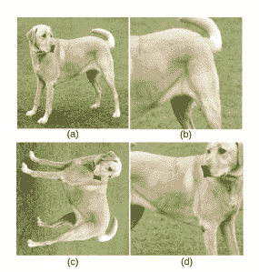
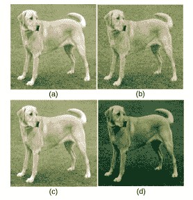
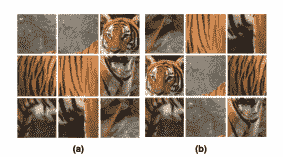
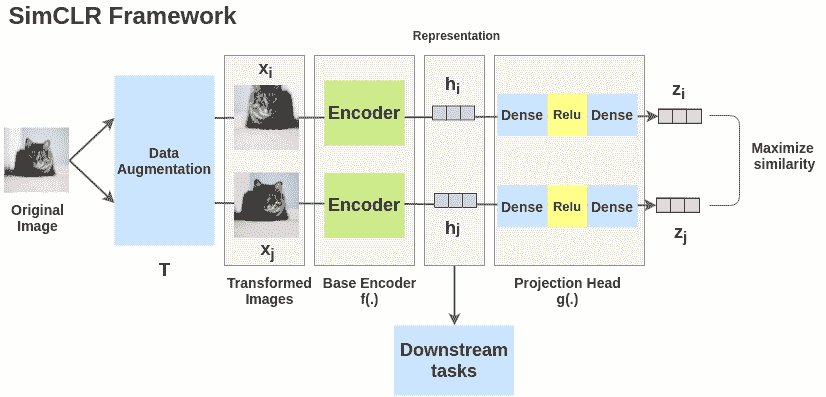
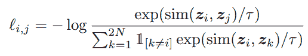
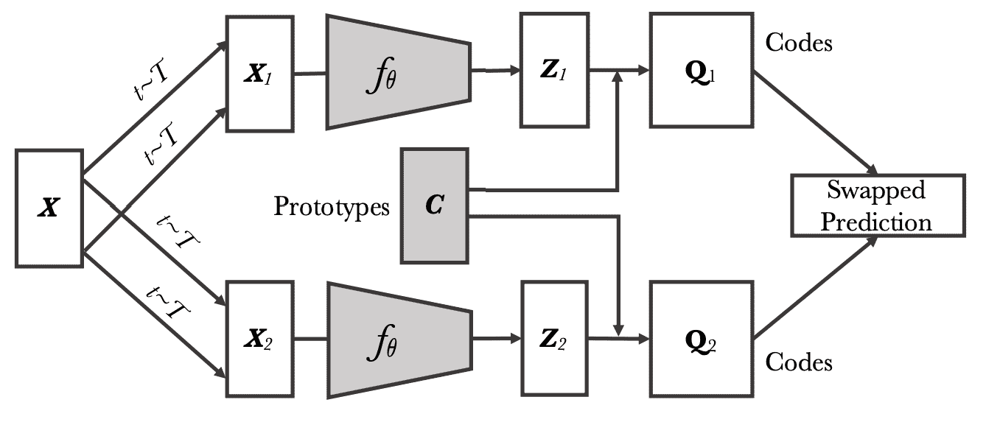
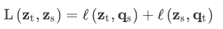
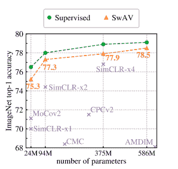

# 自我监督对比学习述评

> 原文：<https://towardsdatascience.com/review-on-self-supervised-contrastive-learning-93171f695140?source=collection_archive---------9----------------------->

## 自我监督对比学习简介与综述

在过去的几年里，对比学习和自我监督技术成为计算机视觉领域的一个热门话题。来自不同人工智能研究实验室的许多研究人员正在致力于创建新的架构，并探索这些技术的有效性。

在本文中，我们将讨论自我监督对比学习的优点和缺点，概述最近的进展，然后回顾最近两个最流行的算法:SwAV 和 SimCLR。让我们深入了解一下！

为什么自我监督学习的想法对许多专业人士如此有吸引力？作为数据科学家，我们几乎总是面临缺乏有标签的干净数据的问题。为了进行目标检测或分割，我们需要大量的标记数据。有时候注释那么多数据是很昂贵的，在某些情况下，我们甚至不能从特定领域获得足够的数据。这就是自我监督技术派上用场的地方！

## **自我监督学习和对比学习**

自我监督学习是非监督学习的一个子集。与监督学习不同，它不需要任何标记数据。相反，它创建自定义的伪标签作为监督并学习表示，然后在下游任务中使用。

自我监督学习主要用于两个方向:GANs 和对比学习。对比学习的目的是将相似的样本分组，而将不同的样本分组。

对比学习的主要动机来自人类的学习模式。人类在不记得所有小细节的情况下识别物体。例如，我们很容易根据颜色、形状和某些其他特征来查看图像并在其中找到表格。粗略地说，我们在头脑中创建某种表征，然后用它来识别新的物体。自我监督学习和对比学习的主要目标分别是创建和概括这些表征。

自我监督的任务被称为借口任务，它们旨在自动生成伪标签。有很多不同的方法可以自动创建任务，比如

1.  颜色增强
2.  图像旋转和裁剪
3.  其他几何变换。

例子 a .几何变换，b .颜色变换，c .拼图游戏:图片来源[1]

有许多新的方法和技术来进行自我监督的对比学习。这些技术的三个最重要的组成部分是托词任务的定义、主干和对比损失。为了找到这些组件的最佳组合，进行了许多研究。

这一领域最受欢迎的两部作品是:

1.  SimCLR [3]:由 Google Research 创建的算法
2.  SwAV [2]:由脸书研究所发布的最新算法

## 视觉表征对比学习的简单框架(SimCLR)

图片来源:【https://amitness.com/2020/03/illustrated-simclr/ 

为了创建 SimCLR 的架构，Google 研究团队通过比较自我监督学习算法的不同组件做了大量的工作，最终，他们找到了最佳架构，该架构在论文发表时是对比学习中的 SoTA。他们的架构由四个主要组件组成:

1.  数据扩充
2.  基本编码器
3.  投影头
4.  对比损失

为了创建托辞任务，SimCLR 使用数据扩充。作者尝试了许多不同的增强构图，并通过随机裁剪、调整大小、颜色失真和高斯模糊获得了最佳效果。他们表明，随着扩充变得越来越复杂，模型开始表现得更好。

第二个组件是基本编码器。他们评估了许多不同的主干，因此他们使用了不同深度的 ResNet。他们的研究表明，更深层次的网络能显著提高训练效果。

下一个实验是选择投影头。具有投影头的架构在下游任务上显示出比没有投影头的架构好得多的结果。进行了许多实验来选择模型的最终结构。因此，选择 Danse-Relu-Dense 结构作为投影头。

最后但同样重要的是:损失函数。归一化温度尺度交叉熵损失(NT-Xnet)被用作对比损失，其目的是拉近表征并推开不同表征。

(1)标准化温度标度交叉熵损失(NT-Xnet)

首先，计算一个正表示和所有其他负表示之间的相似性。余弦相似性被用作距离度量。接下来，用负交叉熵损失(1)来计算正的一对示例(I，j)的损失函数。计算所有正对的最终损耗。

如上所述，进行了大量的实验，最终，研究团队展示了导致他们成功的主要结果:即**扩大规模显著提高性能**。缩放意味着使用更大的批量(对于模型，训练批量从 256 到 8192 不等)、更大的主干以及更长时期的训练(即使在 800 个时期的训练之后，SimCLR 也可以继续其改进)。

## **在多个视图之间交换任务(SwAV)**

最近的 SoTA 在自我监督学习是由脸书研究所提出的。像 SimCLR 一样，SwAV 架构也是基于对自我监督学习技术的不同组件的实验而创建的。然而，他们的成功是基于他们在架构上做出的两大改变:增强类型和集群而不是投影头。这是他们建筑的最终结构:

1.  多作物种植
2.  基本编码器
3.  使聚集
4.  损失与“交换”预测问题。

SwAV 架构:图片来源[2]

对于数据扩充，SwAV 再次使用几何和颜色变换，然而，作者提出了一种新的独特而有效的技术来创建托词任务。这项技术被称为多作物种植。这种类型的增强创建了相同图像的多个视图，而不增加计算成本。在增强之后，我们得到标准高分辨率(224X224)图像的两个变体，以及同一图像的许多采样低分辨率(96x96)视图。这些视图是从主样本图像裁剪和颜色增强的。使用低分辨率视图有助于在不增加太多计算的情况下获得更好的图像样本。

对于基本编码器，再次使用具有不同深度的 ResNets。

该模型的主要区别之一是第三个组件:集群分配。聚类算法的主要问题是它们离线工作，这意味着我们需要将整个数据集提供给算法来获得分配。这在自我监督的环境下是行不通的。SwAV 作者将聚类视为在线任务，并向聚类算法提供小批量数据。Sinkhorn Knopp 算法用于聚类。

为了计算 SwAV 的损失，作者使用了交换问题技术。

(2)交换损失

这里，l(z，q)表示交叉熵，其中 q 被称为代码(聚类的输出)，z 是图像特征和所有原型之间的点积的 softmax。法典可以被认为是基本真理。假设同一图像的两个不同视图的表示应该包含相似的信息，因此应该可以从另一个视图的表示中预测一个视图的代码。

## **基准测试结果**

自监督模型的基准结果:图像源[2]

## **结论**

对下游任务的基准测试结果表明，自我监督技术目前还不能超过监督学习技术，但这些都是强大的方法，可以用于不同的领域，其中数据注释稀缺或难以标记数据是具有挑战性的。

## 文学

[1]https://arxiv.org/pdf/2011.00362.pdf

[2][https://arxiv.org/pdf/2006.09882.pdf](https://arxiv.org/pdf/2006.09882.pdf)

[3][https://arxiv.org/pdf/2002.05709.pdf](https://arxiv.org/pdf/2002.05709.pdf)