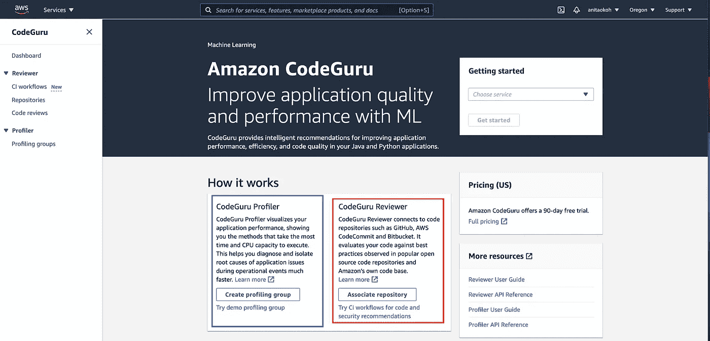
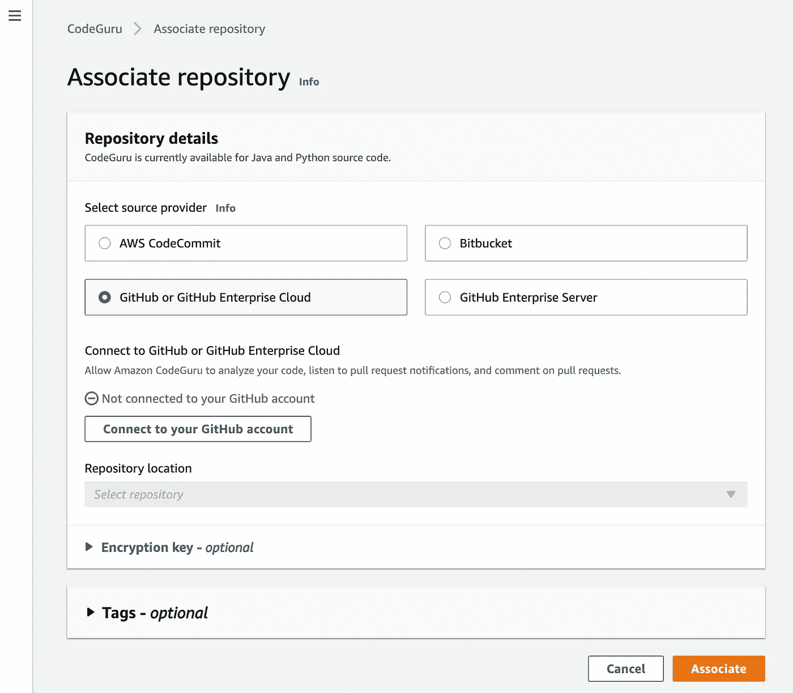
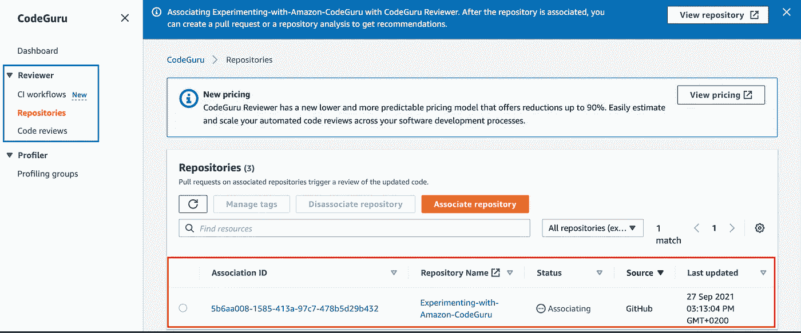
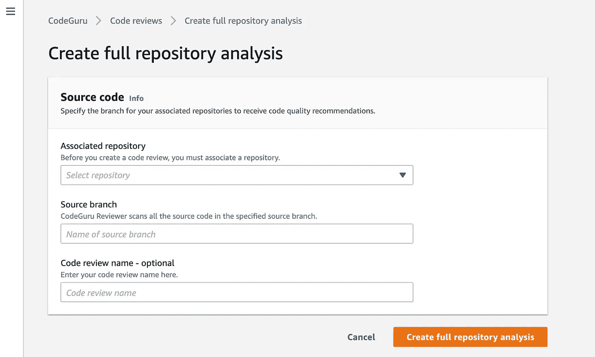
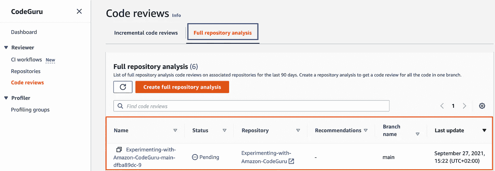
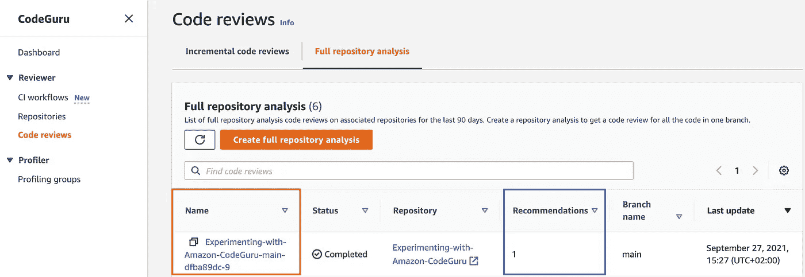
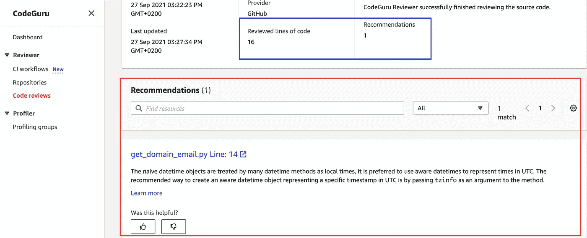
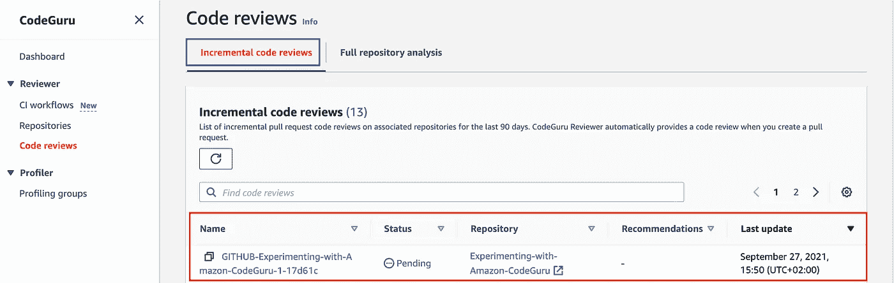

# 使用 Amazon CodeGuru Reviewer 检查 Python 脚本

> 原文：<https://towardsdatascience.com/reviewing-python-scripts-using-amazon-codeguru-reviewer-36927f213d01?source=collection_archive---------36----------------------->

## 了解 Amazon CodeGuru Reviewer 和自动化代码评审的方法

图片来自 [Unsplash](https://unsplash.com/photos/iar-afB0QQw?utm_source=unsplash&utm_medium=referral&utm_content=creditShareLink)

2020 年的某个时候，AWS 推出了一项名为**亚马逊代码大师**的新服务。
CodeGuru 主要有两种服务:**CodeGuru Profiler**和 **CodeGuru Reviewer** 。

对于本文，我们将更多地关注 CodeGuru 评审员。

## 什么是 Codeguru 评审员？

> 根据 **AWS 用户指南**，**亚马逊 CodeGuru Reviewer** 是一项使用程序分析和机器学习来检测开发者难以发现的潜在缺陷的服务，并提供改进你的 Java 和 Python 代码的建议。

通俗地说，它审查您的代码，并在检测到潜在缺陷时给出建议。

不幸的是，这些建议并不详尽。它有九个方面

*   AWS 最佳实践
*   并发
*   资源泄漏预防
*   防止敏感信息泄露
*   常见的编码最佳实践
*   重构
*   输入验证
*   证券分析
*   代码质量

*你可以在这里* *找到更多关于以上九个方面的信息* [*。知道该服务目前只支持 Java 和 Python 语言也很好。*](https://docs.aws.amazon.com/codeguru/latest/reviewer-ug/recommendations.html)

**让我们使用 Amazon CodeGuru Reviewer** 进行一次简单的代码审查。

在开始之前，请确定以下事项。

*   您已经有了要使用的测试存储库。在这里随意克隆我在这个演示中使用的测试库[。](https://github.com/anitaokoh/Experimenting-with-Amazon-CodeGuru)
*   您知道如何运行简单的 git 任务，比如创建一个新的分支，提交和推送变更等。这里的是这方面的一篇复习文章。
*   您知道如何在 GitHub 上创建 Pull 请求。[这里](https://docs.github.com/en/github/collaborating-with-pull-requests/proposing-changes-to-your-work-with-pull-requests/creating-a-pull-request)是这方面的复习文章。
*   您拥有 AWS 管理帐户，可以使用 AWS 控制台查找服务。您可以在这里创建一个免费的等级帐户[，并使用](https://aws.amazon.com/free/?trk=ps_a131L0000085DvcQAE&trkCampaign=acq_paid_search_brand&sc_channel=ps&sc_campaign=acquisition_US&sc_publisher=google&sc_category=core&sc_country=US&sc_geo=NAMER&sc_outcome=acq&sc_detail=aws%20free%20tier&sc_content=Account_e&sc_segment=432339156165&sc_medium=ACQ-P|PS-GO|Brand|Desktop|SU|AWS|Core|US|EN|Text&s_kwcid=AL!4422!3!432339156165!e!!g!!aws%20free%20tier&ef_id=EAIaIQobChMI5J_dk9GA8wIVmIzICh1ULQAqEAAYASAAEgLOhPD_BwE:G:s&s_kwcid=AL!4422!3!432339156165!e!!g!!aws%20free%20tier&all-free-tier.sort-by=item.additionalFields.SortRank&all-free-tier.sort-order=asc&awsf.Free%20Tier%20Types=*all&awsf.Free%20Tier%20Categories=*all)[这个](https://aws.amazon.com/console/)来帮助您快速使用 AWS 管理控制台。

如前所述，我特别为这个演示创建了一个简单的存储库。这里可以找到[。](https://github.com/anitaokoh/Experimenting-with-Amazon-CodeGuru)

存储库包含一个`.py`文件。我们会用这份文件来进行审查。

## 让自己熟悉这项服务

Gif 来自 [Giphy](https://giphy.com/gifs/coffee-suicide-squad-harley-quinn-Wp0ZtQjgViqR2)

*   前往 AWS 管理控制台，搜索**亚马逊代码大师**或**代码大师**。一旦你选择了搜索，你就会被带到 Amazon CodeGuru 控制台。在那里，您将看到两个可用的主要服务:**剖析器**和**评审器**。

作者截图

*   点击显示 Codeguru associate repository*(在红色框突出显示的下面)*的部分按钮。通过这种方式，CodeGuru Reviewer 可以访问您选择的存储库。

您会看到一个类似这样的页面表单。

作者截图

在这一页上，有四件重要的事情要做

1.  指定要使用的源提供程序。由于演示资源库目前存储在 GitHub 中，所以我们选择 GitHub。
2.  因为我们选择了 Github，所以我们需要通过点击 Connect to Github 按钮将服务连接到我们的 GitHub，并允许服务访问您的 Github *(注意，选项根据您选择的源提供者而变化)*。
3.  选择特定的演示存储库。在我的例子中，我会选择名为**与亚马逊代码大师**一起实验的存储库。
4.  点击按钮:**关联仓库**。

点击按钮后，您将被重定向到如下所示的页面。

作者截图

您会注意到**状态** s 字段*(在突出显示的红色区域内)* 在一段时间后从**关联**变为**关联**。

导航到上面蓝色突出显示的菜单部分中的**代码审查**页面。

它会带你到一个像这样的页面

作者截图

在 code reviews 页面上，您会注意到两个选项卡(突出显示的红色和蓝色):

*   **完整存储库分析**:审查特定 Git 分支存储库中的所有代码，并在必要时返回建议。
*   **增量代码评审**:只评审更新的代码行，它由**拉请求(PR)触发**。

点击此处了解更多关于两种点评类型[的信息。](https://docs.aws.amazon.com/codeguru/latest/reviewer-ug/repository-analysis-vs-pull-request.html)

## 演示 1:完整的存储库分析

要获得完整的存储库分析，请点击**完整存储库分析**选项卡并选择**创建完整存储库分析**。您将被重定向到下面的页面。

作者截图

您需要在这里指定

*   您想要查看哪个关联存储库*(在本例中:*[***)Experimenting-with-Amazon-CodeGuru***](https://github.com/anitaokoh/Experimenting-with-Amazon-CodeGuru)*)*
*   而分支代码是在*(在本例中，分支是* ***主*** *分支)*。
*   你可以**选择**给出一个代码评审名。然而，这位代码权威评审者会自动生成一个名字。但是，可以随意修改。

在上面的表单页面中点击**创建完整的存储库分析**按钮之后，您将被重定向到显示评审状态的上一个页面。

它看起来像这样。

作者截图

一旦完成，状态从**未决**变为**完成**

作者截图

*(状态也可以更改为失败。大多数情况下，这是由于表单页面中的输入不正确，例如，用于查找代码脚本的错误分支名称等。)*

从上面可以立即看到它输出了多少条建议

您可以通过点击*(突出显示的红色)*上方的**名称**字段下的链接找到建议。你会看到下面的页面。

作者截图

所有建议都可以在该页面上阅读。您也可以直接在您的 GitHub 存储库上查看这些建议。

## 演示 2:增量代码评审

> 请记住:
> 
> 增量代码评审只有在关联的存储库上进行 PR 时才会被触发。

我继续添加了一个修改，通过在下面的代码中取消对`return`命令上面的`print`语句的注释，使`.py`文件生效。

通过[共享 Deepnote](https://deepnote.com/sign-in?token=095f134f)

接下来，我做了下面一系列的事情

*   创建名为 **trigger_pr，**的分支
*   添加、提交所做的更改并将其推送到该分支。
*   最后，我在 Github 中创建了一个 Pull 请求，将 **trigger_pr** 分支合并到**主**分支。

我一创建 PR，就会触发**增量代码评审**，自动**开始**增量代码评审**。**

您可以通过返回到代码评审页面来确认这一点，并且您将会在增量代码评审选项卡下看到正在进行的评审，就像这样。

作者截图

像**完整存储库分析**过程一样，当完成时，状态从**待定**变为**完成**。您还可以查看输出了多少条建议*(如果有，即建议可能为零)*，并按照您在上面查看的方式查看这些建议。

> 一个优秀的宠物项目应该是弄清楚如何使这个过程成为一个工作流程，而不是每次你需要审查某个东西时手动点击按钮或填写表格。

在 GitHub 的这里找到代码演示[。](https://github.com/anitaokoh/Experimenting-with-Amazon-CodeGuru)

## 亚马逊 CodeGuru Reviewer 的潜在应用有

*   面试带回家测试的自动化代码审查。
*   当没有人审查 PR 时，自动进行 PR 审查。它还可以帮助人类评审者基于建议关注哪里，从而缩短评审过程时间。