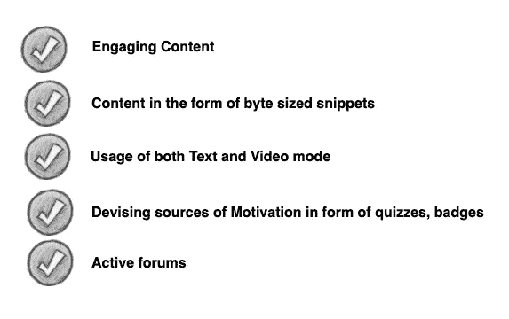
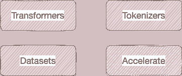
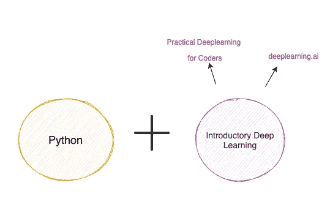
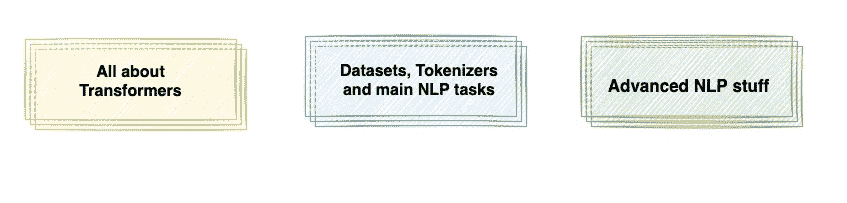
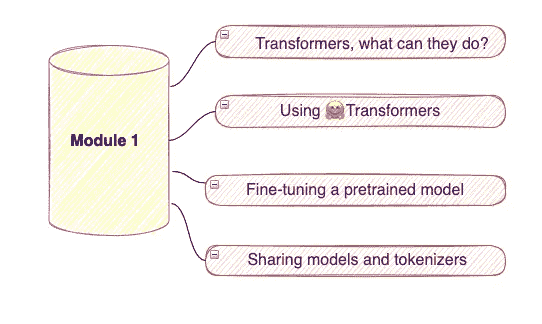
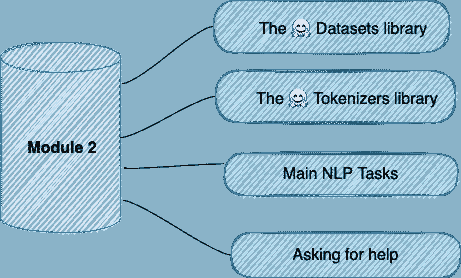
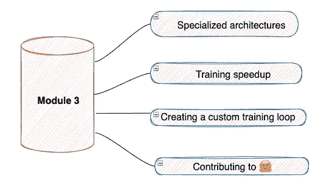
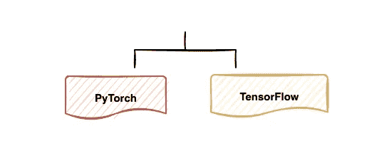
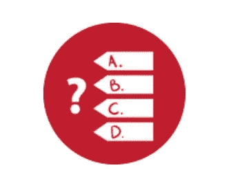

# 回顾最近发布的拥抱脸🤗课程

> 原文：<https://towardsdatascience.com/reviewing-the-recently-released-huggingface-course-a6b4ace16167?source=collection_archive---------10----------------------->

## 课程内容的概述和浏览

该上另一门课了|作者图片

大规模开放在线课程(**mooc**)是自学成才的数据科学家生活中不可或缺的一部分。如果你在一个满是想要成为数据科学家的房间里，有可能他们中的百分之五十都上过著名的吴恩达的[机器学习课程。然而，问题就在这里。尽管我们中的许多人注册了各种在线课程，但只有少数人完成了这些课程。事实上，一项名为](https://www.coursera.org/learn/machine-learning)[为什么 MOOCs 不起作用的研究在 3 个数据点](https://www.insidehighered.com/digital-learning/article/2019/01/16/study-offers-data-show-moocs-didnt-achieve-their-goals)中声称，在线课程的完成率和保留率是最低的。虽然有些人可能会说，学生必须有足够的动力来完成一门课程，但责任也落在内容创作者身上。

一个伟大的 MOOC 的食谱|作者的图片

我和很多人交流过，并听取了他们对发布内容的反馈。如果一门课程检查了以上五点，我相信它会成为一次很好的学习经历。

那么，为什么突然深入在线课程呢？这是因为最近，团队在 [**抱紧脸**](https://huggingface.co/) **🤗**用抱脸库 在 NLP 上发布了他们的 [**免费课程。这门课程将让许多人不仅了解他们的图书馆，而且了解如何在 NLP 中完成最先进的任务。拥抱脸是自然语言处理生态系统中一个非常著名的名字。除了有一个很酷的标志，他们还被认为是 NLP 领域的民主化。**](https://huggingface.co/course/chapter1)

在这篇文章中，我们将走过，并得到一个课程的游览。然后，我们将查看课程内容、课程设置，以及它是否符合我们的需求。所以让我们开始吧。

🔖[抱脸](https://medium.com/u/b1574f0c6c5e?source=post_page-----a6b4ace16167--------------------------------)课程链接:[https://huggingface.co/course/chapter1](https://huggingface.co/course/chapter1)

# 关于❓的课程是什么

本课程的重点是使用 HuggingFace 生态系统教授自然语言处理的细节。尽管该课程是针对初学者的，但在某种程度上，它对中间用户和专家都有帮助。本课程的主要目标是强调四个重要的拥抱面部库的内部工作原理和用法:

拥抱脸库|作者图片

*   [**变形金刚**](https://github.com/huggingface/transformers) 是一个库，提供了数千个像 BERT、GPT-2、RoBERTa、XLM、DistilBert、XLNet 等预先训练好的模型。，对文本执行任务，如分类、信息提取、问题回答、摘要、翻译、文本生成等。
*   [**分词器**](https://huggingface.co/docs/tokenizers/python/latest/) 将文本输入转换成数值数据。
*   [**Datasets**](https://huggingface.co/docs/datasets/) 是一个轻量级的可扩展库，可以轻松共享和访问数据集以及自然语言处理(NLP)的评估指标。
*   [**加速**](https://github.com/huggingface/accelerate) 库支持在多个 GPU 或 TPU 上分布式训练 Pytorch 模型，只需少量调整

除此之外，课程还会教你如何使用[抱脸毂](https://huggingface.co/models)。整个课程以短视频片段的形式，并配有文字解释和可重复使用的代码。

# 什么是 pre-requisites❓

这门课程有几个先决条件，所以你可以充分利用它。它要求你对 Python 有很好的理解，并具备一定水平的基础深度学习知识。此外，在 [Pytorch](https://pytorch.org/) 或 [Tensorflow](https://www.tensorflow.org/) 方面有一些经验将会有所帮助。

课程的先修课程|作者图片

# 这门课包括❓的哪些内容

课程分为三个主要模块，每个模块又分为章节或小节。随着您的进步，这些模块会越来越先进。主要模块如下:

课程的三个模块|作者图片

> 目前，只发布了第一个模块。其余两个模块将在未来几个月内推出。

## 模块 1

第一模块的内容(内容取自课程页面)|作者图片

第一个模块介绍了变压器库的概念以及如何使用它。此外，它还教授如何使用来自[拥抱面部中枢](https://huggingface.co/models)的模型，在数据集上对其进行微调，然后在中枢上共享结果。

该模块进一步分为四章:

*   **第 1 章**

本章介绍了 NLP，以及为什么文本处理对机器学习从业者提出了挑战。然后解释了**管道的概念—** 管道是🤗变形金刚图书馆。

> 它将模型与其必要的预处理和后处理步骤联系起来，允许我们直接输入任何文本并获得可理解的答案——来源【HuggingFace 课程】

您可以将管道方法应用于几个 NLP 任务，如文本生成、文本分类、问题回答和许多其他任务。然后，您将深入了解**变压器**模型以及**编码器**、**解码器**和**序列到序列模型**的架构和工作原理。最后，您将了解编码器、解码器和编码器-解码器模型。

*   **第二章**

现在你知道变压器是什么，管道是如何工作的，你会看到它是如何工作的。您将使用 Transformer 模型和 tokenizers 来复制`pipeline` API 的行为。您还将了解到**记号赋予器**以及它们如何将文本转换成模型可以理解的输入。

*   **第三章**

事情现在开始有点进展了。本章重点介绍**定制数据集的预训练** NLP 模型。您将学习如何利用高级的`**Trainer**` API 来微调模型，然后使用🤗**加速**库在多个 GPU 和 TPU 上训练你的 Pytorch 模型。

*   **第四章**

最后一章集中在拥抱脸生态系统的社区方面。它将教你如何浏览**模型中心**，这样你不仅可以使用社区培训的模型，还可以贡献你自己的模型。

## 模块 2

第二模块的内容(内容取自课程页面)|图片由作者提供

第二个模块深入到 Huggingface **数据集**和**记号化器**中。一旦你对第一个和第二个模块有了相当好的理解，你将能够运用所学的知识来处理最常见的 NLP 任务。

## 模块 3

第三模块的内容(内容取自课程页面)|图片由作者提供

如果你想学习如何为特定用例编写**自定义对象**或者理解**专用架构**，这个模块不会让你失望。在本模块结束时，您应该了解 HuggingFace 生态系统，并以有意义的方式解决复杂的 NLP 问题。

> 单元 2 和单元 3 的章节发布后，文章将会更新

# course❓使用哪些框架

该课程在 [Pytorch](https://pytorch.org/) 和 [Tensorflow](https://www.tensorflow.org/) 都有。因此，如果您对这两个图书馆中的任何一个都感到满意，您应该可以开始了。此外，该课程可以很容易地跟随谷歌 Colab 笔记本电脑。

# 有奖问答🏅

每章的末尾都提供了补充测验来测试你的理解程度。然而，了解你是否真正掌握了材料的一个很好的方法是在你自己的项目中或通过与社区合作来利用所学的知识。

# 结束语🌟

那么，回到我们的问题，这个 MOOC 是否符合正确的标准？绝对的。课程内容是有意义的，有趣的，是很长一段时间所需要的。每个模块都经过精心策划，从简单到系统地推进。这可以防止初学者一开始就失去兴趣。该课程还鼓励参与者使用自己的例子或数据进行实验，这是一个好主意。MOOCs 缺乏互动性，包括测验和“尝试自己”练习可以帮助克服这一点。

*👉有兴趣看我写的其他文章。这个* [*回购*](https://github.com/parulnith/Data-Science-Articles/blob/main/README.md) *包含了我分类写的所有文章。*