# 查看 TensorFlow 决策森林库

> 原文：<https://towardsdatascience.com/reviewing-the-tensorflow-decision-forests-library-1ecf50ae00c3?source=collection_archive---------17----------------------->

## 使用 Tensorflow 和 Keras 构建基于树的模型的库

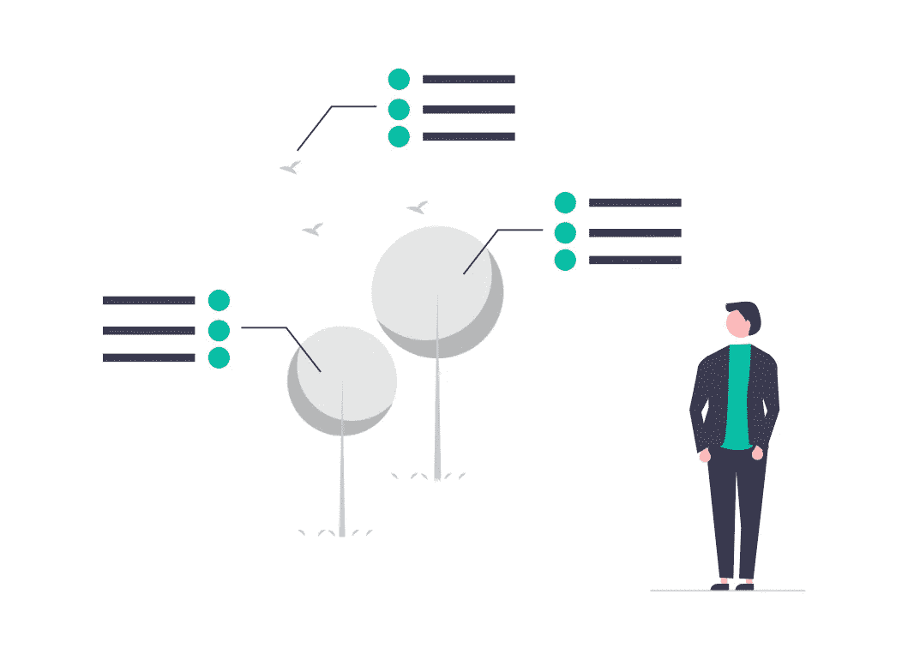

感谢[https://undraw.co/illustrations](https://undraw.co/illustrations)提供免费插图

在他们的论文 [*表格数据:深度学习不是你需要的全部*](https://arxiv.org/abs/2106.03253?utm_campaign=Breaking%20the%20Jargons&utm_medium=email&utm_source=Revue%20newsletter) 中，作者认为，尽管深度学习方法在图像和文本领域取得了巨大成功，但传统的基于树的方法如 XGBoost 在表格数据方面仍然大放异彩。作者检查了 [Tabnet](https://arxiv.org/abs/1908.07442?utm_campaign=Breaking%20the%20Jargons&utm_medium=email&utm_source=Revue%20newsletter) 、[神经不经意决策集成(节点)](https://arxiv.org/abs/1909.06312?utm_campaign=Breaking%20the%20Jargons&utm_medium=email&utm_source=Revue%20newsletter)、 [DNF 网](https://arxiv.org/abs/2006.06465?utm_campaign=Breaking%20the%20Jargons&utm_medium=email&utm_source=Revue%20newsletter)和 [1D-CNN](https://paperswithcode.com/method/1d-cnn?utm_campaign=Breaking%20the%20Jargons&utm_medium=email&utm_source=Revue%20newsletter) 深度学习模型，并使用 [XGBoost](https://arxiv.org/abs/1603.02754?utm_campaign=Breaking%20the%20Jargons&utm_medium=email&utm_source=Revue%20newsletter) 比较了它们在 11 个数据集上的性能。

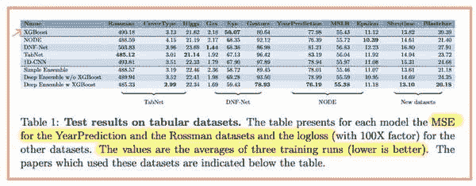

表格数据:深度学习不是你需要的全部|来源:[https://arxiv.org/pdf/2106.03253.pdf](https://arxiv.org/pdf/2106.03253.pdf)

这是一篇重要的论文，因为它重申了一个事实，即深度学习可能不是解决所有机器学习问题的银弹。另一方面，对于表格数据，基于树的算法已经显示出与神经网络性能相当，甚至优于神经网络，同时易于使用和理解。

对于喜欢使用基于树的模型的人来说，这是一个好消息。几个月前， **TensorFlow Decision Forests，**又名 **TF-DF** 库被谷歌开源。在本文中，我们将了解什么是 TF-DF，以及它如何对我们有所帮助。

# 目标

许多优秀的资源和代码示例已经作为文档的一部分提供(参考下面的**参考**部分)。因此，我不会重新发明轮子。本文不是入门指南，而是对该库的快速概述，展示其主要思想和特性。为了深入了解，推荐由 [Eryk Lewinson](https://medium.com/u/44bc27317e6b?source=post_page-----1ecf50ae00c3--------------------------------) 撰写的关于使用 [TensorFlow 决策森林](/tensorflow-decision-forests-train-your-favorite-tree-based-models-using-keras-875d05a441f)使用口袋妖怪数据集的文章。

# 张量流决策森林

决策森林(DF)是一类由多个决策树组成的机器学习算法。[随机森林](https://en.wikipedia.org/wiki/Random_forest)和[梯度提升决策树](https://en.wikipedia.org/wiki/Gradient_boosting)是两种最流行的测向训练算法。[tensor flow 决策森林](https://www.tensorflow.org/decision_forests)是为训练、服务、推理和解释这些决策森林模型而创建的库。TF-DF 基本上是 c++[Yggdrasil Decision Forests(YDF)](https://github.com/google/yggdrasil-decision-forests#:~:text=Yggdrasil%20Decision%20Forests%20(YDF)%20is,interpretation%20of%20Decision%20Forest%20models.)库的包装器，使其在 TensorFlow 中可用。

TF-DF 为基于树的模型和神经网络提供了统一的 API。这对用户来说非常方便，因为他们现在可以对神经网络和基于树的模型使用统一的 API。

# 实施概述

TF-DF 库可以很容易地用 pip[安装](https://www.tensorflow.org/decision_forests/installation#installation_with_pip)。但是，它仍然不能与 Mac 或 Windows 兼容。对于非 Linux 用户来说，通过 Google Colab 使用它可能是一种变通方法。

让我们看看在[帕尔默企鹅](https://allisonhorst.github.io/palmerpenguins/articles/intro.html)数据集上使用 TF-DF 的基本实现示例。该数据集是 iris 数据集的替代物，目标是根据给定的特征预测**企鹅物种**。


[brgfx-www.freepik.com 创造的水矢量](https://www.freepik.com/vectors/water)

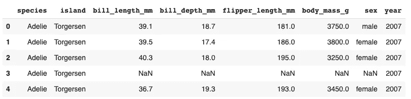

数据集的前五行

如您所见，数据集是数字和分类特征的混合，是分类机器学习问题的经典示例。TensorFlow 中的训练决策森林非常直观，如下例所示。该代码取自官方文件。

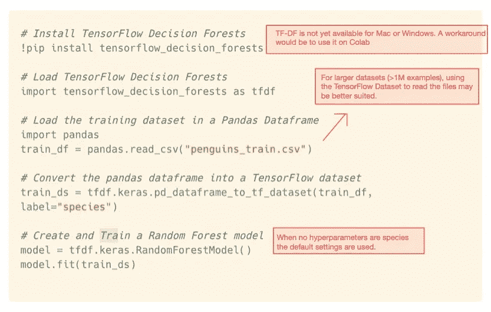

训练张量流决策森林|作者图片

很多事情都很突出。值得注意的是，不需要像一键编码和标准化这样的预处理。我们将在下一节谈到它们。

# 应用程序

我们已经看到了一个分类示例。TF 决策森林还可以用于[回归](https://www.tensorflow.org/decision_forests/tutorials/beginner_colab#training_a_regression_model)甚至[排名](https://www.tensorflow.org/decision_forests/tutorials/beginner_colab#training_a_ranking_model)这样的任务。

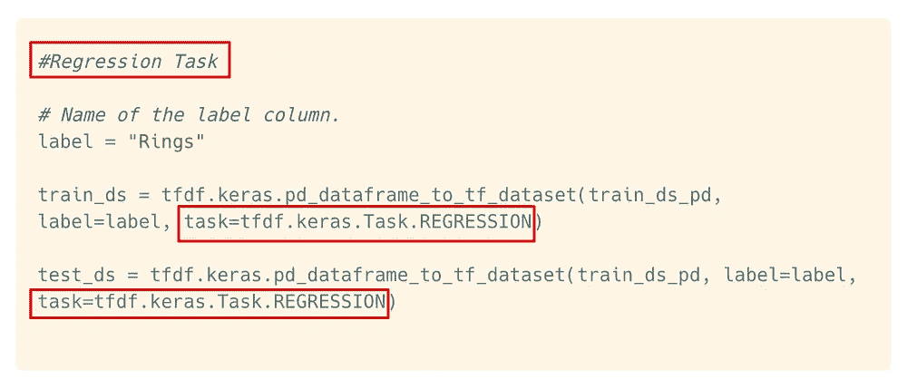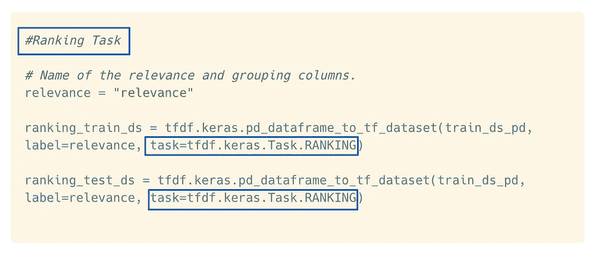

使用 TF 决策森林的回归和排序示例|作者图片

# 突出

TF-Decision 森林在几个方面表现突出。让我们简要讨论其中的几个:

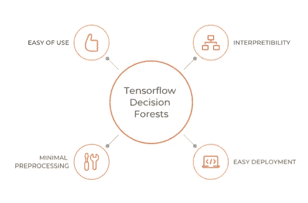

TF 决策森林的亮点|作者图片

## **易用性**

*   相同的 Keras API 可以用于神经网络以及基于树的算法。将决策森林和神经网络结合起来创建新型混合模型是可能的。
*   无需指定输入特征。TensorFlow 决策森林可以自动检测数据集中的输入要素。

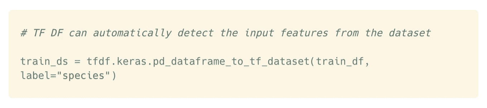

通过 TF 决策树自动检测输入特征|图片由作者提供

## **最小预处理**

*   不需要像分类编码、归一化和缺失值插补这样的预处理。
*   不需要验证数据集。如果提供，验证数据集将仅用于显示指标。

## TensorFlow 服务的简单部署选项

*   模型训练完成后，您可以使用`model.evalute()`在测试数据集上对其进行评估，或者使用`model.predict()`进行预测。最后，您可以使用 [TensorFlow Serving](https://www.tensorflow.org/tfx/guide/serving) 将模型保存为`SavedModel`格式，就像任何 TensorFlow 模型一样。

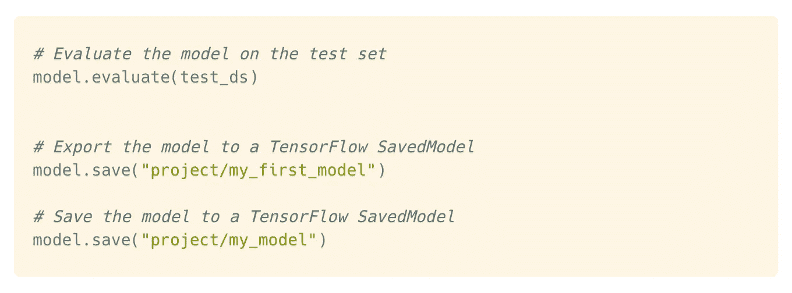

通过 [TensorFlow 发球](https://www.tensorflow.org/tfx/guide/serving) |作者图片

## 可解释性

*   有时候，对于高风险的决策，我们必须理解模型是如何工作的。TensorFlow 决策树有内置的绘图方法来绘制和帮助理解树结构。

这是我们的随机森林模型的第一棵树的图。

```
tfdf.model_plotter.plot_model_in_colab(model_1, tree_idx=0, max_depth=3)
```

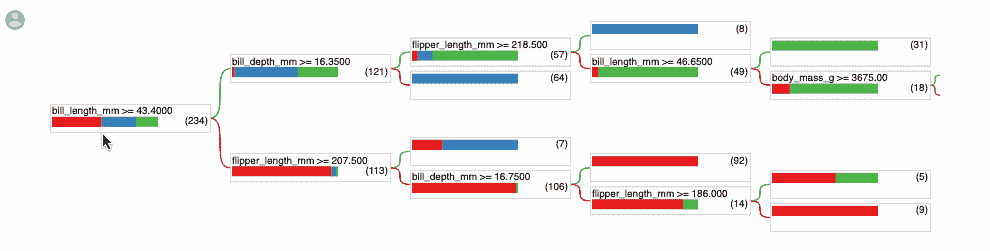

交互式可视化|作者图片

此外，用户还可以访问模型结构和特征重要性以及训练日志。

# 改进的余地

TF 决策树打包了许多有用的特性，但也有一些需要改进的地方。

*   不直接支持 Windows 或 macOS(直到日期)。
*   到目前为止，TF DF 模块中只有三种算法可用:随机森林、梯度提升树和 CART 模型。

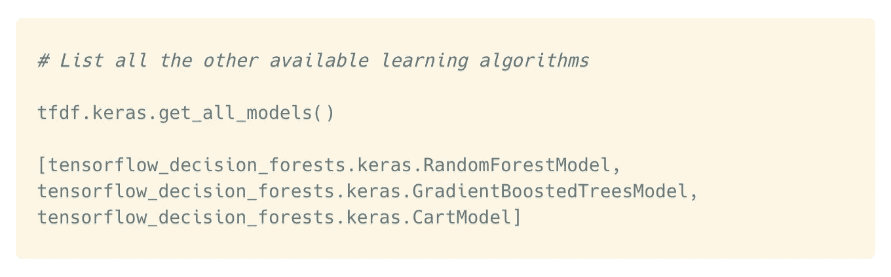

TF 决策森林库中所有可用的学习算法|作者图片

*   目前，也不支持在 GPU/TPU 基础设施上运行模型。

# 最后一句话&入门资源

总的来说，TF 决策树为使用 Tensorflow 和 Keras 构建基于树的模型提供了一个很好的选择。对于那些已经有 TensorFlow 管道的人来说，这尤其方便。这个库还在不断的开发中，所以很快就会有更多的特性出现。如果您想查看代码示例并使用该库作为您的用例，这里有一些适合所有级别的优秀资源。

*   [TensorFlow 决策森林教程](https://www.tensorflow.org/decision_forests/tutorials)
*   [GitHub 上的 TensorFlow Decision Forests](https://github.com/tensorflow/decision-forests) 项目。
*   [官方博客](https://blog.tensorflow.org/2021/05/introducing-tensorflow-decision-forests.html)