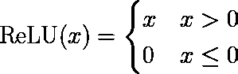

# 重温 DCT 域深度学习

> 原文：<https://towardsdatascience.com/revisiting-dct-domain-deep-learning-51458fe2e6e4?source=collection_archive---------17----------------------->

## [意见](https://towardsdatascience.com/tagged/opinion)

## 对 JPEG 和 DCT 域数据的深度学习代表了一个有前途的新研究方向。

在进行我的学位论文提案时，我有机会重温了我在 ICCV 2019 年的论文“JPEG 变换域中的深度剩余学习”。大约一年后回顾它，看看这个领域从那时起是如何发展的，这是一次有趣的经历。在这篇文章中，我将给出我们在论文中提出的方法的一些细节，然后谈一谈 DCT 域深度学习的最新进展。

JPEG 与空间吞吐量的比较，稍后会详细介绍。图片作者。

# 概观

我预计许多读者将熟悉深度学习，这是现代机器学习中无处不在的技术。然而，很少有人熟悉 DCT 域技术及其在这里的应用。这些想法在 20 世纪 80 年代末和 90 年代初非常流行，当时解压缩 JPEG 对计算机来说是一个非常耗时的过程。这个想法很简单:重新定义你想要执行的操作，这样它们就可以在压缩数据上完成，而不是在像素本身上完成。这是可能的，因为 JPEG 转换(大部分)是线性的。我们通常将这些技术称为 JPEG、DCT 或压缩域操作。

虽然随着计算能力的增加，这些想法已经过时，但在我看来，它们仍然非常适用于计算机视觉，从长远来看，每幅图像节省几毫秒可以节省大量时间(例如:训练卷积神经网络)，这正是我想在 ICCV 论文中展示的内容[1]。2019 年是该领域研究的一个极其活跃的领域，回顾进展令人兴奋，四种正交技术最终成为基础。

首先，这里是一些附加资源:

1.  论文本身可以在 [arxiv](https://arxiv.org/abs/1812.11690) 上免费获得
2.  我在开发这项技术时做了大量的笔记，你可以在这里阅读[这些笔记也可以作为](http://maxehr.umiacs.io/jpeg_domain_resnet/jpeg_domain_resnet_html.html)[可运行 Jupyter 笔记本](https://colab.research.google.com/drive/1UHho38IkrF4QqQiIm5rX8RWw-8V3D0h3#scrollTo=2YdUQrum0onC)获得
3.  文中使用的代码是公开的，你可以从我的 [gitlab](https://gitlab.com/Queuecumber/jpeg-domain-resnet) 获得

# JPEG 和 DCT

有很多关于 JPEG 如何工作和离散余弦变换(DCT)的文章，所以我只简单介绍一下。JPEG 编码大致由以下步骤组成，从 RGB 图像开始:

1.  转换图像 YCbCr 色彩空间，将亮度(灰度或 Y)数据与色彩数据(Cb 和 Cr)分开。
2.  填充并居中图像。大多数编码器会进行色度子采样(4:2:0 是最常见的)，这意味着颜色通道在每个维度上减半。由于 DCT 将在 8 乘 8 的块中进行，这意味着图像需要被填充到 16 的倍数，以便在对颜色通道进行二次采样之后，大小可以被 8 整除。然后通过从每个像素中减去 128 来使像素居中。
3.  计算每个块的 2D 第二类离散余弦变换(通常称为 DCT)。这是 JPEG 算法的真正核心，压缩域运算中的大部分工作是处理 DCT 和算法的其他步骤，这些步骤对于导出运算来说通常是微不足道的。
4.  上述变换的结果称为 DCT 系数，然后使用预先计算的量化表对其进行量化。只是每个 8 乘 8 模块的元素级除法，并对结果进行舍入。这是 JPEG 中主要的有损步骤，所有复杂的 JPEG 伪像都是由 DCT 系数上这个相对简单的操作引起的。
5.  系数按之字形顺序矢量化，低频放在开头，高频放在结尾。这是因为量子化倾向于将我们大脑无论如何都无法清晰感知的高频归零。通过将零集中在向量的末尾，可以有效地对它们进行游程编码。
6.  RLE 向量然后被熵编码

JPEG 解码本质上是相反的过程。请注意，我们说第 4 步是有损耗的，因为它实际上无法撤消。我们知道用来划分系数的量化矩阵是什么，但是因为系数是四舍五入的，所以当我们相乘时，我们只能得到原始系数的近似值。

作为参考，DCT 由下式给出:

对于像素块 *P，*块偏移 *m，n* 和空间频率 *α，β* 。函数 *V()* 计算使变换正交的比例因子。这里有两个重要的结果需要注意。第一个是，每个系数是所有***块中像素的函数，第二个是，第一个频率( *α = β =* 0):***

******

***换句话说，它是像素的未加权和，与块的平均值成比例。***

# ***JPEG 的线性度***

***正如我上面提到的，模拟 JPEG 压缩的一种方法是线性映射。我们可以对 JPEG 编码这样做，只要我们忽略上一节第 4 步中的舍入，它完全适用于 JPEG 解码。这很有用，因为任何其他线性地图都可以乘以 JPEG 线性地图，以创建一个新的地图，对 JPEG 数据进行操作。为了简单说明这一点，考虑以下两个实数的线性函数:***

******

***如果我想将 *f* 然后 *g* 应用于相同的输入，我可以简单地计算 *f(x)* 然后 *g(x)* ，这需要两次乘法，或者我可以计算***

******

***它只需要一次乘法。这是压缩域技术背后的思想:如果 *f* 是 JPEG， *g* 是对像素的一些操作，那么你可以将它们相乘来对 JPEG 数据进行操作。***

***那么这到底是什么样子的呢？布莱恩·史密斯在 1993 年发现了这一点[2]，我试图用多元线性代数的思想将它形式化。如果你不知道什么是多元线性代数，它只是线性代数对任意形状张量的扩展(注:张量形状的恰当数学术语是它的**型**)。警告一下，这有点复杂。***

***首先，让我们复习一些符号。本节中的所有方程都将采用所谓的“爱因斯坦符号”(他在研究广义相对论时开发的)。这本质上是一种写和的简写方式，它使得张量积更具可读性。在爱因斯坦符号中，有上指数和下指数，重要的是要记住，如果你看到一个上标，它是一个上指数而不是幂。不出所料，一个下标被称为**下下标**。每当一个指数在表达式中作为一个张量的上指数出现，而作为另一个张量的下指数出现时，元素就会相乘并相加。每当一个指数出现在两个张量的相同(上或下)位置时，元素相乘但不相加。任何未加总的指数都会结转到结果中。这里有一个矩阵向量乘积的例子，关于矩阵 *Q* 和向量 *x:****

******

***因此，我们乘以索引 *i* ，因为它出现在 *Q* 的顶部和 *x* 的底部，然后求和，我们让 *j* 单独产生索引为 *j* 的向量 *q* 。***

***接下来，我们需要定义在这个模型下图像是什么样子。我们说**单平面**图像(例如，灰度图像)是类型(0，2)张量，这意味着它没有上索引和两个下索引(本质上它是一个矩阵)。我们将此表示为:***

******

***被圈起来的次数有一个张量积(有时称为外积)，其中的 *H* 和 *W* 是向量空间，*表示一个**对偶空间**，对于我们的目的来说只是意味着张量积的结果有较低的指标。***

***最后，我们可以导出 JPEG 压缩和解压缩张量。为了简洁，我不会把推导放在这里(它相当长)，但你可以在论文的 3.2 节找到它。推导的结果是两个线性图，第一个是:***

******

****J* 执行 JPEG 压缩，注意这里的 *H，W* 没有*号，这意味着它们是较高的索引，因此当我们将其应用于 *I* 时，它们会被相乘。还要注意，X 和 Y 索引图像中的一个块，K 索引存储的系数(每个块有 64 个)。第二张地图是:***

******

***它执行 JPEG 解压缩。有了这两张图，我们可以得到一张新的线性图，它计算像素的线性函数，如下所示:***

******

***并且计算相应的 JPEG 域映射为:***

******

***阅读最后一个等式的右边，我们可以看到新地图做了什么。它解压缩图像，应用 *C* ，然后压缩结果。但是因为我们事先将所有这些相乘，所以它在一个步骤中完成所有这三个步骤。***

***在继续之前，我将展示另一个重要的张量，我们将在下一节使用它:DCT 张量。这可用于执行正向和反向 DCT:***

******

***如前一节中的 DCT 方程一样, *m，n* 索引像素块，α，β索引空间频率。 *V* 是用于使变换正交的常数。注意缺失的求和:这由张量积来处理。***

# ***JPEG 领域深度学习***

***事实证明，这让我们在 JPEG 领域深度学习方面取得了很大进展。对于 ICCV 的论文，我们有一个简单的目标:使用前一节中的分析来制作一个 ResNet [3],它对 JPEG 域数据进行操作，但尽可能接近相同的结果，就好像它对像素进行操作一样。ResNet 有几个操作，我们需要定义每个操作。***

*****卷积**这个非常简单，直接来自上一节。卷积是像素上的线性映射，所以它们本质上是我们之前讨论过的 *C* 。使用同样的技术，我们可以将ξ定义为压缩域卷积。这里我们还可以做一些小技巧，如果你感兴趣的话，请看第 4.1 节。***

*****批量规格化**这个也很简单。批次范数定义了可学习的仿射参数γ和β，并测量批次的运行均值和方差。然后使用以下公式应用这些值:***

******

***正如我们之前所讨论的，0，0 系数与块的平均值成比例，这使得它易于提取，并且比计算像素平均值快得多(无条件读取与 64 次求和)。计算方差也很容易，事实证明，如果像素的均值为零，则 DCT 系数的均值等于像素的方差。类似地，应用β就像将它加到 0，0 系数上一样简单，应用γ就像将每个系数乘以它一样简单。有关该程序的更多详细信息，请参见第 4.3 节。***

*****全局平均池**这是批量标准化的一个延续。其思想是只取每个特征图的每个通道的平均值。这就像读取每个已经包含平均值的块的 0，0 系数一样简单。参见下图和论文的第 4.5 节。请注意，从这一点来看，ResNet 使用完全连接的层，而 GAP 输出正是这些完全连接的层所期望的输入，因此不需要导出进一步的压缩域操作。***

******

***DCT 域全局平均池。图片作者。***

*****模型转换**本节最后要提到的是，我们的公式中没有任何东西依赖于从随机权重开始，从预先训练的模型开始并从中导出 JPEG 域模型同样有效。我们称之为模型转换，它基本上意味着你可以得到一个模型，在 JPEG 域数据上操作，而不需要重新训练任何东西。***

***虽然这让我们对 JPEG 域 ResNet 了如指掌，但仍然缺少一大块:ReLU [4]。***

# ***ReLU 问题***

***CNN 本质上是非线性的，这使得它们能够学习如此复杂的映射。在现代架构中，ReLU 几乎专门用于引入非线性。前面的分析只适用于线性函数，所以我们需要依靠一种近似技术。***

***回想一下，ReLU 被定义为***

******

***将所有负值设置为零。这可以用二进制掩码来实现，定义如下***

******

***然后与原始特征图相乘。这样做的好处是近似遮罩比近似 ReLU 本身要容易得多(见下图)。***

******

***我们近似技术的示例模块。绿色表示负值，红色表示正值，蓝色表示零值。图片作者。***

***我们使用来自每个 JPEG 块的 DCT 系数的子集来计算近似掩模。通过仅使用系数的子集，我们仍然具有比完全解压缩更高的吞吐量。***

***到目前为止，最有趣的部分是我们提出的对 DCT 系数应用蒙版(像素蒙版)的方法，这是我们在上一节中讨论的 JPEG 线性的直接结果。对于这一部分，我们可以使用 DCT 张量 *D* ，因为我们不必担心跨块的相互作用。我们将用一个 DCT 块 *F* 来操作它的像素域块 *I、*和掩码 *G.****

***如果我们天真地这样做，我们会:***

1.  ***解压缩图像***
2.  ***逐像素倍增蒙版***
3.  ***重新压缩图像***

***所有这些都是线性或双线性映射:***

******

***因此，我们可以将这些步骤相乘，得到一个包含所有三个步骤的双线性映射:***

******

***然后我们可以做出如下定义:***

******

***并且 *H* 是将像素掩模应用于 DCT 系数的双线性映射。这个操作比前几个稍微复杂一点，完整的细节在论文的第 4.2 节。***

# ***结果***

***那么所有这些是如何工作的呢？实际上相当好。我们在 MNIST [5]和 CIFAR [6]上测试了这项技术。这是我们使用的玩具网络:***

******

***玩具网络结构。图片作者。***

***这基本上是一个微小的 ResNet [3]。***

***第一件有趣的事情是近似值的精确度。首先，我们可以注意到，如果根本不进行近似(例如，通过使用所有空间频率来计算掩模，这相当慢)，我们将像素域网络匹配到浮点误差内。当我们开始逼近 ReLU 时，通过比较朴素方法(APX)和我们的方法(ASM ),我们得到了以下精度:***

******

*****左:** RMSE 个人 8 乘 8 街区。**中:**模型转换后的网络精度。**右:**带再训练的网络精度。图片作者。***

***即使用于重建的频率更少，我们的方法也做得很好，尤其是在再训练时。***

***接下来要看的是吞吐量。我们的目标是建立一个运行速度更快的网络，因为它不需要解压，我们成功了吗？算是吧:***

******

***吞吐量结果。图片作者。***

***我们可以看到 JPEG 训练稍微快了一点，而 JPEG 推理几乎快了 4 倍，这是一个很大的改进。那么为什么训练比较慢呢？推理不仅允许我们离线预计算一些我们需要的地图，而且 JPEG 训练的反向传递要复杂得多，因为它需要 JPEG 压缩和解压缩张量的梯度。***

# ***进一步的进展***

***虽然我的论文很整洁，但这类工作在 2019 年取得了一些其他重大进展。首先，我们应该谈谈我的方法的主要缺点:权重明显大于传统的 CNN。以至于基本上不可能将其应用于“真正的”架构或像 ImageNet 这样的数据集。这里提出的方法的权重大小为 O(HW ),而传统 CNN 的权重大小为 O(1)。我确实提出了这个工作的一个扩展，它的权重为 O(1 ),但是这个还没有发表，仍然有很大的内存开销。这种方法的目标之一是尽可能接近像素域操作，这就是为什么我们只使用一种近似。如果你放松这种约束，你可以做一些真正有趣的事情。现在在这一领域已经开发了另外三种基本技术。***

*****什么都不做**可能最著名的是 [Gueguen 等人的](https://papers.nips.cc/paper/7649-faster-neural-networks-straight-from-jpeg)【7】，其基本内容是“在不修改网络结构的情况下传递 ResNet DCT 系数”。事实证明，这只能以轻微的精度损失为代价，并且您可以从 ResNet 中移除初始层以获得高吞吐量，但是它似乎不能在整个图像分类之外工作(例如，检测、分割等不能很好地工作)。***

*****块表示**下一项技术通过为每个 DCT 块定义一个[“块表示”](https://arxiv.org/abs/1904.08408)【8】来利用 DCT 块结构。他们通过使用 8x8 步距-8 卷积来实现这一点。这给出了每个维度上八分之一大小的图像。他们将这一想法用于物体检测。***

*****频率系数重排**最后的技术利用了系数【9】的频率[结构。他们通过重新安排频道来做到这一点。所以，再一次，你最终得到的图像是每个维度的八分之一大小，这次是 64 个通道。他们把这个想法用于语义分割。](https://dl.acm.org/doi/abs/10.1145/3338533.3366557?casa_token=ituStLLbGcwAAAAA:wWLarXh94TGd7iFPabG-yaAMe1-MBN-xGI0Z7XHSaYFIywOcya-t3UwflZQY3ST5nS7RyLiHxeciX58)***

***总的来说，看到这个领域的发展是令人兴奋的。我认为这真的很重要，也很有趣，所以我总是鼓励人们参与进来。JPEG 文件无处不在，因此这类数学应用程序并不缺乏。作为另一个例子，在 ECCV 2020 上，我使用了后两种技术来实现 JPEG 伪像校正的艺术水平[10]。***

## ***参考***

1.  ***米（meter 的缩写））Ehrlich 和 L. Davis，[JPEG 变换域中的深度残差学习](https://arxiv.org/abs/1812.11690) (2019)，载于:计算机视觉国际会议论文集。***
2.  ***B.Smith，[运动 JPEG 视频的快速软件处理](https://dl.acm.org/doi/10.1145/192593.192628) (1994)，载于:第二届 ACM 多媒体国际会议论文集。***
3.  ***K.何等，【图像识别的深度残差学习】 (2016)，载于:IEEE 计算机视觉与模式识别会议论文集。***
4.  ***动词 （verb 的缩写）Nair 和 G. Hinton，[整流线性单元改进受限玻尔兹曼机器](https://www.cs.toronto.edu/~hinton/absps/reluICML.pdf) (2010)，机器学习国际会议。***
5.  ***Y.LeCun，[MNIST 手写数字数据库](http://yann.lecun.com/exdb/mnist/)***
6.  ***A.Krizhevsky 和 G. Hinton，[从微小图像中学习多层特征](http://citeseerx.ist.psu.edu/viewdoc/download?doi=10.1.1.222.9220&rep=rep1&type=pdf) (2009)***
7.  ***长度 Gueguen 等人，[直接来自 jpeg 的更快的神经网络](https://papers.nips.cc/paper/2018/hash/7af6266cc52234b5aa339b16695f7fc4-Abstract.html) (2018)神经信息处理系统的进展。***
8.  ***B.Deguerre 等，[压缩 jpeg 图像中的快速物体检测](https://arxiv.org/abs/1904.08408) (2019)，IEEE 智能交通系统会议。***
9.  ***赛。Lo 和 H. Hsueh-Ming，[探索 DCT 表示的语义分割](https://arxiv.org/abs/1907.10015)(2019)ACM 多媒体亚洲会议录。***
10.  ***米（meter 的缩写））Ehrlich 等人，[量化引导的 JPEG 伪像校正](https://arxiv.org/abs/2004.09320) (2020)欧洲计算机视觉会议论文集。***