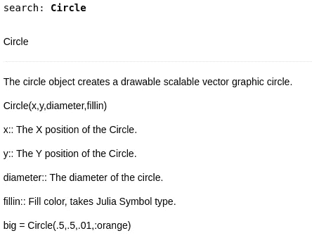
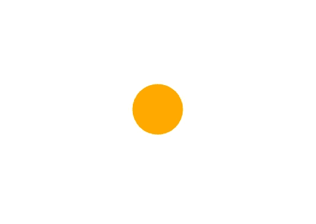
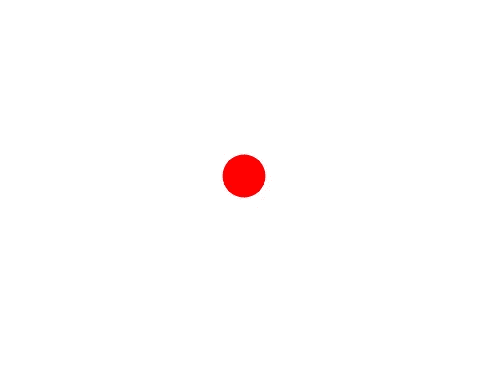
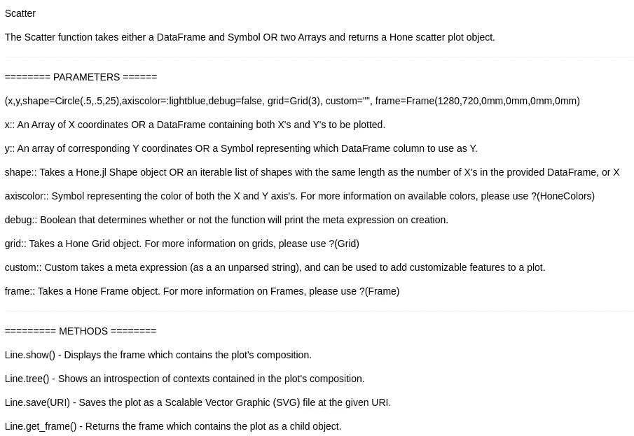
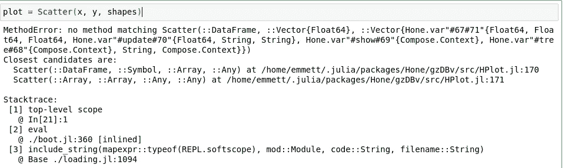
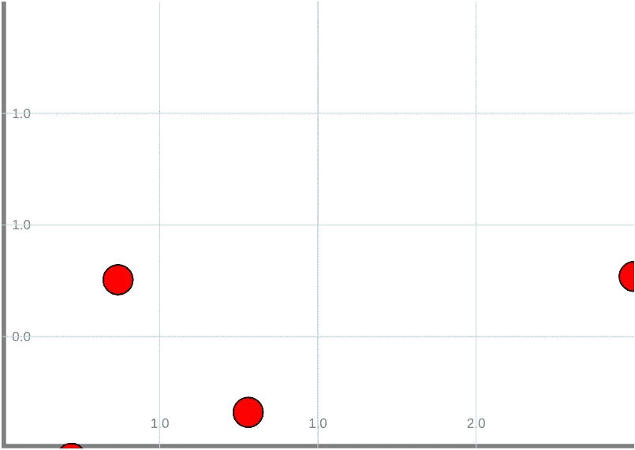

# 重访我的元编程绘图库！

> 原文：<https://towardsdatascience.com/revisiting-my-meta-programmed-plotting-library-c6802d0171c0?source=collection_archive---------32----------------------->

## Hone.jl

## 回顾一下我过去做过的一个非常酷的项目！

# 介绍

一年多以前，我开始用 Julia 编程语言开发一个新项目。该项目旨在作为主要的实践，以及证明语言中的一些概念和想法，同时也用 Julia 的范式和方法进行一些实验。该项目名为 Hone.jl，Hone.jl 是一个面向对象的图形库，使用高级声明性调用来创建元代码。这有一些缺点，主要是 Julia 在一定数量的重复代码后中断了解释。如果您想阅读我写的介绍该软件的文章，您可以在这里查看:

</introducing-hone-a-modular-object-oriented-graphing-library-for-julia-823b028b462a>  

不管这些问题，我认为这是一个超级酷的项目！不仅如此，编程真的很有趣！本着这个包已经正式推出一年的精神，我决定回去看看这个包是如何工作的，以及它能够产生什么样的结果。如果您想尝试使用 Hone.jl，或者查看我将在本文中使用的代码，您可以在 Github 上查看它，或者查看我用来生成本文中的结果的笔记本:

> [笔记本](https://github.com/emmettgb/Emmetts-DS-NoteBooks/blob/master/Julia/revisiting%20Hone.ipynb)

<https://github.com/emmettgb/Hone.jl>  

# 高级接口

为了使用 Hone.jl，我们需要添加这个包。它不在 Julia General 注册表中，所以我们必须通过 git 添加它:

```
julia> ]
pkg> add [https://github.com/emmettgb/Hone.jl.git](https://github.com/emmettgb/Hone.jl.git)
```

现在，在我的笔记本中，我将使用 DataFrames.jl 创建一个新的数据框:

```
using DataFrames
df = DataFrame(:A => randn(20), :B => randn(20), :C => randn(20))
```

现在我们可以使用 Hone:

```
using Hone
```

包中的所有内容都被导出，所以我们现在可以使用？()方法。Hone.jl 非常酷的一点是它是模块化的。这意味着我们可以单独创建散点图的各个部分，甚至可以随心所欲地添加新的形状。记住这一点，让我们来看看这个圆形:

```
?(Circle)
```



作者图片

我们现在将使用这些参数做一个圆。

```
shape1 = Circle(.5, .5, .08, :orange)
```

我们可以使用 show()函数显示圆:

```
shape1.show()
```



作者图片

由于我们的数据框具有多个要素，我们应该制作另一个形状以便绘制其他要素。我还会把这个做得小一点:

```
shape1 = Circle(.5, .5, .02, :orange)
shape2 = Circle(.5, .5, .04, :red)
shape2.show()
```



作者图片

现在我们将把这两个形状放入一个数组中，我们可以将它作为参数传递到散点图中:

```
shapes = [shape1, shape2]
```

现在看看我们的形状还需要什么，我们将使用相同的？()我们的散点类型方法:

```
?(Scatter)
```



作者图片

所有这些参数都是位置性的，对于某些参数，我们需要输入一些空值。回过头来看，这是一个糟糕的想法，但我并不介意，因为除了我之外，这个包并不打算由任何人添加，因为与 Julia 可用的其他包竞争并不一定在 Hone.jl 的目标列表中。因此，我们将 X 作为数据帧，y 作为数组，并创建一个散点图。不过，我们需要做的第一件事是准备要通过这个函数传递的 x 数据帧和 y 数组。为此，我们将首先从我们的数据帧中提取我们的:C 数组:

```
y = df[!, :C]
```

现在我们需要在 X 数据帧中去掉这一列。我们将使用 select()和 Not()方法来实现这一点。

```
x = select(df, Not(:C))
```

现在我们可以做散点图了！

```
plot = Scatter(x, y, shapes)
```



作者图片

> 哎呀。

看起来这个调用实际上将使用一个符号而不是一个数组，这个符号将调用数据帧上的列。这可能会产生问题，因为该包使用 DataFrames.jl 的旧版本，该版本可能支持对列进行索引，如下所示:

```
df[:A]
```

但是现在的语法应该是:

```
df[!, :A]
```

> 所以希望我们不会遇到这个问题。如果我们这样做了，我会简单地提供很长时间以来的第一次更新…

事实证明这个包有相当多的问题，为了解决一些问题，我们可能需要深入研究一下。幸运的是，我们完全有能力做到这一点！

# 代码内部

在我们开始修复这个包之前，我们应该看看里面的实际代码，这些代码实际上已经相当过时了。我知道这使用了装箱类型，这是一种在 Julia 中使用未知类型创建类型的过时方法，所以我们可能应该使用内部和外部构造函数将其更新为较新的方法。如果你想了解更多关于 Julia 中构造函数的知识，我也写了一篇文章，你可以点击这里:

</an-advanced-look-at-constructors-in-julia-5b428882dde8>  

```
git clone [https://github.com/emmettgb/Hone.jl.git](https://github.com/emmettgb/Hone.jl.git) --branch Unstable
```

这个包的排列方式有两个函数，_arrayscatter 和 _dfscatter。这两个方法与 Scatter()方法一起被分派来处理不同的类型。使用内部构造函数可以更有效地做到这一点，但是这也是包装在一个完全不同的对象中的，这个对象叫做 Frame。因此，我们不将散点图作为一种类型，而是保留分派，只改变框架的类型。举个例子，下面是一个新函数，用于创建包含两个数组的散点图:

```
function Scatter(x::Array, y::Array; shape = Circle(.5,.5,25),
        grid = Grid(4),
        features = [Axis(:X), Axis(:Y)],
        frame=Frame(1280,720,0mm,0mm),
        )
    points = Points(x, y, frame, shape)
    frame.add(points)
    glabels = GridLabels(x,y, grid)
    frame.add(grid)
    frame.add(glabels)
    for feature in features
        frame.add(feature);
    end
    return(frame)
end
```

我更改的另一件事是更新 DataFrames.jl 调用，以反映最新版本的语法。由于 DataFrames.jl 没有 compat 绑定，所以可以假设它将使用最新版本。我还从 Frame 类型中删除了一些参数，我们现在要重构它。以下是现成的代码:

```
function Frame(width::Int64, height::Int64, lm, bm)
    base = string("compose(context(units=UnitBox(0,0,",
    width, ",",
    height, ",",
    lm, ",", rm,",",
    tm, ",", bm,
        ")),")
    objects = []
    tag = base
    composition = nothing
    add(object) = composition,objects,tag = _frameup(base,objects,object)
    show() = composition
    tree() = introspect(composition)
    save(name) = draw(SVG(name), composition)
    (var)->(add;show;tag;base;objects;composition;save;tree;width;height;lm;bm;rm;tm)
end
```

我要做的第一件事是从底部去掉上边距和右边距，因为我想我不会再用这个方法了。我将用 0 替换它们。现在我们需要将它包装在一个可变结构中，并用 new()方法传递我们的类型。我们将从在我们的函数上面添加这个开始:

```
mutable struct Frame{A, S, T, SA}
    add::A
    show::S
    tree::T
    save::SA
    tag::String
    objects::Array
```

然后，我们将更改用于创建类型的最后一部分，并将其恢复为:

```
A, S, T, SA = typeof(add), typeof(show), typeof(tree), typeof(save)
    new{A, S, T, SA}(add, show, tree, save, tag, objects)
```

我们也可以用它来创建一个完整的类型层次结构，并进行更多的转换——比如在 objects 类型中。我们可以将数组{Any}改为类似数组{HoneShape}的形式。现在我要更新并再次尝试使用该软件包！

```
julia> ]
pkg> update
```

# 结论

现在我们终于可以创建一个散点图，如下所示:

```
plot = Scatter(df[!, :A], df[!, :B], shape = shapes[1], grid = Grid(4),
    frame = frame)
```



作者图片

我认为这是一个非常酷和有趣的项目，有很大的潜力。做了一点工作后，我真的很好奇我能在这个包中实现多长时间的功能！我很想知道是否有人认为我应该继续在这个方案上工作，或者我应该让它保持原样并继续前进。你怎么想呢?我想把事情进一步与互动和可能的动画，以及更多的图形功能。我在 Twitter 上发起了一个投票，你可以提供你的答案！您可以在此查看投票结果并进行投票:

> 感谢您的阅读！