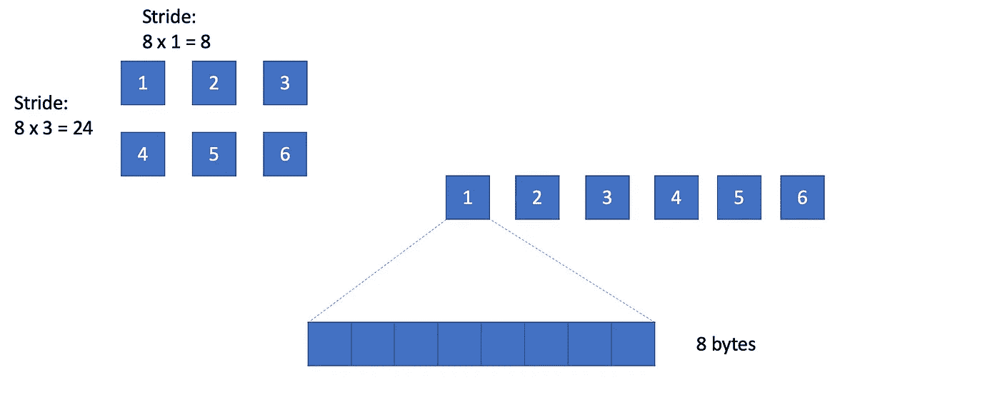
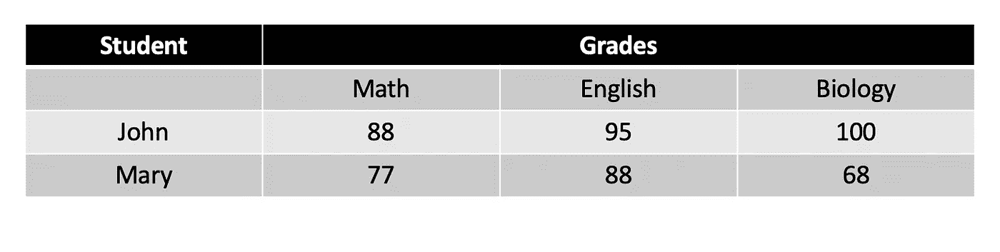

# 重访 Numpy 和 ndarray

> 原文：<https://towardsdatascience.com/revisiting-numpy-and-ndarray-e1e5f9a69791?source=collection_archive---------24----------------------->

## ScPyT

## 关于 ndarray 对象和 Numpy 包的鲜为人知但有用的知识和技巧


在 [Unsplash](https://unsplash.com?utm_source=medium&utm_medium=referral) 上由 [Faris Mohammed](https://unsplash.com/@pkmfaris?utm_source=medium&utm_medium=referral) 拍摄的照片

我最近开始了一项艰巨的任务— —阅读整个 Numpy 文档，特别是最新发布的 Numpy 模块(1.19)的 [API 参考](https://numpy.org/doc/1.19/reference/index.html)。这么做的原因很简单，我是一名生物信息学博士生，我的研究重点是在广泛的生物学问题中开发计算工具。随着项目的进展，我发现对 Numpy 知识的缺乏极大地阻碍了我快速准确地找到最优解的能力，并且我浪费了大量的时间来搜索 Stackoverflow 上的某些命令。为了让我的生活更轻松，我问自己，**为什么不直接钻研 Numpy 官方文档**，这样可以很大程度上填补我的知识空白，节省我很多时间。

所以我确实阅读了文档，并且完全诚实地告诉你，**我从阅读那篇**中学到了很多。现在，我只想分享我在过去几周学到的技巧和诀窍，希望它最终会对你有用。

我决定将这个系列命名为:**Python 中的科学计算**，因为我将涵盖线性代数和统计建模。这是一个很大的话题，所以我必须把它分成几个部分:

1.  **重访 Numpy 包和 ndarray 对象**(本文)
2.  [Python 中的线性代数](https://medium.com/swlh/linear-algebra-in-python-b967061e342a)
3.  Python 中的统计建模(敬请关注)

我在这里总结的所有内容都来自于 [Numpy 的官方 API 参考](https://numpy.org/doc/1.19/reference/index.html)，但是我认为使这篇文章有价值的关键部分是因为我根据自己的工作经验提炼了它们，并且以我认为容易理解的方式组织了它们。你可以在我的 Github 页面找到所有的代码库:

[https://github.com/frankligy/ScPyT](https://github.com/frankligy/ScPyT)

现在，让我们开始旅程吧！

# ndarray 是如何存储在内存中的？

让我们创建一个 n 阵列:

```
import numpy as np
a = np.array([[1,2,3],[4,5,6]])
```

ndarray 的一个您可能不知道的属性:

```
a.strides
# (24, 8)
```

当你访问`strides`属性时，它返回一个元组为(24，8)，什么意思？为了理解它，我们必须知道 ndarray 是如何存储在我们的内存中的。

在底层，数据必须存储在平面 1D 阵列中，我们认为理所当然并每天使用的 2D 3D 阵列实际上需要复杂的内存分配过程。让我们以这个`a`数组为例。



内存和步幅属性中的数组

这个 2D 数组必须以上述方式展平并存储在内存中，正如你注意到的，数组中的每一项都是一个整数，默认占用 8 个字节，因此是 64 位，现在你知道`np.int64`是什么意思了吧？这意味着这个整数将占用 64 位内存空间。

现在我们回过头来看看我们的`a.strides`输出，它是`(24,8)`，它表示沿着`axis=0`(行方向)，跳跃一个单位需要跨越 24 步，它是从每整数倍 8 字节得到的，每行有三个元素。具体来说，从 1 跳到 4 需要 24 步的记忆。第二个`8`表示列方向，跳过 1 个单位需要 8 步，因为它们基本上是相邻的。

# 你理解 Numpy 中的 dtype 对象吗？

创建 ndarray 时，将自动推断出一个 dtype 对象并将其与该数组相关联。举个例子，

```
d = np.array([1,2,3])
d.dtype
# dtype('int64')
```

它的 dtype 是一个“int64”对象，也就是说，数组中的元素是均匀整数，每个整数占用 8 个字节或 64 位内存。有一种更正式的方式来表示这一点:

```
d.dtype == np.dtype('<i8')
# True
```

1.  ‘的意思是字节的顺序，为了简单起见，对于大多数情况它并不影响我们如何理解`dtype`对象。它表示我们如何在底层存储字节。
2.  “I”表示整数，还有一些其他常用的符号值得记忆:'？'表示布尔值，“U”表示无符号整数，“f”表示浮点，“O”表示 python 对象，“U”表示 Unicode 字符串。
3.  “8”表示它在内存中占用多少字节。概括一下，' < f8 '应该是' float64 '吧？唯一需要特别注意的地方是，对于 Unicode 字符串，第三位不是表示字节数，而是表示字符串的长度。例如，' < U8 '表示长度为 8 的 Unicode 字符串。

为了进一步理解`dtype`，让我们再次使用'< U8 '的例子，

```
d_type = np.dtype('<U8')
d_type.byteorder
# '='
d_type.itemsize
# 32
d_type.name
# 'str256'
```

因此，为了方便起见，`dtype`对象将有三个易于访问的属性与其字节顺序、项目大小和快捷方式名称相关联。让我们仔细看看，`U8`表示 8 个字符的字符串，每个字符用 UTF8 编码，这是一种变长编码(每个字符会占用 1–4 个字节)。让我们取最大值，因此一个字符占用 4 个字节，8 个字符将占用 32 个字节。`str256`表示该字符串占用 256 位。作为扩展，如果使用 ASCII 编码，每个字符将由 1 个字节编码，例如，字母 A 将是 ASCII 表中的数字 65，它能够用 1 个字节(8 个二进制位)来表示。

# 结构数组和记录数组

顺便说一下，我选择这些例子是因为它们都是我日常生活中经常使用的东西。所以，请不要仅仅把它看作是我试图让你大吃一惊的一些有趣/奇特的用法，它们实际上在许多现实世界的例子中是超级有用的命令。

让我们创建一个结构化数组:

```
sa = np.array([('John',[88,95,100]),('Mary',[77,88,68])],
              dtype=[('student','<U8'),('grades','<i4',(3,))])
```

想想我们要用一个数组来形象化下面的情况，有两个学生“约翰”和“玛丽”，约翰的数学、英语和生物成绩分别是 88、95、100，玛丽的是 77、88、68。我们可以用表格来说明这种结构:



一个结构数组代表什么？

这里我们有两个元字段，“学生”和“成绩”，对于字段“成绩”，它实际上是一个(3，)1D 数组，分别对应于“数学”、“英语”和“生物”。在结构数组`sa`中，我们定义了每个列的字段名(列名)和 dtype，以及一个可选的 shape 参数来指定 ndarray shape。然后我们把每一行/观察作为一个元组，形成一个结构数组。

结构化数组的好处不仅在于以节省成本的方式组织数据，而且允许您通过简单地键入以下内容来访问每个字段:

```
sa['student']
# array(['John', 'Mary'], dtype='<U8')
```

还有一个类似于结构数组的对象叫做记录数组，我们先把结构数组`sa`转换成记录数组`ra`。

```
ra = sa.view(np.recarray)
type(ra)
# numpy.recarray
```

使用记录数组的额外好处是，您可以使用以下方式访问每个字段:

```
ra.student
# array(['John', 'Mary'], dtype='<U8')
```

除此之外，结构数组和记录数组看起来非常相似。

# 切片和索引

根据官方文档，有三种方法可以对 ndarray 进行索引和切片，它们是:

1.  基本索引
2.  高级切片(数值型、布尔型)
3.  现场访问

我已经在我的`structural array and record array`部分中介绍了字段访问。对于剩下的两个，基本索引是指我们使用整数或切片对象来切片 ndarray:

```
b = np.array([[1,2,3,4,5,6,7,8,9,10],
             [4,5,6,7,8,9,20,11,12,13],
             [1,2,3,4,5,6,7,8,9,9]])
b0 = b[1:3,4:7].  # basic indexing
```

这里(1:3)是一个 python `slice`对象，它相当于`slice(1,3,1)`。如果使用 1 或 3 这样的单个整数，这也是基本的索引。**需要注意的是:基本的索引只会在原始的** `**b**` **数组上创建一个视图，它不会为此创建一个副本。**为了说明这一点，我们更改切片`b0`数组上的一个值:

```
b0[0,1] = 99
```

那么让我们看看在原来的`b`阵列上会发生什么:


修改“视图”会改变原来的数组

你看到明显的“99”了吗？我们不小心改变了原始数组`b`的值，这可能会有不利影响，所以请确保您意识到这一点。**无论何时使用基本索引，您都是在创建一个“视图”而不是一个完整的“副本”**。

相比之下，什么是高级切片呢？高级切片允许您在想要提取元素的每个维度上传递索引。

```
b1 = b[:,(4,7)].  # (4,7) is advanced slicing
```

为了突出差异，(4，7)属于高级切片，但 4:7 是基本索引，因为它是一个`slice`对象。

高级切片总是会创建一个“副本”，因此您不必担心“基本索引”可能会引发的有害问题。

高级切片也可以接受布尔值，这是 Numpy 包中非常方便的方法。Python 原语`list`对象不支持布尔索引。

# 你需要知道的许多有用的功能

在我通读文档后，这里有一个我标记为“需要知道”的函数列表，因为我以前看到它们在现实世界的任务中使用过，或者我认为知道这些可以给你带来很多方便。

*   **创建数组**:(空、1、0、满和相关的 full_like)
*   **身份数组**:(眼，身份)
*   **数值范围**:(排列，linspace，logspace，meshgrid)
*   建筑矩阵 : (diag，tri，tril，triu，vander)
*   **整形**:(整形、对换、转置、展平、散开、新轴、挤压、扩展 _ 变暗、平铺、重复)
*   **连接和拆分**:(连接，堆栈，列 _ 堆栈，拆分，数组 _ 拆分)
*   **功能编程**:(沿轴应用)
*   **分度**:(在哪里)
*   **逻辑**:(逻辑异或)
*   **数学** : (deg2rad，hypot，sinh，trunc，round，lcm，gcd 等)
*   **随机** : (rand，randn，randint，choice，shuffle，beta 等)
*   **统计** : (corrcoef、cov、直方图、分位数、var 等)

我建议在 Numpy 文档中检查它们的例子，并内化它们的用法。

# 结论:

下一次，我将带您浏览 python 中的**线性代数模块**，然后是**统计建模**。感谢阅读！如果你喜欢这篇文章，请在 medium 上关注我，非常感谢你的支持。在我的 [Twitter](https://twitter.com/FrankLI55917967) 或 [LinkedIn](https://www.linkedin.com/in/guangyuan-li-399617173/) 上联系我，也请让我知道你是否有任何问题或你希望在未来看到什么样的 NumPy 教程！

Github 资源库:

[https://github.com/frankligy/ScPyT](https://github.com/frankligy/ScPyT)