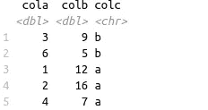

# 用 Dplyr 改写熊猫

> 原文：<https://towardsdatascience.com/rewriting-pandas-with-dplyr-5927b856f87d?source=collection_archive---------29----------------------->

## Python 和 R 在数据操作上的比较


尼提什·米娜在 [Unsplash](https://unsplash.com/s/photos/again?utm_source=unsplash&utm_medium=referral&utm_content=creditCopyText) 上的照片

Python 和 R 是数据科学生态系统中的主流编程语言。两者都提供了大量的包和框架来执行有效的数据分析和操作。

在本文中，我们将从数据操作和转换任务方面比较两个非常流行的库。

*   pandas:Python 的数据分析和操作库
*   dplyr:R 的数据操作包

下面的例子由熊猫和 dplyr 解决的一些简单任务组成。使用这些包有很多选择。我用 R-studio IDE 做 R，用 Google Colab 做 Python。

第一步是安装依赖项和读取数据。

```
#Python
import numpy as np
import pandas as pd
marketing = pd.read_csv("/content/DirectMarketing.csv")#R
> library(readr)
> library(dplyr)
> marketing <- read_csv("/home/soner/Downloads/datasets/DirectMarketing.csv")
```

我们有一个关于营销活动的数据集存储在一个 csv 文件中。我们将这个数据集读入熊猫的数据帧和熊猫的数据帧，


营销数据框架(图片由作者提供)


营销 tibble(图片由作者提供)

我们现在可以开始工作了。

## 基于条件的筛选

任务:过滤花费金额大于 2000 的行。

下面的代码根据给定的条件创建一个新的数据帧或表。

```
#pandas
high_amount = marketing[marketing.AmountSpent > 2000]#dplyr
high_amount <- filter(marketing, AmountSpent > 2000)
```

对于熊猫，我们在数据帧上应用过滤条件，就像我们正在索引一样。对于 dplyr，我们将数据帧和条件都传递给过滤函数。

## 根据多个条件过滤

任务:筛选消费金额大于 2000 且历史高的行。

```
#pandas
new = marketing[(marketing.AmountSpent > 2000) & (marketing.History == 'High')]#dplyr
new <- filter(marketing, AmountSpent > 2000 & History == 'High')
```

对于这两个库，我们可以使用逻辑运算符组合多个条件。

我们将为下面的两个示例创建一个示例 dataframe 和 tibble。

```
#pandas
df = pd.DataFrame({
     'cola':[1,3,2,4,6],
     'colb':[12, 9, 16, 7, 5],
     'colc':['a','b','a','a','b']
})#dplyr
df <- tibble(cola = c(1,3,2,4,6), 
             colb = c(12, 9, 16, 7, 5),
             colc = c('a','b','a','a','b')
            )
```


df(作者图片)

## 基于列排序

任务:根据可乐对 df 中的行进行排序。

```
#pandas
df.sort_values('cola')#dplyr
arrange(df, cola)
```

我们在 pandas 中使用 sort_values 函数，在 dplyr 中使用 arrange 函数。默认情况下，它们都是按升序对值进行排序。


分类 df(按作者分类的图像)

## 基于多列排序

任务:首先根据 colc 以降序对行进行排序，然后根据 cola 以升序对行进行排序。

这比上一个例子更复杂，但逻辑是相同的。我们还需要改变升序排序的默认行为。

```
#pandas
df.sort_values(['colc','cola'], ascending=[False, True])#dplyr
arrange(df, desc(colc), cola)
```



分类 df(按作者分类的图像)

对于熊猫，这些值根据给定列表中的列进行排序。列表中列的顺序很重要。如果我们想改变默认的行为，我们也传递一个列表给 ascending 参数。

对于 dplyr，语法稍微简单一点。我们可以通过使用 desc 关键字来改变默认行为。

## 选择列的子集

我们可能只需要数据集中的一些列。pandas 和 dplyr 都提供了选择一列或一列列表的简单方法。

任务:通过选择“地点”、“薪金”、“花费金额”列来创建数据集的子集。

```
#pandas
subset = marketing[['Location','Salary','AmountSpent']]#dplyr
subset = select(marketing, Location, Salary, AmountSpent)
```


子集(作者图片)

逻辑是一样的，语法也非常相似。

## 基于现有列创建新列

在某些情况下，我们需要将列与转换相结合来创建一个新列。

任务:创建一个名为 spent _ ratio 的新列，它是支出金额与工资的比率。

```
#pandas
subset['spent_ratio'] = subset['AmountSpent'] / subset['Salary']#dplyr
mutate(subset, spent_ratio = AmountSpent / Salary)
```

我们使用 dplyr 的 mutate 函数，而我们可以直接对带有 pandas 的列应用简单的数学运算。


(图片由作者提供)

## 结论

我们比较了 pandas 和 dplyr 如何完成简单的数据操作任务。这些只是基本操作，但对于理解更复杂和高级的操作是必不可少的。

这些库提供了更多的函数和方法。事实上，两者都是非常通用和强大的数据分析工具。

在下面的文章中，我将基于复杂的数据操作和转换任务来比较这两个库。

敬请关注后续文章！

感谢您的阅读。如果您有任何反馈，请告诉我。