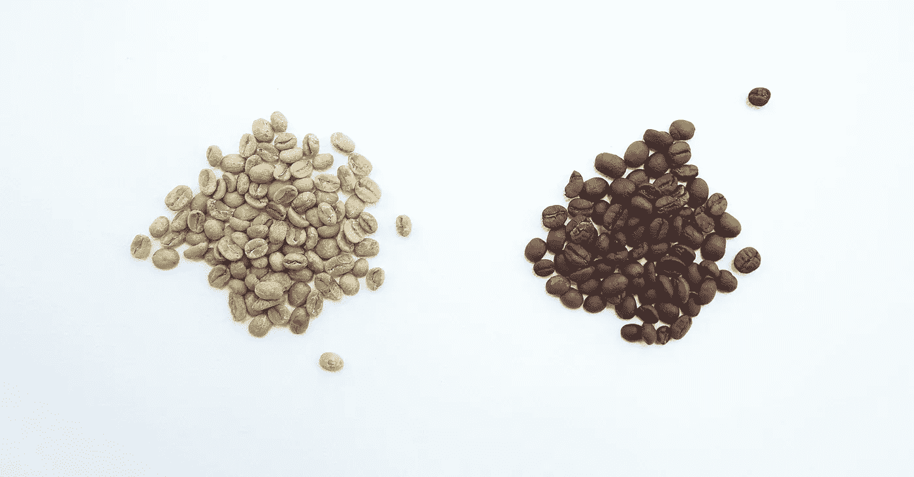
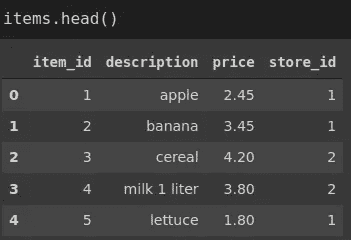
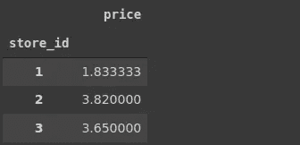
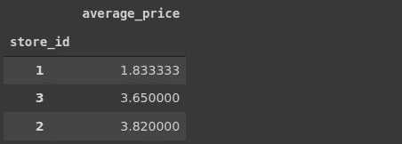
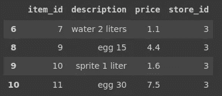
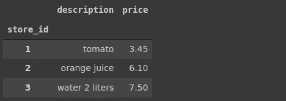
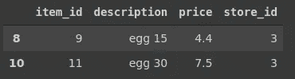
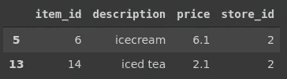

# 用熊猫重写 SQL 查询

> 原文：<https://towardsdatascience.com/rewriting-sql-queries-with-pandas-ac08d9f054ec?source=collection_archive---------27----------------------->

## SQL 和熊猫实用指南



[咖啡极客](https://unsplash.com/@coffeegeek?utm_source=unsplash&utm_medium=referral&utm_content=creditCopyText)在 [Unsplash](https://unsplash.com/s/photos/compare?utm_source=unsplash&utm_medium=referral&utm_content=creditCopyText) 上的照片

Pandas 是一个用于数据分析和操作的 Python 库。SQL 是一种用于处理关系数据库的编程语言。它们的共同点是 Pandas 和 SQL 都操作表格数据(即表格由行和列组成)。

因为 Pandas 和 SQL 都处理表格数据，所以类似的操作或查询可以使用其中任何一种来完成。在本文中，我们将使用 Pandas 语法重写 SQL 查询。因此，这将是他们两人的实际指南。

我有一个 SQL 表和一个包含 15 行 4 列的 Pandas 数据框架。让我们从显示前 5 行开始。

```
mysql> select * from items limit 5;
+---------+--------------+-------+----------+
| item_id | description  | price | store_id |
+---------+--------------+-------+----------+
|       1 | apple        |  2.45 |        1 |
|       2 | banana       |  3.45 |        1 |
|       3 | cereal       |  4.20 |        2 |
|       4 | milk 1 liter |  3.80 |        2 |
|       5 | lettuce      |  1.80 |        1 |
+---------+--------------+-------+----------+
```



(图片由作者提供)

我们有一些关于在不同零售店出售的商品的数据。在下面的例子中，我将写下一个查询任务，并用 SQL 和 Pandas 完成它。

## 示例 1

任务:找出每个商店商品的平均价格。

我们需要根据商店 id 列对价格进行分组，并计算每个商店的平均值。

```
mysql> select avg(price), store_id 
    -> from items
    -> group by store_id;+------------+----------+
| avg(price) | store_id |
+------------+----------+
|   1.833333 |        1 |
|   3.820000 |        2 |
|   3.650000 |        3 |
+------------+----------+
```

在 SQL 中，我们在选择列时应用聚合函数(avg)。group by 子句根据商店 id 列中的类别对价格进行分组。

```
items[['price', 'store_id']].groupby('store_id').mean()
```



(图片由作者提供)

在 Pandas 中，我们首先使用 groupby 函数，然后应用聚合。

## 示例 2

任务:通过将 price 列重命名为“average_price ”,并根据平均价格对商店进行排序，来修改前面示例中的结果。

在 SQL 中，我们将使用 AS 关键字进行重命名，并在末尾添加 order by 子句对结果进行排序。

```
mysql> select store_id, avg(price) as average_price
    -> from items
    -> group by store_id
    -> order by average_price;+----------+---------------+
| store_id | average_price |
+----------+---------------+
|        1 |      1.833333 |
|        3 |      3.650000 |
|        2 |      3.820000 |
+----------+---------------+
```

在 Pandas 中，重命名价格列有许多选项。我将使用命名的 agg 方法。sort_values 函数用于对结果进行排序。

```
items[['price', 'store_id']].groupby('store_id')\
.agg(average_price = pd.NamedAgg('price','mean'))\
.sort_values(by='average_price')
```



(图片由作者提供)

## 示例 3

任务:找到商店 id 为 3 的所有商品。

我们只需要根据商店 id 列过滤行。在 SQL 中，这是通过使用 where 子句来完成的。

```
mysql> select * from items
    -> where store_id = 3;+---------+----------------+-------+----------+
| item_id | description    | price | store_id |
+---------+----------------+-------+----------+
|       7 | water 2 liters |  1.10 |        3 |
|       9 | egg 15         |  4.40 |        3 |
|      10 | sprite 1 liter |  1.60 |        3 |
|      11 | egg 30         |  7.50 |        3 |
+---------+----------------+-------+----------+
```

对熊猫来说，这也是一个非常简单的操作。

```
items[items.store_id == 3]
```



(图片由作者提供)

## 实例 4

任务:找出每家商店出售的最贵的商品。

此任务涉及分组依据和聚合。在 SQL 中，max 函数应用于 price 列，值按商店 id 分组。

```
mysql> select description, max(price), store_id
    -> from items
    -> group by store_id;+----------------+------------+----------+
| description    | max(price) | store_id |
+----------------+------------+----------+
| apple          |       3.45 |        1 |
| cereal         |       6.10 |        2 |
| water 2 liters |       7.50 |        3 |
+----------------+------------+----------+
```

在 Pandas 中，我们首先按照商店 id 对所选的列进行分组，然后应用 max 函数。

```
items[['description','price','store_id']].groupby('store_id').max()
```



(图片由作者提供)

## 实例 5

任务:找到所有包含单词“egg”的项目。

该任务涉及过滤，但与我们在前面的示例中所做的不同。在 SQL 中，我们将在 where 子句中使用 like 关键字。

```
mysql> select * from items
    -> where description like '%egg%';+---------+-------------+-------+----------+
| item_id | description | price | store_id |
+---------+-------------+-------+----------+
|       9 | egg 15      |  4.40 |        3 |
|      11 | egg 30      |  7.50 |        3 |
+---------+-------------+-------+----------+
```

' %egg% '符号表示我们希望每个描述中都包含' egg '字符序列。

在 Pandas 中，我们将使用 str 访问器的 contains 函数。

```
items[items.description.str.contains('egg')]
```



(图片由作者提供)

## 实例 6

任务:找出所有在描述中包含“升”这个词并且比 2 美元贵的物品。

它类似于上一个示例中的任务，但有一个附加条件。

在 SQL 中，我们可以在 where 子句中放置多个条件。

```
mysql> select * from items
    -> where description like '%liter%' and price > 2;+---------+--------------+-------+----------+
| item_id | description  | price | store_id |
+---------+--------------+-------+----------+
|       4 | milk 1 liter |  3.80 |        2 |
+---------+--------------+-------+----------+
```

在 Pandas 中，我们可以应用如下多个过滤条件:

```
items[(items.description.str.contains('liter')) & (items.price > 2)] item_id        description     price     store_id                       3       4       milk 1 liter       3.8            2
```

## 例 7

任务:找到所有描述以“冰”开头的物品。

这是另一种基于文本的过滤。在 SQL 中，我们可以使用 like 运算符或 left 函数将描述的前三个字符与' ice '进行比较。

```
mysql> select * from items
    -> where left(description, 3) = 'ice';+---------+-------------+-------+----------+
| item_id | description | price | store_id |
+---------+-------------+-------+----------+
|       6 | icecream    |  6.10 |        2 |
|      14 | iced tea    |  2.10 |        2 |
+---------+-------------+-------+----------+mysql> select * from items where description like 'ice%';+---------+-------------+-------+----------+
| item_id | description | price | store_id |
+---------+-------------+-------+----------+
|       6 | icecream    |  6.10 |        2 |
|      14 | iced tea    |  2.10 |        2 |
+---------+-------------+-------+----------+
```

在 Pandas 中，我们可以使用 str 访问器的 startswith 函数。

```
items[items.description.str.startswith('ice')]
```



(图片由作者提供)

## 结论

Pandas 和 SQL 都是在数据科学领域使用的流行工具。它们被证明是有效和实用的。如果你正在或计划从事数据科学领域的工作，我强烈建议两者都学。

我们已经使用 Pandas 和 SQL 做了一些基本的查询来检索数据。通过执行相同的操作来比较它们是一种很好的做法。它将提高你的实践技能以及对语法的理解。

感谢您的阅读。如果您有任何反馈，请告诉我。