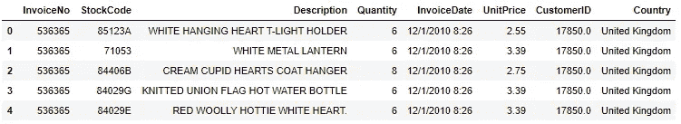
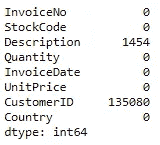
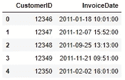
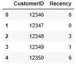
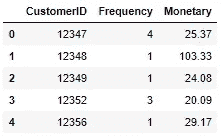
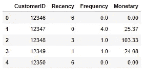
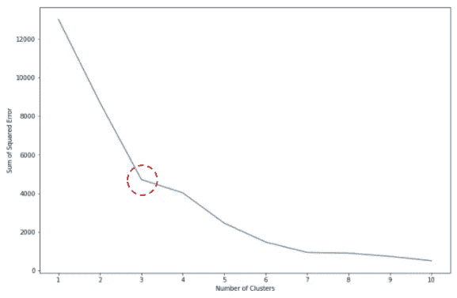
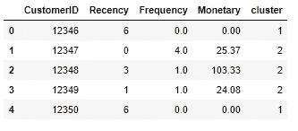
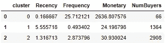
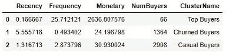

# 电子商务中的 RFM 细分

> 原文：<https://towardsdatascience.com/rfm-segmentation-in-e-commerce-e0209ce8fcf6?source=collection_archive---------13----------------------->


照片来自[pixabay.com](http://pixabay.com)

## 实用的 RFM 教程，包含详细的数据预处理步骤和业务操作项

如果你是一名对无监督学习的商业应用——尤其是聚类——感兴趣的数据从业者，你应该熟悉 RFM 分割。

RFM 细分是一种众所周知的基于三个用户特征的用户细分策略:

1.  Recency (R):用户最近一次交易是什么时候？
2.  频率(F):客户多久交易一次？
3.  货币(M):用户的交易规模是多少？

我们可以使用这种技术来更深入地了解我们的用户群，让我们能够提出(更重要的是，回答)以下重要问题:

*   我们为用户提供了多少种不同的 RFM 细分市场？每个细分市场有哪些独特的高级特征？(通过回答这些问题，我们可以确定可用于最大化每个细分市场收入的业务杠杆)
*   每个 RFM 片段的百分比是多少？(回答这个问题有助于判断机会)

鉴于这种方法明显的潜在好处，在互联网上有大量关于 RFM 分割的资源也就不足为奇了。也就是说，我似乎找不到一个关于如何创建 RFM 分割的好教程。我的结果表明，教程要么

1.  提供的数据预处理措施不充分，无法真正适用于真实的业务环境。
2.  或者，没有对收集的细分市场进行适当的业务分析，导致没有可操作的步骤来跟进这项工作(我认为这应该是构建 RFM 细分市场的首要目标)

考虑到这一点，我决定写这篇教程。将涵盖以下主题:

*   具有现实(商业)考虑的详细数据预处理
*   进行 K-均值聚类(RFM 分段的引擎)的最佳实践，包括特征标准化和确定最佳 K(聚类/分段的数量)。
*   对收集的 RFM 细分市场进行实际分析，以便我们能够采取适当的业务行动，以及后续行动的机会大小。

让我们开始旅行吧，别再废话了！

# 数据

本文中使用的数据是一个电子商务数据集，可通过[这个链接](https://www.kaggle.com/carrie1/ecommerce-data)在 Kaggle 获得。数据集是交易数据，包含一家英国零售商在 2011 年的交易。

# 数据预处理

**导入数据**

我们的旅程从导入数据开始。

```
# import data
import pandas as pdraw_data = pd.read_csv('data.csv')
raw_data.head()
```



raw_data.head()

我们可以看到数据有八列，但是我们在后面的练习中将只使用其中的一个子集。

**基础数据清理**

原来，数据在某些列上包含空行，以及重复的行。在这一步，我们想摆脱他们。

```
# check NA/NULL
raw_data.isna().sum()
```



我们确实在一些列上有空行

```
# remove NULL
raw_data = raw_data.dropna(axis = 0, how = 'any')# check duplicates
raw_data.duplicated().sum() # 5225 duplicated rows detected# drop duplicates
raw_data = raw_data.drop_duplicates(ignore_index = True)
```

**特征工程**

这一步至关重要，因为我们开始将原始数据转换为具有适当格式的数据，以供即将到来的聚类算法使用。为此，我们将采取以下措施:

1.  将`InvoiceDate`列转换为方便的日期时间格式
2.  通过将`Quantity`和`Unitprice`相乘来创建`trx_amount`列
3.  将`CustomerID`列转换为整数格式

```
# convert datetime column format
raw_data.InvoiceDate = pd.to_datetime(raw_data.InvoiceDate)# create trx_amount col
raw_data['TrxAmount'] = raw_data.Quantity * raw_data.UnitPrice# include only positive TrxAmount values(exclude credit)
raw_data = raw_data[raw_data['TrxAmount'] > 0]# cast CustomerID column to integer
raw_data.CustomerID = raw_data.CustomerID.astype('int')
```

有了从上面的代码片段中获得的最新的`raw_data`数据帧格式，我们就可以为 RFM 分割构建一个新的数据帧了。dataframe 的关键字是`CustomerID`，有三列特性:最近、频率和货币。

首先，我们讨论第一个特性:最近性，我认为就所需的预处理而言，这是三个特性中最复杂的。我们将从下面的代码开始。

```
# recency (r) df
data_r = raw_data[['InvoiceDate','CustomerID']].groupby('CustomerID')['InvoiceDate'].agg('max').reset_index()data_r.head()
```



初始最近数据帧:data_r.head()

我们将用户最近度定义为自从用户进行最后一次交易已经过去了多长时间(以月为单位)。在这点上，我们首先需要确定我们用于向后计算月份的当前时间参考:我们将它设置为`InvoiceData`列的最近值。

```
# current time reference
cur_time = data_r.InvoiceDate.max()# month diff function
def month_diff(cur_time, datetime_val): 
    return 12 * (cur_time.year - datetime_val.year) + (cur_time.month - datetime_val.month)# recency month
data_r['Recency'] = data_r.InvoiceDate.apply(lambda datetime_val: month_diff(cur_time, datetime_val))
```

其次，如果客户最近一次交易发生在 6 个月或更久之前，我们会认为他/她绝对是被激怒了，因此，如果交易时间超过 6 个月，我们就没有兴趣对最近交易值进行编码，因为我们不再拥有有意义的额外信息。换句话说，最近值必须限制在最长 6 个月。

```
# clip max at 6 months backward
data_r.Recency = data_r.Recency.clip(lower = None, upper = 6)# drop InvoiceDate column
data_r = data_r.drop('InvoiceDate', axis = 1)# head
data_r.head()
```



已处理的最近数据帧:data_r.head()

我们结束了最近的事。现在我们将创建频率和货币特征。因为我们只想要最有意义(非过时)的信息，所以在构建频率和货币特征时，我们只考虑过去 6 个月的交易:

*   频率:用户在前六个月完成的交易次数。
*   货币:用户在过去六个月的平均交易规模

值得注意的是，从计算的角度来看，这个时间段约束也是有利的。假设你在亚马逊工作，创建 RFM 细分市场。如果您不限制时间窗口，您将最终使用他们超过二十年的事务日志数据(这在大小上可能太大了)。

```
# frequency & monetary(fm) df only w.r.t. last 6 months data
EARLIEST_DATE = pd.to_datetime('2011-06-09')
data_fm = raw_data[raw_data.InvoiceDate >= EARLIEST_DATE]
data_fm = data_fm[['InvoiceNo','CustomerID','TrxAmount']]data_fm = data_fm.groupby('CustomerID')[['InvoiceNo','TrxAmount']].agg({'InvoiceNo':'nunique', 'TrxAmount':'mean'}).reset_index()
data_fm = data_fm.rename(columns = {'InvoiceNo':'Frequency', 'TrxAmount':'Monetary'})
data_fm.Monetary = data_fm.Monetary.round(2)
data_fm.head()
```



频率-货币数据框架:data_fm.head()

最后，我们将近期数据框架(`data_r`)与频率&货币数据框架(`data_fm`)结合起来，得到我们的最终数据！

```
# join to have the final data df
data = data_r.merge(data_fm, on = 'CustomerID', how = 'left')
data = data.fillna(0)
data.head()
```



最终数据:data.head()

# 基于 K 均值聚类的 RFM 分割

**标准化栏目**

这一步在很多教程中经常被跳过。然而，最佳实践是标准化 R-F-M 特征，特别是因为货币函数具有货币的度量，这意味着标度与其他特征有很大不同。通过将其标准化，我们确保 K-means 算法不会高估这个货币函数(即，将它视为比其他特征更重要的特征)。

```
from sklearn.preprocessing import StandardScaler# feature columns
feature_cols = ['Recency','Frequency','Monetary']# standardized df for training
standardized_data = data.copy()# standardization
scaler = StandardScaler()
scaler.fit(data[feature_cols])
standardized_features = scaler.transform(data[feature_cols])
standardized_data[feature_cols] = standardized_features
```

**肘法**

如你所知，K-means 算法中的 K(聚类数)是一个超参数。因此，我们必须提前仔细选择它。肘法是最佳选择 K 的一种常用方法:我们绘制各种 K 值的误差平方和(SSE ),并选择 SSE 下降斜率在该值前后显著变化的 K 值。

对于那些不熟悉 SSE 的人来说，术语“误差”指的是数据点与其质心之间的偏差/距离。因此 SSE 是所有数据点的这种平方误差的数量。同样值得注意的是，SSE 值总是随着 K 的增加而减小。

为了继续，我们用十个不同的 K(1，2，…，10)拟合 K-means 算法十次，并保存每个收敛模型的 SSE(注意 SSE 存储在`inertia_`属性中)。

```
# fit K-means clustering on various Ks
from sklearn.cluster import KMeanskmeans_kwargs = {
    "init" : "random",
    "n_init" : 10
}sse = []
for k in range(1,11):
    kmeans = KMeans(n_clusters=k, **kmeans_kwargs)
    kmeans.fit(standardized_data[feature_cols])
    sse.append(kmeans.inertia_)
```

让我们把肘法形象化！

```
# Elbow method plot
import matplotlib.pyplot as pltplt.figure(figsize = (12,8))
plt.plot(range(1,11), sse)
plt.xticks(range(1,11))
plt.xlabel("Number of Clusters")
plt.ylabel("Sum of Squared Error")
plt.show()
```



不同数量聚类的误差平方和

看上面的图，很明显我们可以选择 K= 3:观察在这个特定的 K 值之前和之后斜率的巨大差异。

**拟合 K-表示使用最优 K**

在知道最佳 K 是 3 之后，我们使用这个 K 值再次拟合算法。

```
kmeans_kwargs = {
    "init" : "random",
    "n_init" : 10
}# run kmeans with the optimal k
kmeans = KMeans(n_clusters=3, **kmeans_kwargs)
kmeans.fit(standardized_data[feature_cols])
data['cluster'] = kmeans.labels_
data.head()
```



具有从 K-means 算法获得的聚类数的数据

# 结果分析

我们的工作还没有结束。我们必须在群集被收集后对其进行解释。为此，我们可以通过显示 R-F-M 形心值以及每个集群中的用户数量来总结所获得的集群。

为什么是质心值？因为我们可以认为这些值是每个获得的聚类的代表。因此，我们可以使用这些值从相应的用户方面(R/F/M)来解释属于特定集群的用户的整体行为/特征。

```
# look at the centroids per cluster
centroid_df = data.groupby('cluster')[['Recency', 'Frequency', 'Monetary','CustomerID']].agg({'Recency': 'mean', 'Frequency': 'mean', 'Monetary':'mean','CustomerID':'nunique'}).reset_index()
centroid_df = centroid_df.rename(columns = {'CustomerID':'NumBuyers'})
centroid_df
```



获得的聚类:质心细节和聚类大小

根据上表，我们有三个用户群/细分市场:

1.  **集群 0:我们的顶级用户群。**此类别的用户是最近/当前的定期购买者(最近购买率低，频率高)。他们最近的一次交易也就在几天前，之前半年的交易频率是 26 次。不幸的是，他们为数不多(66 个用户，相当于所有用户群的 1.5%)。
2.  第一类:我们被搅动的用户群。这一类别的用户是我们选择退出的客户(最近率高*【注意这是一件坏事】*，频率低)。他们上一次交易是五个多月前，之前半年只有 0 或 1 次交易！不幸的是，他们也很多(1364 个用户，相当于所有用户群的 31.5%)。
3.  **集群 2:我们的休闲用户群。**这一类别的用户是我们的常客(无论是最近的还是频繁的)。他们最近的交易发生在最近两个月内，在之前的六个月内交易频率高达三次。众所周知，他们是我们用户群中最大的一部分(2908 个用户，相当于所有用户群的 67%)

```
# give high-level name for each cluster
centroid_df.pop('cluster')cluster_names = ['Top Buyers','Churned Buyers','Casual Buyers']
centroid_df['ClusterName'] = cluster_namescentroid_df
```



获得了具有高级名称的集群

**可操作的步骤**

我们将根据对上述集群的了解，为每个集群创建一个定制的推广策略，如下所示:

*   顶级买家:没有必要用优惠券/促销活动来压倒他们(这为我们省钱)，但我们可以优化/利用某种忠诚度积分来留住他们。
*   **临时买家:**我们需要提高这一细分市场的频率和货币价值。我们可以通过提供返现形式的优惠券来实现这一点(以实现重复购买)，并具有较高的资格门槛(例如，优惠券仅对至少 50 英镑的交易金额有效)。
*   被搅动的买家:我们的首要任务是让他们在被搅动一段时间后再次与我们交易。为了鼓励他们这样做，我们可以提供一两张大额福利券。这与持续不断的推送通知密切相关。

# 总结和结论

祝贺你读到这里！👏

在这篇博客中，我们通过一步一步的 Python 教程，以端到端的方式在电子商务环境中执行了 RFM 分割！我们首先执行彻底的数据预处理，然后适当地拟合 K-means 算法(结合特征标准化和肘方法)。最后，我们解释了由此产生的细分市场，以便为每个细分市场制定个性化的推广计划。

啊，对了，对于那些喜欢 GitHub 界面的人来说，完整的笔记本可以在我的 GitHub repo [这里](https://github.com/pararawendy/RFM-in-ecommerce)找到。

我希望这篇文章对你即将到来的 RFM 细分项目/任务有所帮助！总而言之，感谢阅读，大家在 [LinkedIn](https://www.linkedin.com/in/pararawendy-indarjo/) 上和我连线吧！👋