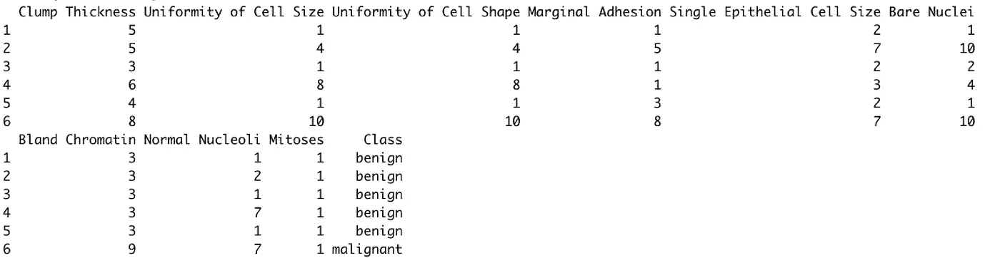
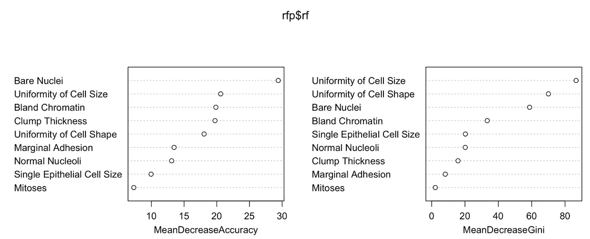
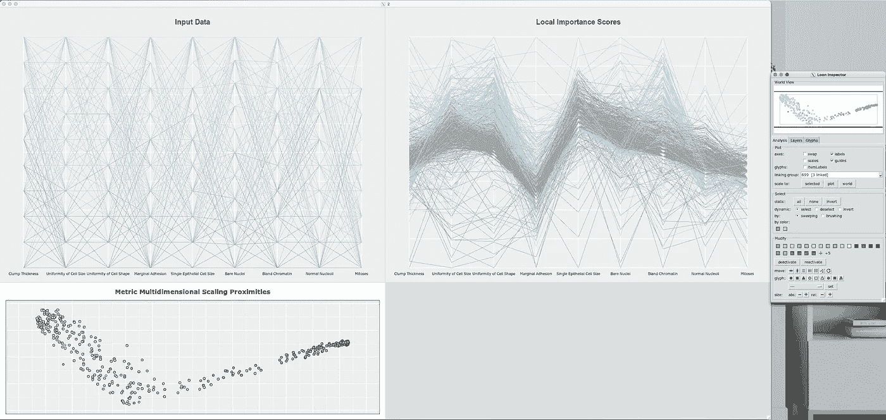
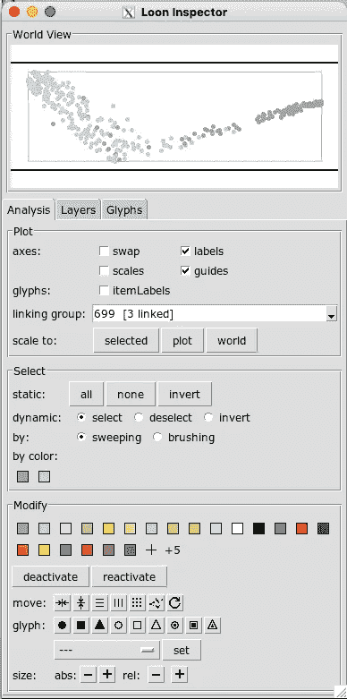
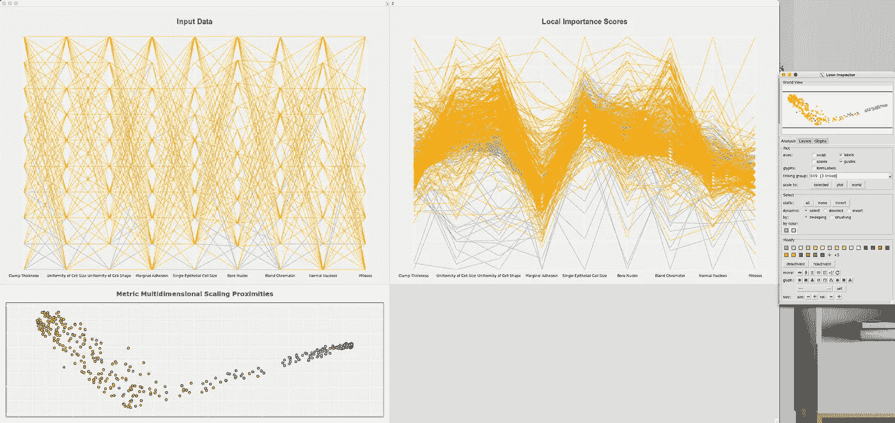
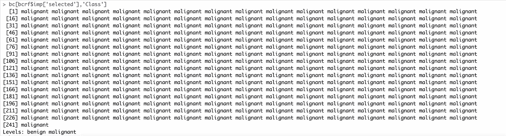
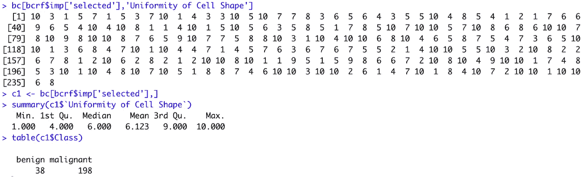
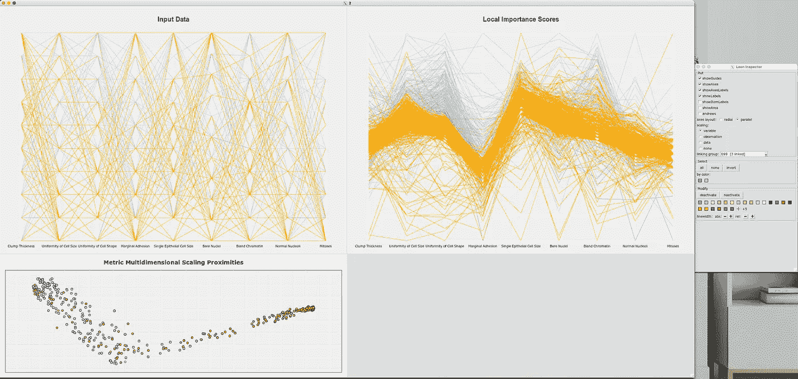
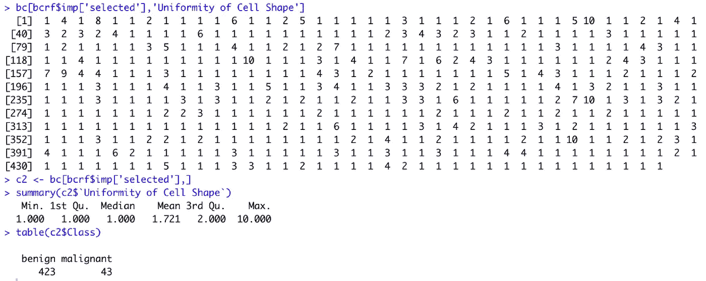
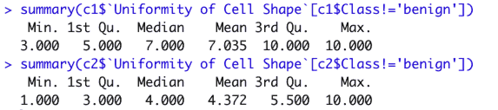

# Rfviz:一个交互式可视化包，用于解释 R

> 原文：<https://towardsdatascience.com/rfviz-an-interactive-visualization-package-for-random-forests-in-r-8fb71709c8bf?source=collection_archive---------11----------------------->

## [实践教程](https://towardsdatascience.com/tagged/hands-on-tutorials)

## 从随机森林算法的最初创建者和他们在 Java 中的最初实现开始，他们的工作被翻译成 R 包 Rfviz。

# 背景故事

首先，我想说的是，我不应该因为这个计划而得到任何荣誉。这应归功于 Leo Breiman 博士和 Adele Cutler 博士，他们是这一广受欢迎的成功算法的最初创造者。我只是一个幸运的学生，在我的研究生项目中与卡特勒博士一起工作。

Breiman 博士和 Cutler 博士最初用 Java 创建了允许你可视化和解释随机森林的图。你可以在这里看看原著的剧情和风格:

[](https://www.stat.berkeley.edu/~breiman/RandomForests/cc_graphics.htm) [## 随机森林.分类手册

### RAFT(随机森林工具)是一个新的基于 java 的可视化工具，由 Adele Cutler 和 Leo Breiman 为…

www.stat.berkeley.edu](https://www.stat.berkeley.edu/~breiman/RandomForests/cc_graphics.htm) 

我有幸从 2017 年开始去了犹他州立大学，卡特勒博士是那里统计系的教授。我想做机器学习方面的研究生工作，并请她做我的研究生导师。她同意了，并向我展示了潜在的项目。在这个时候，我不知道她帮助创建了随机森林算法。事实上，直到我的项目进行到一半的时候，我才从另一个教员那里得知。当我走近她，问她为什么不告诉我时，她回答说，“哦，我真的不喜欢自吹自擂。”我希望这能告诉你她是多么脚踏实地，是一个怎样的人。

总之，她向我展示的一个潜在项目是将一些用于交互式可视化和随机森林解释的 Java plots 翻译成 R。我选择了这个项目，并在 2018 年完成了 R 的翻译，并将包作为 Rfviz 发布到 CRAN。

最近，我一直在工作中使用它，在我看来，能够获得比通过 Shapley 方法或整体变量重要性图等方法更深入的见解。我认为其他人应该更多地了解我从布雷曼博士和卡特勒博士的工作中获得的益处。这是这篇文章的灵感来源。

# 理论背景

## 随机森林

随机森林(Breiman (2001))使许多树木(通常 500 或更多)适合回归或分类数据。每棵树都适合数据的引导样本，因此一些观察值不包括在每棵树的拟合中(这些被称为树的*出袋*观察值)。在每棵树的每个节点上独立地随机选择相对较少数量的预测变量(称为 *mtry* ),这些变量用于寻找最佳分割。树长得很深，没有修剪。为了预测一个新的观察值，观察值被传递到所有的树上，预测值被平均(回归)或投票(分类)。

## 可变重要性

对于每个变量，为数据集中的每个观察值获得局部重要性分数。为了获得观察值 *i* 和变量 *j* 的局部重要性分数，对观察值 *i* 超出范围的每棵树随机置换变量 *j* ，并将变量 *j* 置换数据的误差与实际误差进行比较。观察值 *i* 超出范围的所有树的平均误差差是其局部重要性分数。

变量 *j* 的(总体)变量重要性分数是所有观测值的局部重要性分数的平均值。

## 邻近

邻近度是当两个观测值都超出范围时，两个观测值在同一终端节点结束的时间比例。获得所有观察对组合的接近度分数，给出对称的接近度矩阵。

注意:在处理近似时，建议使用 9 或 10 倍的树，因为这是两个观测值都超出范围的概率。这是为了确保每个观察结果能够与后续观察结果进行比较。

## 平行坐标图

平行坐标图用于绘制一些变量的观察值。变量可以是离散的或连续的，甚至是分类的。每个变量都有自己的轴，这些轴用等间距的平行垂直线表示。通常，轴从观察数据值的最小值延伸到最大值，尽管其他定义也是可能的。通过使用分段线性函数连接每个变量的观察值，绘制出给定的观察值。

静态平行坐标图不太适合发现变量之间的关系，因为显示很大程度上取决于图中变量的顺序。此外，对于大型数据集来说，它们承受着过度绘制的痛苦。然而，通过*刷*图(用对比色突出显示观察值的子集)平行坐标图可用于调查不寻常的观察值组，并将观察值组与变量的高/低值相关联。

# Rfviz 制作的图

## 输入数据的平行坐标图。

预测变量绘制在平行坐标图中。观察值根据其响应变量的值进行着色。刷这个图允许研究者交互地检查输入数据，寻找不寻常的观察，异常值，或预测和反应之间的任何明显的模式。该图通常与局部重要性图结合使用，这使得用户可以更专注于对给定观察组重要的预测值。

## 局部重要性分数的平行坐标图。

每个观察值的局部重要性分数绘制在平行坐标图中。具有高局部重要性的刷牙观察可允许用户查看原始输入平行坐标图上的相应变量，并观察该变量是否具有高值或低值，从而允许诸如“对于该组，最重要的变量是变量*j’*”的解释。

## 邻近度的旋转散点图。

该图允许用户选择看起来相似的观察值组，并刷过它们，相应的观察值显示在两个平行的坐标图中。例如，在分类中，如果用户刷一组来自类 1 的观察值，那么他们可以检查局部重要性平行坐标图。对于正确分类该组很重要的变量将被突出显示，然后可以在原始输入平行坐标图中研究任何具有高重要性的变量，以查看重要变量的高值或低值是否与该组相关联。

# 使用案例:

这里使用的数据是来自图书馆 [OneR](https://rdrr.io/cran/OneR/man/breastcancer.html) 的乳腺癌数据集。它最初来自 UCI 机器学习资源库[这里](https://archive.ics.uci.edu/ml/datasets/Breast+Cancer+Wisconsin+(Original))。

```
library(OneR)
library(rfviz)
library(tidyverse)
data(breastcancer)
bc[is.na(bc)] <- -3
data_x <- bc[,-10]
data_y <- bc$Class
head(breastcancer)
```



截图 1

```
#The prep function. This runs default randomForest() and prepares it for the plotting function.rfprep <- rf_prep(data_x, data_y)
```

我们的用例:假设我们查看随机森林中的可变重要性图。

```
varImpPlot(rfprep$rf)
```



截图 2

查看一些最重要的变量，我们可以看到，根据基尼系数的平均下降,“细胞大小的均匀性”和“细胞形状的均匀性”是两个最重要的预测指标。但是，这些价值观中哪些是最重要的，对哪个阶层最重要？让我们打开可视化工具，深入研究其中一个。

```
#Pull up the visualization toolbcrf <- rf_viz(rfprep, input=TRUE, imp=TRUE, cmd=TRUE)
```



截图三

我们可以看到这里有三个情节，还有一个“loon inspector”与情节进行交互。对于每列数据，每个平行坐标图都有单独的刻度，这就是为什么没有 y 轴刻度或标签的原因。刻度与该列的最大值和最小值相关。邻近图是一个 XYZ 散点图。主要是在空间上显示不同的类在树中是如何分组的。

首先，让我们看看什么颜色与每个类相关。在右侧的“loon inspector”中的“select”部分，单击“by color”子部分下的一种颜色。我们先点蓝色。在屏幕截图 5 中，您可以看到结果。



截图 4



截图 5

我们可以看到，所有与蓝色类相关的数据现在都突出显示了。这与哪一类相关？回到休息状态，运行:

```
bc[bcrf$imp['selected'],'Class']
```



截图 6

我知道这是最基本的，但这是我目前为止能快速简单地识别类的所有方法。我还没想好怎么在检查员身上标注颜色。现在我们知道蓝色是恶性或 1 级，灰色是良性或 0 级。现在单击可视化工具上的任意位置，将会取消选择。


截图 7

我们现在知道，蓝色是 1 类或患有恶性癌症的人。现在，让我们关注“细胞形状的一致性”列，这是基尼系数总体重要性图中平均下降的第二个最重要的变量。看一下局部重要性分数图，以及截图 7 中的“细胞形状的一致性”栏。从视觉上看，1 级/恶性肿瘤的局部重要性分值似乎倾向于高于 0 级/良性肿瘤。

现在，这里是深入解释和理解的地方。在局部重要性分数图上，用鼠标单击并向上拖动“细胞形状一致性”栏，靠近您认为两类或两种颜色的线会发生分离的位置。以下是我在截图 8 中选择的内容。


截图 8

在 R 中，运行:

```
bc[bcrf$imp['selected'],'Uniformity of Cell Shape']
c1 <- bc[bcrf$imp['selected'],]
summary(c1$`Uniformity of Cell Shape`)
table(c1$Class)
```



截图 9

现在对我们没有在局部重要性分数图上的“细胞形状的一致性”列中选择的数据部分做同样的操作。以下是我在截图 10 中选择的内容。



截图 10

再次在 R 中运行:

```
bc[bcrf$imp['selected'],'Uniformity of Cell Shape']
c2 <- bc[bcrf$imp['selected'],]
summary(c2$`Uniformity of Cell Shape`)
table(c2$Class)
```



截图 11

现在让我们看看结果。在我们最初选择的患者中，198/236 (~84%)来自 1 级/恶性肿瘤。“细胞形状均匀度”值的第一个四分位数为 4，中位数为 6，第三个四分位数为 9。

对于第二组，423/466 (91%)来自 0 级/良性。“细胞形状均匀度”值的第一个四分位数为 1，中位数为 1，第三个四分位数为 2。

由此，我们可以得出结论，对于预测的第二个最重要的变量，第一个四分位数为 4，中位数为 6，第三个四分位数为 9 的较高“细胞形状均匀性”值通常对随机森林的 1 类/恶性分类很重要。我说“一般”是因为我们选择数据中包括了一些 0 级/良性的。

另一方面，第一个四分位数为 1、中位数为 1、第三个四分位数为 2 的较低值“细胞形状的均匀性”通常对随机森林的 0 级很重要。更重要的是，我们可以查看确切的数据，并将其保存为 R 中的对象，以便进行更多的操作。

例如，假设我们不希望其他类的任何值出现在每个数据选择的“细胞形状一致性”的汇总数据中。

```
summary(c1$`Uniformity of Cell Shape`[c1$Class!='benign'])
summary(c2$`Uniformity of Cell Shape`[c2$Class!='benign'])
```



截图 12

那么 Rfviz 允许我们做什么呢？Rfviz 允许我们对随机森林进行更深入的交互和解释。我们可以可视化数据并与之交互，*快速查看类别之间的差异，并查看总体重要变量对每个类别的局部重要性。*

关于如何与工具交互的更深入的教程，请看[这里](https://chrisbeckett8.github.io/Rfviz.html)。

我希望你喜欢这篇文章，并祝你在随机森林的解释和推断中好运。

参考资料:

布雷曼，2001 年。“随机森林。”*机器学习*。[http://www.springerlink.com/index/u0p06167n6173512.pdf](http://www.springerlink.com/index/u0p06167n6173512.pdf)。

布雷曼，我，和一个卡特勒。2004.*随机森林*。[https://www . stat . Berkeley . edu/~ brei man/random forests/cc _ graphics . htm](https://www.stat.berkeley.edu/~breiman/RandomForests/cc_graphics.htm)。

C Beckett，*Rfviz:R 中随机森林的交互式可视化包*，2018，https://chrisbeckett8.github.io/Rfviz.