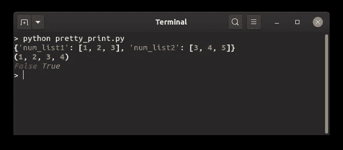
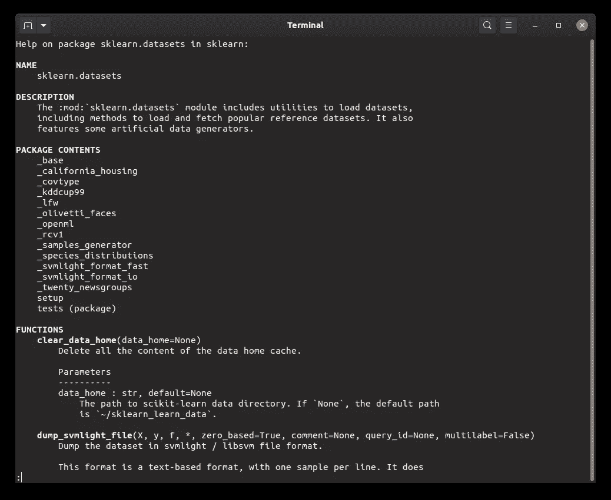
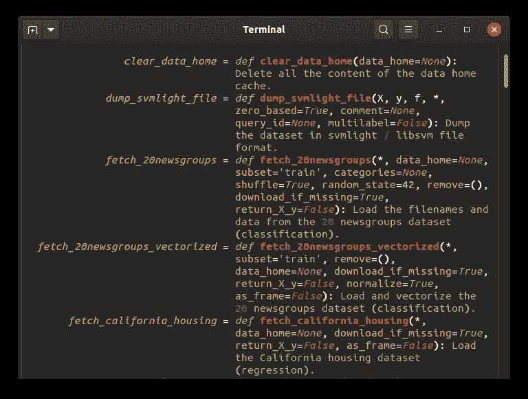
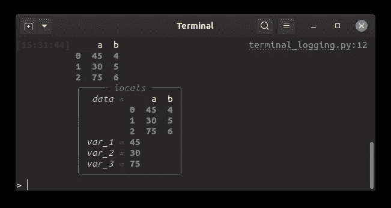
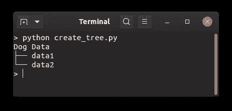
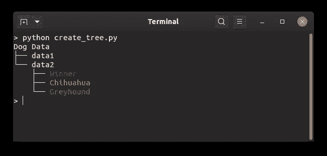
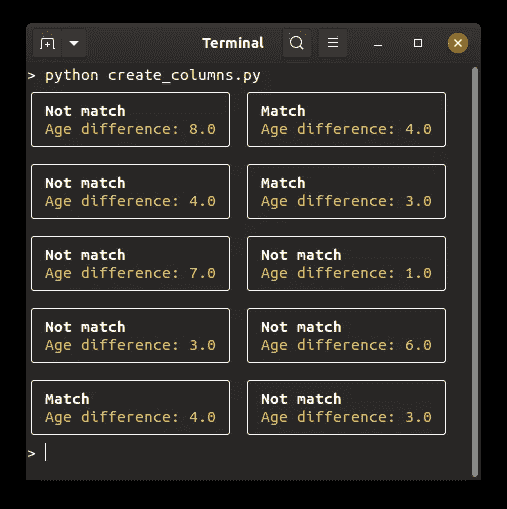

# Rich:用 Python 在终端生成丰富美观的文本

> 原文：<https://towardsdatascience.com/rich-generate-rich-and-beautiful-text-in-the-terminal-with-python-541f39abf32e?source=collection_archive---------7----------------------->

## 用几行代码调试和创建很酷的 Python 包

# 动机

在开发了一个有用的 Python 包或函数之后，您可能希望您的队友或其他用户使用您的代码。然而，您的代码在终端中的输出有点令人厌烦，并且很难理解。

有没有一种方法可以让输出像下面这样更清晰更漂亮？


作者 Gif

这就是 Rich 派上用场的时候。除了漂亮的印刷，Rich 还允许您:

*   生成关于任何 Python 对象的漂亮报告
*   调试函数的输出
*   创建一个树来显示文件结构
*   创建进度条和状态
*   创建漂亮的列

在本教程中，我将向您展示如何用几行 Python 代码完成上面提到的所有事情。

# 开始

要安装 Rich，请键入

```
pip install rich
```

要快速总结 Rich 的功能，请键入

```
python -m rich
```


作者图片

输出很漂亮！但是怎样才能重现上面这样的输出呢？

# 创建漂亮的打印输出

Rich 使用 pretty print 函数使调试变得容易。虽然 [icecream 允许您查看产生输出](/stop-using-print-to-debug-in-python-use-icecream-instead-79e17b963fcc)的代码，但是 Rich 会根据数据类型突出显示输出。



作者图片

在上面的输出中，不同的输出基于它们的**数据类型**用不同的颜色突出显示。这个输出不仅漂亮，而且当有许多不同数据类型的输出时，对于调试也很有用。

# 生成关于任何 Python 对象的漂亮报告

场景:你不确定你正在使用的 Python 对象的功能。您不想在 Google 上搜索，而是想在终端中快速浏览 Python 对象。这可以使用`help()`来完成

但是，输出相当长，难以阅读。



作者图片

幸运的是，Rich 提供了`inspect`，这使得在终端中查看 Python 对象的文档更加容易。



作者图片

现在你知道`sklearn.datasets`提供了哪些数据集以及如何使用它们了！

# 调试函数的输出

Scenerio:您想知道函数中的哪些元素创建了特定的输出。所以你打印了函数中的每个变量。

解决方案:您可以简单地使用`Console`对象来打印输出和函数中的所有变量。



作者图片

您可以通过简单地使用`console.log`来查看产生函数输出的相关细节！这将使您更容易发现代码中的任何错误，并相应地修复它们。

# 创建目录的树形结构

如果我们想知道一个目录的结构，查看目录树结构会很有帮助。Rich 允许我们使用`Tree`对象来这样做。

例如，如果我们的数据目录包含两种类型的数据:`data1`和`data2`，我们可以使用`tree.add`方法将这两个文件添加到父目录中



作者图片

在`data2`下，我们有另外 3 个文件。我们可以使用与上面相同的方法将它们添加到`data2`。但是为了使它更有趣，我们还将使用`['color_name]your_text'`给我们的字符串添加颜色



作者图片

现在我们有了一个整洁的树结构，不同的叶子有不同的颜色！

# 创建进度条和状态

了解代码的进度或状态通常很有用。Rich 允许我们使用`progress.track`方法创建一个进度条。


作者 Gif

如果我们想记录一个特定任务完成执行的时间，我们可以使用`console.status`来代替


作者 Gif

是不是很酷？如果您不喜欢当前的微调器，可以使用以下命令搜索其他微调器选项:

```
python -m rich.spinner
```

然后通过为`console.status`方法中的`spinner`参数指定不同的值来更改默认微调器。


作者 Gif

# 创建漂亮的列

您可能只想比较两个不同要素之间的关系，而不是一次查看数据集中的许多要素。Rich 允许您使用等宽的整齐列一次查看多行数据。

我们将下载 [Open ML 的速配数据](https://www.openml.org/d/40536)集，查看两人年龄差距与匹配与否的关系。



作者图片

# 结论

恭喜你！您刚刚学习了如何使用几行 Python 代码生成漂亮的终端输出。我们都喜欢 Python 包，当我们等待它工作的时候，它们在终端上看起来很酷。

我希望这篇文章能给你一些想法，让你的工作流程更有效率，并开发一个有很酷的用户界面的包。我鼓励您探索 Rich，了解我在本文中没有提到的其他特性。

随意在这里叉玩这篇文章[的源代码。](https://github.com/khuyentran1401/Data-science/tree/master/terminal/rich)

我喜欢写一些基本的数据科学概念，并尝试不同的算法和数据科学工具。你可以在 LinkedIn 和 T2 Twitter 上与我联系。

星[这个回购](https://github.com/khuyentran1401/Data-science)如果你想检查我写的所有文章的代码。在 Medium 上关注我，了解我的最新数据科学文章，例如:

[](/prettify-your-terminal-text-with-termcolor-and-pyfiglet-880de83fda6b) [## 用 Termcolor 和 Pyfiglet 美化你的终端文本

### 厌倦了你的终端输出？让我们改变它的颜色和形状！

towardsdatascience.com](/prettify-your-terminal-text-with-termcolor-and-pyfiglet-880de83fda6b) [](/stop-using-print-to-debug-in-python-use-icecream-instead-79e17b963fcc) [## 在 Python 中停止使用 Print 进行调试。用冰淇淋代替

### 你是使用打印还是日志来调试你的代码？用冰淇淋代替。

towardsdatascience.com](/stop-using-print-to-debug-in-python-use-icecream-instead-79e17b963fcc) [](/understand-your-csv-files-from-your-terminal-with-xsv-65255ae67293) [## 了解您的 CSV 文件从您的终端与 XSV

### 用一行代码通过你的终端快速理解你的 CSV 文件

towardsdatascience.com](/understand-your-csv-files-from-your-terminal-with-xsv-65255ae67293) [](/introduction-to-dvc-data-version-control-tool-for-machine-learning-projects-7cb49c229fe0) [## DVC 介绍:机器学习项目的数据版本控制工具

### 就像 Git 一样，但是有数据！

towardsdatascience.com](/introduction-to-dvc-data-version-control-tool-for-machine-learning-projects-7cb49c229fe0)