# 脊线、套索和弹性网回归

> 原文：<https://towardsdatascience.com/ridge-lasso-and-elasticnet-regression-b1f9c00ea3a3?source=collection_archive---------2----------------------->

## 正则化的持续冒险和防止模型过度拟合的永恒追求！


套索、山脊和弹性网回归|照片由 Daniele Levis Pulusi 拍摄

这篇文章是上周介绍使用线性回归的[正则化的延续。莴苣那边回到本质上，用更先进的技术简化我们的模型，使最好的数据科学/机器学习模型成为可能。我们如何简化我们的模型？通过移除尽可能多的特征。我为什么要这么做？我想要一个更简单的模型。为什么我想要一个更简单的模型？因为一个简单的模型概括得更好。泛化是什么意思？**这意味着你可以在现实世界中使用它**。该模型不仅解释了训练数据，而且也有更好的机会解释我们以前没有见过的数据。](/regularization-and-linear-regression-bcaeba547c46)

## 正规化

正则化试图通过添加调谐参数λ或α来控制方差:

## 套索(L1 正则化)

*   正则项惩罚系数的绝对值
*   将不相关的值设置为 0
*   可能会移除模型中的过多特征

## 岭回归( **L2 正则化**)

*   惩罚回归系数的大小(大小的平方)
*   强制降低 *B* (斜率/部分斜率)系数，但不是 0
*   不会删除不相关的功能，但会最小化它们的影响

现在不要担心λ。现在假设λ是 1。对于岭回归，我们惩罚回归系数的大小。因此，较大的回归系数是较大的惩罚。

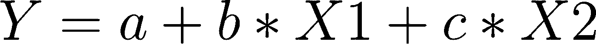

b 和 c 是回归系数

所以在这个岭回归中，我会取 **b** 的平方，并把它加到 **c** 的平方上。这就是我的惩罚。现在比这稍微复杂一点，因为有时我想让惩罚变强或变弱，我现在引入这个λ，这个调谐参数。所以我的惩罚现在变成了:

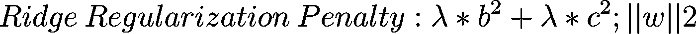

也称为 L2 或欧几里德范数

这就是岭回归的作用。通过在我的成本函数中加入这个惩罚，在训练过程中，它将保持这些 b 和这些 c 很小。这样做可以简化模型。这意味着任何给定的列都不会有那么大的功率。

套索做了几乎相同的事情。除了正则化罚函数没有平方:

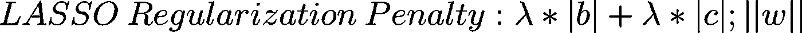

也称为 L1 或曼哈顿/出租车规范

请注意，因为这里可能有负值，所以需要在部分斜率的系数上加上绝对值。

上例中的系数 b 和 c 由您使用的算法调整。我们通过引入一个不为 1 的 lambda 罚值给它添加了另一个怪癖——它一直在幕后，但为了简单起见，我们将其保持为 1。当需要评估你的模型的好坏时，通过成本函数，我们将把一个我们称为λ的惩罚乘以你的系数(或系数的平方)，这将是一个额外的惩罚。

我们仍然有我们的一般成本函数。这只是对成本函数增加。我们的一般成本函数总是相同的，它是这样的，我们有 y——预测的 y，取它的平方，然后把所有这些加起来。这是我们的成本函数，基线。现在，为了正则化的附加惩罚是使用所谓的 L2 范数的岭回归，或者使用所谓的 L1 范数的 LASSO(最小绝对收缩和选择算子)回归。

对于这两种类型的回归，较大的系数对模型不利。对于岭，由于平方的原因，损失不成比例地更大，但是一般来说，较大的系数会降低模型性能，较大的系数会降低拟合优度。

名词（noun 的缩写）b:***L****符号是对闵可夫斯基规范和 ***Lp*** 空格的引用。这些只是将出租车和欧几里德距离的概念推广到以下表达式中的 *p > 0p > 0* :*

*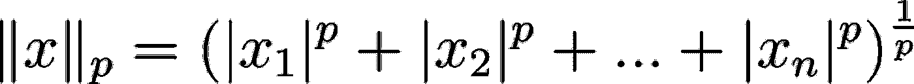*

*对于那些还记得线性代数的人*

## *里脊回归*

*再次重申，岭回归是一种限制回归中独立变量(列/特征/属性)数量的方法。正则最小二乘准则最小化误差的最小平方加上正则项，正则项是常数和系数平方之和的乘积:*

*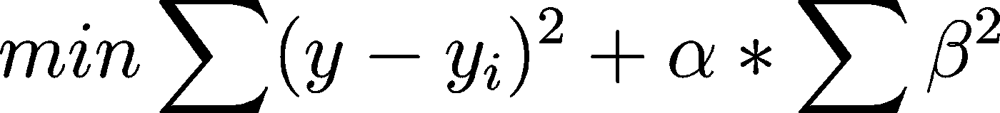*

*岭回归成本函数，以另一种方式表达|在某些文献中，有时使用α代替λ*

*本质上，这是为了防止部分斜率项变得过大。*

*这里我称这个惩罚系数为α，而不是λ。这有点令人困惑，因为在这个行话中，alpha 有几个非常相关的意思。所以我想提醒你，一般来说，你可能会有一些问题，lambda 是一个安全的赌注。α至少有两个非常接近但仍然不同的含义。*

*这里，我们有这个β的平方。什么是贝塔？β是系数的向量。所以β是一个向量，在我之前的例子中是 b 和 c。记住，我有 y = a +b*X1 + c*X2，b 和 c 是两个系数。β是一个向量，这里由两个数字组成。在我的例子中，这两个数字是 b 和 c；a 是截距，有时容易混淆地称为 b。*

*所以β的平方和上面的等式完全一样。什么是偏坡？部分斜率的另一个词是系数。为什么我们称之为偏坡？如果你记得，我们有一个斜率，当我们有一个线性回归时，y = a + b*X，b 是斜率。如果你有多个 x，那么 y = a + b*X1 + c*X2 + d*X3 等等。然后，在我刚才提到的例子中，b，c 和 d 都是部分斜率，这是因为它们乘以了列。列的输入值随变量的变化而变化的方式会影响输出。如果系数或部分斜率越大，影响就越大。当我说更大，我的意思是在数量上。*

*所以脊目标**是残差平方和(RSS)+λ*(系数的平方和)**。*

*   *使用 lambda 来平衡最小化 RSS 和最小化系数*
*   *当 lambda = 0 时，结果与常规线性回归相同:您已经移除了岭回归损失*
*   *随着λ增加到无穷大，系数变得更接近于 0*
*   *任何非零λ值都会将系数缩小到小于非正则化回归的系数*
*   *随着 lambda (alpha)的增加，模型复杂度降低*

*Lambda 只是一个标量，应该使用交叉验证(调整)从您的数据中学习。所以λ总是正的，介于零和无穷大之间。给你一个范围的基本概念，它很少比 1 大很多，可能是 2 或 3，通常是 1 的一小部分。这是为什么呢？嗯，事情就是这样解决的。我刚才说的有反例，但是作为一个普遍的启发，你通常会发现λ在 0 和之间，一个小值，让我们说大约 2。*

*如果模型的复杂度随着 lambda 的增加而降低，你怎么能看出这一点？*

*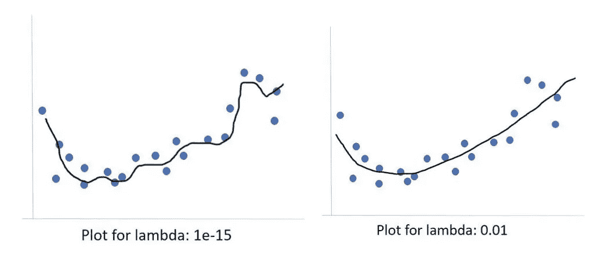*

*我们的回归线与蓝点吻合得很好*

*在上面的例子中，我近似了某种形式的回归，在这种情况下，可能不是线性回归。这种回归非常有效。然后我们添加了 lambda 参数。希望事情有所好转。如果我在这里看这个，我可能会想要右边的那个。我的理由是，我看到这些蓝点，它们到处飞，它们在那条黑线的上下。我预计这些蓝点会有更多的变化，会有很多变化。所以我认为，试图找到一个模型，试图最小化这些蓝点的残差，会试图最小化它太多，会发生的是，它会变得太复杂，它会过度拟合。然后，当新的数据出现时，模型从未见过的数据，这些新数据不会出现在模型适合的地方。*

*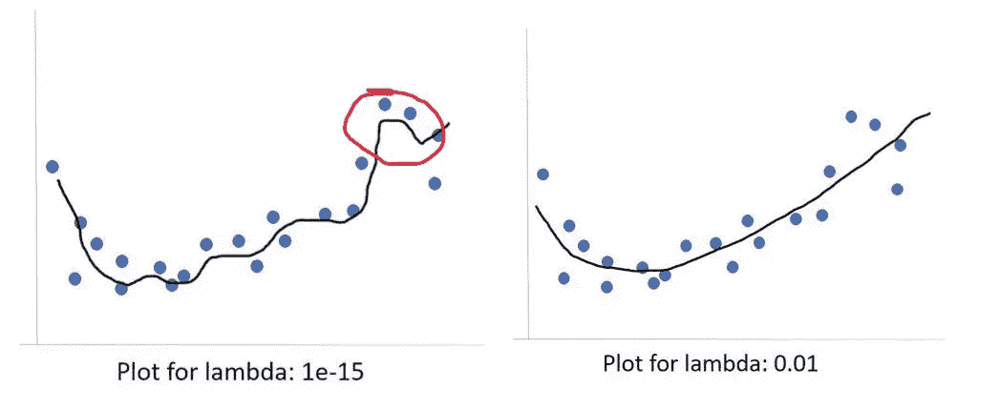*

*红色圆圈很可能过度拟合残差*

*例如，这个用红色圈起来的小怪癖，看起来很不错。但我猜测这只是因为一两个数据点有相对高的 y 值。我认为这只是一个怪癖。也许这应该直接过去，就像它在最右边的图像上一样。因为如果我看一下这些蓝点上升和下降的总量，我真的无法证明创建一个试图下降以最小化这一个蓝点的残余然后再上升的模型是正确的。因此，小的λ值可能是过度拟合的，我相信右边的 1/100λ值实际上更好地拟合了数据，并且将更好地概括。*

## *套索*

*套索回归做了几乎相同的事情；这是限制回归中自变量数量的另一种方法。唯一的区别是，它使用绝对值。现在的问题是，因为数学，它不只是减少系数，拉索实际上删除了系数。许多人喜欢 LASSO 的原因是:**系数实际上可以变为零，而在岭回归中，它们不会变为零，它们会变小，但永远不会消失**。*

*现在，你可以用最后一种方法，如果你看到系数变得很小，你可以说，“好吧，我把这一列扔掉，因为它的系数很小。”LASSO 的好处在于它实际上会以一种智能的方式为你做到这一点。*

*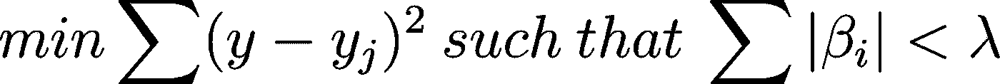*

*y 是 j 点的预测值，有 I 项具有β系数—λ限制β*

*系数的向量。你只需要取绝对值，而不是平方它们。*

## *线性代数*

*接下来是线性代数的快速回顾。为什么我们要快速复习线性代数？嗯，因为机器学习是大量的线性代数，你对机器学习算法理解得越多，通常你就能更好地应用它们。**在研究数据科学时，你不是在研究机器学习，你是在研究如何使用机器学习算法**。*

*矩阵的代数性质；*

*   *加/减矩阵:必须具有相同的维数(m * n)*
*   *对于矩阵乘法:内部尺寸必须匹配*
*   *记住矩阵乘法是不可交换的:A x B！= B x A*
*   *矩阵乘以它的逆矩阵得到单位矩阵*
*   *矩阵除法未定义*

## *矩阵线性回归*

*考虑线性回归公式:*

*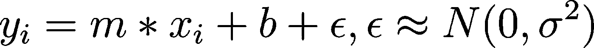*

*写成矩阵:*

*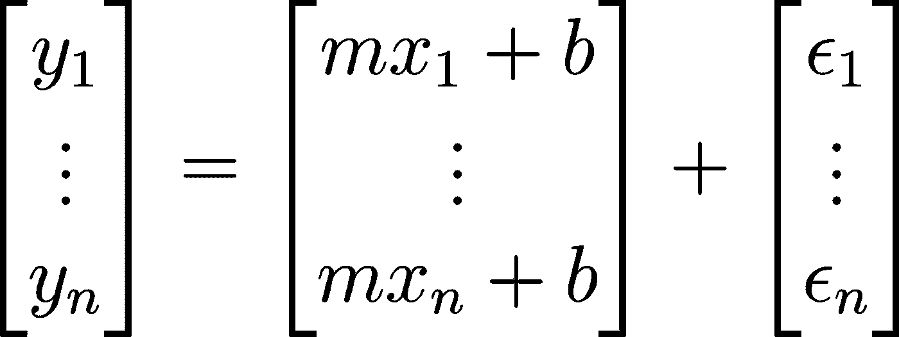*

*可以改写为:*

*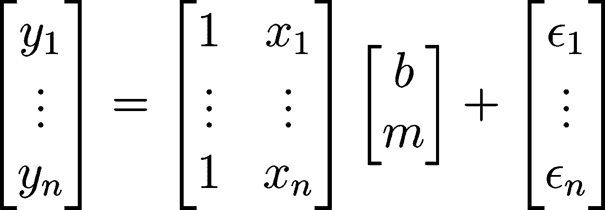*

*对于矩阵的线性回归，如果你有，比方说 10 个案例，这意味着 10 个点，你将有 10 列，那么将有一个精确的，最好的解决方案。对此会有一个简单的解决方案。然而，并不是在每种情况下，都有共线性的情况，这意味着一列与另一列基本相同，或者与其他一些列的组合相同。当这种情况发生时，你通常有无限多的解决方案。我们不喜欢这样，因为有无限多的解，意味着你没有任何有用的解。如果有这样的情况，根本没有解决办法。但是一般情况下，或者你希望的情况是，你有一个好的解决方案。*

*大多数时候，当我们做机器学习或数据科学时，我们的案例比变量多得多；我们的数据点比列多得多；我们的行数比列数多得多——我只是用稍微不同的词一遍又一遍地重复同样的事情。这将给我们带来一个问题，首先，这意味着我们的 x 矩阵不是一个方阵。*

*所以当我们想要反转它的时候，我会告诉你们我们想要这样做，这会给我们带来一些问题，伴随着共线性之类的问题。*

*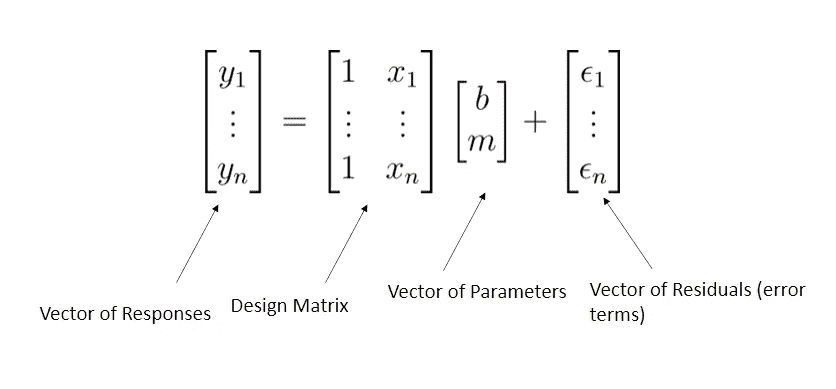*

*简洁地说:y = X *β+ε*

*这些概念在代码中得到最好的展示。*

# *Python 示例:奇异值分解*

*在前面的中，我提到逐步回归是一种正则化的方法，通过向前或向后的方法，一次找到一个有意义的特征。我现在引入奇异值分解(SVD)作为另一种有意义的寻找特征的方法。*

*正则化方法稳定了**模型矩阵**的逆。我们将使用奇异值分解方法来稳定模型矩阵。*

*名词（noun 的缩写）b:逐步回归是一个计算密集型过程，因为我们必须多次重新计算模型。存在允许计算更新模型的方法，但是对于大量的特征，存在许多排列。我们需要能够处理数百、数千甚至数百万个特征的方法。考虑一个只有 20 个特征的小数据集。没有交互项的可能线性模型的数量由下式给出:*

*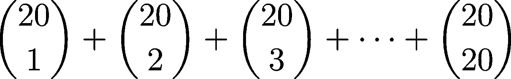*

*也就是帕斯卡三角形第 21 行的和。结果是:*

*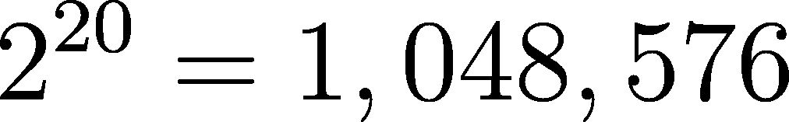*

*虽然根据我们的算法，这将是要计算的模型的最大数量，但是当天真地考虑逐步回归时，你可以看到这在计算上变得多么困难。*

*为了理解特征选择/转换的动机和方法，我会复习一些线性代数。*

## *线性代数评论*

```
*import numpy as npa_list = [2]*3
print(a_list)
print(type(a_list))
a = np.array([2]*3)
print(a)
print(type(a))
b = np.arange(1, 4)
print(b)
print(type(b))*
```

*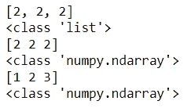*

*Jupyter 类似地显示列表和数组*

*矩阵乘法和加法*

```
*a2d = np.array([[2]*3, [3]*3])
print(‘a: \n{} \n a-size: {}’.format(a2d, a2d.shape))
b2d = np.reshape(np.arange(1,7), newshape=(2, 3))
print(‘\nb: \n{} \n b-size: {}’.format(b2d, b2d.shape))# Addition
print(‘\nAddition: \n {}’.format(a2d + b2d))
# Multiplication
print(‘\nMultiplication: \n {}’.format(a2d * b2d))*
```

*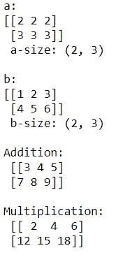*

## *矩阵转置*

*我们也可以通过翻转行和列来转置一个二维矩阵。我们使用`numpy`方法`np.transpose`。*

```
*print(‘Try transposing on a vector…’)
print(np.transpose(a))
# Transposition on a vector does not workprint(‘Now reshape a into 2D and then transpose:’)
print(np.transpose(np.reshape(a, newshape=(1,3))))
print(‘Now transpose a 2d matrix:’)
print(np.transpose(a2d))*
```

*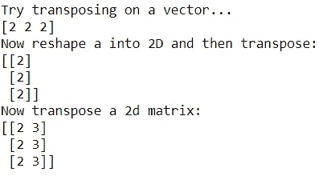*

## *矩阵点积*

*我们需要知道如何计算两个等长向量的**点积**，也称为**标量积**或**内积**，通过逐元素乘法，然后将它们相加:*

*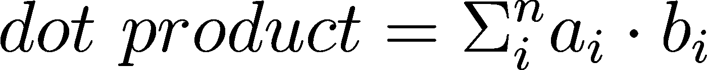*

```
*print(‘np.dot(a, b) = np.dot({}, {})’.format(a, b))
np.dot(a, b)*
```

*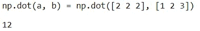*

*向量与其自身的内积的平方根是向量的长度或 L2 范数:*

*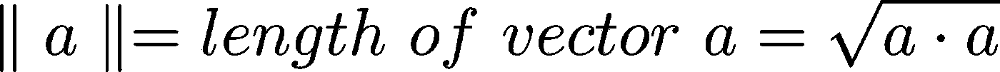*

*我们也可以把内积写成:*

*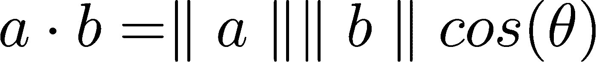**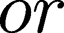**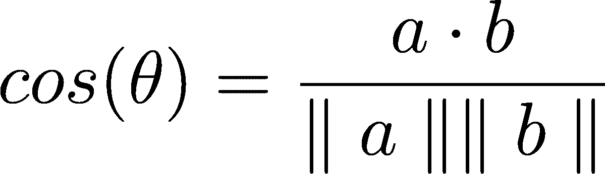*

*注意正交向量的内积是 0*

```
*aa = np.array([1, 0, 0])
bb = np.array([0, 1, 1])
print(inner_prod(aa, bb))*
```

*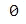*

*线性无关的向量是完全正交的*

*下面是一些关于矩阵的运算。设 A 和 B 是 m=4 行乘以 n=3 列的矩阵:*

```
*A = np.array([[4]*3]*4) 
print(A)
B = np.array(np.reshape(np.arange(1, 13), newshape = (4, 3)))
print(B)
C = np.array(np.reshape(np.arange(1, 9), newshape = (4, 2)))
print(C)
np.dot(np.transpose(A), C)*
```

*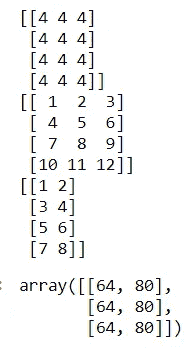*

## *单位矩阵*

*这个特殊的正方形矩阵在对角线上有 1，在其他地方有 0:*

*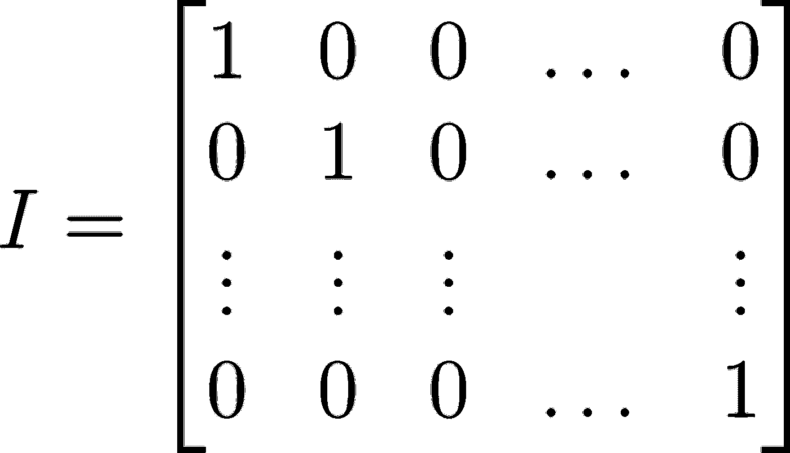*

*1 的矩阵等价物*

*乘以任何矩阵的恒等式给出了那个矩阵。如果 AB 是一个矩形矩阵，那么:*

*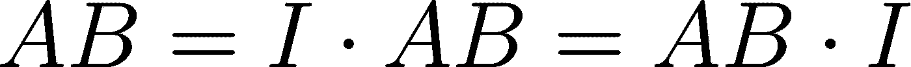*

*在`numpy`中，单位矩阵被称为`np.eye`，并以行数/列数作为自变量:*

```
*I3 = np.eye(3)
I4 = np.eye(4)print(‘I (3X3) = \n{}’.format(I3))
print(np.dot(I3, AtB))print(‘I (4x4) = \n{}’.format(I4))
print(np.dot(I4, ABt))*
```

*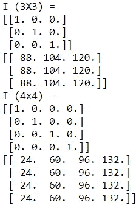*

# *矩阵的逆*

*定义并计算矩阵的逆矩阵，使得:*

*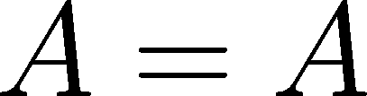**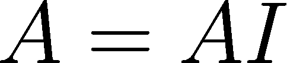**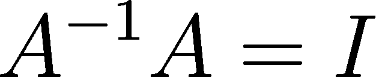*

*用`numpy`中的线性代数方法，用`np.linalg.inv`求矩阵 M 的逆*

```
*M = np.array([[1., 4.], [-3., 2.]])
M_inverse = np.linalg.inv(M)print(‘M: \n{}’.format(M))
print(‘\nM_inv = \n{}’.format(M_inverse))
print(‘\nM_inv * M = \n{}’.format(np.dot(M_inverse, M)))
print(‘\nM * M_inv = \n{}’.format(np.dot(M, M_inverse)))*
```

*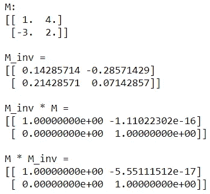*

*抛开这个简短的回顾，我们现在可以开始用 SVD 正则化模型了。*

# *奇异值分解*

*在机器学习中，我们经常会遇到不能直接求逆的矩阵。相反，我们需要对 a 进行分解，以便计算 A^−1，这可以通过 SVD 来实现:*

*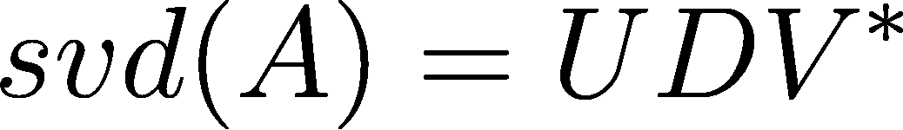*

*   *u 是正交单位范数左奇异向量*
*   *V 是正交单位范数右奇异向量，V∫是共轭转置；对于实值 A，这只是 VT*
*   *d 是奇异值的对角矩阵，据说定义了一个**谱***
*   *a 由奇异值缩放的奇异向量的线性组合组成*

*要计算矩阵的 SVD 并查看结果，请执行下面单元格中的代码。我们使用称为`np.linalg.svd`的`numpy`方法，使用`s`获得奇异值:*

```
*U, s, V = np.linalg.svd(B, full_matrices=False)
print(‘B: {}’.format(B)) # ESHx
print(‘U: {}’.format(U))
print(‘s: {}’.format(s))
print(‘V: {}’.format(V))*
```

*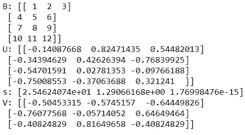*

# *岭和套索回归正则化*

*到目前为止，我们已经研究了两种处理过度参数化模型的方法；基于逐步回归和奇异值分解的特征选择。在本节中，我们将探索基于优化的机器学习模型最广泛使用的正则化方法，**岭回归**。*

*让我们从研究线性回归问题的矩阵方程公式开始。目标是在给定数据𝑥x 向量和**模型矩阵** A 的情况下，计算最小化均方残差的**模型系数**或权重的向量。我们可以将我们的模型表示为:*

*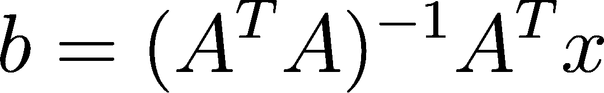*

*执行下面单元格中的代码，它计算λ值为`0.1`的𝐴^𝑇 * 𝐴+𝜆 )^-1 * A^T 矩阵*

```
*U, s, V = np.linalg.svd(M, full_matrices=False)# Calculate the inverse singular value matrix from SVD
lambda_val = 1.0
d = np.diag(1\. / (s + lambda_val))print(‘Inverse Singular Value Matrix:’)
print(d)# Compute pseudo-inverse
mInv = np.dot(np.transpose(V), np.dot(d, np.transpose(U)))print(‘M Inverse’)
print(mInv)*
```

*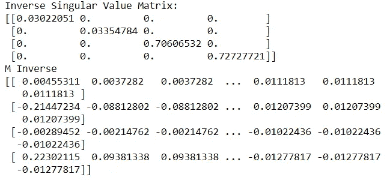*

## *偏差-方差权衡*

*偏差-方差权衡是机器学习模型的一个基本属性。为了理解这种权衡，让我们将模型的均方误差分解如下:*

*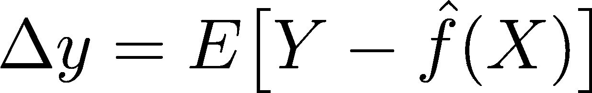*

*正则化会减少方差，但会增加偏差。选择正则化参数以最小化 delta_X。在许多情况下，这一过程证明是具有挑战性的，涉及大量耗时的反复试验。*

***不可约误差**是模型精度的极限。即使你有一个完美的模型，没有偏差或方差，不可减少的误差是数据和模型中固有的。你不能做得更好。*

*`statsmodels`包允许我们计算一系列岭回归解。实现这一点的函数使用了一种叫做“Elasticnet”的方法，我们知道岭回归是 elastic-net 的一个特例，稍后我会详细介绍这一点。*

***注意:这是我之前在高尔顿家族数据集上工作的延续。***

*下面单元格中的代码计算 20 个 lambda 值的解:*

```
*# Ridge regression with various penalties in Statsmodels
# sequence of lambdas
log_lambda_seq = np.linspace(-6, 2, 50)
lambda_seq = np.exp(log_lambda_seq)coeffs_array = []
rsq_array = []
formula = ‘childHeight ~ mother + father + mother_sqr + father_sqr + 1’for lamb in lambda_seq:
 ridge_model = sm.ols(formula, data=male_df).fit_regularized(method=’elastic_net’, alpha=lamb, L1_wt=0)
 coeffs_array.append(list(ridge_model.params))
 predictions = ridge_model.fittedvalues
 residuals = [x — y for x, y in zip(np.squeeze(predictions), childHeight)]SSR = np.sum(np.square(residuals))
 SST = np.sum(np.square(childHeight — np.mean(childHeight)))rsq = 1 — (SSR / SST) 
 rsq_array.append(rsq)# pull out partial slopes (drop intercept version)
beta_coeffs = [x[1:] for x in coeffs_array]
plt.plot(log_lambda_seq, beta_coeffs)
plt.title(‘Partial Slopes vs Log-Lambda’)
plt.ylabel(‘Partial Slope Values’)
plt.xlabel(‘Log-Lambda’)
plt.show()*
```

*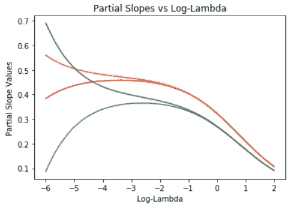*

*绘制局部斜率与 R 的关系:*

```
*# % deviance explained
plt.plot(rsq_array, beta_coeffs)
plt.xlim([0.0, 0.25])
plt.title(‘Partial Slopes vs Log-Lambda’)
plt.xlabel(‘R-squared’)
plt.ylabel(‘Partial Slopes’)
plt.show()*
```

*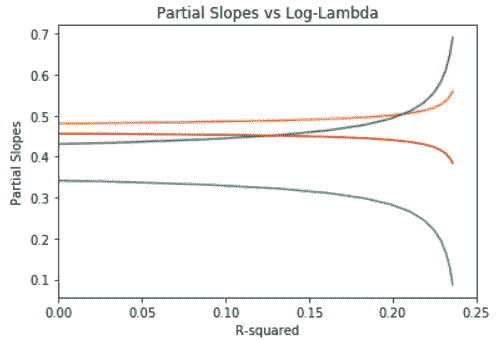*

*注意，随着 lambda 的增加，4 个模型系数的值向零减小。当所有系数都为零时，模型预测标签的所有值都为零！换句话说，λ的高值给出了高度偏向的解，但是方差非常低。*

*对于较小的λ值，情况正好相反。该解决方案具有较低的偏差，但相当不稳定，具有最大方差。这个**偏差-方差权衡**是机器学习中的一个关键概念。*

# *套索回归*

*我们也可以使用其他规范进行正则化。LASSO 或 L1 正则化限制了模型系数绝对值的总和。L1 范数有时被称为曼哈顿范数，因为距离的测量就像你在一个矩形的街道网格上行进一样。*

*您也可以将 LASSO 回归视为限制模型系数向量值的 L1 范数。λ的值决定了系数向量的范数对解的约束程度。*

*执行与之前相同的计算，但是使用不同的正则化范数和相关联的惩罚:*

```
*# LASSO regression with a sequence of lambdas
# sequence of lambdas
log_lambda_seq = np.linspace(-6, 2, 50)
lambda_seq = np.exp(log_lambda_seq)coeffs_array = []
rsq_array = []
formula = ‘childHeight ~ mother + father + mother_sqr + father_sqr + 1’for lamb in lambda_seq:
 ridge_model = sm.ols(formula, data=male_df).fit_regularized(method=’elastic_net’, alpha=lamb, L1_wt=1)
 coeffs_array.append(list(ridge_model.params))
 predictions = ridge_model.fittedvalues
 residuals = [x — y for x, y in zip(np.squeeze(predictions), childHeight)]SSR = np.sum(np.square(residuals))
 SST = np.sum(np.square(childHeight — np.mean(childHeight)))rsq = 1 — (SSR / SST)
 rsq_array.append(rsq)# drop intercept version
beta_coeffs = [x[1:] for x in coeffs_array]
plt.plot(log_lambda_seq, beta_coeffs)
plt.title(‘Partial Slopes vs Log-Lambda’)
plt.ylabel(‘Partial Slope Values’)
plt.xlabel(‘Log-Lambda’)
plt.show()*
```

*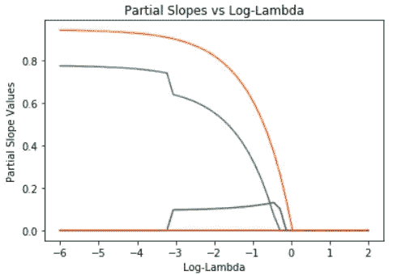*

```
*# plot partial slopes vs R squared (% deviance explained)
plt.plot(rsq_array, beta_coeffs)
plt.xlim([0.0, 0.25])
plt.title(‘Partial Slopes vs Log-Lambda’)
plt.xlabel(‘R-squared’)
plt.ylabel(‘Partial Slopes’)
plt.show()*
```

*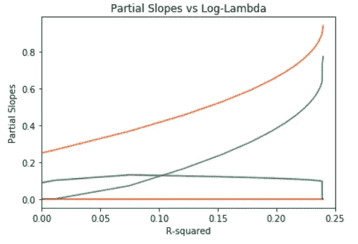*

*注意，模型系数比 L2 正则化受到更严格的约束。事实上，可能的模型系数中只有两个具有非零值！这是典型的 L1 或拉索回归。*

# *弹性净回归*

***弹性网**算法使用 L1 和 L2 正则化的加权组合。正如您可能看到的，LASSO 和 Ridge regression 使用了相同的函数，只有`L1_wt`参数发生了变化。这个论点决定了偏斜率的 L1 范数的权重。如果正则化是纯 L2(山脊)，如果正则化是纯 L1(拉索)。*

*下面单元格中的代码对每种回归方法给予同等的权重。执行这段代码并检查结果:*

```
*# ElasticNet Regression with a sequence of lambdas
# sequence of lambdas
log_lambda_seq = np.linspace(-6, 0, 50)
lambda_seq = np.exp(log_lambda_seq)coeffs_array = []
rsq_array = []
formula = ‘childHeight ~ mother + father + mother_sqr + father_sqr + 1’for lamb in lambda_seq:
 ridge_model = sm.ols(formula, data=male_df).fit_regularized(method=’elastic_net’, alpha=lamb, L1_wt=0.75)
 coeffs_array.append(list(ridge_model.params))
 predictions = ridge_model.fittedvalues
 residuals = [x — y for x, y in zip(np.squeeze(predictions), childHeight)]SSR = np.sum(np.square(residuals))
 SST = np.sum(np.square(childHeight — np.mean(childHeight)))rsq = 1 — (SSR / SST)
 rsq_array.append(rsq)# pull out partial slopes (drop intercept version)
beta_coeffs = [x[1:] for x in coeffs_array]
plt.plot(log_lambda_seq, beta_coeffs)
plt.title(‘Partial Slopes vs Log-Lambda’)
plt.ylabel(‘Partial Slope Values’)
plt.xlabel(‘Log-Lambda’)
plt.show()*
```

*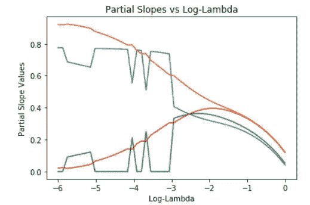*

```
*# plot partial slopes vs R squared (% deviance explained)
plt.plot(rsq_array, beta_coeffs)
plt.xlim([0.0, 0.25])
plt.title(‘Partial Slopes vs Log-Lambda’)
plt.xlabel(‘R-squared’)
plt.ylabel(‘Partial Slopes’)
plt.show()*
```

*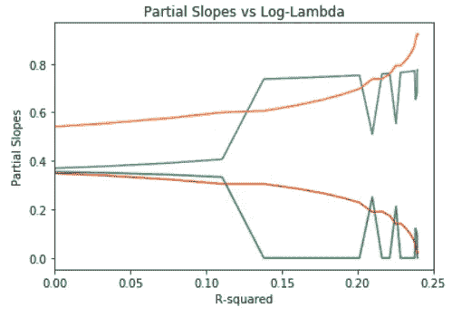*

*请注意，弹性网络模型结合了 L2 和 L1 正则化的一些行为。*

# *结论*

*在这篇文章和上周的文章中，我研究了 3 种方法来解决过度拟合模型的问题:*

*   *逐步回归，一次消除一个要素*
*   *奇异值分解寻找有意义的特征*
*   *套索、脊和弹性网正则化以稳定过度参数化模型*

*重要术语包括:*

*   *AIC-根据模型参数数量调整的模型对数似然*
*   *偏差——模型相对可能性的度量(方差的推广)*
*   *奇异值分解将矩阵描述为一系列向量 U，V，D 的线性组合*
*   *奇异值 s-用作比例项的奇异值对角矩阵*
*   *λ—添加到奇异值上的小偏差项，用于稳定逆奇异值矩阵*
*   *PCA 主成分分析，通过使用函数和奇异值分解来确定可以从彼此独立的线性组合中获得哪些新特征*
*   *PCR 主成分回归使用 PCA 来执行“正则化”回归*
*   *L1 正则化-使用“曼哈顿”规范的套索正则化*
*   *L2 范数正则化-限制模型系数向量值的“欧几里德”范数的岭正则化*
*   *弹性网算法——L1 和 L2 正则化的加权组合*

*我简要回顾了线性代数运算:*

*   *添加向量和矩阵*
*   *向量和矩阵相乘*
*   *用`np.transpose`转置矩阵*
*   *用`np.dot`点积或标量积或内积*
*   *向量的 L2 范数*
*   *带`np.eye`的单位矩阵*
*   *用`np.linalg.inv`求矩阵的逆*
*   *用`np.linalg.svd`进行奇异值分解*
*   *用`np.diag`创建对角矩阵*

*到目前为止，我一直严格地使用线性回归模型。接下来，我将看看线性模型上广泛使用的变体，称为 [**逻辑回归**](/logistic-regression-cebee0728cbf) **！***

*在 [Linkedin](https://www.linkedin.com/in/james-a-w-godwin/) 上找到我*

**物理学家兼数据科学家——可用于新机遇| SaaS |体育|初创企业|扩大规模**