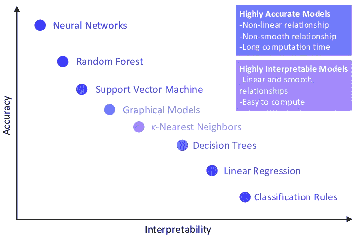

# 适合工作的型号

> 原文：<https://towardsdatascience.com/right-model-for-the-job-243b0009d84e?source=collection_archive---------5----------------------->

## 环境如何决定数据科学中的模型选择

为商业用例选择正确的机器学习模型可能很棘手。作为免费可用库的一部分，有如此多的模型可以方便地访问，并且每天都有更多的模型被添加进来，所以花一些时间考虑一下应该将精力集中在哪个模型子集上是非常重要的。许多因素决定了这一选择，如手头的问题陈述、可用数据量、生产限制。

在决定正确的模型时，要考虑的最基本的问题是问题的性质，是分类任务还是回归任务。这一点从问题陈述中应该是清楚的。

比方说，我们正在研究一个回归问题。可用于训练的数据量是选择模型的另一个重要考虑因素。然而，要考虑的更好的一点是模型的目的，也就是说，模型是用于预测还是用于绘制推理。

## 预言；预测；预告

预测产量所需的模型必须将准确性置于其他考虑因素之上。当然，这种情况下的准确性是指对看不见的数据(“测试误差”)的预测准确性，而不是对经过训练的数据模型的预测准确性(“训练误差”)。

例如，如果我们要预测股票价格，我们会希望关注预测的准确性。

在这种情况下，最佳模型将是具有最佳预测误差的模型。通常，这种模型将更加复杂和非线性，以捕捉目标变量的变化。然而，随着模型复杂性的增加，解释所有的变化以及每个因素如何影响输出以及影响到什么程度变得越来越困难。

例如，在二维空间中可视化数据点是非常容易的，而随着维数的增加，在 n 维空间中可视化数据点变得越来越困难。

## **推论**

除了预测之外，该模型还可用于近似目标变量和一组特征之间的关系。例如，了解影响预期寿命的因素，如教育和生活水平，可能是有用的。对于政策制定者来说，理解额外两年的教育能在多大程度上提高预期寿命是很重要的。

当推理是分析的主要目的时，最好有一个比更复杂的模型更容易解释的模型，有更好的预测准确性。对于这些情景，更重要的是理解因素之间的相互作用以及每个因素在目标变量的最终值中的权重。简单、易于解释的模型(如线性回归)更可取，因为直接查看线性回归模型的系数可以让我们了解特征的重要性以及预测随特征值的变化而发生的变化。

## 鱼与熊掌不可兼得

可能会出现预测和推理都很重要的情况。例如，预测房价的模型不仅可以提供对房产价值的估计，还可以提供对影响房产价格的因素以及影响程度的想法。

通常在业务中，具有最佳预测准确性的复杂模型需要与一些可解释性框架相结合，以方便业务采用。

根据问题，如果我们有一个具有良好预测准确性的可解释模型，那么我们可以直接使用该模型。此外，还有一些模型可解释性技术，如莱姆和 SHAP，它们可以增强模型的可解释性。

## 复杂性问题

模型架构的选择不仅取决于用例，还取决于其他因素，比如可用的数据量。更复杂的模型需要更大量的数据来提供类似的预测精度。

在模型准确性和模型可解释性之间有一个折衷。随着模型变得更加复杂，它可以更好地遵循数据中的模式，但它也变得更难解释。但是，如果一个复杂的模型是基于有限的数据训练的，那么这个模型可能会过拟合。它将更加 ***【灵活】*** 即它将过于紧密地适应目标特征的变化，但它也将噪声结合到图案中。

常见的机器学习模型——可解释性-准确性谱(图片来自[这篇](https://ieeexplore.ieee.org/document/8844682)论文)

## 结论

选择正确的机器学习模型不仅取决于业务用例，还取决于可用的数据量。如今，行业中可能存在对预测准确性的过度依赖，但预测和推断在分析工作流中都有价值。两者都提供了更好地理解数据的不同视角，并且是互补的方法。

将来，当开始一个新的分析并决定模型架构时，最终用例以及可用的数据量是重要的因素。

## 相关阅读

1.  [博客](https://www.datascienceblog.net/post/commentary/inference-vs-prediction/)推理与预测的比较
2.  可解释的 ML [书](https://christophm.github.io/interpretable-ml-book/)