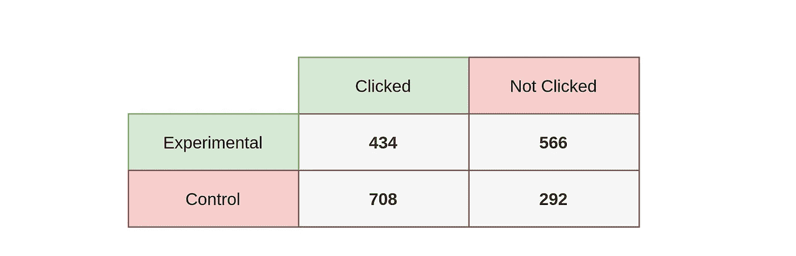
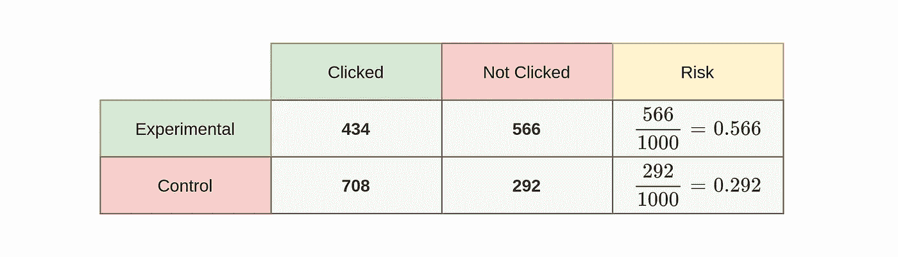
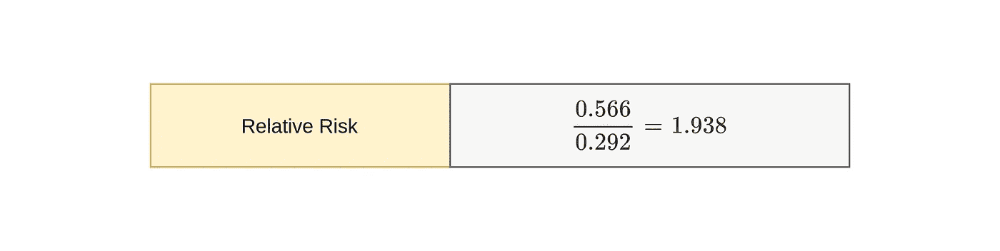
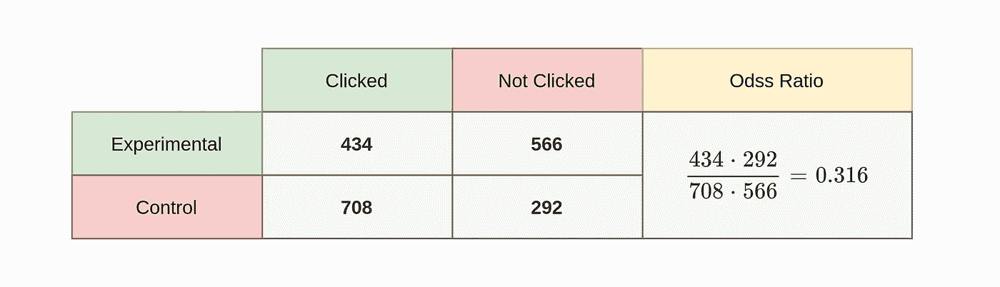

# 风险、相对风险和几率

> 原文：<https://towardsdatascience.com/risk-relative-risk-and-odds-2837915fede8?source=collection_archive---------33----------------------->

## 统计数字

## 了解相对风险和优势比

根据[维基百科](https://en.wikipedia.org/wiki/Risk)中对风险的定义；风险是坏事发生的可能性。因此，在使用风险这一术语时，应考虑阴性病例的数量。换句话说，风险取决于负面案例比正面案例多多少。那么，相对风险和优势比是多少呢？在这篇文章中，你将得到以下问题的答案；

*   什么是风险和相对风险？
*   如何找到相对风险？
*   风险、相对风险、比值比有什么区别？
*   如何决定我们应该使用哪种风险度量？

[洛伊克·莱雷](https://unsplash.com/@loicleray?utm_source=unsplash&utm_medium=referral&utm_content=creditCopyText)在 [Unsplash](https://unsplash.com/s/photos/risk?utm_source=unsplash&utm_medium=referral&utm_content=creditCopyText) 上拍摄的照片

# 风险和相对风险

最好通过一个例子来简单地理解风险和相对风险。假设有一个电子商务网站，人们可以购买手表。让我们假设，这个电子商务网站已经决定将产品传送带移到页面顶部。他们正在考虑将这个转盘放在页面的右边，而不是放在顶部。在这种情况下，风险在于客户(用户)发现这种重新定位不可用，或者他们无法习惯。考虑到每天平均有 1 万用户的网站流量，做出这样的用户界面更改会对购买数量产生负面影响。如果用户习惯了旧的布局，让他们习惯新的是一个巨大的挑战。因此，电子商务网站决定在做出这一改变之前只检查两个不同的组(样本)。第一组将看到电子商务网站的新布局，在右边栏中有一个产品转盘。第二组将看到它是旧布局，顶部有一个产品转盘。因此，第一组将是实验组，第二组将是对照组。

他们决定每个组 1000 个用户，他们不想要很少登录网站的用户。这些用户的数据可能会误导搜索结果。因此，他们选择了平均每周至少登录两次网站的用户。这些用户在产品传送带上的行为将被跟踪。如果用户在某周首次登录时点击产品传送带上的任何项目，该用户将被确认为“已点击”。如果用户在第一次登录时没有进行任何点击，该用户将被确认为“未点击”。那么，现在让我们来检查产品转盘点击。

实验组和对照组的点击量—图片由作者提供

实验组中的 434 名用户在第一次登录时点击了产品传送带中的项目。566 名在侧边栏中看到产品轮播的用户从未点击或在首次登录时点击。现在，让我们检查一下控制组的用户，他们像以前一样看到了布局(没有产品传送带位置的变化)。1000 个用户中有 708 个在第一次登录时点击了产品转盘中的项目。剩下的 292 名用户从未点击或没有点击他们的初始登录。基于这些结果，可以说新的布局对于点击来说效率不高。不过还是要深挖一点，计算风险和相对风险。

## 计算

如前所述，风险是坏事发生的可能性。这种情况下不好的地方是“没有被点击”，因为我们希望用户点击产品。所以，要找到实验组中“未被点击”的风险，我们应该得到属于实验组的“未被点击”的数量，并除以实验组中的用户总数。这是实验组的风险。同样，也可以获得对照组的风险值。

风险计算-作者图片

对照组“未点击”的风险为 0.292。实验组是 0.566。根据这些结果，实验组的风险高于对照组。可以得出结论，将产品轮播放置在右侧边栏具有较高的风险。**相对风险** (RR)可以用来定义这个风险有多高。实验组的风险除以对照组的风险，得到了在改变产品传送带的布局后被“不点击”的相对风险。

相对风险的计算——作者图片

相对风险为 1.938。这意味着改变产品传送带的位置的风险是不改变的 1.938 倍。

## 让步比

还有一种测量方法叫做优势比。这个比率经常与相对风险混淆。但是，它们在逻辑上是不同的。相对风险取决于两组的风险，优势比取决于对照病例(表中单元格)。可以说，赔率有两种情况，预期和意外。在本例中，电子商务网站决定更改布局，因此预计这将对用户点击产生积极影响。令人意想不到的是，这些变化将对用户的点击量产生负面影响。

比值比-作者图片

这个比值比表明，位于右侧边栏的产品轮播被点击的可能性是位于顶部的产品轮播被点击的可能性的 0.316 倍。0.316 小于 1。多 0.316 倍的意义在于，对照组的点击次数会多得多。所以，当取 0.316 的-1 次方时((0.316)^-1 = 2.97)，2.97 将是不点击情况下的“赔率”。意义；点击位于顶部的产品传送带的可能性(控制)是点击位于侧边栏的产品传送带的可能性(实验)的 2.97 倍。

请阅读我之前的文章，了解更多关于比值比的信息；

 [## 比值比和费希尔精确检验的解释

### 比值比的计算及在 Python 上应用 Fisher 检验

towardsdatascience.com](/interpretation-of-odds-ratio-and-fishers-exact-test-c6dde394d204) 

# 结论

解释可能性的术语总是一个挑战。因此，在解释风险、相对风险和优势比时，定义问题或研究的逻辑是至关重要的。不应该忘记风险有负面意义。在获得相对风险和比值比之前，将病例分为预期和非预期两类会更好理解。这些类别也可以被命名为积极或消极。