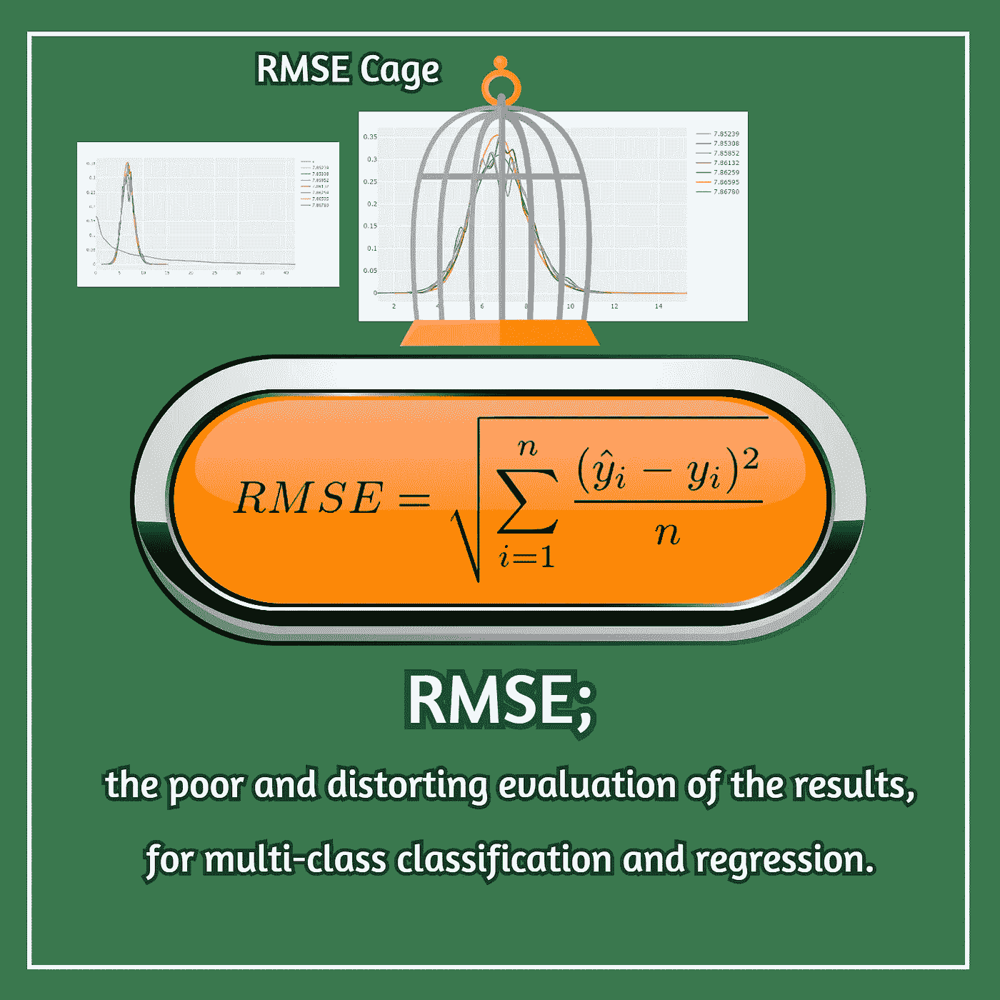
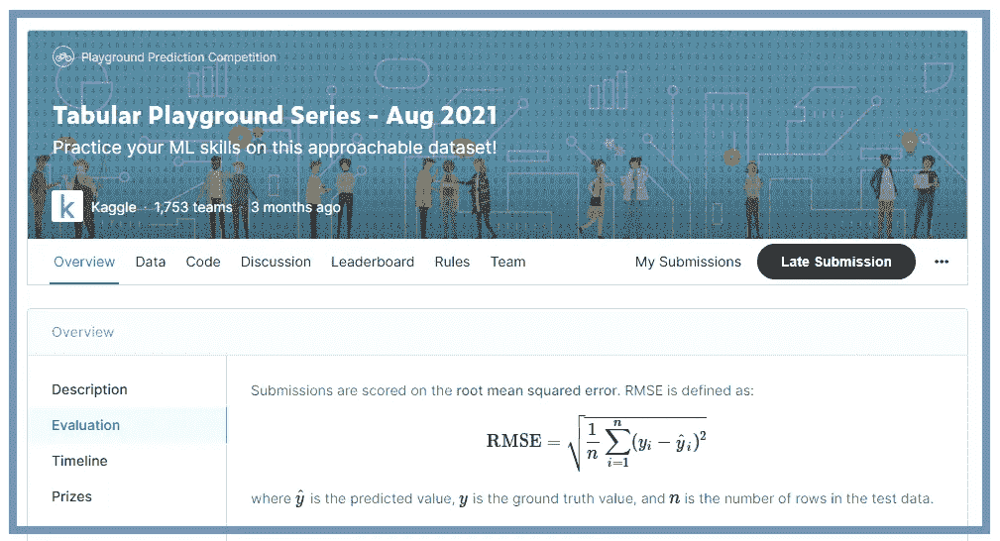
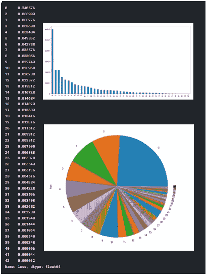
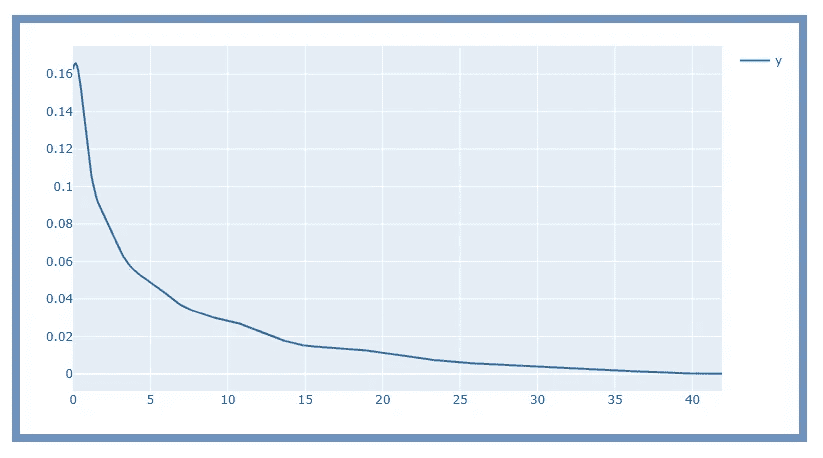
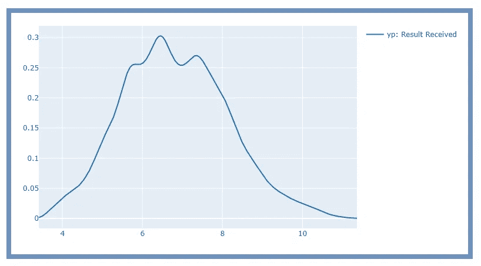
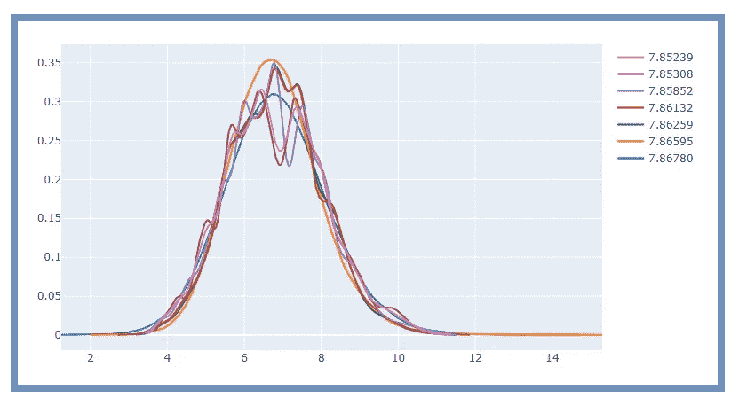
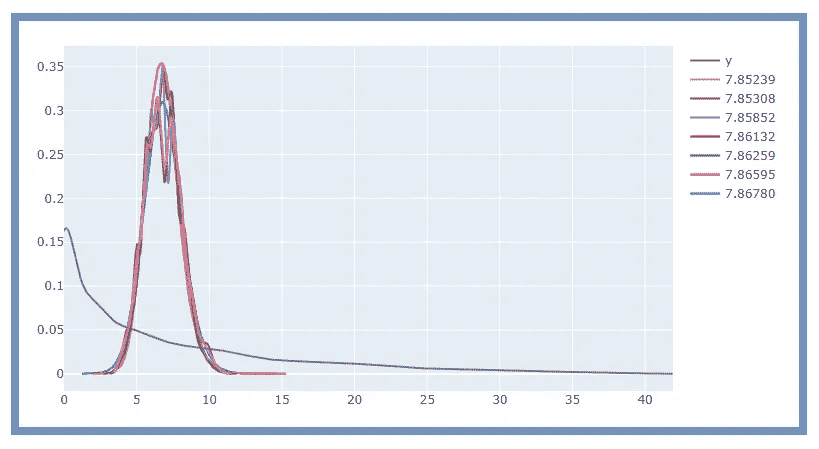
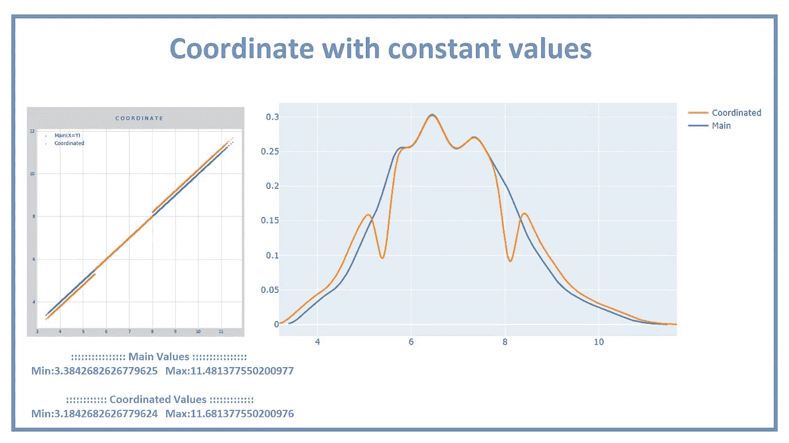
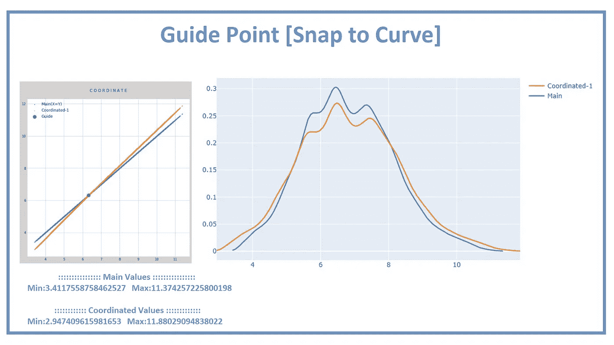

# RMSE:扭曲对结果的评估

> 原文：<https://towardsdatascience.com/rmse-the-poor-and-distorting-evaluation-of-the-results-for-multi-class-classification-and-efebbf0492a2?source=collection_archive---------15----------------------->

## RMSE 评估较弱，不应用于多分类以及具有分散结果的回归。

RMSE 评价(图片由作者提供)

为了教授分类和回归的基本概念，“RMSE 评价”通常被用作一种常用的评价方法。从一开始，人们就对这种评价方法持肯定态度。但是如果将这种评估方法用于全面的多类分类挑战或回归挑战，则可以容易地识别出最终结果的弱点。

在这些挑战中，每个人都在争取更好的分数，参与者尝试不同的分类和回归方法是很自然的。但是，如果这些挑战是在 RMSE 的基础上评估的，所有分类和回归方法的结果都将被“RMSE 笼子”捕获。换句话说，结果将很少分散，并且所有结果都是错误获得的，仅在正确值的平均值附近。

请注意，例如，如果多类别分类挑战的评估仅基于 based 在基于 RMSE 计算参与者的最终分数之前，首先参与者自己基于 RMSE 设置他们所有的方法和算法(XGBoost，CATBoost，…)，以便在评估期间获得最佳分数。这正是所有方法试图最小化 RMSE 方程的原因。但是最小化这个等式并不总是能让我们更接近正确的答案。也就是说，结果将具有很小的分散性，并且将仅围绕一个数 *(mean(y_train))* 。换句话说，一些类通常在我们的结果中没有代表性，仅仅是因为它们不接近那个数字。

对此的数学证明不是我们文章的主题。在这篇文章中；我们回顾了 Kaggle 挑战赛的最佳结果(其中甚至包括该挑战赛的一些获胜者),并表明由于使用了 RMSE 评估，提交给该挑战赛的所有结果的分散性非常低。因此，我们在任何预测中都看不到一些正确的值。我们也建议一些方法，这样你可以通过增加你的结果的分散性来提高你在这种类型的挑战中的分数。这篇文章写于 2021 年 12 月作者: [*索马耶赫·戈拉米*](https://medium.com/@somayyeh_43305) 和 [*麦赫兰卡泽米尼亚*](https://mehrankazeminia.medium.com/) 。

## 表格游乐场系列—2021 年 8 月

表格游乐场系列—2021 年 8 月(图片由作者提供)

2021 年，每月将在 Kaggle 举办“表格游乐场系列”挑战赛。这些挑战对于练习来说非常棒，每个人都可以从别人的笔记本和现场评论中学习。在其中一些挑战中(如八月)，RMSE 被用于评估。接下来，我们将回顾[八月挑战](https://www.kaggle.com/c/tabular-playground-series-aug-2021)，以及本月提交的结果。

在这个挑战中，为每个样本提供 100 个特征。“火车”组包含 250，000 个样本，而“test‌”组包含 150，000 个样本。“训练”组中的答案(损失栏)是数字 0 到 42。这意味着“test‌”集合中的 150，000 个样本中的每一个也必须被分配一个 0 到 42 之间的数字。最终，这项挑战的获胜者将是其结果能够最小化 RMSE 方程的人。

在这些挑战中，“训练”集和“测试”集总是随机的(所谓的混洗)，除了在时间序列挑战或类似挑战的情况下。这意味着“测试”集合中“损失”栏中的数字必须介于 0 和 42 之间，并且这些数字的直方图必须与“训练”集合中“损失”栏中的直方图相似。例如，如果在“train”集合中大约 25%的“loss”列为零，那么在“test”集合中大约 25%的“loss”列也应该为零。

不能在“中等平台”运行代码，但我们已经在 Kaggle 上发布了以下四个挑战的笔记本。您可以在这些笔记本中找到本文剩余部分中呈现的所有结果的代码，并自己运行它:

[***【1】TPS 8 月 21 日—XGBoost&CatBoost***](https://www.kaggle.com/somayyehgholami/1-tps-aug-21-xgboost-catboost)
*[***2】TPS 8—智能组装***](https://www.kaggle.com/somayyehgholami/2-tps8-smart-ensembling/notebook)
[***【3】TPS 8 月 21 日—结果& RMSE 评测***](https://www.kaggle.com/somayyehgholami/3-tps-aug-21-results-rmse-evaluation)
<https://www.kaggle.com/somayyehgholami/4-tps-aug-21-guide-point-snap-to-curve>*

***By:*[*Somayyeh*](https://www.kaggle.com/somayyehgholami)*&*[*Mehran Kazeminia*](https://www.kaggle.com/mehrankazeminia)**

## **挑战数据的概况**

**“train”集合的“loss”列的值包括 0 到 42 之间的 250，000 个数字。另外，根据下面的图表，其中 0.240576 是 0 号，0.088276 是 1 号，0.088900 是 2 号，…其中 0.000012 是 42 号。如前所述；在这个挑战中，必须为“测试”集的“丢失”列预测 150，000 个数字。预测的数字应该是大约 0.24 其中 0，0.08 其中 1，以此类推。**

****

**data_train['loss'](图片作者提供)**

**令人惊讶的是，没有一个预测值接近正确值。你会看到所有方法预测的数字都在 3 到 12 之间。例如，没有一个预测接近于零。但我们知道，总预测数的 24%左右一定是零(或接近零)。**

**换句话说，“train”集合中“loss”列的直方图如下图。所以正确的预测直方图应该是这样的。**

****

**(图片由作者提供)**

**但是如果你看看这次挑战的不同预测，所有预测的直方图如下图所示。这意味着所有的分类和回归方法只能使 RMSE‌方程最小化，不幸的是不能接近正确的预测。**

****

**(图片由作者提供)**

**我们在我们的第[第一](https://www.kaggle.com/somayyehgholami/1-tps-aug-21-xgboost-catboost/)和第[第二](https://www.kaggle.com/somayyehgholami/2-tps8-smart-ensembling)笔记本中使用 XGBoost 和 CatBoost，然后将我们的结果与其他几个公共笔记本的结果“组合”起来以提高我们的分数。但是所有笔记本结果的直方图与上图相似，这意味着所有的结果都在“RMSE 笼子”里。在[第三](https://www.kaggle.com/somayyehgholami/3-tps-aug-21-results-rmse-evaluation)和[第四](https://www.kaggle.com/somayyehgholami/4-tps-aug-21-guide-point-snap-to-curve)笔记本中，我们看了同样的问题，并提供了一些提高分数的近似方法。**

**我们在这次挑战中挑选了七款优秀的笔记本，每一款的成绩都非常不错。这些笔记本使用了以下方法:**

***1-* [*投票(CB/XGB/LGBM) > > >得分:7.86780*](https://www.kaggle.com/dmitryuarov/falling-below-7-87-voting-cb-xgb-lgbm) *2-*[*表格去噪+残差网络> > >得分:7.86595*](https://www.kaggle.com/pourchot/in-python-tabular-denoising-residual-network) *3-*[*LightAutoML>>>得分:7.86259*](https://www.kaggle.com/alexryzhkov/aug21-lightautoml-starter) *4-【4】***

**下图包含了这七个笔记本的结果直方图。正如你所看到的，它们都装在一个盒子里，我们称之为“RMSE 笼”。**

****

**(图片由作者提供)**

**所有直方图的纵轴近似为“np.mean(y)=6.81392”。如你所见，所有的预测都围绕这个数字。如果我们在一张图中画出这七个笔记本的 y 直方图和预测直方图，那么正确值和预测值之间的差异就变得相当清楚了。**

****

**(图片由作者提供)**

# **那怎么办呢？**

**RMSE 评估较弱，不应用于多分类以及具有分散结果的回归。因为所有方法的结果都会在“RMSE 笼子”里面。当然，如前所述，这在数学上是可以证明的。然而，如果你运行一个使用“RMSE 评估”的挑战；有几件事要记住:**

*   **“组合”方法也许能提高你的笔记本分数，但你的成绩的分散性不会增加，实际上对这个问题没有帮助(RMSE·凯奇)。**
*   **笔记本预测的数字顺序和排名并不准确。这意味着，只要有一丝可能，RMSE 方程就可能脱离最优状态。而在实践中，我们不能简单地增加数字的离散度。**
*   **在我们的[第三本笔记](https://www.kaggle.com/somayyehgholami/3-tps-aug-21-results-rmse-evaluation)中，我们介绍了一种近似方法，叫做“常值坐标”。这种方法是基于将一个固定值加到一些结果上，并从一些其他结果中减去另一个固定值。要成功做到这一点，你必须“试错”很多次。**

****

**(图片由作者提供)**

*   **在我们的[第四本笔记本](https://www.kaggle.com/somayyehgholami/4-tps-aug-21-guide-point-snap-to-curve)中，我们介绍了另一种叫做“曲线拟合”的方法。我们的想法是基于“引导点”来“捕捉到曲线”。最佳“引导点”是基于评估方程“RMSE”来确定的。值“np.mean(yy)”在这里是合适的，但是我们不知道这个数字是多少。所以我们首先考虑“np.mean(y)”，然后用数字“R”修改它的值。**

****

**(图片由作者提供)**

## *****好运。*****

**[*索马耶赫*](https://www.kaggle.com/somayyehgholami)*&*[*梅兰*](https://www.kaggle.com/mehrankazeminia)**