# RNA 速度:细胞的内部指南针

> 原文：<https://towardsdatascience.com/rna-velocity-the-cells-internal-compass-cf8d75bb2f89?source=collection_archive---------12----------------------->

## [思想和理论](https://towardsdatascience.com/tagged/thoughts-and-theory)

## 在单细胞 RNA 测序数据中寻找方向


[绝对视觉](https://unsplash.com/@freegraphictoday?utm_source=unsplash&utm_medium=referral&utm_content=creditCopyText)在 [Unsplash](https://unsplash.com/s/photos/compass?utm_source=unsplash&utm_medium=referral&utm_content=creditCopyText) 上拍摄的照片

单细胞 RNA 测序(scRNA-seq)在过去十年中彻底改变了我们研究细胞生物学的方式，开创了单细胞基因组学的快速发展领域。scRNA-seq 允许我们描绘单个细胞的转录组，获得对它们的功能和身份的全面了解。转录组是细胞中所有信使核糖核酸(mRNA)分子的集合。在过去的一年里，你可能经常听说 mRNA，许多新冠肺炎疫苗都依赖于这种分子。mRNA 代表一个基因的读数或转录本。这些分子携带有关感兴趣的基因的信息，细胞的机器用这些信息来构建蛋白质。在基于 mRNA 的新冠肺炎疫苗中，它们携带着如何制造针对 SARS-CoV2 病毒的良性蛋白质的信息，有效地教会我们的身体如何抵抗感染。这些 mRNA 分子的产生被称为**转录**，这些分子有时也被相应地称为转录物。你会经常听到生物学家将 mRNA 丰度更宽泛地称为基因表达。你可以把它想象成建造宜家家具:指令就是转录的 mRNA 分子，对应的蛋白质就是家具。然而，在 mRNA 被翻译之前，它必须经历一个额外的步骤。mRNA 分子中有不编码蛋白质的片段，称为**内含子**。这些在蛋白质翻译之前通过称为**剪接**的过程被去除。剩下的片段被称为**外显子**。很快知道这一点很重要。

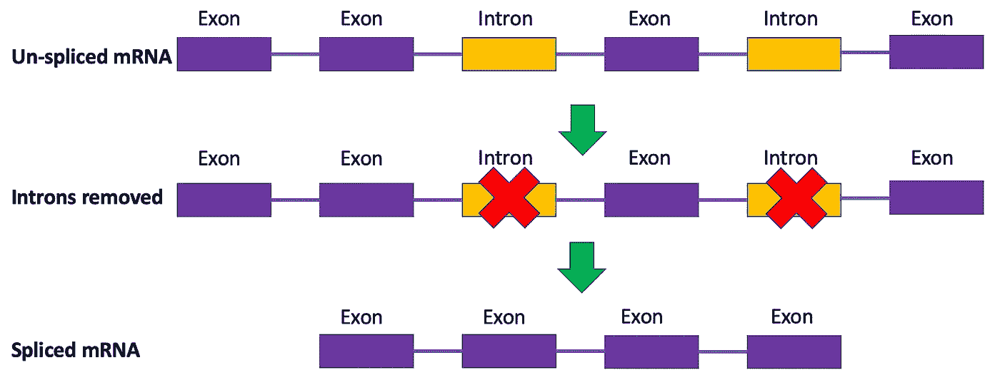

作者图片

您可以将转录组视为细胞的指纹，用于识别它并将其与其他细胞区分开来(例如，红细胞与神经元)。通过对成千上万个细胞的转录组进行测序，我们可以构建一个整体的、高维的细胞状态图，这些细胞状态是干细胞在转变为更专业化的细胞(如神经元)时所经历的，可以表征癌症肿瘤，并区分患者的健康组织和患病组织。这些测序协议因此产生了数千兆字节的数据进行分析和理解，这可能会因为我们的数据集中有如此多的维度而变得复杂，每个维度对应一个基因([见我的第一篇文章](/why-you-should-be-using-phate-for-dimensionality-reduction-f202ef385eb7)关于解决这个难题的一种方法)。看起来很酷，对吧？然而，这种方法有一个主要缺点。这些测序实验在过程中杀死细胞，阻止我们在以后的时间点再次对这些细胞重新测序。因此，我们只剩下一个细胞 mRNA 丰度的静态快照，这使得推断其未来的基因表达具有挑战性。我们如何解决这个问题？

这就是 RNA 速度发挥作用的地方。RNA 速度是一种简单而强大的方法，它使我们能够预测细胞未来的基因表达。回想一下，我提到过 mRNA 可以通过剪接和未剪接的转录物来区分。虽然剪接的转录物是大多数 scRNA-seq 方案的主要读数，但也测量未剪接的表达。利用这些补充信息，我们可以建立一个简单的数学模型来预测未来的剪接表达。

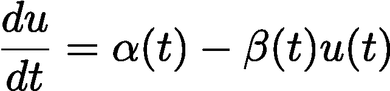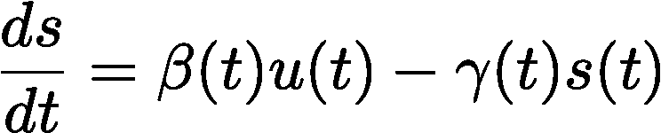

作者图片

其中 *u* 为未剪接的 mRNA 分子数， *s* 为剪接的 mRNA 分子数， *α* 为转录速率， *β* 为从未剪接到剪接的剪接速率， *γ* 为剪接的 mRNA 产物的降解速率。

取给定细胞的特定基因的未来 mRNA 表达和当前 mRNA 表达之间的差异，我们可以得到基因表达变化的度量。对于给定细胞的所有基因，这些基因可以聚合起来，以创建细胞未来转录组的载体，代表所述细胞变化的速度和方向——因此出现了术语 RNA 速度。一种常见的可视化方法是在嵌入中将一个向量场叠加到单元格上，如下所示:

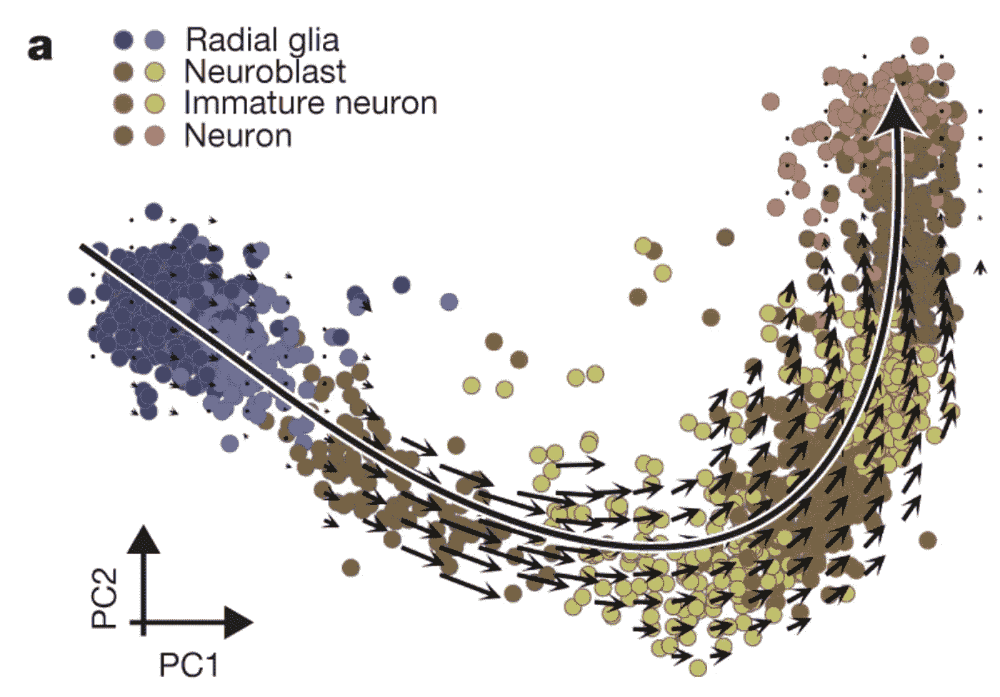

La Manno 等，***Nature*****560**:494–498(2018)PCA 包埋中经历神经发生的细胞的 RNA 速度

这是经历神经发生的细胞的 PCA 图——大脑中神经元(红色)的产生来自称为放射状胶质细胞(蓝色)的干细胞样细胞。每个点代表一个叠加了 RNA 速度向量的细胞，预测细胞转变。注意这些箭头如何在中间阶段(成神经细胞和未成熟神经元)变长——这表明基因表达的动态变化，因为神经元的基因打开，而放射状胶质细胞的基因关闭。随着这些细胞成功转化为神经元，载体迅速缩短，反映了这些细胞基因表达的“减速”。你可以把这些向量想象成类似于细胞的指南针:一个内部 GPS，如果细胞想要成为神经元，它可以精确地指出细胞需要去的方向。

RNA 速度主要有两种模型:稳态模型和动态模型。稳态模型是发表在 [Nature](https://www.nature.com/articles/s41586-018-0414-6) 上的原始模型，上图使用了它的实现。这个模型假设了一个通用的、转录组范围的剪接率，并且基因表达遵循一个稳态:即，当 *ds/dt=0* 由 *u = γs* 给出时，速度被估计为与剪接和未剪接分子的 *γ* 拟合比率的偏差。下面我举个例子:

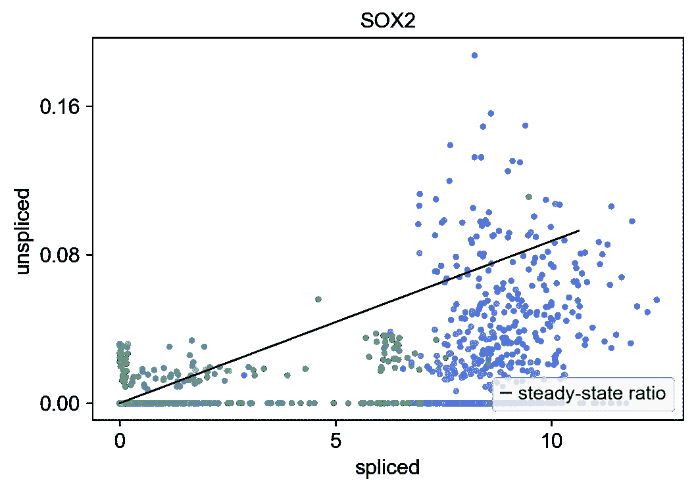

作者图片

该图根据从 SOX2 基因转录的剪接与未剪接的分子计数，绘制了来自先前显示的神经发生 PCA 的单个细胞，so x2 基因是放射状神经胶质细胞的标记(蓝色)。实线是从广义线性回归模型中得到的对 *u = γs* 的拟合(参见[我的上一篇文章](/going-for-gold-predicting-medal-outcomes-in-the-olympics-using-generalized-linear-modeling-e6e9d4837ae8)对这个统计模型的介绍)*。*这条线以上的细胞( *u > γs* )被认为具有正速度。这意味着未剪接的 SOX2 mRNA 分子的产量超过了它的剪接对应物的降解:我们有 SOX2 mRNA 的净产量。相比之下，线( *u < γs* )以下的细胞具有负速度:被降解的 SOX2 比产生的多，导致净损失。直接在线上的细胞具有零速度，因为它们没有偏离这个 *γ* 拟合的未剪接与剪接 mRNA 分子的比率。

[相比之下，动态模型](https://www.nature.com/articles/s41587-020-0591-3)直接求解每个基因的完整转录动力学，而不是做出转录组范围的假设。它不是试图将数据拟合到回归模型中，而是使用[期望最大化算法](/expectation-maximization-explained-c82f5ed438e5) (E-M)来估计参数，该算法使用最大似然来迭代逼近 *α* 、 *β* 和 *γ* ，并学习给定基因的拼接/未拼接轨迹。这为每个基因分配了如下可能性:

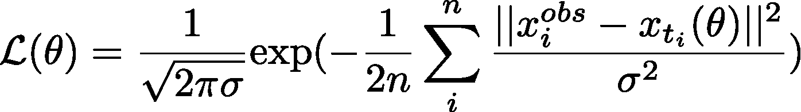

在哪里

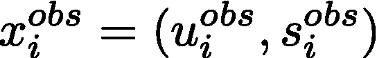

其分别代表细胞 *i* 中特定基因观察到的未剪切和剪切的 mRNA 分子，而 *xₜᵢ* 代表基于推断的参数集 *θ* = ( *α* ， *β* ， *γ* )在时间 *tᵢ* 的未剪切/剪切的分子。具有高可能性的基因被认为是感兴趣的生物现象中动态变化的主要贡献者——在我们的情况下，是神经发生。但是足够的数学，让我们看看这在行动中！

要亲自尝试 RNA velocity，请使用以下任一 pip 安装 scvelo 包:

```
pip install -U scvelo
```

如果您喜欢 conda，您可以通过 bioconda 渠道进行安装，如下所示:

```
conda install -c bioconda scvelo
```

您还需要 scanpy，可以从 conda-forge 安装。这是 Python 中一个流行的单细胞分析库。

`conda install -c conda-forge scanpy`

我们将使用上面描述的人类神经发生数据集作为例子，在这里我将说明和比较稳态和动态模型。该数据集有 1720 个细胞，代表神经发生中的四种主要细胞类型:放射状胶质细胞、成神经细胞、未成熟神经元和神经元。

首先，我们将从互联网上加载数据集:

接下来，让我们导入我们的包

我们将把数据集读入一个[带注释的数据](https://anndata.readthedocs.io/en/latest/) (anndata)对象。这是存储用于 Python 分析的单细胞数据的一种流行方式:

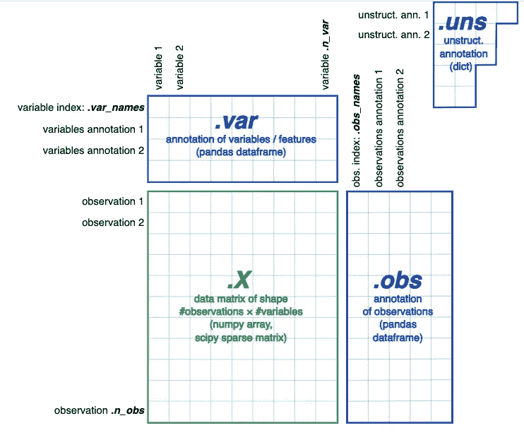

Anndata 概述，来自 Wolf 等人，SCANPY:大规模单细胞基因表达数据分析。 *Genome Biol* **19、** 15 (2018)和[https://anndata.readthedocs.io/en/latest/](https://anndata.readthedocs.io/en/latest/)

现在我们来计算 RNA 的速度。scvelo 为此使用了两个函数:`scv.tl.velocity()`计算每个基因的速度，`scv.tl.velocity_graph()`基于速度和潜在细胞状态转换之间的余弦相似性输出速度图。换句话说，它测量细胞基因表达的变化与其预测速度向量的匹配程度，预测速度向量可用于推导转移概率。我们还会将数据中的数字聚类标签更改为论文中定义的单元格类型。

这为我们提供了以下 PCA 图，类似于论文中的图:

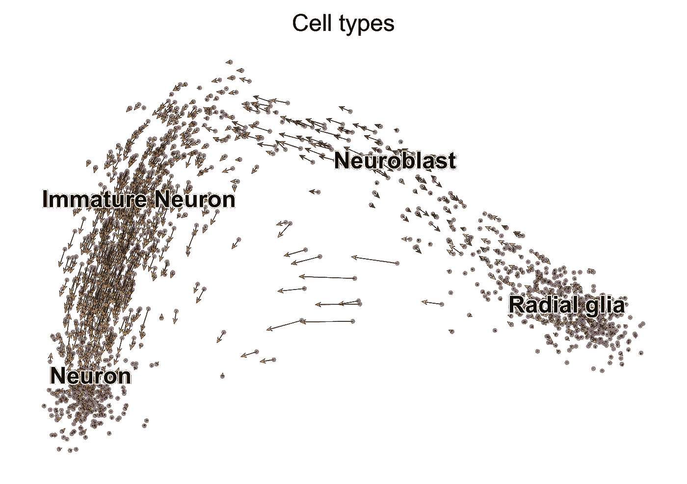

作者图片

正如你所看到的，每个细胞都有一个箭头叠加在上面，预测其未来的转录组。这些箭头给了我们一种全局方向性的感觉，显示了从放射状胶质细胞到神经元的线性进展。然而，你可能已经注意到，一些绿色的神经母细胞似乎正在回复成放射状胶质细胞。在一些神经元中也有类似的现象，尽管程度较轻。这些回流可归因于两个主要原因:1)如前所述，原始 RNA 速度模型的稳态假设不能准确反映更多的瞬时细胞群体，如神经母细胞；2) scRNA-seq 非常稀疏。基因容易逃避测序平台的检测，导致“退出”，这些 mRNA 测量值被错误地记录为零。一种避免这种情况的方法是使用插补，我们通过计算推断缺失值。一种类似的方法是通过数据平滑来消除固有稀疏性产生的噪声，原始论文的[作者通过 k-最近邻池](https://github.com/velocyto-team/velocyto-notebooks/blob/master/python/hgForebrainGlutamatergic.ipynb)做到了这一点。这些方法中的每一种都有缺点，以及[关于是否应该将它们用于 scRNA-seq 分析的争论](https://genomebiology.biomedcentral.com/articles/10.1186/s13059-020-02132-x)，因为结果可能是误导的。出于本文的目的，我将继续以原始形式呈现数据集。

我们可以通过生成相位图来进一步探索细胞的基因特异性速度:

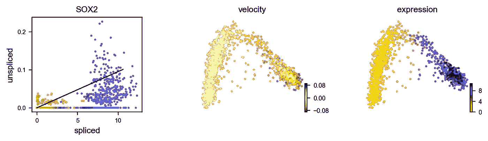

最左边是 SOX2 表达的拼接 v .未拼接图，so x2 表达是放射状胶质细胞的标志。每个点是根据其细胞类型着色的细胞(蓝色代表放射状胶质细胞，绿色代表成神经细胞，暗金色代表未成熟神经元，红色代表神经元)。如前所述，确定性模型通过假设稳态模型来求解未来表达式。线条代表 *ds/dt* 稳态解的回归拟合，用 *u = γs* 表示。这条线以上的细胞被认为具有正速度:SOX2 正被上调，这些细胞中产生的净产物多于其被降解的产物。我们看到一些放射状胶质细胞似乎显示了这种现象，如右侧的表达图所示，其中上面 PCA 图中的细胞根据它们的 SOX2 表达水平进行着色。然而，大多数细胞在开始分化时关闭 SOX2 活性(由中间图中的负速度指示)，正如 SOX2 在其他细胞类型中的零速度所证明的那样:它们不再转录也不再降解其 mRNA 分子，这解释了这些细胞类型中的最低表达水平。

如上所述，稳态模型虽然强大，但也有局限性，因为它假设了稳态表达水平和恒定的剪接速率。在更复杂的系统中，具有多种最终状态(即，一个干细胞可以最终分化成不同的细胞)和异质亚群，这种假设可能失败并产生错误的解释。这就是前面提到的动态模型的用武之地。我们可以使用以下代码实现动态模型:

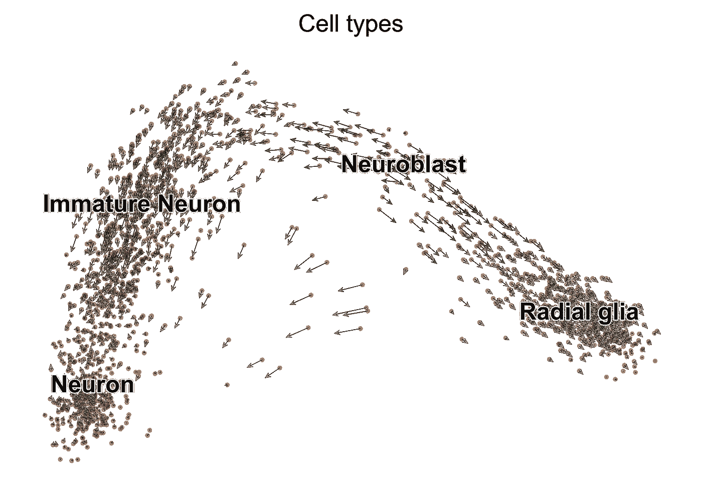

在这里，我们观察到相邻细胞之间的方向更加一致(尽管神经母细胞之间的方向仍然存在分歧，这可以通过数据平滑来解决)，神经元具有明显的主导趋势。使用每个基因的可能性估计，我们可以提取出表现出最显著动态行为的基因:

```
NPAS3        0.994760
CREB5        0.896914
FOS          0.882965
SLC1A3       0.806150
SYT1         0.749349
MYT1L        0.737498
MAPT         0.687999
GLI3         0.663777
DOK5         0.656130
LINC01158    0.651856
RBFOX1       0.608533
TCF4         0.592459
FRMD4B       0.580061
HMGN3        0.577301
ZBTB20       0.575223
Name: fit_likelihood, dtype: float64
```

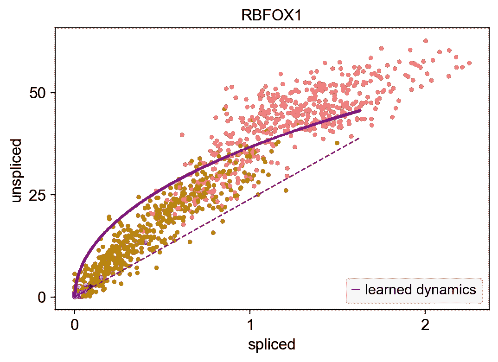

该图显示了基因 RBFOX1 的未剪接/剪接轨迹，根据细胞类型用点着色(蓝色代表放射状胶质细胞，绿色代表成神经细胞，暗金色代表未成熟神经元，红色代表神经元)，用 E-M 算法得到的紫色拟合动力学曲线。你可以看到实线曲线如何给出比虚线稳态模型更好的拟合，随着细胞从放射状胶质细胞到神经元，未剪接 mRNA 相对于剪接 mRNA 的转录迅速增加，表明该基因在神经元中被激活，而在放射状胶质细胞中不活跃。我们可以观察到几个基因在神经发生的不同部分被上调和下调的类似动态，如下所示:

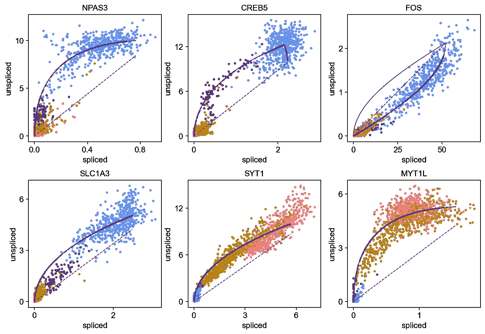

# 最后的想法

scRNA-seq 的一个主要缺点是它只能产生细胞转录组的快照；您不能重新访问您的样本进行后续测序。RNA velocity 是一种规避这种限制的有效方法，它利用 RNA 生物学来推断未来的基因表达，绘制出细胞固有的转录指南针，并为您的数据提供方向性。这可以用来说明细胞到达给定终点可能采取的不同途径，基因表达变化有多快，构建干细胞如何变得更加特化的整体轨迹，还有很多。但是，它也不是没有自己的局限性。如前所述，scRNA-seq 常常是稀疏的和嘈杂的。从描述良好的生物学过程的基本事实来看，速度随后可能是不直观的或完全不正确的。虽然插补和数据平滑等方法有助于纠正这些问题，但应小心使用，因为它们易于消除实际的生物噪声，从而提供有价值的见解，例如向我们数据集中不存在的细胞的潜在转变。尽管如此，这是一种强大的方法，为理解高维生物数据提供了很多清晰度，并且随着数据科学领域的不断发展，这种方法将继续进一步完善。单细胞基因组学这十年的目标之一是有效整合测量细胞不同属性(如 RNA、蛋白质、表观遗传学等)的高维数据集。像 RNA velocity 这样的方法可以[扩展](https://genomebiology.biomedcentral.com/articles/10.1186/s13059-020-1945-3)来学习这些不同模态之间的关系，从而对细胞间的转换做出强有力的推断，并因此微调细胞的指南针。

# 参考资料:

[1] G .拉·曼诺、r .索尔达托夫、a .蔡塞尔、e .布劳恩、h .霍赫格纳、v .佩图霍夫、k .李德施赖伯、M. E .卡斯特里蒂、p .伦纳伯格、a .弗尔兰、j .范、L. E .博尔姆、z .刘、d .范·布鲁根、j .郭、x .何、r .巴克、e .松德斯特伦、g .卡斯特洛-布兰科、p .克拉默、I .阿达梅科

[2] V. Bergen，M. Lange，S. Peidli，F. Alexander Wolf 和 F. J. Theis，[通过动力学建模将 RNA 速度推广到瞬时细胞状态](https://www.nature.com/articles/s41587-020-0591-3)，(2020)，自然生物技术

[3] V. Bergen，R. Soldatov，P. V. Kharchenko，F. J. Theis， [RNA 速度——当前挑战和未来展望](https://www.embopress.org/doi/full/10.15252/msb.202110282)，(2021)，分子系统生物学