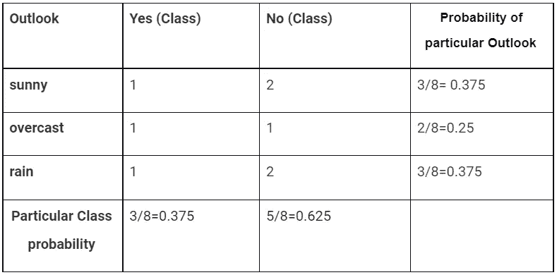
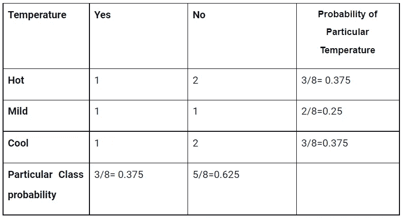
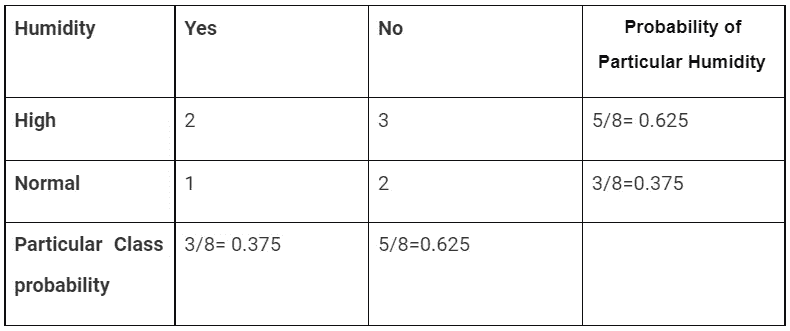
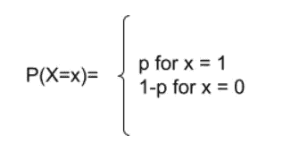
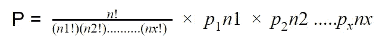
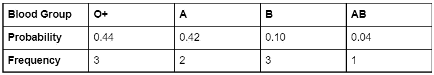
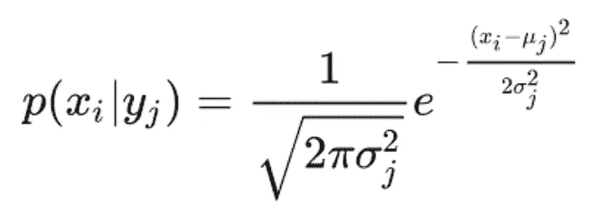
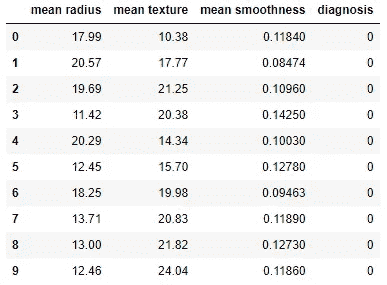
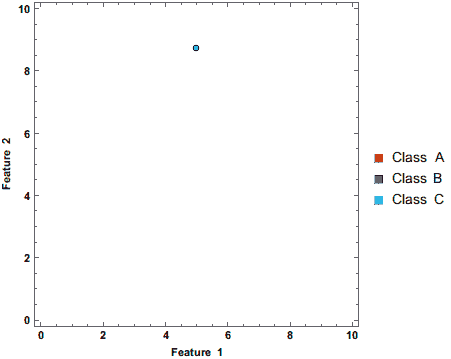

# 从朴素贝叶斯定理到朴素贝叶斯分类器的路线图(Stat-09)

> 原文：<https://towardsdatascience.com/road-map-from-naive-bayes-theorem-to-naive-bayes-classifier-6395fc6d5d2a?source=collection_archive---------11----------------------->

## 朴素贝叶斯分类器的完整指南，从头开始实现


约翰·汤纳在 [Unsplash](https://unsplash.com?utm_source=medium&utm_medium=referral) 上拍摄的照片

朴素贝叶斯这个名字本身就表达了算法的含义。但是怎么会！我们来分析一下算法的名字，朴素贝叶斯。我们找到两个术语，一个是朴素的，另一个是贝叶斯。在这里，Naive 意味着算法中使用的所有特征都是相互独立的；而且之所以叫贝叶斯，是因为它依赖于贝叶斯定理。朴素贝叶斯分类器是分类器算法的集合，其中所有算法共享一个共同的原则，因为每个特征对都是彼此独立分类的。它基于一个对象进行预测。为了理解该算法，我们必须从一些基本术语开始，如生成模型、贝叶斯定理。有两种机器学习模型。

*   生成模型
*   判别模型

朴素贝叶斯分类器是生成模型的用例之一。因此，在一开始，我们将讨论生成模型。

*注意:如果你想了解概率的概念，在阅读这篇文章之前，我建议你先浏览一下下面这篇文章。]*

</basic-probability-concepts-for-data-science-eb8e08c9ad92>  

## ✪生成模型

生成模型主要关注数据的分布，并考虑分布的密度来计算类。

生成模型的一些示例:

*   ‌naïve·贝叶斯
*   贝叶斯网络
*   马尔可夫随机场
*   ‌Hidden 马尔可夫模型
*   潜在狄利克雷分配
*   生成对抗网络
*   自回归模型

## ✪贝叶斯定理

以英国数学家托马斯·贝叶斯命名的贝叶斯定理被用来寻找条件概率。条件概率用于根据前一个事件找到事件概率。贝叶斯定理产生后验概率来分解先验概率。

先验概率是在获取新数据点之前事件的相似性。

后验概率是在获取新数据点后对事件的推测。决定性地，贝叶斯定理试图在新的数据或信息被添加到数据集之后找到事件的可能性。贝叶斯定理的公式:

P(A|B) = P(A) * P(B|A)/P(B)

在哪里，

P(A)表示事件 A 发生的概率

P(B)表示事件 B 发生的概率

P(A|B)表示给定 B 时发生 A 的概率

P(B|A)表示给定 A 时发生 B 的概率

## ◉朴素贝叶斯算法是如何工作的

一个分类问题可能有一个、两个或多个类别标签。假设我们有 m 个类别标签 **y1，y2，…，ym，**和 **n** 输入变量 **X1，X2，…，Xn。从这些数据中，我们可以计算出给定输入变量的概率。数据的公式如下**

**P(yi | x1，x2，…，xm) = P(x1，x2，…，xn | yi) * P(yi) / P(x1，x2，…，xm)。**

我们必须确定值 **yi** 其中 **i =1，2，…，m.** 最后将这些概率值与对应的 yi 值进行比较。最大概率值表示输出标注。

让我们用下面的例子简化一下。假设我们有一个由三个输入变量组成的**‘天气状况’**数据集，**前景、温度和湿度、**和相应的目标值**‘播放’。**我们试图根据输入变量找出某一天比赛的概率。假设我们要计算天气条件下打球的概率:**前景=晴朗，温度=凉爽，湿度=正常。**

开始时，我们必须为特定输入变量转换频率表中的数据集，并计算可能性:

➣ **为 Outlook 输入变量**



温度输入变量的➣

****

**湿度输入变量的➣**

********

****这里， *P(播放=是)= 0.5，P(播放=否)= 0.5*****

****现在，我们的配方准备应用贝叶斯定理来找出在那个雨天玩家是否会玩的输出。****

> *****P(是|晴，......高)=P(晴|是)*P(凉|是)*P(正常|是)*P(是)/(P(晴)*P(凉)*P(正常)*****
> 
> ******从上表******
> 
> *****P(晴|是)= 1/4 = 0.25*****
> 
> *****P(酷|是)=2/4 = 0.5*****
> 
> *****P(正常|是)=2/4 = 0.5*****
> 
> *****P(晴天)= 0.375*****
> 
> *****P(酷)= 0.375*****
> 
> *****P(正常)= 0.375*****
> 
> *****P(是)=4/8 = 0.375*****
> 
> *****所以 P(是|晴，…..高)=(0.25 * 0.5 * 0.5 * 0.375)/(0.375 * 0.375)=****0.444*******
> 
> *****P(无|晴……高)= P(晴|无)*P(凉|无)*P(正常|无)*P(无)/(P(晴)*P(凉)*P(正常))*****
> 
> ******根据上表******
> 
> *****P(晴|否)= 1/4 = 0.25*****
> 
> *****P(cool|No)=2/4 = 0.5*****
> 
> *****P(正常|否)=2/4 = 0.5*****
> 
> *****P(晴天)= 0.375*****
> 
> *****P(冷)= 0.375*****
> 
> *****P(正常)= 0.375*****
> 
> *****P(否)=4/8 = 0.625*****
> 
> *****所以 P(不|晴，…..高)=(0.25 * 0.5 * 0.5 * 0.625)/(0.375 * 0.375)* =****0.740740*******

****所以，我们从上面的计算中发现。****

****`***P(No|sunny,…..high) > P(No|sunny,…..high)***`****

******因此，在雨天，玩家无法玩游戏。******

## ****朴素贝叶斯模型的✪类型****

****朴素贝叶斯模型的类型基于它们的分布。诸如****

****◉ **伯努利朴素贝叶斯******

****伯努利朴素贝叶斯是一种重要的朴素贝叶斯算法。这个模型以文档分类任务而闻名，它决定一个特定的单词是否留在文档中。在这些情况下，频率的计算就不那么重要了。这是最简化的算法。该算法对于小数据集最有效。伯努利朴素贝叶斯的决策规则是****

********

****例如，您想知道文档中是否包含特定的单词。在这类二元分类中如真或假、成功或失败、0 或 1、玩或不玩等。，使用伯努利朴素贝叶斯分类。****

****◉ **多项式朴素贝叶斯******

****当我们研究术语“多项式”时，它的意思与多类分类密切相关。假设你对特定输出的频率感兴趣；多项式朴素贝叶斯算法是解决这一问题的合适算法。另一个例子是，您给了一个文本文档来查找文档中某个特定单词的出现次数。在这种情况下，您必须应用多项式朴素贝叶斯算法。对于多项式朴素贝叶斯算法，使用多项式分布函数。多项式分布函数:****

********

****在这里，我们将展示方程，并用下面的一个实例来找出 **P** 的过程。例如，我们从城市人口 ***(孟加拉达卡的拉杰巴里)*** 中收集了血型样本。此外，计算样本中每个血型的概率。****

********

****作者图片****

****现在，你出了一道题，随机取 9 个人，计算一下。****

> *****这里，n1 = O+的频率值，*****
> 
> *****n2 =频率值 A，*****
> 
> *****n3 =频率值 B，*****
> 
> *****n4 =频率值 AB*****
> 
> *****这里，n=9，随机样本的总数。*****
> 
> *****另外，p1 = 0.44 =样本中 O+血型的概率，*****
> 
> *****p2 = 0.42 =样本中 A 血型的概率，*****
> 
> *****P3 = 0.10 =样本中 B 血型的概率，*****
> 
> *****P3 = 0.04 =样本中 AB 血型的概率*****

****现在，只要把上面的值代入方程，就会得到多项式朴素贝叶斯的概率。****

## ****◉ **高斯朴素贝叶斯******

****伯努利朴素贝叶斯和多项式朴素贝叶斯用于离散类型数据集。但是我们将使用真实世界的连续数据。在这种情况下，我们需要使用高斯朴素贝叶斯定理。高斯分布或正态分布函数看起来如下:****

********

## ****朴素贝叶斯算法的✪从头实现****

****为了从零开始实现朴素贝叶斯，我们将一步一步地接近:****

```
**#importing necessary libraries
import numpy as np 
import pandas as pd**
```

****➣从头开始创建用于实现朴素贝叶斯算法的数据集。****

```
**from sklearn.datasets import load_breast_cancer
cancer = load_breast_cancer()data = pd.DataFrame(data=cancer.data, columns=cancer.feature_names)
data['diagnosis'] = cancer.targetdata = data[["mean radius", "mean texture", "mean smoothness", "diagnosis"]]
data.head(10)**
```

********

****作者图片****

****➣:首先，我们要计算先验概率。我们已经创建了一个函数**calculate _ prior _ probability**，其中您将数据帧、df 和 Y 作为输入，并返回先验概率值。*如****P(Y =是)*** *或****P(Y =否)。*******

****➣当我们创建函数 **cal_likelihood_gau 时，我们必须计算条件概率。我们**将输入必要的数据，计算给定 Y 标签时输入变量 **X** 的概率，这意味着概率 **X** 给定 **Y** 。该函数返回将被进一步使用的 **pro_x_given_y，**。****

****➣最后，你必须建立模型，并使用前面的两个函数**calculate _ prior _ probability**和 **cal_likelihood_gau 计算后验概率。******

****➣从上面的`naive_bayes_gaussian() function.`中预测最终产量****

****输出****

```
**[[36  4]  
 [ 0 74]] 
0.9736842105263158**
```

## ****使用 Sckit-learn 的朴素贝叶斯算法的✪Implementation****

****➣使用 Sckit-learn 导入实现朴素贝叶斯算法所需的库。这里，我们将实现伯努利、高斯和多项式朴素贝叶斯算法。****

```
**from sklearn import metrics
import urllib
from sklearn.naive_bayes import BernoulliNB,GaussianNB, MultinomialNB
from sklearn.metrics import accuracy_score
from sklearn.model_selection import train_test_split**
```

****➣拆分数据集，用于训练、测试和转换数据以适应模型。****

```
**train, test = train_test_split(data, test_size=.2, random_state=41)
X_train=train.iloc[:,:-1].values
y_train=train.iloc[:,-1].values
X_test = test.iloc[:,:-1].values
y_test = test.iloc[:,-1].values**
```

****➣最后，训练模型，测试准确性，并显示混淆度量。****

****输出****

```
**0.6491228070175439 
0.7368421052631579 
0.9649122807017544 
0.9736842105263158 
[[36  4]  
 [ 0 74]]**
```

****上述结果清楚地表明，当数据集包含连续值时，高斯朴素贝叶斯算法优于其他朴素贝叶斯算法。****

********

****来源:[https://upload . wikimedia . org/Wikipedia/commons/b/B4/Naive _ Bayes _ classifier . gif](https://upload.wikimedia.org/wikipedia/commons/b/b4/Naive_Bayes_Classifier.gif)****

****上面的 gif 演示了朴素贝叶斯分类器是如何工作的。****

## ****结论****

****朴素贝叶斯分类器是监督学习中一种简单易行但功能强大的分类算法。如果我们考虑数据集的分布，它在分类提供有效结果的情况下表现良好。更准确地说，当存在对事件的先前发生的依赖性时。在自然语言处理中，有时算法显示出有希望的结果。****

******参考文献******

****1.[https://www . analyticsvidhya . com/blog/2017/09/naive-Bayes-explained/](https://www.analyticsvidhya.com/blog/2017/09/naive-bayes-explained/)****

****2 . https://www . Java point . com/machine-learning-naive-Bayes-classifier****

## ****关于数据科学统计学的完整系列文章****

1.  ****[*少即是多；采样的‘艺术’(Stat-01)*](/less-is-more-the-art-of-sampling-dda8b59d399?source=your_stories_page-------------------------------------)****
2.  ****[*熟悉数据科学最重要的武器~变量(Stat-02)*](/get-familiar-with-the-most-important-weapon-of-data-science-variables-48cc7cd85dc5?source=your_stories_page-------------------------------------)****
3.  ****[*要提高数据分析能力，您必须了解频率分布(Stat-03)*](/to-increase-data-analysing-power-you-must-know-frequency-distribution-afa438c3e7a4?source=your_stories_page-------------------------------------)****
4.  ****[*通过可视化频率分布找到数据集的模式(Stat-04)*](/find-the-patterns-of-a-dataset-by-visualizing-frequency-distribution-c5718ab1f2c2?source=your_stories_page-------------------------------------)****
5.  ****[*比较多个频率分布，从数据集中提取有价值的信息(Stat-05)*](/compare-multiple-frequency-distributions-to-extract-valuable-information-from-a-dataset-10cba801f07b?source=your_stories_page-------------------------------------)****
6.  ****[*通过简短的讨论消除你对 Mean 的误解(Stat-06)*](https://medium.datadriveninvestor.com/eliminate-your-misconception-about-mean-with-a-brief-discussion-a9fed67d4b08?source=your_stories_page-------------------------------------)****
7.  ****[*通过规范化提高您的数据科学模型效率(Stat-07)*](https://medium.datadriveninvestor.com/increase-your-data-science-model-efficiency-with-normalization-918484b4626f?source=your_stories_page-------------------------------------)****
8.  ****[*数据科学的基本概率概念(Stat-08)*](/basic-probability-concepts-for-data-science-eb8e08c9ad92?source=your_stories_page-------------------------------------)****
9.  ****[*从朴素贝叶斯定理到朴素贝叶斯分类器的路线图(Stat-09)*](/road-map-from-naive-bayes-theorem-to-naive-bayes-classifier-6395fc6d5d2a?source=your_stories_page-------------------------------------)****
10.  ****[*数据科学爱好者需要知道的假设检验(Stat-10)*](https://medium.datadriveninvestor.com/all-you-need-to-know-about-hypothesis-testing-for-data-science-enthusiasts-30cfe1dce028?source=your_stories_page-------------------------------------)****
11.  ****[*多组间统计比较用 ANOVA (Stat-11)*](/statistical-comparison-among-multiple-groups-with-anova-d4ac27f6e59e?source=your_stories_page-------------------------------------)****
12.  ****[*用卡方检验比较分类变量的相关性(Stat-12)*](/compare-dependency-of-categorical-variables-with-chi-square-test-982baff64e81?source=your_stories_page-------------------------------------)****