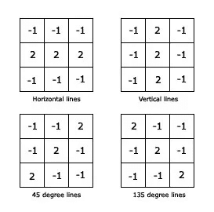
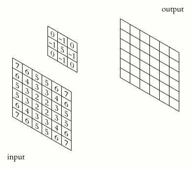
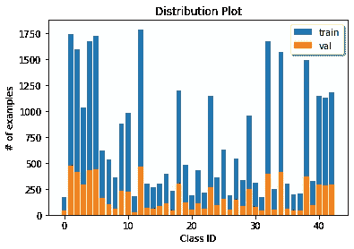
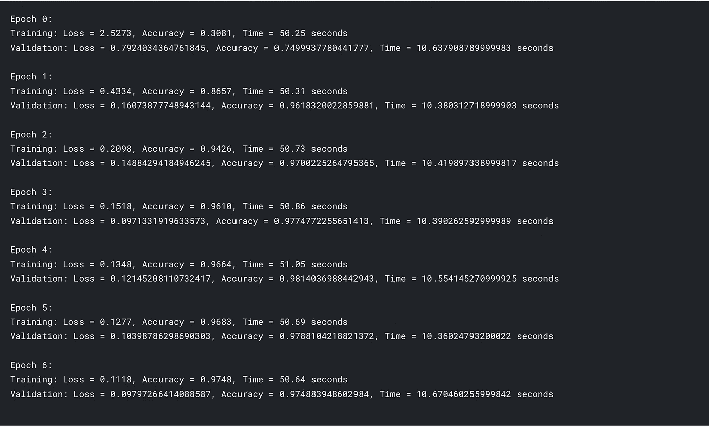
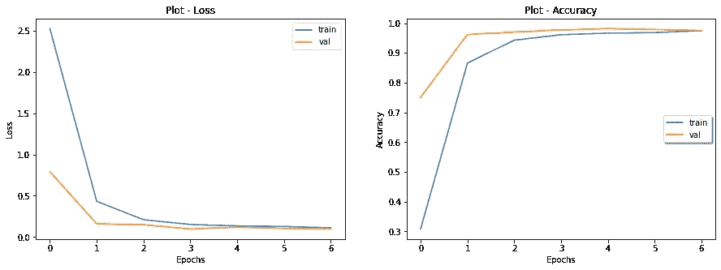
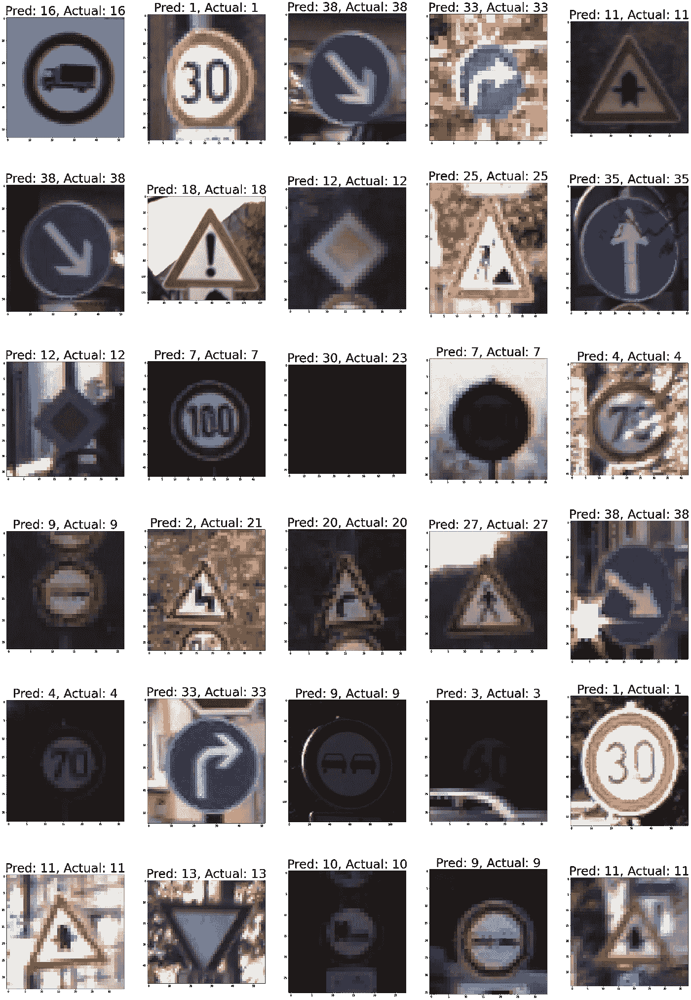

# 路标让你疯狂？

> 原文：<https://towardsdatascience.com/road-signs-driving-you-crazy-e686d97f2480?source=collection_archive---------16----------------------->

## 以下是我如何建立一个程序来为你阅读它们


罗西·斯蒂格尔斯在 [Unsplash](https://unsplash.com/s/photos/road-signs?utm_source=unsplash&utm_medium=referral&utm_content=creditCopyText) 上的照片

路标。一大堆不同颜色的符号，它们的形状你应该能够推断出它们的意思。奇怪的符号，你必须谷歌甚至模糊地认识。路标令人困惑，很难记住它们的意思。这就是为什么我建立了[这个程序](https://www.kaggle.com/taraprole/roadsignclassifier)来为你阅读它们！给定一张足够清晰、裁剪得当的图像，我的 CNN 可以读取路标中的图案，并使用数字分类系统对它们进行分类。我将向你展示它是如何工作的！

# 目录

因为这是一篇有点长的文章，我想我应该给你一个简短的目录，以便能够快速导航到我的文章的特定部分。

1.  [***为什么这个其实有用？***](#e7b3)
2.  [***CNN***](#4930)
3.  [***入门***](#9795)
4.  [***准备数据***](#f088)
5.  [***创建神经网络***](#c631)
6.  [***定义功能***](#088e)
7.  [***训练神经网络***](#af7b)
8.  [***测试型号***](#48c1)

# 为什么这实际上是有用的？

你可能想知道这一切有什么意义。当我们可以自己看路标时，为什么我们需要一台计算机来对它们进行分类？

答案:**自动驾驶汽车。**

无人驾驶汽车每天都变得越来越真实。谷歌的姐妹公司 Waymo 已经在亚利桑那州的凤凰城建立了完整的系统。城市特定区域的市民可以像订购优步一样订购无人驾驶汽车！但是，为了让自动驾驶汽车与你今天可能驾驶的汽车无缝集成，它们需要能够像人类一样遵守道路规则。这包括阅读路标！

# CNN

你可能也想知道这些 CNN 的东西是什么。别担心，我可以解释😉

CNN 是一种特别擅长图像分类的神经网络(阅读我的其他文章来了解基础知识)。CNN 用于计算机视觉，因为它们擅长检测图像中的图案，如线条、圆形和其他形状和图案。CNN 使用卷积层，它本质上学习可以检测图像模式的过滤器。例如，过滤器可以检测垂直线，也可以检测水平线。



信用:塔拉普罗尔

这些滤波器在图像上“卷积”,以小的 3x3(或任何大小的滤波器)块来获得所述 3x3 块的点积。过滤器首先检查输入图像的第一个 3x3 区域，并找到该块的点积。它记录下来，并成为下一层输入的一部分。对于整个图片中的每一个 3×3 的块，都会发生这种情况，并且创建一个用点积和过滤器简化的新图片。



图片由 Kjell Magne Fauske 在[公共领域](https://commons.wikimedia.org/wiki/File:2D_Convolution_Animation.gif)发布

正如你所看到的，这个过滤器把一个更大的图像变成更容易管理和计算机可读的东西。过滤器通常检测图像中最相关和最突出的特征——它们可以非常简单，如检测线条和形状，也可以非常复杂，如面部识别——或者就我而言，是路标。

如果你想看看这些卷积层是如何工作的，请查看瑞尔森大学的资源:

 [## 卷积神经网络的三维可视化

www.cs.ryerson.ca](https://www.cs.ryerson.ca/~aharley/vis/conv/) 

这里有一段来自 DeepLizard 的视频，让你了解更多关于 CNN 的信息:

CNN 上的深蜥蜴

# 入门指南

为了创建我自己的 CNN，我使用了一个叫做 [PyTorch](https://pytorch.org/) 的 Python 库。PyTorch 是一个开源的机器学习框架，允许你从头到尾创建神经网络。首先，我通过 [Kaggle](https://www.kaggle.com/) 创建了一个 Jupyter 笔记本，这是一个非常有用的网站，允许你使用免费的 GPU 来运行你的机器学习模型。我强烈建议将您的代码移到那里——一旦您掌握了窍门，它非常直观且易于使用。

神经网络在大型数据集上训练。在我的神经网络中，我使用德国交通标志识别基准(GTSRB)数据集来训练和测试神经网络。我的神经网络对一组 39，209 个带标签的图像进行了训练，以学习用于确定路标模式的过滤器。然后，它在一组 12，630 张带标签的测试图像上进行测试，以了解它在真实世界数据上的准确性。

为了将数据加载到我的程序中，我前往 GTSRB 数据集的 [Kaggle 页面，并创建了一个新的笔记本。](https://www.kaggle.com/meowmeowmeowmeowmeow/gtsrb-german-traffic-sign)

```
import torch as t 
import torchvision 
from torchvision import transforms 
import torch.utils.data as data 
import torch.optim as optim
import torch.nn as nn 
import time 
import numpy as np
import os 
import matplotlib.pyplot as plt
```

下面是我导入的库的列表，它们是什么，以及它们各自文档的链接。

*   [PyTorch](https://pytorch.org/docs/)
*   [火炬视觉【PyTorch 内部的计算机视觉库](https://pytorch.org/vision/stable/index.html)
*   [Transforms](https://pytorch.org/vision/stable/transforms.html) -允许转换输入数据，在这种情况下是从图像到张量。还能够对输入数据进行大小调整、裁剪和其他转换。
*   [torch.utils.data](https://pytorch.org/docs/stable/data.html) -处理数据的工具
*   [torch.optim](https://pytorch.org/docs/stable/optim.html) -优化算法，使网络达到最佳状态
*   [torch.nn](https://pytorch.org/docs/stable/nn.html) -神经网络工具，专门为训练神经网络而制作
*   [时间](https://docs.python.org/3/library/time.html) -用于计时测试和培训所需的时间
*   [NumPy](https://numpy.org/)——用于制作和使用数据数组
*   [os](https://docs.python.org/3/library/os.html) -用于管理我们程序中的文件
*   matplotlib.pyplot -用于显示整个程序的图形和图像

# 准备数据

```
*#Defining the transformation*
data_transforms = transforms.Compose([transforms.Resize([112, 112]), transforms.ToTensor()])
```

接下来，我为数据定义了转换。该转换将输入图像的大小调整为 112x112，并将这些图像转换为张量。

```
*#Defining hyperparameters*

BATCH_SIZE = 256
learning_rate = 0.001
EPOCHS = 7
numClasses = 43
```

然后我定义了模型的超参数，比如批量大小、学习速率和时期数。批量大小是指一次处理的图像数量。学习率是神经网络每次出错时调整的程度。历元是计算机检查整个训练集的次数(它查看每个图像 7 次)。

```
*#path of training data*

train_data_path = '../input/gtsrb-german-traffic-sign/Train'
train_data = torchvision.datasets.ImageFolder(root = train_data_path, transform = data_transforms)

*#Divide data into training and validation (0.8 and 0.2)*
ratio = 0.8
n_train_examples = int(len(train_data) * ratio)
n_val_examples = len(train_data) - n_train_examples

train_data, val_data = data.random_split(train_data, [n_train_examples, n_val_examples])

print(f"Number of training samples = **{**len(train_data)**}**")
print(f"Number of validation samples = **{**len(val_data)**}**")
```

接下来，我开始创建我的数据集！首先，我定义了训练数据的文件路径。Kaggle 使复制和粘贴数据路径在您的程序中使用变得很容易——只需前往界面的右侧，将鼠标悬停在包含您的列车数据的文件夹上，然后单击复制按钮。然后，我使用 torchvision 的 [ImageFolder](https://pytorch.org/vision/stable/datasets.html#torchvision.datasets.VisionDataset) 数据集类型，使用 Kaggle 文件路径和我之前定义的转换，创建了我的训练集。

然后，我将训练集分为训练集和验证集。训练是程序实际训练的内容——这些是它将学习识别的图像。验证集基本上是为了在训练时进行测试——它让您实时看到您的模型在没有训练的数据上的表现。

```
*#create data loader for training and validation*
trainloader = data.DataLoader(train_data, shuffle=True, batch_size=BATCH_SIZE)
valloader = data.DataLoader(val_data, shuffle=True, batch_size=BATCH_SIZE)
```

准备训练数据的最后一步是创建数据加载器。这基本上是一种让程序轻松访问和遍历你定义的数据集的方法。我已经将这些加载器的批处理大小设置为 256(我之前设置的变量),它们每次都会洗牌。

```
*# Plot histogram for training and validation data*

train_hist = [0]*numClasses
for i **in** train_data.indices:
    tar = train_data.dataset.targets[i]
    train_hist[tar] += 1

val_hist = [0]*numClasses
for i **in** val_data.indices:
    tar = val_data.dataset.targets[i]
    val_hist[tar] += 1

plt.bar(range(numClasses), train_hist, label="train")
plt.bar(range(numClasses), val_hist, label="val")
legend = plt.legend(loc='upper right', shadow=True)
plt.title("Distribution Plot")
plt.xlabel("Class ID")
plt.ylabel("# of examples")

plt.savefig("train_val_split.png", bbox_inches = 'tight', pad_inches=0.5)
```

不过，在开始实际训练网络之前，我画了一个数据分布图。我设置它来显示总共有多少个例子，以及训练和验证之间的差异。



信用:塔拉普罗尔

# 创建神经网络

```
class **NeuralNet**(nn.Module):
    def __init__(self, output_dim):
        super().__init__()

        self.features = nn.Sequential(
            nn.Conv2d(in_channels=3, out_channels=64, kernel_size=3, stride=2, padding=1),
            nn.MaxPool2d(kernel_size=2),
            nn.ReLU(inplace=True),

            nn.Conv2d(in_channels=64, out_channels=192, kernel_size=3, padding=1),
            nn.MaxPool2d(kernel_size=2),
            nn.ReLU(inplace=True),

            nn.Conv2d(in_channels=192, out_channels=384, kernel_size=3, padding=1),
            nn.ReLU(inplace=True),

            nn.Conv2d(in_channels=384, out_channels=256, kernel_size=3, padding=1),
            nn.ReLU(inplace=True),

            nn.Conv2d(in_channels=256, out_channels=256, kernel_size=3, padding=1),
            nn.BatchNorm2d(256),
            nn.MaxPool2d(kernel_size=2),
            nn.ReLU(inplace=True),
            )

        self.classifier = nn.Sequential(
            nn.Dropout(0.5),
            nn.Linear(256*7*7, 1000),
            nn.ReLU(inplace=True),

            nn.Dropout(0.5),
            nn.Linear(in_features=1000, out_features=256),
            nn.ReLU(inplace=True),

            nn.Linear(256, output_dim)
            )

    def forward(self, x):
        x = self.features(x)
        h = x.view(x.shape[0], -1)
        x = self.classifier(h)
        return x, h
```

有趣的事情从这里开始！这是我定义我的神经网络的代码块。这个网络非常类似于 AlexNet 框架，使用 5 个卷积层，然后是 3 个全连接(线性)层。每个卷积层使用最大池。这里有一个来自 DeepLizard 的关于 max pooling layers 的视频，我觉得它很好地解释了这个主题。

最大池层数上的深蜥蜴

我还使用了[退出方法](https://machinelearningmastery.com/dropout-for-regularizing-deep-neural-networks/)来减少我的模型中的过度拟合(网络学习特定的图像而不是模式)——这是使用 nn 定义的。辍学(0.5)。

```
*# define optimiser and criterion functions*
optimiser = optim.Adam(model.parameters(), lr=learning_rate, weight_decay=0.01)
criterion = nn.CrossEntropyLoss()
```

这里我定义了优化器和损失函数。优化器是在每个训练时期之后返回并固定模型的参数。我还在优化器中设置了权重衰减，这意味着权重每次都会减少一点。这也有助于减少过度拟合。

# 定义函数

```
*# Function to perform training of the model*

def train(model, loader, opt, criterion):
    epoch_loss = 0
    epoch_acc = 0

    *# Train the model*
    model.train()

    for (images, labels) **in** loader:
        images = images.cuda()
        labels = labels.cuda()

        output, _ = model(images)
        loss = criterion(output, labels)

        *# Training pass*
        opt.zero_grad()

        *# Backpropagation*
        loss.backward()

        *# Calculate accuracy*
        acc = calculate_accuracy(output, labels)

        *# Optimizing weights*
        opt.step()

        epoch_loss += loss.item()
        epoch_acc += acc.item()

    return epoch_loss / len(loader), epoch_acc / len(loader)
```

接下来，定义一个函数来训练模型。基本上，该函数迭代通过训练/验证加载器并训练网络。需要注意的几件重要事情是优化和反向传播。该函数还返回它所使用的每个历元的损失和精度(一个历元是程序循环通过所有训练数据的次数)。

```
def evaluate(model, loader, opt, criterion):
    epoch_loss = 0
    epoch_acc = 0

    *#evaluate the model*
    model.eval()

    with t.no_grad():
        for (images, labels) **in** loader:

            images = images.cuda()
            labels = labels.cuda()

            output, _ = model(images)
            loss = criterion(output, labels)

            acc = calculate_accuracy(output, labels)

            epoch_loss += loss.item()
            epoch_acc += acc.item()

    return epoch_loss / len(loader), epoch_acc / len(loader)
```

我还定义了一个函数来评估模型。不使用梯度下降，它测试网络的表现如何。像训练函数一样，它评估网络的损耗和准确性。

# 训练神经网络

```
*#TRAINING*

train_loss_list = [0]*EPOCHS
train_acc_list = [0]*EPOCHS
val_loss_list = [0]*EPOCHS
val_acc_list = [0]*EPOCHS

for epoch **in** range(EPOCHS):
    print("Epoch **{}**: ".format(epoch))
    train_start_time=time.monotonic()
    train_loss, train_acc= train(model, trainloader, optimiser, criterion)
    train_end_time = time.monotonic()

    val_start_time = time.monotonic()
    val_loss, val_acc = evaluate(model, valloader, optimiser, criterion)
    val_end_time = time.monotonic()

    train_loss_list[epoch] = train_loss
    train_acc_list[epoch] = train_acc
    val_loss_list[epoch] = val_loss
    val_acc_list[epoch] = val_acc

    print("Training: Loss = **%.4f**, Accuracy = **%.4f**, Time = **%.2f** seconds" %(train_loss, train_acc, train_end_time-train_start_time))
    print("Validation: Loss = **{}**, Accuracy = **{}**, Time = **{}** seconds".format(val_loss, val_acc, val_end_time - val_start_time))
    print("")
```

这就是:我的代码中最重要的部分！这个模块是所有神经网络训练发生的地方。它首先打印出纪元编号，然后使用训练集加载器训练模型。它还使用 time.monotonic()函数计算训练模型所需的时间。然后它对验证集做同样的事情，除了它使用 evaluate 函数(这里没有训练)。

在这一切结束时，它打印出损耗、精度和训练网络所用的时间。我看到了损失的减少和精确度的提高——这非常令人满意😁



前一个块的输出——看着损耗减少，精度增加！

顺便说一下，你可以访问项目的 Kaggle 页面来查看这些块的所有输出。

```
*# Saving the model*

*# Create folder to save model*
MODEL_FOLDER = "../Model"
if **not** os.path.isdir(MODEL_FOLDER):
    os.mkdir(MODEL_FOLDER)

PATH_TO_MODEL = MODEL_FOLDER + "/pytorch_classification_alexnetTS.pth"
if os.path.exists(PATH_TO_MODEL):
    os.remove(PATH_TO_MODEL)
t.save(model.state_dict(), PATH_TO_MODEL)

print("Model saved at **%s**" %(PATH_TO_MODEL))
```

当训练完成时，程序保存模型，以便我可以在以后加载和使用它。

```
*# Plot loss and accuracies for training and validation data*

_, axs = plt.subplots(1, 2, figsize=(15, 5))

*# Loss plot*
axs[0].plot(train_loss_list, label="train")
axs[0].plot(val_loss_list, label="val")
axs[0].set_title("Plot - Loss")
axs[0].set_xlabel("Epochs")
axs[0].set_ylabel("Loss")
legend = axs[0].legend(loc='upper right', shadow=False)

*# Accuracy plot*
axs[1].plot(train_acc_list, label="train")
axs[1].plot(val_acc_list, label="val")
axs[1].set_title("Plot - Accuracy")
axs[1].set_xlabel("Epochs")
axs[1].set_ylabel("Accuracy")
legend = axs[1].legend(loc='center right', shadow=True)
```

测试过程之前的最后一点代码是绘制网络的损耗和准确性。这使用 matplotlib 库来创建两个简单的线图，显示每个时期的损耗和每个时期的精度。每个图表将这些元素中的一个与训练集和验证集进行比较。训练集的线条是蓝色的，验证集的线条是橙色的。看到网络如何随着时代的发展而进步真的很有趣。



信用:塔拉普罗尔

# 测试模型

现在我已经训练了神经网络，是时候看看它在一些它从未见过的测试数据上的表现了。这是因为在现实世界中，并非所有的路标都处于相同的角度，相同的旋转，相同的背景-计算机通过训练集学习了许多变化，我们需要看看它是否可以应用于一些新的例子。

```
*#Define transformations*

test_transforms = transforms.Compose([
    transforms.Resize([112, 112]),
    transforms.ToTensor()
    ])
```

首先，我为测试数据定义了转换。这种转换将测试图像转换为 112 x 112 的图片，然后转换为 PyTorch 可以读取的张量。

```
*# Define path of test data*

test_data_path = "../input/gtsrb-test-images/GTSRB/Final_Test"
test_data = torchvision.datasets.ImageFolder(root = test_data_path, transform = test_transforms)
test_loader = data.DataLoader(test_data, batch_size=1, shuffle=False)

numClasses = 43
```

然后我定义了测试数据的路径，再次使用 Kaggle 数据集中的复制粘贴函数。对于测试数据，我在数据输入方面有一些问题。我使用的 CSV 文件中的 png 格式，图像是。ppm 文件。我选择从 [GTSRB 网站](https://benchmark.ini.rub.de/gtsrb_dataset.html#Downloads)单独下载测试图片，并上传到 Kaggle 作为自定义数据集。

```
import pandas as pd
*# Read the image labels from the csv file*
*# Note: The labels provided are all numbers, whereas the labels assigned by PyTorch dataloader are strings*

df = pd.read_csv("../input/gtsrb-german-traffic-sign/Test.csv")
numExamples = len(df)
labels_list = list(df.iloc[:,6])

print(numExamples)
```

为了让计算机读取每个图像，使用 CSV 文件来获取文件路径和它们各自的类。为了实现这一点，我导入了 Pandas 库。我用它来读取 CSV 文件，获取示例数量，并使用 iloc 函数创建标签列表。这得到了整个列(列 7，按照 Python 语法索引为 6 ),并将它转换成一个列表，我可以用它来标记测试图像。

```
*#Perform classification*

y_pred_list = []
corr_classified = 0

with t.no_grad():
    model.eval()

    i = 0

    for image, _ **in** test_loader:
        image = image.cuda()

        y_test_pred = model(image)

        y_pred_softmax = t.log_softmax(y_test_pred[0], dim=1)
        _, y_pred_tags = t.max(y_pred_softmax, dim=1)
        y_pred_tags = y_pred_tags.cpu().numpy()

        y_pred = y_pred_tags[0]
        y_pred = labels[y_pred]

        y_pred_list.append(y_pred)

        if labels_list[i] == y_pred:
            corr_classified += 1

        i += 1

print("Correctly classified: **{}**".format(corr_classified))
print("Incorrectly classified: **{}**".format(numExamples - corr_classified))
print("Final accuracy: **{}**".format(corr_classified / numExamples))
```

这是一大段代码🤣总的来说，这个模块为模型对测试数据的预测创建了一个空列表。在没有梯度下降(没有训练)的情况下，代码循环通过测试加载器中的每个图像，并在模型中运行它。它使用 softmax 和 max 函数来预测给定图像将具有哪个标签，然后将该标签添加到之前创建的列表中。

最后，它打印出正确分类的数量，错误分类的数量，然后将两者相除得到最终的准确度。

```
*# Display first 30 images, along with the actual and predicted classes*
from PIL import Image
fig, axs = plt.subplots(6,5,figsize=(50,75))
*#fig.tight_layout(h_pad = 50)*
for i **in** range(30):
    row = i // 5
    col = i % 5

    imgName = '../input/gtsrb-test-images/GTSRB/Final_Test/' + df.iloc[i,7]
    wrongFolder = str(imgName).replace('/Test', '/Images')
    wrongExtension = wrongFolder.replace('.png', '.ppm')
    img = Image.open(wrongExtension)
    axs[row, col].imshow(img)
    title = "Pred: **%d**, Actual: **%d**" % (y_pred_list[i], labels_list[i])
    axs[row, col].set_title(title, fontsize=50)

plt.savefig("predictions.png", bbox_inches = 'tight', pad_inches=0.5)
```

最后，是时候看看一些真实的数据和随之而来的预测了！这段代码显示了 30 个测试图像，预测和实际标签显示在每个图像的上方。



信用:塔拉普罗尔

正如你所看到的，该模型只预测了一些错误的图像，并且在对一些硬路标进行分类方面做了非常出色的工作。

> 这个项目来自 Suraj Krishnamurthy 的 GTSRB 分类程序。这里看 Github 项目原文:【https://github.com/surajmurthy/TSR_PyTorch 

<https://www.linkedin.com/in/taraprole/>  

如果你有兴趣看更多我的作品，我有一份每周时事通讯，请在下面订阅！

<https://taraprole.substack.com/subscribe>  

# 参考

**GTSRB 数据集**

*   Johannes Stallkamp、Marc Schlipsing、Jan Salmen 和 Christian Igel
    [人与计算机:交通标志识别的基准机器学习算法](https://www.sciencedirect.com/science/article/abs/pii/S0893608012000457)。神经网络 32，第 323–332 页，2012 年
*   Johannes Stallkamp、Marc Schlipsing、Jan Salmen 和 Christian Igel
    [德国交通标志识别基准:多类别分类竞赛](https://ieeexplore.ieee.org/document/6033395)。神经网络国际联合会议(IJCNN 2011)，第 1453–1460 页，IEEE 出版社