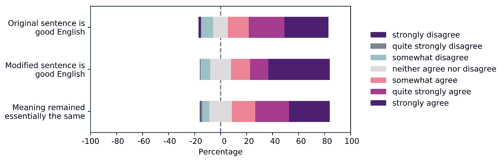
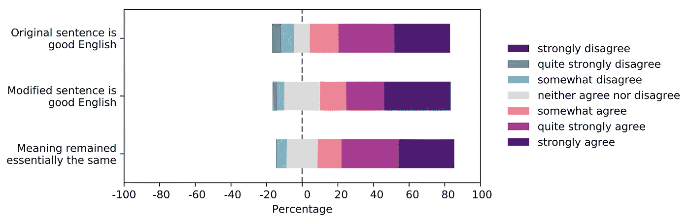

# 机器人记者——如何应对重复

> 原文：<https://towardsdatascience.com/robojournalism-how-to-tackle-the-repetition-693fcc25cac4?source=collection_archive---------23----------------------->

## 在基于模板的自动新闻 NLG 中改进语言多样性

汉娜·格蕾丝在 [Unsplash](https://unsplash.com/?utm_source=unsplash&utm_medium=referral&utm_content=creditCopyText) 上的照片

在这篇博文中，我描述了我 2020 年在赫尔辛基大学进行的数据科学领域硕士论文研究的一部分。2021 年 4 月，一篇关于新闻媒体内容分析和自动报告生成的论文随后发表在《EACL 黑客工作室学报》上。特别感谢我的硕士论文导师和合著者 Leo Leppä nen。

为了服务于更广泛的受众，我将很快解释一些关键概念。然而，理解这篇文章需要对计算机科学有一些基本的了解。

**自然语言生成(NLG)**——在 NLG，目标是从一些潜在的非语言数据(如时间序列数据或图像)中创建可以用英语或其他人类语言生成流利文本的系统。

**基于模板的 NLG** —经典的 NLG 方法，通过将数据插入模板来构造最终文本，如“In***【where】***，最高温度为***【period】*****【temperature】**【C”。由此产生的句子可能是“在 ***芬兰*** ，2020 年夏季*的最高温度是 ***33.5*** 摄氏度”。***

****词性(POS)标签** —用于表示单词在文本中的作用的标签，例如名词和副词。**

****单词嵌入** —用数字向量表示的自然语言单词，以便计算机能够理解它们。这些从文本集合中学习的向量形成了向量空间，其中向量的距离是那些单词的语义距离的近似值。一个经典的例子是，你可以做这样的计算，“如果你从国王的向量中减去男人的向量，然后加上女人的向量，你就会得到王后的向量”。**

****上下文单词嵌入** —单词嵌入最初是非上下文的，这意味着不管原始上下文如何，拼写相同的两个单词将具有相同的向量表示。让我们以*银行*这个词为例，它可以指一家银行或一家金融机构。上下文单词嵌入将学习不同上下文的不同向量表示。**

# **在基于模板的自动新闻 NLG 中使用上下文单词嵌入来改进语言的多样性**

**基于模板的自然语言生成(NLG)方法仍然广泛用于新闻行业的自动化新闻报道，即使已经引入了新的和令人兴奋的 NLG 统计方法。为什么？基于模板的方法精确地表示底层数据**，并且它们的过程**是透明的**。****

****开发一个简单的基于模板的 NLG 系统很容易，但是当引入更多的模板来增加语言的多样性时，所需的工作量就会迅速增加。并且当为特定领域编写大量模板时，如果不进行大量修改，它们就不能转移到新的领域。****

****对于我的硕士论文研究，我们提出了一个想法:如果我们依靠少量的简单模板，并允许上下文单词嵌入模型在输出中**插入新的**和**替换现有的**单词，会怎么样？****

****由于保留意义和控制输出对于新闻的上下文至关重要，我们将方法缩小到只插入预定义的词类和用同义词替换。****

# ****方法****

****在我的论文研究中，我开发了两个算法，一个用于单词的添加，一个用于单词的替换。我的方法需要上下文单词嵌入，带有一个屏蔽语言模型头( [BERT](https://arxiv.org/abs/1810.04805) )、一个同义词词典( [Wordnet](https://wordnet.princeton.edu/) )和一个词性标注工具( [NLTK](https://www.nltk.org/) )，可用于所讨论的语言(英语)。我的研究中使用的具体工具和语言在括号中提到。****

****作为示例使用的系统从欧盟统计局(欧盟统计局)提供的时间序列数据中生成新闻报道。****

## ****基于上下文添加新单词****

****为了添加新词，将带有词性标签定义的**空槽**引入到中间领域模板中。然后，在过程结束时处理这些空槽，因为上下文单词嵌入需要上下文，即句子中的周围单词来操作。****

> ****在澳大利亚，2018 年 75 岁或以上的女性 **{empty，pos=RB}** 的平均等值净收入为 22234 €。****

****然后，使用上下文单词嵌入来为该空槽找到一组合适的单词。如果单词从上下文单词嵌入中得到高于给定阈值的分数，则该单词被认为是合适的。然后通过我们选择的词类来缩小单词列表，在这个例子中，词类是副词 RB。****

> ****在澳大利亚，2018 年 75 岁以上的女性**仍然**获得 22234 €的平均等值净收入。****

******简而言之的插入算法(硕士论文中有完整的伪代码):******

******输入**:句子、词性、k、最小掩码标记数、最大掩码标记数
**输出**:拟合词列表****

1.  ****初始化空列表 *WordsAndScores* 。****
2.  ****从 min [MASK] tokens 到 max [MASK] tokens
    2.1 范围内的 *n* 循环。在句子中插入 *n* [MASK]标记，代替空槽
    2.2。针对 2.1 中的屏蔽句子，从屏蔽语言模型中获取 top *k* 预测(单词和分数)。
    2.3。将单词及其分数插入到步骤 1 中初始化的列表中。****
3.  ****返回列表*单词和分数*的子集，其中单词词性等于输入词性，分数大于或等于确定的阈值。****

## ****基于上下文替换现有单词****

****为了替换单词，单词在中间模板中被标记为“要被替换”。****

> ****在芬兰，2016 年家庭在医疗保健上的总支出为 20.35 %。****

****在生成过程结束时，向同义词词典查询要替换的那些单词的同义词。这些同义词随后用带有屏蔽语言模型头的上下文单词嵌入来评分，并且那些分数高于给定阈值的被认为是合适的候选。然后从这个列表中随机选择一个单词。****

> ****在芬兰，2016 年家庭在医疗保健上的总支出为 20.35 %。****

******替换算法简称(硕士论文有完整伪代码):******

******输入**:原单词，句子
**输出**:拟合单词列表****

1.  ****初始化一个空列表*字和分数*****
2.  ****从同义词词典中获取原单词的同义词列表****
3.  ****循环同义词列表
    3.1。用句子
    3.2 中的同义词替换原词。使用掩蔽语言模型，给句子
    3.3 中的单词打分。将同义词和分数添加到步骤 1 中初始化的单词和分数列表中。****
4.  ****返回列表中得分大于或等于给定阈值的子集 *WordsAndScores*****

# ****结果呢****

****我们的方法由通过在线平台招募的人类法官进行评估。法官被问及关于原句和修改后的句子的问题 1-3，以及关于合适和不合适单词的问题 4 和 5。****

1.  ****原句是目标语言中质量好的句子。****
2.  ****修饰句是目标语言中质量好的句子。****
3.  ****原文和修改后的句子意思基本相同。****
4.  ****有多少被评估为合适的单词可以用在第一句中标记的地方，这样意思基本上保持不变？****
5.  ****有多少被评价为不合适的词可以用在第一句中有标记的地方，使意思基本保持不变？****

****问题 1 和 2 被要求评估修改是否改变了句子质量，问题 3 被要求评估句子含义是否基本上保持与定义为新闻生成系统的要求相同。****

****问题 4 和 5 用来检查我们将单词分为合适和不合适的单词是否有意义。事实并非如此。有合适的词被排除在第一组词之外，类似地，一些明显不合适的词也被包括在第一组词中。****

****然而，根据我们的评估，修改并没有降低句子的质量，句子的含义基本上与用李克特量表评估句子 1-3 时相同，李克特量表的范围从 1(“强烈不同意”)到 4(“既不同意也不反对”)到 7(“强烈同意”)，Q1 和 Q2 的得分大致相同，Q3 的得分也在同意一方。我们认为这些结果是成功的。****

********

****插入法句子的质量和句子意义的保持。****

********

****英语中高资源替换句子的质量和句子意义的保持。****

****插入和替换方法的人工评估结果。主要数字是在 7 点李克特量表上给出的分数，括号中的数字是标准偏差。****

# ****关键要点****

*   ****在一个案例研究的上下文中使用这篇博文中提出的算法确实创造了语言的多样性，同时保持了句子的质量和意义。****
*   ******加法:**将加法缩小到一个特定的词类，使过程处于控制之中。我预计，要添加的词性“安全”在很大程度上取决于文本的类型。例如，对于新闻报道，添加形容词可能会添加错误信息，从而改变意思，但对于虚构的故事，这可能是一个有趣的选择。****
*   ******替换方法**:同义词词典的使用减少了自然语言生成所需的模板变体的数量，而语言模型的使用允许对提议的变体进行上下文评分，从而选择更高质量的结果。例如，人们可以找出某个词类“安全”地在自己的领域中进行替换，并允许替换模板中该词类的所有出现。****

# ****限制****

*   ****在替换法中，我设法避免了用英语处理词法形式。我预计开发一个单独的词法处理将允许成功地替换单词，例如，复数形式。****
*   ****这些结果是在局部(句子)而不是全球(完整的新闻报道)水平上进行评估的。我们预计，例如，当在一个句子中插入一个像“still”这样的词时(如关于加法方法的部分中的示例所示)，当在全局级别上进行评估时，结果可能会有所不同。****

# ****其余硕士论文研究****

****在我的论文工作中，我还为低资源语言开发了本文中提出的算法的变体，这些语言没有同义词词典或词性标注工具。这些变体利用成对对齐的跨语言单词嵌入将低资源语言单词“翻译”成高资源语言，然后利用可用的同义词词典和词性标注工具。这些变体的结果明显低于这篇博文中的结果。然而，已经确定了一些明显的改进点。****

****感谢您的阅读！如果你学到了新的东西或者喜欢这篇文章，[在 Medium](https://medium.com/@miiaramo/follow) 上跟随我。我目前正在撰写关于 NLP 和数据工程的未来文章。你也可以在 [LinkedIn](https://www.linkedin.com/in/miiaramo/) 上找到我。你可以从以下链接找到原始论文和研讨会论文:****

******硕士论文** : [【语境和跨语言嵌入的自动撰写新闻的(再)词汇化](http://urn.fi/URN:NBN:fi:hulib-202011254592)****

******研讨会论文** : [使用上下文和跨语言的单词嵌入来提高基于模板的自动杂志 NLG 的多样性](https://www.aclweb.org/anthology/2021.hackashop-1.9.pdf)****