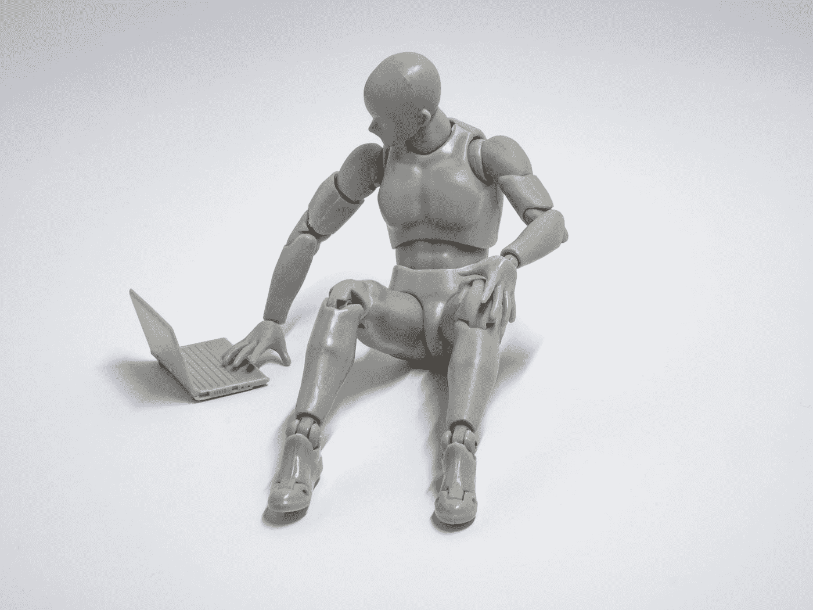

# 机器人农场、人工生命和二阶工程

> 原文：<https://towardsdatascience.com/robot-farms-artificial-life-and-second-order-engineering-an-in-depth-interview-with-professor-a524c92ee455?source=collection_archive---------25----------------------->

布雷特·乔丹在 [Unsplash](https://unsplash.com?utm_source=medium&utm_medium=referral) 上的照片

## [思想与理论](https://towardsdatascience.com/tagged/thoughts-and-theory)

## 古兹提·艾本教授深度访谈

1991 年，Guszti Eiben 在埃因霍温理工大学获得了计算机科学博士学位。他在布达佩斯的 etvs loránd 大学攻读数学硕士学位期间，第一次接触到了人工智能。在当时，AI 非常深奥，Guszti Eiben 只能做白日梦来想象它的可能性。现在，作为阿姆斯特丹自由大学的人工智能教授和约克大学的特别客座教授，他拥有实现所有科幻梦想的工具。艾本教授是进化计算的先驱；他编写了现在许多大学都在使用的教科书，是世界上第一个让两个机器人生孩子的人，并不断推动该领域超越现状。

2018 年，一个由他的英国同事组成的财团获得了 200 万欧元的资助，用于研究自主机器人进化。ARE 项目正在建造 EvoSphere，这是一个进化机器人栖息地，作为研究进化和智能出现的工具。对于生物学家和计算机科学家来说，基本的进化问题现在可以得到解答了。但是 EvoSphere 也有望推动工程学的发展；应用包括自主机器人殖民太空和清理地球上的核反应堆。艾本教授假设，如果进化可以创造智能，那么人工进化也可以创造人工智能。

艾本教授，继续你的类比:上帝创造了后代，而你创造了人造后代。说你是人造神公平吗？

肯定不是，而且我不同意你第一部分的说法‘上帝创造了后代’，因为进化创造了后代。这是一个很大的起点差异。简单来说，一开始，物理变成了化学，化学变成了生物。与最后一次转变同时，进化出现了。我们仍处于进化的伟大过程中，这是地球上最伟大的表演。我只能改变基质，在这个过程中起次要作用。我们所知道和分析的唯一进化形式是碳基的，也就是地球上的生命。像我这样的人不会引入新的原则；我们只是在新的媒介上引入进化原理。

顺序如下:19 世纪，达尔文用湿件描述了进化。在 20 世纪，软件进化是由计算机科学家发明的。现在，在 21 世纪，我们正致力于硬件的发展。因此，有两个重大转变:

1.湿件到软件

2.软件到硬件。

结果是硬件的进化，这不同于我们所知的碳基生命。

> “未来的人工智能将由自主过程产生，而不是由人类开发人员编码解决方案。我把这种现象称为“二阶工程”。"

**你被认为是进化计算的先驱；你的主要贡献是什么？**

在 20 世纪后期，出现了一个社区，它使用基于达尔文原理、选择和繁殖的搜索算法来解决问题，并开发了现在称为进化计算的东西。然而，在早期，没有人知道如何精确调整进化算法。首先，我对方法论做出了贡献。我烧死了三个研究和优化进化过程中超参数的博士生。我展示了进化过程的质量如何依赖于这些超参数，并把它放在了研究议程上。此外，我优化了优化器，以改善进化过程的结果。

其次，在等待一本好教材很长时间之后，我自己写了一本(和吉姆·史密斯，一位来自英国的朋友兼同事)。我们的教科书现在可能是*进化计算的*教科书，在许多大学使用，最近，它已经被翻译成中文。

第三，我研究了基于生殖机制的基本问题。例如，我调查了如果我们有两个以上的父母会发生什么。在生物学中，我们知道两种繁殖方式:有性繁殖和无性繁殖。无性繁殖只包括突变，而有性繁殖需要双亲，被更高级的生命形式如智人和鱼类所使用。

作为一名数学家，我认为父母的数量只是一个繁殖参数。它不必限于两个，理论上，它可以是三个、四个或更多。我研究了如果更多的亲本繁殖，进化会发生什么，并证明了在交叉算子中有两个以上的亲本会加速进化。根据交叉算子的种类，最佳数量在 2 到 10 之间。

最后，也许是我最重要的贡献；我提倡主动对象的优化，而不是被动对象的优化。在经典的进化计算中，像旅行推销员的路线或工业对象的设计这样的对象会被优化。我开始优化与代理的事情。在那个领域中，我研究和进化活跃的人工制品、代理、有机体或模拟机器人。在某种程度上，这些都是相同类型的实体；他们有身体和大脑。两者兼而有之使它们更难进化，但研究起来也更有趣。

在我们深入细节之前，你能简单介绍一下吗？什么是进化计算？

它是一个有自己风格的搜索算法集合；进化的风格。这种风格采用了生物进化中的繁殖/变异和选择原则。

有人可能会说所有的搜索算法都有相同的属性，即:生成和测试。“生成”步骤相当于复制/变异，“测试”步骤用于选择。进化算法在搜索算法的大家庭中是独特的，因为它们使用解的群体和交叉作为搜索算子，组合两个或多个解。这是独一无二的，因为所有其他搜索方法只迭代一个解，应用扰动(突变)产生新的解。此外，群体中选择和繁殖的随机性是一个重要的特征。

总之，进化算法是基于群体的随机搜索方法。进化计算受进化原理的激励，搜索步骤可以使用搜索空间中更多的点来生成新点。我们并不完全模拟或仿效进化(碳基)机制，但我们使用进化原则。

**进化计算是人工智能的一种形式吗？**

绝对的。为了更进一步，粗略地说，人工智能可以分为符号/自上而下和子符号/自下而上的方法。在符号人工智能中，算法设计者在制定规则方面最为突出，而设计者在子符号方法方面则不那么突出。在 20 世纪，自上而下的方法是占主导地位的方法，而次符号方法在 21 世纪成为主导。通过子符号人工智能，算法可以根据预定义的方法找到解决方案。然而，产生输出的结果规则有时非常不透明和不可解释。进化计算是一种亚符号、自下而上的 21 世纪人工智能。

**你的作品有很多应用；你最感兴趣的应用是什么？**

所有这些都非常有趣，但它们的可见性可以区分一些比另一些。

请允许我先解释一件事；进化不一定是不受控制的。进化可以被人类监督和控制；我们称之为*‘繁殖’*。农民可以培育作物和动物等物种。从进化的两个主要操作，繁殖和选择，人类可以控制选择已经几千年了。例如，农民可以决定哪头公牛和母牛可以交配生小牛。影响进化的选择部分几代人是有效地引导进化走向理想的结果。

在这种背景下，我工作中最明显的应用是“机器人饲养场”，进化在人类的监督下进行。人类可以帮助、指导和加速进化过程，以达到期望的结果。如果有足够的资源(理解为资金)，我们可以在五年内拥有机器人养殖场。这种养殖场将采用进化作为设计方法，在监督下运行许多代，一旦出现好的解决方案，就停止进化。这种方法不会取代传统的机器人设计方法，但它有一个补充通常应用的利基。

一个很好的应用例子是用于监测雨林的机器人。这个问题非常复杂，因为我们不知道哪种机器人最适合那种环境；机器人应该有轮子、腿还是两者都有？它应该小一点，以便偷偷穿过植被中的洞，还是应该大一点，以便它可以压倒障碍？通过经典工程方法设计的机器人只能在静态、可预测和结构化的环境中工作(例如仓库)。但是如果环境是复杂的，动态的，事先不知道，找到一个好的设计是非常困难的，进化是你的朋友。我对我的学生说:当事情变得艰难时，进化就开始了。

基于这个想法，我们可以使用机器人饲养场来获得设计良好的身体和大脑，并在我们的原型森林中良好地运行。在那之后，我们创造出许多最佳机器人的复制品，并把它们送出去监测真实的环境。这是我最喜欢的应用之一，因为我们可以很快地做到这一点，而且它与社会相关。

从长远来看，我们可能拥有不受人类直接监督的进化过程。这意味着一个不用手，几乎开放的进化过程。然而，这个过程引发了失控进化的伦理和安全问题。同时，这种方法具有非常有用的应用。例如，它可以用于空间研究。我们可以把一个进化机器人群体送到另一个星球，让他们做地球上的生物所做的事情。首先，它们需要进化并适应环境，以便长期生存和运作。一旦它们能够存活下来，它们就可以启动与人类相关的任务，比如建造房屋或让地球适合人类居住。这是一种不同于养殖场的方法，因为它不受指导和控制。

假设许多机器人被派出去执行一项任务。机器人如何在执行任务和寻找配偶之间做出选择？

分时系统是最符合逻辑的。例如，任务执行可以(几乎)是永久的，而交配可以是偶然的，可能由时间(例如交配季节)或事件(例如遇到另一个机器人)触发。

**这些是实际的应用，还是一个关于可能性的假设性讨论？**

这个育种场是一个实际应用，涉及到约克大学、布里斯托尔机器人实验室、爱丁堡纳皮尔大学和阿姆斯特丹自由大学之间的合作。我们的目标是开发能够清理核电站的机器人。这种有远见的项目通常是我们不会成功的。然而，我们学到了很多东西，知道如果我们再获得四年的资助，该如何让它发挥作用。

免提自主机器人的空间应用是未来的事，还需要 10 到 15 年。然而，这些应用不仅仅是钱和工程的问题。首先需要解决一些基本的技术、科学和伦理问题；怎样才能建立一个系统来运作，做我们想做的事，没有坏处？

**你对哪些基本问题最感兴趣？**

我最喜欢的两个是'*,智力是如何从非智力起点进化而来的？*和*‘在(进化的)智能行为背后，身体和大脑之间的相互作用是什么？前提是智力不仅在大脑中，也在身体中。我们所知道的所有现存的智慧形式都存在于一个身体中，我们不知道有任何不需要身体的智慧。这表明智力既需要大脑，也需要身体。更具体地说，行为总是由身体、大脑和环境决定的。*

人类可以很好地在坚实的地面上用两条腿走路。但是如果你把它们放入水中，它们会下沉。如果身体没有改变，但是环境改变了，那么行为需要改变，例如，游泳而不是走路。从基础和实践的角度来看，这都很有趣。

例如，我们调查的一个有趣的问题是:*‘什么对智能行为更重要；好的身体，还是好的大脑？“我们是如何通过进化得到这些的？”*。回答这个问题有很多注意事项，因为答案可能取决于实验设置、给定的机器人设计和环境细节。然而，我已经量化了这个问题，通过实验回答了它，并与一名学生和一名同事在年度人工生命会议上发表了结果。在我们进化的机器人系统中，对于智能行为来说，身体比大脑更重要。

**你的实验装置是什么？**

我们设计了一个具有本质属性的系统；所有可能的身体和大脑可以组合成一个工作机器人，我们测量了每种组合的行为。简而言之，我们找到了一种技术解决方案，即使是鱼的大脑也可以放在人体上工作。

我们生成了 25 个身体和 25 个大脑，形成了 625 种排列在表格中的组合，并对每一种进行了评估。然后，我们查看了列的标准偏差和行的标准偏差。如果标准差较低，则该部分更重要。为了理解为什么，想象这些行是物体。在这种情况下，你会得到一个有 25 种不同大脑组合的身体，从而得到 25 个适应值。如果这些健康值在一个很小的范围内，你用什么大脑都没关系；你总是得到大致相同的情报。但是，如果你有一个更大的健身值传播，那么智力在更大程度上取决于大脑。

这就是我们如何将我们的天真问题量化为科学问题。公式化问题后，我们“只”需要运行模拟并填写身体-大脑矩阵。最后我们发现，在身体固定的情况下，价差总是更小。在这个系统中，身体对行为质量更具决定性。

对于这个问题，我感兴趣的不仅仅是工程学。我特别着迷于基本的，甚至是哲学的方面，身体和大脑之间的相互作用，以及它们如何通过进化同时发展。

**所以，身体对智力最重要。然而，人类有一套固定的身体部位。父母的最佳数量大于两个。然而，人类只有双亲。人类陷入局部最优了吗？**

不会，最优的父母数量也是由实用性决定的。更多的父母不太实际，需要更多的努力和运气来交配。

Evosphere 和机器人养殖场一样吗？

不，不一定；进化球是一个通用的概念，而养殖场是一个特定的亚型。在后者中，人类处于循环中，并在“机器人托儿所”中监督选择和婴儿学习过程。

与饲养场相反，Evosphere 还允许开放式机器人进化，无需人类直接监督。Evosphere 是一个通用的系统架构，由三个组件组成。第一个是机器人制造商或“生育诊所”，生产机器人后代。从进化的角度来说，一个基因型(机器人的 DNA)被转换成一个表现型，一个真正的机器人。第二个是训练中心或“托儿所”，是“新生”机器人学习最佳身体控制的地方。这个阶段被称为“婴儿时期”。在此期间，机器人学习新技能，不能生育。在婴儿时期之后，机器人变得有生育能力，并进入“竞技场”，在那里它们操作和生产孩子。这是一个通用的系统架构，适用于所有机器人进化系统，不管细节是如何实现的。

**你更喜欢使用 Evosphere 的哪个组件？**

在过去的几年里，我对婴儿期更感兴趣，也更有挑战性，婴儿期类似于机器学习，但也完全不同。解释这种差异的最佳方式是将“机器学习”一词颠倒为“学习机器”。这里的意思是，对于“学习机器”，你是在讨论能够学习的机器，无论是模拟的还是物理的。值得注意的是，学习机通过执行动作来生成其训练数据，而在机器学习中，用户向算法提供预定义的训练数据集。

在我的研究背景下，学习机器形成了一个很大的挑战；每个新机器人都有不同的身体(例如，更多的腿，更少的轮子，不同的传感器，相机在另一边)，需要依赖于身体的控制器。因此，每个机器人代表一个新的学习问题:如何最佳地控制给定的身体，并确保机器人能够操作，例如行走、执行任务、生存和繁殖。

人类婴儿花一年时间学习走路和抓握物体。进化型机器人也必须在出生后迅速发展他们的“手眼协调能力”。机器人的问题更具挑战性，因为人类婴儿的身体总是和他们的父母一样(例如两只手，每只手上有五个手指)。相比之下，机器人后代可以拥有与父母完全不同的身体。我们正在使用机器学习中的一些学习技术，如强化学习和神经网络。因此，尽管许多机器学习算法有潜在的帮助，但我们事先对机器人的形态(身体规划)一无所知，也无法做出任何假设。因此，我们需要在我们的设计空间中对所有可能的机器人都有效的学习方法。进化产生的每一个新机器人都相当于传统机器学习中的一个新数据集。

这个学习问题只是真正大挑战的敲门砖；发现进化和学习是如何相互影响的。这个问题已经讨论了一百多年，产生于生物学界。他们发明了像*、*或*鲍德温效应*这样的概念，早期的人工智能社区开始采用。四十年前的论文研究了在我现在称之为人工生命系统的环境中学习和进化的结合。这对进化中的机器人来说是一个突出的问题，因为婴儿期的学习是必不可少的。这就把进化和学习之间相互作用的理论问题变成了一个实际问题:如何将机器人的进化和学习结合起来，以最大限度地提高效率和效能？

最终，我对进化和学习在一个系统中的结合感兴趣；这将是实现人工智能新水平的重要途径。我相信未来的人工智能将由自主过程产生，而不是由人类开发人员编码解决方案。我把这种现象叫做*‘二阶工程’*或者*‘二阶发展’*。开发人工智能系统(机器人或其他)的标准方法是基于开发人员分析问题，进行文献搜索，并设计和实现目标系统。这是典型的‘一阶工程’。用二阶工程，我们开发一个进化系统，它为我们开发一个解决方案，而不是我们直接构建一个 AI 或机器人系统。我深信，二阶工程在未来的人工智能中将变得更加突出。

**人类在二阶工程中的作用是什么？**

人类应该指定进化系统的组成部分。例如，定义基因型中使用的遗传语言，指定适当的变异和交叉算子，制定适应度函数，并确定繁殖条件。如果应用了学习，那么也需要定义学习方法。

这里有两个关键问题:样品效率和安全性。生物进化是非常浪费的。它创造了许多解决方案，其中大部分在变得肥沃之前就夭折了。人工进化系统不能太浪费，因为时间尺度是几周或几个月，而不是几百万年。此外，我们需要确保在真实世界中生产真实机器人的固有随机和自适应系统的安全性。显而易见的危险是失控的进化和不必要的或危险的机器人属性的出现。安全和道德至关重要。然而，我们对这些问题知之甚少，因为我们才刚刚开始了解它们。然而，我们需要从一开始就意识到道德和安全问题。

在早期的媒体采访中，你讨论了集中复制。这是你提议的一种安全措施吗？

是的，因为它有助于防止进化失控。我的解决方案是拒绝分布式生殖系统，如产卵、怀孕或细胞分裂，因为这些生殖系统将允许机器人在任何地方以任何方式繁殖，而没有阻止它们的选项。相反，我坚持认为，我们只能建立一个用于机器人(再)生产的集中单元的进化系统，这是 EvoSphere 的第一个组成部分。该装置用作安全开关；一旦关闭，繁殖就停止了，不会再有机器人后代。现有的机器人可能不会立即‘死亡’,但至少它们不会进一步繁殖。

**自主机器人的适应度函数是如何定义的？**

研究团体的标准方法是有一个任务，并且将适应性等同于任务性能(例如，对于应该很快的机器人；快机器人会生很多孩子，慢机器人不会)。这保证了进化会创造出擅长完成这项任务的机器人。我试图推动研究界走得更远，做更复杂的有实际意义的任务，同时考虑多项任务。为了生存，机器人需要擅长许多任务。

**让我们假设我们正在发送一个机器人殖民地到一个遥远的星球。有多项任务要执行。你如何定义适应度函数？**

这里要区分技能和任务。完成复杂任务所需的可组合的基本技能相对较少，不到 10 项。采取运动；机器人必须行走。然后，运动应该是目标；机器人应该学会如何移动到特定的目标并避开障碍物。随后，机器人需要学习操纵物体。这套基本技能可以用作垫脚石，这样机器人也可以执行更复杂的任务。机器人将在“机器人学校”学习这些技能，使他们能够执行更复杂的任务。

**让我们把重点放在事物的进化和二阶工程上。你能想象机器人会发展出意识、道德或情感来执行任务的场景吗？**

让我先给“事物的进化”下定义。之前，我描述了从湿件到软件，从软件到硬件的转变。同样，这样的序列也可能与进化有关:从生命体的进化到代码的进化(进化计算)，再到事物的进化(机器人)。

关于意识的问题很难回答；它更具有根本性和哲理性。我不能说他们是否会或可能有意识。下面的类比是简单的解决方法:如果它走路像鸭子，看起来像鸭子，叫起来像鸭子，那么它很可能是一只鸭子。如果机器人的行为符合我们的道德标准，我们可以称它们为道德机器人，不管驱动这种行为的机制是什么。道德行为是可设计的和可取的；他们需要遵守我们的标准。

**但是这也可能是进化过程的结果吗？**

有进化或任何其他适应性的、突现的过程在起作用并不意味着我们不能控制它。我们必须发展技术和科学来控制这些突发过程，并确保它们尊重我们的约束，我们可以称之为道德或伦理边界。然而，设置这样的约束归结为自底向上、子符号人工智能中最大的问题之一；如何在不禁用进化过程的情况下限制它们？因此，如何将进化保持在我们的伦理边界内，而不过度“限制”它们的行为。我没有答案，只能强调需要进一步关注。

**假设你有一个机器人，可以在两个机器人中选择繁殖后代。这两个机器人在功能上是一样的。机器人基于美学做出决定，这种说法可信吗？**

基于我们基于工程的认知，我们倾向于根据功能性和实用性来选择机器人。但是生活不是那样的。你提出的想法很好，我们正在研究。这种方法不同于通常的进化算法。首先，选择不是集中进行的，而几乎所有的人工进化系统都有一个集中的协议，“经理”(技术上来说是主要的进化循环)，来决定哪些机器人与哪些其他机器人交配。该决定基于每个群体成员的完整信息。这是算法学家想要的属性，但不是人工生命社区。因此，第一个变化是使机器人能够自己选择交配对象。其次，择偶标准应该改变。目前，两个机器人可以相遇，并纯粹基于效用(任务表现)决定是否想要一个“宝宝”。在新的方法中，我们用另一个与机器人形态相关的标准来扩展或取代这个标准——美，如果你愿意的话。通常，效用与行为相关联；*‘告诉我你在森林里采集了多少土壤样本，我就告诉你我要不要和你生个孩子’*。或者，您可以将其更改为；*‘我看着你，我会告诉你我是否想和你生个孩子’*。所以，是的，基于审美的选择是可能的，非常令人兴奋，我们刚刚开始研究它。

**这种基于美学的方法对工程师也有意思吗，还是主要对人工生命的人有意思？**

对于工程师来说，这没什么意思，因为他们是以实用为导向的。它主要对人工生命、理论生物学或哲学感兴趣。一个有趣的问题是:如果你有形态驱动的选择，你会得到什么样的身体/形态？孔雀是我脑海中的一个典型例子。孔雀有奇异的形态特征；它们巨大的尾巴。虽然尾巴很漂亮，但是它们完全没有用，甚至很危险。尾巴使孔雀更容易被捕食者捕获，并且它们需要孔雀吃更多的食物。然而，这种形态特征严重影响了孔雀是否会繁殖。我很好奇我们是否会在机器人系统中看到这种现象。如果我们的进化机制捕捉到了基本属性，我们就可以创造一个人工进化系统，它具有与碳基进化相同的吸引子。碳基进化经历了数百万年的发展，非常复杂。人工进化仅仅发展了几十年，而且远没有那么复杂，所以这种可能性并不是板上钉钉的事。

然而，它是极其令人兴奋的；发现这样的效应表明我们理解了进化系统的本质。不管我们能捕捉到的基质是什么，进化本身就有一些基本的东西。这也将暗示其他星球上的生命。如果所有的进化系统都是相似的，那么其他星球上的进化也可能是相似的。

你说，随着人工智能改变了我们对智能的看法，人工生命很可能也会改变我们对生命的看法。你认为人工生命会给我们的生活带来怎样的改变？

生命的概念将不再局限于碳基生命，这是我们目前知道的唯一一种生命。如果许多科学家同意进化的机器人系统构成了生命，那将承认生命可以有不同的基础。其他生命形式可以是数字化的、机电一体化的，或者基于具有新的驱动和传感形式的新材料。这意味着判断一个东西是否有生命的标准会发生变化；他们需要更多地关注功能，而不是“具体化”或实例化。一个更宽泛的生命定义将使对生命的研究更具普遍性。作为一名科学家，你不希望只根据一个样本就得出结论。然而，目前我们只有一个生命样本。更多的样本会带来更好的结论，也能更好地洞察生命的意义。

为此，重要的是我们所知的生命是适度可观察的，难以控制的，并且不是真正可编程的，这使得实验研究变得困难。但是机器人和人造生物是可观察、可控制和可编程的。例如，可以通过注册 wifi 信号来检索机器人通信，内部进程可以记录在机器人内部的黑匣子中。原则上，这可以涵盖一切:所有的感官输入，机器人大脑中的所有信息处理，所有的控制命令，电池电量，等等。这种数据可以离线存储和分析，或者在控制回路中使用，以在线方式在系统运行期间探测系统。这为我们研究和理解生命和智能提供了一套扩展的工具。

最终，进化机器人系统代表了一种全新的研究工具，可以帮助理解智能的出现。这里关键的未决问题是:*‘智慧是如何出现的？’*时至今日，甚至连最简单的答案都没有。比如获取智力的过程是线性的、阶梯式的，还是曲棍球棒曲线？进化中的人工生命系统允许我们研究这些问题，这将是我们所知的人工智能的丰富。

**采访到此结束，艾本教授。你有什么遗言吗？**

突现智能和二阶工程有非常重大的风险。在开发此类系统时，必须从一开始就彻底解决这些风险。如果我们只是在它们发生时才试图减轻它们，那就太晚了。

*   基因操作发明后，直接干预生殖成为可能。这在伦理上有争议，但在技术上是可能的。

这次采访是代表比荷卢经济联盟人工智能协会进行的。我们汇集了来自比利时、荷兰和卢森堡的人工智能研究人员。