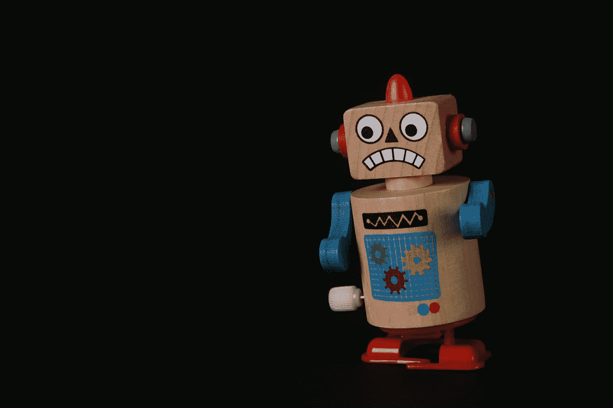
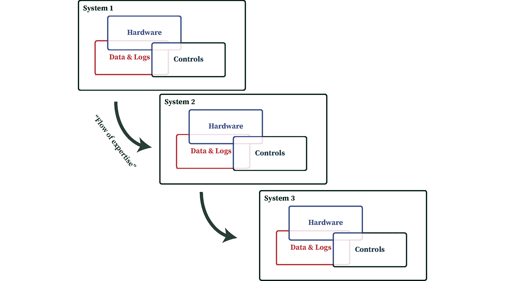
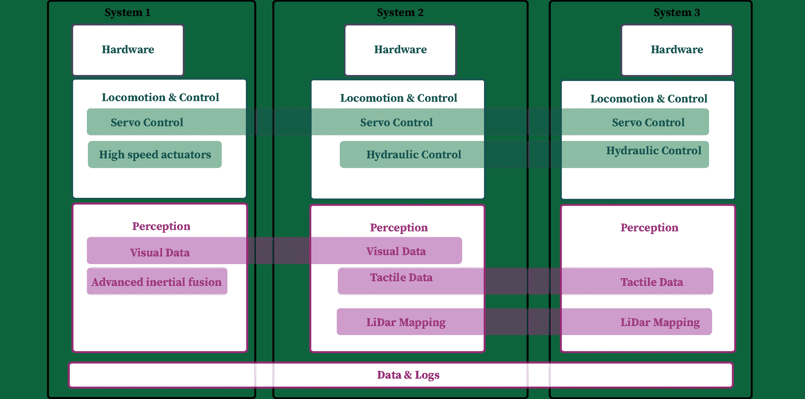
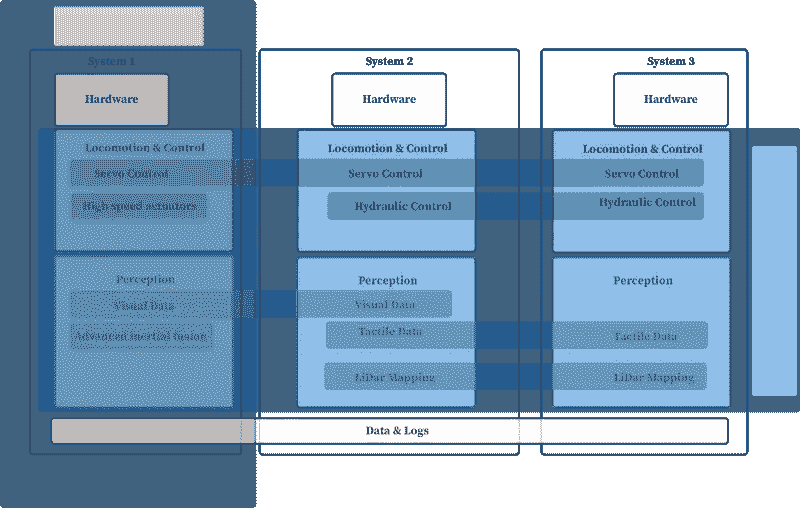
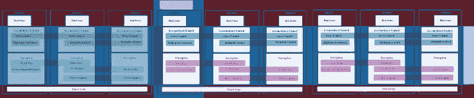

# 机器人公司 2.0:横向模块化

> 原文：<https://towardsdatascience.com/robotic-companies-2-0-horizontal-modularity-4a920fa34c9?source=collection_archive---------46----------------------->

## 如何表现为一个数字平台而不是制造商，将是下一代机器人公司的最佳选择

过去十年，数据和深度学习一直在改变世界。大多数机器人公司还没有进入数据革命，机器人技术的主流愿景还远未实现。机器人公司的现状不会实现机器人在任何场景下帮助我们完成任何任务的梦想(或至少试图取得某种程度的成功)，但它将创造出一些解决一个问题的昂贵玩具(提示，我们[已经有](https://www.bostondynamics.com/spot) [已经有一些](https://www.tesla.com/models))。

如今最受欢迎的机器人初创公司是波士顿动力公司、特斯拉汽车公司，甚至可能是 SpaceX。所有这些公司都在竞争前**年垂直整合一种具有最佳自主性的产品，以创造出极具价值的产品。最终，竞争会赶上来，我感兴趣的是在一项任务中获得 90%或 99%相同能力，但同时解决多种类似问题的新公司。通过在物理上不同的平台上查看试探性地相同的问题陈述(避免崩溃，定位对象),可以同时解决其他问题。**

我对成功的机器人公司的下一个时代的看法是**水平模块化**，其中跨系统的数据共享使得能够使用新的技术集，并消除了多次解决同一类问题的需要。

在这篇文章中，我强调了我如何*看待机器人开发中的*两个大玩家: [Boston Dynamics](https://www.bostondynamics.com/) 和 [Covariant.ai](https://covariant.ai/) (自我报告偏差，因为这是伯克利分校的副产品)及其未来。未来几年将会有更多的例子可供借鉴。

照片由 [Ann H](https://www.pexels.com/@ann-h-45017?utm_content=attributionCopyText&utm_medium=referral&utm_source=pexels) 从 [Pexels](https://www.pexels.com/photo/blue-and-red-robot-toy-4102557/?utm_content=attributionCopyText&utm_medium=referral&utm_source=pexels) 拍摄。

首先，在讲述我们如何从垂直硬件优化转向水平模块化机器人平台之前，先了解一下这些公司及其开发流程的背景。

## 波士顿动力公司

[Boston Dynamics](https://www.youtube.com/watch?v=fn3KWM1kuAw) 通过最大化**特定硬件组件**的性能，在移动性的狭窄终端产生了惊人的工作(计划很快就他们和他们使用的系统发表一篇文章)，但它不是为通用性和可扩展性而建立的。他们让工程师研究每一个子问题，以获得更高的可靠性。从入门读物来看，Boston Dynamics 利用非常精确的模拟器和机器人模型，通过流行的最优控制变量(如[模型预测控制](https://en.wikipedia.org/wiki/Model_predictive_control))来计算最佳动作。这种方法过度专注于他们的平台，没有简单的将权重或模块转移到新问题的方法(一些来源:[波士顿动力公司在真实世界 RL 研讨会上讨论了他们的 MPC](https://sites.google.com/view/neurips2020rwrl)和来自 IEEE 的[体面总结)。](https://spectrum.ieee.org/automaton/robotics/humanoids/how-boston-dynamics-taught-its-robots-to-dance)

## 协变. ai

与此同时，协变专注于收集正确的数据，以解决一类问题**，例如机器人对拾取和放置的感知。在一次采访中，联合创始人 Pieter Abbeel 非常肯定地说他们的开发过程是(凭记忆回忆):**

> **我们把我们能想到的一切都扔给了实验室里的机器人。**

**从数据而非控制的角度来看，这听起来像是一种极限开发。一个例子是，我们如何解决机器人的感知问题，使它能够看到和操纵半透明的物体。如果感知堆栈可以看到并识别半透明物体在空间中的位置，这些知识就可以用于操纵和移动。在数据驱动的感知机制之外，协变并不试图重新发明轮子，而是使用 PID、LQR、MPC 等控制中屡试不爽的方法。**

## **从垂直转向水平机器人开发**

**我们从机器人在过去是如何发展的开始。这可以被描述为硬件和软件之间的专业舞蹈。最好的机器人专家对他们有一种文艺复兴时期的感觉，在小团队中，他们会连续迭代和优化系统。这里的限制因素是时间、专业知识和资源。**

****

**机器人迭代优化，速度慢。**

**为了了解行业如何超越这种方法，我们需要理解机器人系统是由重叠的原语集组成的。**

## **机器人原型**

**每个机器人都需要具备某些技能才能作为产品存在。每个机器人都需要:与世界互动(操纵、移动等)并看到世界，这通常被称为感知。运动和控制可以使用许多不同的模块，包括不同的执行器和不同的算法来决定和规划。感知使用许多不同的形式，类似于不同的感觉。**

**如果我们放大多个机器人公司汇聚的地方，它们有许多不同的能力，并且几乎总是与相关系统有一些重叠。在相似类型的数据和动作中利用这些水平连接是机会所在。**

****

**一些机器人系统如何在模块中重叠的可视化。**

**当然，我不会说这很容易做到:将另一个项目的数据插入到您自己的项目中，反之亦然，通常会导致两者都不工作。利用等级制度是有希望的。**

## **层级和模块化**

**[分级控制](https://en.wikipedia.org/wiki/Hierarchical_control_system#:~:text=A%20hierarchical%20control%20system%20(HCS,form%20of%20networked%20control%20system.)和[分级学习](https://thegradient.pub/the-promise-of-hierarchical-reinforcement-learning/)是在系统中显式或自动创建抽象以改善其行为的领域。拥有一个动态的层级结构对这一愿景的发展至关重要。如果系统的各个部分不能相互分离，机器人使用来自多个一流供应商的解决方案的希望就很小(幸运的是，正在成为下一代机器人专家的计算机科学家[确实最擅长抽象](https://democraticrobots.substack.com/p/models-systems-code-and-robots))。**

**最佳层级的效果是机器人不可知论，一些研究表明，数据和方法可以在经过集中训练的**独立机器人上工作**。您可以查看这两篇论文以了解更多信息(这两篇论文都非常受欢迎，我非常倾向于继续这一研究方向):[通过分层集成模型进行多机器人深度强化学习](http://www.robot-learning.ml/2020/files/B4.pdf)或 [Sim-to-(Multi)-Real:将低级鲁棒控制策略转移到多个四旋翼飞行器](https://arxiv.org/pdf/1903.04628.pdf)。随着许多机器人专家被困在他们的机器人之外，共享数据的能力变得越来越迫切，而不仅仅是有趣。**

## **数据和缩放**

**回到开头，我是这样看待我重点提到的两家公司的:**

****

**比较垂直和水平。波士顿动力公司和协变公司在方法上采取不同的方向。**

**随着机器人种类的减少和少量机器人将数据传输到云端，这种方式的影响会更小。然而，有一个明显的趋势是增加在线设备的数量，当许多系统试图解决许多场景时，协变开始看起来像一个完全不同的命题。**

****

**横向模块化的终极游戏和关键收获。横向是 Covarint，纵向是 Boston Dynamics。**

**这并不是说协变将解决感知和控制堆栈中的所有问题，而是说，通过成为其中一个问题的最佳解决方案，它们的影响和价值将会聚合。**

**加倍努力，这种方法可以让新的机器人公司更快地发展和部署。例如，一家公司需要解决一个新的执行器和场景(总是有新的机器人应用程序，只是有时没有足够的创造力)，可以使用其他公司的 API 等感知和控制堆栈的可插拔部分。新玩家不需要收集大量数据来在他们的新环境中使用 vision，这将有助于改善他们为任何组件购买的播放器。该公司需要解决以前缺失的子组件，而不是从头构建一个全新的系统。**

**水平的模块化公司将获得大部分价值(数字媒体总是如此)，但快速发展的新垂直公司将迅速部署，并带回机器人令人兴奋的未来:我们可以制造任何东西来解决你的问题。**

**我已经花了很多时间来建立一个新的网站，这将是我关于机器学习和更广泛的生活的许多知识和思想的家园。[正是这里。](https://www.natolambert.com/subscribe)**

**如果你想支持这个:喜欢，评论，或者[伸出](https://twitter.com/natolambert)！这第一次出现在我的子堆栈上[。](https://democraticrobots.substack.com/)**

** [## 自动化大众化

### 一个关于机器人和人工智能的博客，让它们对每个人都有益，以及即将到来的自动化浪潮…

robotic.substack.com](https://robotic.substack.com/) 

现在为博客的“漂亮部分”寻找外部照片。谢谢爸爸。**