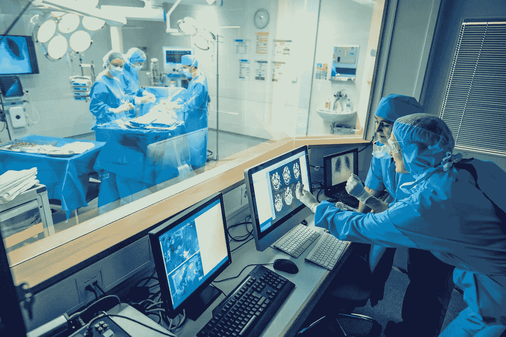

# 机器学习时代的稳健决策

> 原文：<https://towardsdatascience.com/robust-decision-making-in-the-era-of-machine-learning-2dc43fd571a6?source=collection_archive---------12----------------------->

## [公平和偏见](https://towardsdatascience.com/tagged/fairness-and-bias)

## 我们如何确保 ML 避免人类决策中的陷阱

(与约瑟夫·莫里斯合著@LLNL。)

过去十年中最重要的技术进步之一是机器学习(ML)[1]的成熟和广泛采用。许多过去由传统的以算法为中心的编程难以完成的任务突然变得触手可及。大多数此类任务的核心是根据提供给决策者的信息做出决策。例如，决定走哪一步棋是决策；驾驶或刹车是一个决策过程；从 CT 图像诊断癌症是决策；评估在不引起地震的情况下，我们可以向地下注入多少废水或二氧化碳也是一个决策过程。决策者曾经要么是一个人，要么是一群人；现在它可以是一个使用 ML 和传统算法编程的不同组合的人工智能(AI)。

(照片由 iStock 授权)

如何最大化机器学习对我们社会的好处，不仅仅是一个计算机科学的问题。人工智能可以变得越来越聪明，但历史告诉我们，聪明的实体可能会做出愚蠢、不道德甚至灾难性的决定。一旦人们对基于多元智能或多元智能增强决策的潜力有了初步了解，相关的伦理和法律含义就成了讨论的重要话题[2，3]。一个奇怪的观察是，大多数利益相关者似乎没有认识到决策研究本身是心理学和认知科学中一个卓有成效的研究领域。将 ML 置于认知科学的框架中使我们能够理解它的力量和局限性，从而使我们能够以更聪明和更安全的方式利用 ML。

对两个认知过程的理解，在卡尼曼的书*思考快与慢*【4】中被命名为系统 1 和系统 2，可以揭示人工智能在决策中的许多作用。系统 1 是大脑自动的、很大程度上无意识的思维模式。经过充分的训练，系统 1 " *执行熟练的反应并产生熟练的直觉* " [4]。系统 1 负责我们大部分的日常决策。它需要很少的精力或注意力，但往往容易产生偏见。系统 2 缓慢、费力，并受分析推理的支配。考虑所有的选择需要努力和注意力。大多数时候，系统 2 认可系统 1 产生的连贯的，或者至少看起来连贯的故事。当系统 1 挣扎时，系统 2 被调用来进行更努力的推理。

一个简单的、有启发性的事实是，大多数 ML 方法模拟人类系统 1 的操作。卷积神经网络的训练非常类似于人类系统 1 的训练，直观术语“训练”生动地证明了这一点。ML 通过训练建立“经验”关联。当给定类似于训练场景的应用场景时，ML 以一种快速的、看起来毫不费力的方式产生结果。如果培训材料没有涵盖应用场景，或者培训不充分，那么当前的 ML 方法将举步维艰。ML 和人类系统 1 之间的这种相似性提供了许多基于从人类决策科学中学习的有用见解。

*一个强大的系统 2 需要与 m1 协同工作*。在人类决策中，当懒惰的系统 2 因为被系统 1 创造的明显连贯的画面所愚弄而未能干预时，我们往往会犯错误。因此，指望曼梯·里独自做所有的决定是愚蠢的。如果在决策中使用 ML，则检测困难或危险情况并随后触发系统 2 干预的能力应该是强制性的。提到一个在基于 ML 的决策中有意识地包括系统 2 组件的例子是有用的:当前汽车中的自动驾驶系统要求人类驾驶员将手放在方向盘上并准备干预。这个例子中一个有趣的事实是，这里的系统 2 很可能是驾驶员的系统 1 和系统 2 的组合，但作为一个整体，它在这个决策(即驾驶)过程中扮演系统 2 的角色。

*多元化带来稳健的决策*。在人类社会中，重要的决策通常都是经过严格的辩论做出的。当放射科医师阅读 CT 图像时，他/她首先依赖于他/她的系统 1。这种判断通常很快，不需要很大的精神努力，但这种系统 1 只是通过多年的训练才获得这种能力。当放射科医师的系统 1 检测到异常时，系统 2 被调用来进行调查。很多时候会咨询一群不同专业的医生的意见。在这里，多样性是实现可靠诊断的关键。当人工智能取代放射科医生时，我们可以有多个人工智能，它们可以基于不同的数学原理，用不同的数据进行训练，共同完成这项工作。幸运的是，雇佣多个人工智能的成本会更低，因为有一组医生来检查彼此的工作。以这种方式，在过去由单个人系统 1 处理的事情中引入了多样性。

视觉化比以往任何时候都更重要。历史上，可视化一直是算法驱动的决策制定工作流的主要组成部分。人类系统 1 严重依赖视觉输入；因此，卡尼曼创造了“所见即所得”这个表达方式。既然 ML 可以直接“看到”比特，那么可视化还有必要吗？根据上面的讨论，我们看到人类不能完全脱离决策过程。人类评审员、检查员和专家小组仍然是决策制定中“系统 2”不可或缺的部分。因此，鉴于可视化是与人类联系的最直接的方式，可视化的质量直接决定了系统 2 在防止错误和偏见方面的有效性；有效和引人注目的可视化变得比以往任何时候都更重要，以允许人类为决策过程提供及时的输入。

心理学关于决策的研究有一个深刻的发现，那就是大多数人的决策都是不理性的，尽管我们坚信自己是理性的。重要的是要认识到，使用最大似然法来部分取代人类系统 1 并不会使决策制定更加合理。虽然表面上人们倾向于相信机器比人更理性，但基于人工智能的人工智能具有人类系统 1 的所有缺点。无论人工智能变得多么先进，这一点都不会改变。从根本上说，它们的工作方式是一样的。承认局限性是避免陷阱的第一步。更好的未来在于对决策是如何制定的、错误是如何产生的、ML 的局限性以及如何有效地将人类纳入决策过程的充分理解。

(本文由美国能源部的 [SMART](https://edx.netl.doe.gov/smart/) 倡议支持。)

参考:

1.M.I. Jordan，T.M. Mitchell,《机器学习:趋势、观点和前景》。科学:349:6345，255–260。DOI:10.1126/science . AAA 8415(2015)。

2.C. Coglianese，D. Lehr，“机器人监管:机器学习时代的行政决策”宾夕法尼亚大学法学院教师奖学金，1734 年。[https://scholarship.law.upenn.edu/faculty_scholarship/1734](https://scholarship.law.upenn.edu/faculty_scholarship/1734)。(2017)

3.E. Vayena，A. Blasimme A，I.G. Cohen，。医学中的机器学习:应对伦理挑战。 *PLoS Med* 。15(11):e1002689。DOI:10.1371/journal . pmed . 1002689。

4.d .卡尼曼，*思考，快与慢*(法勒，斯特劳斯和吉鲁；2011 年第一版)。