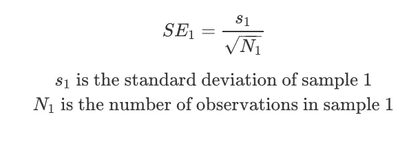

# 稳健实验设计

> 原文：<https://towardsdatascience.com/robust-experiment-design-244f835c6874?source=collection_archive---------6----------------------->

## [行业笔记](https://towardsdatascience.com/tagged/notes-from-industry)

## 实验很容易，对吗？本文将实验设计中的常见陷阱与 t 检验背后的基本统计假设联系起来。

想象一下，你将一小部分用户分成两组。一组人享受新的功能，另一组人则没有。您观察到变体组中某个用户的平均收入更高，这似乎具有统计学意义:因此该功能很好，让我们推出它吧！瞧，实验很容易。嗯，也许…

由[亚历克斯·康德拉蒂耶夫](https://unsplash.com/@alexkondratiev?utm_source=medium&utm_medium=referral)在 [Unsplash](https://unsplash.com?utm_source=medium&utm_medium=referral) 上拍摄的照片

顺便说一下，实验应该很容易:这是强大的因果推理的作弊代码。但是，如果没有给予应有的关心和重视，就会得出错误的结论。花点时间让你的实验变得强大，对你的公司来说，这是做出正确或错误决定的关键。

以下是实验背后的一些重要提示，将实验与基本原则联系起来，以帮助确保你的结论是可靠的。

# 根据基本原则评估你的实验设计

在我们的实验中，我们收集了一些小样本，希望它们能反映我们想要比较的两个平行宇宙(比如一个宇宙引入了某个特性，另一个宇宙没有引入)。因此，实验设计的目的是将测试组和对照组之间的差异归结为两件事:

1.  您的新特性 X 带来的真正差异
2.  抽样误差(因为我们只收集了一小部分样本:我们将很快讨论这个问题)

实验经常使用 t 检验。t 检验估计变异组的平均值可能来自与对照组的平均值相同的抽样分布的概率。换句话说，我们正在测试零假设，即对照均值和变异均值之间没有差异(即使有一些差异，也只是由于收集中的噪声)。

如果测试一个测试组和控制组之间的平均度量的差异，并且每个组有超过 30 个样本，那么[韦尔奇的 t-test](http://daniellakens.blogspot.com/2015/01/always-use-welchs-t-test-instead-of.html) 很可能是[您选择的测试](https://bloomingtontutors.com/blog/when-to-use-the-z-test-versus-t-test)。

确保 Welch 测试背后的假设得到满足将有助于将组之间的任何测量差异分离到这两个因素。为了实现这一点，在收集样本时需要考虑两个关键假设:

1.  组间抽样的独立性
2.  组内抽样的独立性和同分布(iid)

纳赛尔·塔米米在 [Unsplash](https://unsplash.com?utm_source=medium&utm_medium=referral) 上的照片

# **那么什么是群体间的独立性，我为什么要关心？**

## 网络效应

侵犯两个群体之间的独立性可能意味着一个群体的结果也会影响另一个群体。举一个社交媒体平台的例子:你向你的变体组中的用户发布了一个新的分享功能，而控制组看不到它。您的变体组中的用户使用新的共享功能，并且比他们使用旧功能更频繁。这增加了他们的平均参与度(目前看起来不错！).但你的控制组中的用户看不到这些新的共享，事实上他们现在看到的比以前少，这反过来意味着他们与内容的互动比他们原本应该的少。这降低了他们的平均参与度:组间的差异被过分夸大了。这是违反独立性假设的网络效应的一个例子。类似地，如果用户可以看到两个版本，在用户级别而不是访问级别将样本分配给组可以确保组之间没有效果的交叉污染。

## **可观察的混杂因素**

混杂变量是影响样本分配到试验组或对照组以及感兴趣的指标的因素。因此，违反独立性可能意味着收集的样本可能不会受到相同潜在因素的同等影响。例如，我们为你的网站运行一个新的颜色主题的实验，测量新用户注册率:控制组样本在周一到周三收集，而变体样本在周四到周六收集。但是用户更有可能在周末加入，所以在其他条件相同的情况下，我们预计周六的用户数量会更多。每个组的用户分配并不独立于一周中的某一天。同时进行实验有助于解决这个问题，所以这是一个简单的解决办法…

## 隐藏的混杂因素！

但现在让我们说，巧合的是，在你的变体组中有更多的色盲者:这是影响你的度量的一个因素，但你没有收集关于它的数据——那么你如何防止这干扰你的测量？随机化是你的朋友。将您的用户群随机分配到测试组和控制组(有足够的样本量)有助于平衡您没有收集数据的特性。这也有助于确保您的样本也能代表您的人群。确切地说，随机化不会保证组间的平均分布，只是趋向于平均分布:但是[无论如何在测试时，不平均分布的可能性应该被考虑到 p 值中](https://www.analytics-toolkit.com/glossary/randomization/)。

# 那么什么是群体内部的身份识别，我为什么要关心？

## 检查指标的稳定性

独立性确保一个样本的收集不会影响另一个样本的收集。相同分布也意味着样本所采集的分布充分模拟了我们希望它所代表的总体。换句话说，这意味着没有潜在趋势影响我们观察的样本:如果样本的收集影响总体，那么就没有“真实”值(它随着样本的收集而变化)。相反，我们应该期待指标在收集时趋向真实平均值(根据大数定律)，而不是趋势向上或向下，或者其方差随时间变化(这意味着指标不是静止的)。然而，数据的[“外部知识”](https://stats.stackexchange.com/questions/28715/test-for-iid-sampling)很可能是决定数据是否是身份识别数据所必需的

# 但是为什么这有帮助呢？

如果满足独立性和同分布的假设，那么(假设样本量足够大)我们可以确信每个样本的均值服从近似正态分布:均值趋向于总体均值，方差与样本量有关。简而言之，这是中心极限定理(CLT)最常见的版本。

照片由 [Unsplash](https://unsplash.com?utm_source=medium&utm_medium=referral) 上的[水晶贴图](https://unsplash.com/@cmapes?utm_source=medium&utm_medium=referral)拍摄

为了说明这一点:想象投掷一枚公平的硬币。每次抛硬币都不会影响下一次(独立性)，使用相同的硬币可以确保正面的概率保持不变(相同的分布)。如果你把硬币抛 10 次，记录下人头的数量，你可能会得到 5。但实际上，你只有 25%的机会得到 5 分！**这是抽样误差**:尽管真实概率是 50%，但你更有可能在只翻转 10 次时得不到 5 个头。例如，有大约 38%的机会你得到四个或更少。

现在想象一个热心的抛硬币者重复了这个测试——但是他们做了 100 次。现在他们观察到 40 个头的概率只有~3%。相比之下，当我们只做了 10 次翻转时，观察到 4 次翻转或更少是 38%！这表明我们采集的样本越多，我们对结果就越有信心。**。**标准误差是对这些平均值的标准偏差的测量，随着收集的样本越来越多，标准误差也越来越小:

标准误差，即样本平均值的估计标准偏差，随着样本量的增加而减小

现在想象一个完全古怪的抛硬币者重复 100 次抛硬币实验数千次，记录下每次抛硬币的平均头数。他们不仅会发现每个程序的平均头数为 50，而且这些程序平均值的**分布将遵循近似正态分布，**约 68%(这些平均值的一个标准偏差)的程序具有 45-55 个头，约 95%(两个标准偏差)的程序具有 40-60 个头。CLT 的意思是，即使抛硬币的基本分布是二项式的(观察人头是二进制的，零或一)，人头平均数的分布是正态的。

因为 CLT 确保平均值的分布是正态的，这意味着我们可以估计抽样误差方差(标准误差)，我们可以开始确定我们在变异样本中观察到的平均值是从与对照样本相同的分布中产生的可能性。如果这个概率足够低，我们确定两组之间有统计学上的显著差异。批判性地思考是否满足独立性和同分布的假设，从而有助于确保这些测试的结论是稳健的。

参考消息——这些古怪的实验者是“常客”统计学家。重复这个过程很多很多次，最终会给你正确的答案(旁注:这也是考虑置信区间的正确方式:它们与概率无关，因为真实均值要么落在估计的置信区间内，要么不在；但是，如果您多次重复样本收集和“置信区间估计”过程，95%的 ci 将包含真实值)。

[庞余浩](https://unsplash.com/@yuhao?utm_source=medium&utm_medium=referral)在[上拍照](https://unsplash.com?utm_source=medium&utm_medium=referral)

还有一点需要注意:作为测试的一部分，我们需要从我们收集的较小样本中估计总体均值的真实均值和标准差。这也只有在所收集的基础样本是独立且同分布的(样本量足够大)时才有效。

# 将这些联系在一起:统计能力

假设存在真正的差异，检验的统计功效是我们检测到两组之间有统计学显著差异的概率。

假设我们有两个硬币，我们想确定它们翻转头部的概率是否有差异。所以我们把每个翻转 100 次。从这些样本中，我们估计真实总体的平均值为 X1 和 X2。我们将标准误差(这些平均值的标准偏差)估计为样本的标准偏差除以样本大小的平方根。

在这种情况下，Welch t-test 统计量按以下方式指定:

检验统计量的绝对值越大，结果越有可能具有统计学意义。这意味着我们更有可能检测到变异组和对照组之间的真正差异，如果:

*   平均值(X1-X2)的差异更大
*   样本量更大(所以 N_i 更大)
*   度量的方差(噪声，s_i)较低

这说明了良好的度量选择的重要性。如果选择的度量是快速抽动且噪声较少，则差异会更大，方差会更低:因此，对于相同的样本大小，绝对 t-stat 会更大。我们将很快讨论这个问题。

照片由[卡姆兰·乔德里](https://unsplash.com/@kamranc1000?utm_source=medium&utm_medium=referral)在 [Unsplash](https://unsplash.com?utm_source=medium&utm_medium=referral) 拍摄

(旁注:从公式中可以看出，韦尔奇检验不要求两个样本的方差相等——这是学生 t 检验必须满足的一个附加假设。我总是进行韦尔奇 t 检验，而不是学生检验:即使方差不同，它也有效，如果方差相同，它几乎等同于学生 t 检验。)

# 关于运行有效实验的一些进一步的提示

## **被假设引导**

数据科学家经常会遇到一个模糊的问题，比如“我们应该发布特性 X 吗？”。第一步是将这个问题转换成一个可测试的问题陈述，这个问题陈述要么有一个正确的答案，要么有一个错误的答案。例如，“特性 X 将增加每个用户的平均参与次数。”t 检验统计是比较组均值差异的一个很好的选择。假设引导确保你的测试是有目的的，集中在回答“为什么”,也是设计一个有效指标的支柱。

艾米丽·莫特在 [Unsplash](https://unsplash.com?utm_source=medium&utm_medium=referral) 上的照片

## **为测试制定快速抽动指标**

设计一个好的指标通常是让实验有效的秘方——所以有意识地花时间评估你的指标。最重要的是，你设计的指标必须与你公司关心的目标高度相关。但另一方面，这些公司层面的数字往往太慢:增加平台上的收入或用户数量是一个令人钦佩的目标，但在你的小实验中，你真的不太可能有意义地移动它。**相反，关注“快速抽动”指标，**比如那些衡量转化率或用户参与度的指标:这可能是你可以有意义地衡量的两个群体之间的差异(你知道从长远来看，这与推动更多收入或更多用户相关)。

此外，值得查看任何指标的历史变动，以了解它有多嘈杂，是否受到季节性等因素的影响。这将提高你的统计能力。

## 指定护栏规格

花时间思考你的度量标准的缺陷也是值得的，这样它就不会被“欺骗”。例如，你可以开展一个误导性的广告活动来提高点击率，但是当用户访问你的网站时，这将是一个糟糕的体验，并降低新用户的保留率。**如果您的指标很差，指定有效的护栏指标可能是一种补救措施**—这些指标您不会测试其统计显著性，但您可以确保它们不会在您的实验中下降。护栏指标通常也有助于检测看似无关的问题，比如更高的 CPU 使用率。然而，尽管护栏指标很重要，应该总是包括在内，但通常你也可以在第一时间提出一个更好的指标(例如，转化率而不是点击率)。

艾萨克·史密斯在 [Unsplash](https://unsplash.com?utm_source=medium&utm_medium=referral) 上拍摄的照片

另一个潜在的陷阱:小心除数指标。例如，每个活跃用户的每日参与。您可能会看到变体组中每个活跃用户的平均每日参与度上升，但如果变体组中实际活跃的用户数量在测试期间因为不喜欢该功能而下降，您就有了一种偏见，即您只测量了继续保持活跃的用户的改善。

## 对度量标准要有选择性(否则家族错误会咬人！)

**测量数百个指标的统计意义可能很诱人:但是这样做是危险的！**每当我们测试一个指标时，我们都会接受一定程度的误报率(有时称为 1 类错误)，通常设置为 5%。假设两组之间没有真正的差异:如果我们在两组之间测试 20 个指标，我们会期望观察到其中一个具有统计显著性！这可以通过诸如 bonferroni 之类的家族校正来解释，但是这降低了实验的功效。实验的力量是检测两组之间真正差异的可能性，这是实验的全部目的——所以要高度选择你测试的指标。

## Winzorization

样本的平均值和标准偏差受极值的影响很大。在实践中，**数据科学家倾向于使用 winsorization 来处理极值**:例如将极值调整到第 1 和第 99 百分位值。这可以使你的实验更有效率(更快地达到较低样本量的统计显著性)，但注意这将引入偏差，因为极值实际上不是异常值。

由 [Peter Beukema](https://unsplash.com/@peterbeukema?utm_source=medium&utm_medium=referral) 在 [Unsplash](https://unsplash.com?utm_source=medium&utm_medium=referral) 上拍摄

## 新奇效果

**最后，谨防新奇效应。**当一个特性刚刚发布时，用户群可能会大量使用它，推动你的兴趣指标上升，但这是暂时的:随着时间的推移，它们的使用可能会变得不那么新奇。长期抵制(在很长一段时间内保持一个小的控制组)是帮助在更长一段时间内实现这一点的一种方式。

# 让这更上一层楼

有时，我们希望稳健地达到统计显著性，但要更快(用较低的样本量)，并且我们不能改变感兴趣的度量。在这种情况下，方差减少会有所帮助！我将很快写一篇关于如何通过方差减少来增强实验的文章。

Yusuf Evli 在 [Unsplash](https://unsplash.com?utm_source=medium&utm_medium=referral) 上的照片

## 参考资料和进一步阅读:

 [## 总是使用韦尔奇的 t 检验，而不是学生的 t 检验

### 参见我们关于这个主题的论文:Delacre，m .，Lakens，d .，& Leys，C. (2017)。为什么心理学家应该默认使用…

daniellakens.blogspot.com](http://daniellakens.blogspot.com/2015/01/always-use-welchs-t-test-instead-of.html)  [## 何时使用 z 检验与 t 检验

### 我如何知道何时使用 t 检验而不是 z 检验？几乎每个我辅导过的统计学学生都有…

bloomingtontutors.com](https://bloomingtontutors.com/blog/when-to-use-the-z-test-versus-t-test)  [## 什么是随机化？在线控制实验词汇表。

### 随机化是使用随机方法将受试者分配到治疗组的过程。在 A/B 测试中，会…

www.analytics-toolkit.com](https://www.analytics-toolkit.com/glossary/randomization/)